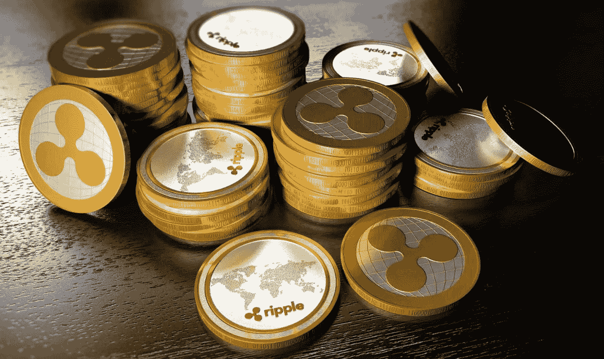

# 停止购买比特币。说真的。

> 原文：<https://medium.com/hackernoon/stop-buying-bitcoin-seriously-9f4cd66443e5>

> 如果你喜欢这篇文章，请考虑在 Medium 上关注我，它让我有动力写更多的想法，并与我的关注者分享我的想法。

Credit: Pixabay ([https://pixabay.com/en/bitcoin-cryptocurrency-btc-currency-2868703/](https://pixabay.com/en/bitcoin-cryptocurrency-btc-currency-2868703/))

我为这个有点苛刻的标题道歉，我不得不让你点击它。然而，帖子的观点并没有远离标题。你应该停止购买它。

[比特币](https://hackernoon.com/tagged/bitcoin)极其不稳定。每当它下跌时，比特币社区的大量交易者都在大喊“等等，让我们飞向月球”。每当价格上涨时，同样的交易者套现——通过大声说话来保护他们的利润。

你能告诉我你最后听到的关于比特币的事是什么吗？我敢保证，这要么是一个朋友吹嘘他们从一项他们不了解的技术中赚了多少钱，要么是一篇告诉你比特币爆炸速度有多快的文章。比特币没用。我觉得这就像是 VHS 对 Betamax，劣质产品更有吸引力。

很容易说我嫉妒或者暗示我在比特币上亏了钱。你是对的，我嫉妒，我后悔没有早点买进，任何一个正常人都会这样。然而，这并不影响我对比特币的观察——我已经研究加密货币有一段时间了。

# 比特币预测

Credit: Pixabay ([https://pixabay.com/en/bitcoin-money-gift-hand-keep-give-2947949/](https://pixabay.com/en/bitcoin-money-gift-hand-keep-give-2947949/))

我对比特币有预测。12 月 10 日，CBOE 将开始提供比特币期货。芝加哥商品交易所将于 12 月 18 日跟进。这对比特币意味着什么？这意味着成千上万想做空比特币并在崩盘中获利的人现在有了机会。

我的预测是，许多人将获得未来合约，投资者信心将下降。当信心下降时，价值也会下降，一旦人们从做空中获利，BTC 的价值将可怕地下降到一个更合理的水平。

我认识的大部分有比特币的人都不懂底层技术([区块链](https://hackernoon.com/tagged/blockchain))。那些相信的人，似乎相信区块链是一种现代技术。不是的。Satoshi 让它在 BTC 很受欢迎，我很高兴他这么做了，区块链有一些令人惊讶的用途，但 BTC 不在其中。仅仅因为希望比特币增值而拥有比特币的人数量惊人，尽管这种基础资产基本上没有任何用处。

我不认为比特币会在很长一段时间内完全崩溃。我建议在 18 号之前卖掉 BTC。你应该投资一些利润到其他加密硬币上。其中一个我想谈的是涟漪币(XRP)。

# 什么是波纹币？

Credit: Coindesk ([https://www.coindesk.com/global-banks-test-ripples-digital-currency-new-blockchain-trial/](https://www.coindesk.com/global-banks-test-ripples-digital-currency-new-blockchain-trial/))

Ripple Coin (XRP)是由 Ripple 提供的资产，旨在为金融机构提供一种可靠的按需选择，以获取跨境支付的流动性。基本上，Ripple 是一项帮助银行在以大幅提高的速度通过可扩展的方式进行国际汇款时降低成本的业务。

最精彩的部分？银行不必使用波纹硬币。他们可以使用其他货币，同时受益于区块链技术。这种互操作性非常好，非常有前途。第一步是让银行信任 Ripple 并看到好处，然后他们可以利用 XRP 来进一步减少损失。

XRP 最近经历了很多起伏，主要是由于与 R3 的 10 亿美元诉讼案，以及对 Ripple 可能随时向市场供应大量 XRP 的担忧。然而，Ripple 刚刚在 12 月 8 日完成了 550 亿枚硬币的托管。这对 XRP 来说是一个重大消息，我们可以期待很快大幅上涨。

Ripple 的一名员工的朋友泄露了一个消息，称第八号发生了托管。这位人士还暗示，印度的一家大银行将在 12 月 11 日买入大量 XRP。如果这种情况发生，我们将看到 XRP 价值可能上升 50-70%。

# 结论

基本上，我建议你认真思考一下为什么你的钱包里会有比特币。你打算利用它，还是让它停滞不前，等待它像市场其他部分一样升值？

如果你遵循邮报，你也应该考虑在 18 号之前卖掉你的 BTC。用你的一些利润投资 XRP，并在那里呆很长时间。XRP 有一个长期战略，如果幸运的话，你可能会在未来两年内看到 10 倍的增长。