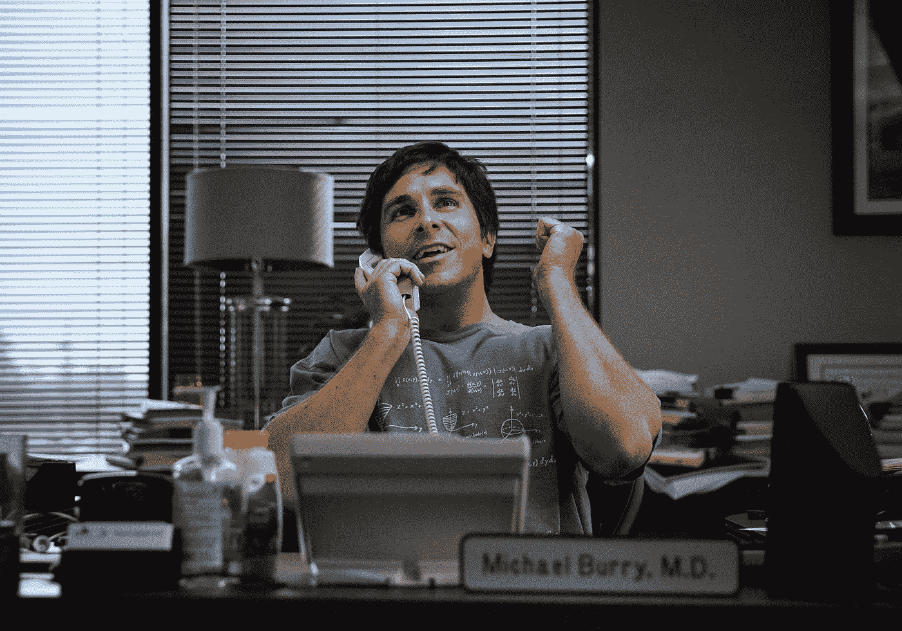

# 不要再为你的想法辩护了，你正在毁掉它们

> 原文：<https://medium.com/hackernoon/stop-defending-your-ideas-you-re-ruining-them-5e4aab74499c>

Michael Burry, M.D. from [The Big Short](http://www.imdb.com/title/tt1596363/)

如果你还没有看过，那就去看看这部由克里斯蒂安·贝尔(上图)、瑞恩·高斯林、史蒂夫·卡瑞尔和布拉德·皮特等主演的短片。这是一部很棒的电影，清晰简明地解释了导致 2008 年金融危机的事件。

这部电影是根据迈克尔·刘易斯的一本书改编的，我开始读这本书，试图理清故事的细节。故事的中心有许多晦涩复杂的金融概念。绝对令人着迷。

真正引起我注意的一个角色是迈克尔·伯里，一个管理着数十亿美元对冲基金的孤独天才。在一封邮件中，他写道:

> “我讨厌与投资者讨论想法，因为我后来成了这个想法的捍卫者，这影响了你的思维过程。”

如果你曾经和一群人一起集思广益，你可能会发现自己处于这种情况。你已经开始讨论一个想法的优点，并且发现放弃它并不容易。你不知何故对这个想法产生了兴趣。

一次完美的头脑风暴包括 3 个步骤:

1.  产生大量未经过滤的想法，但不加以评判
2.  客观地评估所有的想法
3.  决定一个或多个最合适的想法

前两步要求你远离这些想法，不要执着于任何东西。不幸的是，人们天生好胜。在第一步中，他们想提出“最好”的想法。在第二步，当讨论观点时，人们经常唱反调，但是很难知道什么时候放弃争论。

如果你花 3 分钟为一个想法辩护，你就让自己认为这个想法是可以支持的。如果有人能让你相信这不是一个好主意，那就意味着你不够聪明，不能明白为什么这个主意不合适。

如果你花了 3 分钟试图找出一个想法的漏洞，你已经让自己陷入了这不是你的想法的思维定势中。这不是*你*的主意。人性让我们很难形成一个完整的 180 度大转弯，并开始支持这个想法。

这导致了不合标准的想法。人们的个性被投射到想法上，声音最大的人获胜。这个想法的价值很少被考虑在内。

这并不是说我认为你不应该告诉别人你的想法。我不认为你应该尝试成为那个孤独的天才。我不认为你应该避免所有的冲突或者允许其他人左右你对一件事情的想法。

相反，最好是完全绕过个人观点。你能利用头脑风暴之外的人来告知决策吗？

想象一下，高级管理层要求你的公司必须有一个移动应用程序。你是否应该立即启动一个包含一大堆功能的资本支出项目，看看是否有人下载它？你能不能用信用卡购买一些 Google Adwords 并跟踪点击量，看看是否有人对这个应用感兴趣？

埃里克·里斯在一本名为《精益创业公司 的书中推广了这个想法，被称为*最小可行产品*。它能让你快速而廉价地判断出你的想法是否值得追求。

试着找到你想要建造的东西的最小版本，这将会给你一个暗示，告诉你它有多成功。人们常说，如果你对你的第一个版本不感到尴尬，那么它就不够简单。

例如，来自 [Idealab](http://www.idealab.com/) 的 Bill Gross 想知道人们是否会在网上购买汽车— [他建立了一个简单的网页，并在网上销售了一辆汽车](https://www.youtube.com/watch?v=Kc9nX6VvtrI)，然后他在物流方面投入时间来完成订单。

如果你有一个更成熟的产品，并试图决定如何继续，你可能会发现 *A/B 测试*很有用。

A/B 测试是通过实现两个(或更多)想法来进行的，将你的观众分组并向每组展示一个想法。通过跟踪某个指标，例如转化率或参与度，您绝对可以确定哪个版本表现最好。

例如，Airbnb 想知道他们的每个房源上的专业摄影是否意味着更多的预订。他们在一小部分房源样本中添加了专业照片，并将预订率与没有专业照片的房源进行了比较。一旦他们可以肯定地说，更好的照片会带来更多的预订，他们就有理由向每个新地点派遣一名摄影师。

当然，这些不是将主观对话转变为客观比较的唯一技巧，但它们是我最喜欢的。网上有很多资源可以根据你的情况来帮助你实现它们。

我建议你下次讨论一些想法时尝试不同的方法。尽量在讨论中消除你的个人偏见。看看你是否能为其中一个想法证明不成比例的回报，然后突然每个人的自我都消失了。一旦想法显然是最好的，没有人会阻挡它。

*如果你喜欢这篇文章，请点击下面的心形按钮分享——这对我意义重大。*

> [黑客中午](http://bit.ly/Hackernoon)是黑客如何开始他们的下午。我们是 [@AMI](http://bit.ly/atAMIatAMI) 家庭的一员。我们现在[接受投稿](http://bit.ly/hackernoonsubmission)，并乐意[讨论广告&赞助](mailto:partners@amipublications.com)机会。
> 
> 如果你喜欢这个故事，我们推荐你阅读我们的[最新科技故事](http://bit.ly/hackernoonlatestt)和[趋势科技故事](https://hackernoon.com/trending)。直到下一次，不要把世界的现实想当然！

