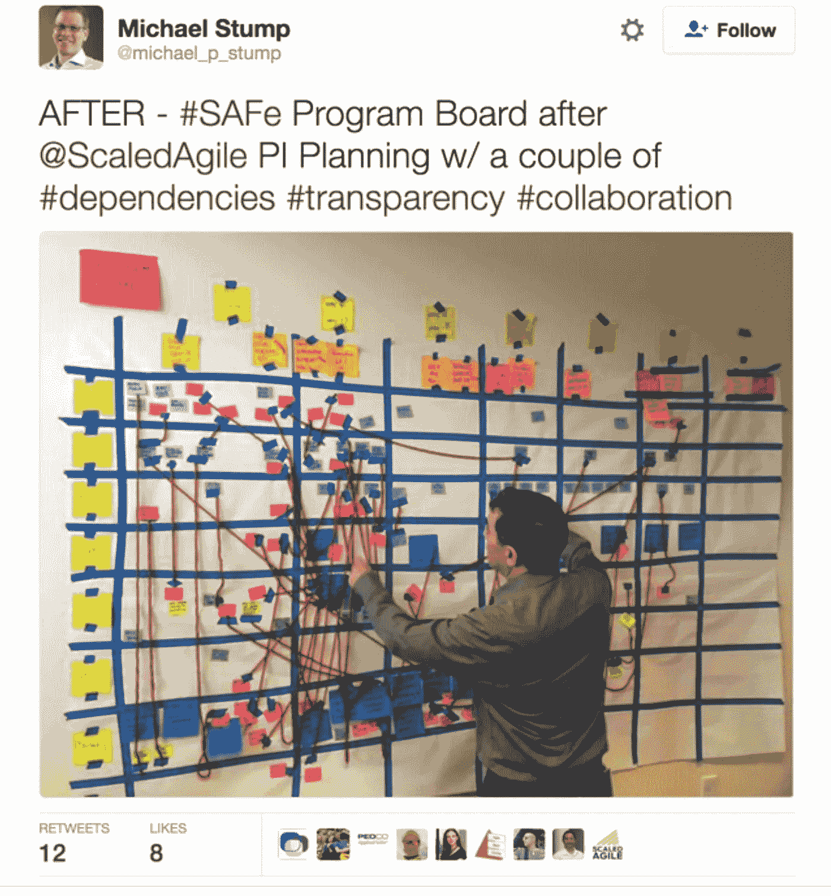

# 不要再纠结于“团队”

> 原文：<https://medium.com/hackernoon/stop-obsessing-over-the-teams-454fae465d63>

听起来熟悉吗？

> 这完全是关于 Scrum 团队的。特色团队。每个团队都需要一个 PO！自组织团队。团队活动/仪式。帮助团队。为团队服务！保护团队。局部聚焦！做一把屎伞！

在这篇文章中，我想说的是，在*有效的*团队的条件具备之前，我们不应该把注意力放在“团队”上。

大多数敏捷方法/框架目光短浅地关注“团队”(个人贡献者的一线团队)。与此同时，组织功能障碍(造成 80%的阻力)依然存在。这不是因为缺乏警告。Scrum 明确指出了独立团队的必要性:

> Scrum 团队是自组织的，跨职能的。自组织团队选择如何最好地完成他们的工作，而不是由团队之外的其他人指导。跨职能团队拥有完成工作所需的所有能力，而无需依赖团队以外的其他人。

…但不知何故，这并不被认为是“进行 Scrum”的先决条件。

在实践中，某些角色——例如 Scrum Master——实际上认为他们的工作是“保护”团队免受这些现实的影响，并在一旁解决它们。

> 我们不希望我们的开发人员对此过于担心。我们需要它们在泡泡里。我们需要他们专注于提供价值，以实现所有这一切的承诺。持续改进是[经理]和[经理]在幕后解决这个问题的工作。

我们雇佣人力负载平衡器(又名项目经理、程序经理、经理)来解决团队之间的依赖关系。我们雇佣 Scrum Masters 来“清除阻挡者和障碍”(请求其他团队做事情)，而团队则尽职尽责地在*上工作，交付价值*和玩 Scrum。我们雇佣非常复杂的扩展框架，发布培训经理，甚至更多的经理…来“协调数百名开发人员的工作”。最终结果？团队仍然四分五裂，步履蹒跚。理论上他们有支持，但是他们被依赖、移交和“支持”管理层所束缚。

问题来了…

如果你有 20 个团队在依赖、移交和约束的网络中挣扎…然后，再多给团队分配一个产品负责人和 Scrum Master，假装他们“拥有一个产品”，进行站立和回顾，并给他们自己的白板，也不会真正地移动针头。现实是你有一个 150 人的“团队”。你必须处理好这个问题。

为什么我们要从团队层面开始？这样更容易，而且不会节外生枝！团队是可塑的。在许多情况下，组织创造了一个方便的叙述，团队是“问题”。这种情况很少发生。去问任何一个在这个行业工作的教练。团队挑战是“问题”的征兆。他们(教练)很少触及团队之外的根本原因。

那些管理层——那些旨在*解决*问题的关联角色——以某种方式(出于某种原因？)似乎永远不会继续前进，也不会重新想象自己的角色。正如你所料，他们组成了不可或缺的王国。最终的结果是团队不再变得更加自主和自组织。该组织从未意识到其潜力。

在我看来，这是一个最大的(如果不是最大的)问题，当谈到真正以一种深入持久的方式变得更加敏捷时。我们从容易的事情开始，但是永远不要改变困难的事情。*球队总是被指责没有采用【方式】，当不可能采用方式的时候。*他们几乎没有时间来解决持续改进的问题。

“业务”和“开发人员/团队”只是边喝咖啡边解决问题的梦幻乌托邦……在任何组织——拥有超过 1 个团队——只是试图将 Scrum 之类的东西嫁接到他们现有的结构、依赖关系和项目文化中，最终都是不可行的。

所以…疯狂的想法:

忘记团队层面的敏捷和 Scrum*。从组织开始。想象工作真实发生的样子……以及所有复杂的依赖关系。如果团队的真实规模是 150 个人站起来。让 150 个人投票选出真正重要的屏蔽程序，然后蜂拥去修复这些屏蔽程序。直面烂摊子，迭代，改进。快速轮换和重组团队，动态解决最大的障碍。不要雇佣人力负载平衡器来维持现状。关注 DevOps、工具、基础设施，并解开过度负担和过度利用团队的政治官僚主义。*

*这些会议会更难吗？是的。但这是现实。你躲不了。*

*当你有了自治的、自组织的团队时，那么引入 Scrum。在那之前，使用项目级/业务级看板来看清事物的本来面目并解决它。*

*这是我们倾向于放弃的艰难决定。去吧。*