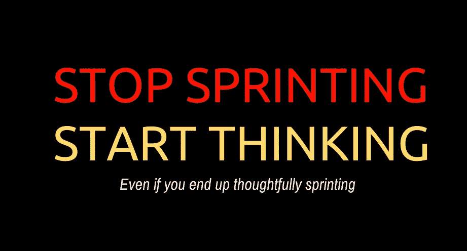
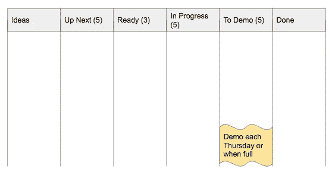

# 停止冲刺。开始思考。

> 原文：<https://medium.com/hackernoon/stop-sprinting-start-thinking-2f754554a733>

## …即使你最终深思熟虑地冲刺

好的。你的团队有一个选择…

1.  这是我们需要优先处理的事情的清单。分解工作， ***，算出你在接下来的两周内能完成什么*。让我们两周后见面，考虑一下我们现在的情况。**
2.  这是我们需要优先处理的事情的清单。 ***分解工作，从最高层拉起，全力以赴。让我们两周后见面，反思一下我们现在的状况。***

## **推回到#2 通常包括以下变化:**

1.  在#1 中，团队将被激励做出他们的 sprint 承诺。
2.  有所追求是件好事。#1 给你。
3.  开发者需要学习如何兑现他们的承诺。#1.
4.  #1 表明开发人员可以交付可预测的产品。
5.  不做#1，我们怎么可能预测这个项目？
6.  对于#1，我们将交付一个有凝聚力的反馈。

## 我认为#2 可以同样好地交付软件产品。

1.  你希望你的团队尽最大努力。交付一套预先确定的故事并不能很好地衡量你是否做到了最好。例如，你可能会遇到一大堆重构。很难。对于#1，你会错过你的承诺，但是要尽你最大的努力。
2.  #2 不排除有目标。但是它确实给了你分离不同类型目标的灵活性:反馈/学习周期，交付周期，等等。
3.  许多团队“基本上做第二步，但是有估计和冲刺目标…我们不把故事当作承诺”。嗯。好的。
4.  有一个简单的方法可以持续兑现承诺(尤其是在信任度较低的环境中)…就是少承诺。我们不想那样。
5.  根据定义，可预测性需要时间。没有理由说明#2 不能展示一段时间内可预测的工作流程。
6.  预测能力在很大程度上受到与实际“完成”工作所需时间无关的因素的影响(例如，批量大小、进行中的工作、移交、工具、环境一致性、审查、多任务处理、利用率等)。)1 和 2 都可以解决这些问题，**但是 2 的处理开销和抽象更少。**

## 那又怎样？

我的偏见很明显。我喜欢 2 号。然而……

重要的部分来了。就产出/影响而言，第一名和第二名并没有什么不同。说真的，从 30，000 英尺的高度看。是吗？

我可以想象一个健康的团队*追求两者，效果完全一样。或者随着时间的推移#1 看起来更像#2，反之亦然。如果一个团队被赋予持续改进的权力(并有消除外部障碍的影响力，并有心理安全感)，他们会找到适合自己的东西。*

*在我看来，问题在于第一点——及其背后的所有仪式(故事点估算、冲刺“承诺”、烧毁/烧毁图表等。)—是如此的*容易被滥用*。让我们面对现实吧:他们一直在被虐待。目标*不是*做 SCRUM 和跳所有的小舞。相反，它包括持续改进和经验过程控制(透明度、检查和适应)。*

***没有什么能阻止你的团队反思一些节奏。***

**

*没有什么能阻止你的团队设定有意义的目标。*

*所以我的建议是停止冲刺，开始思考(即使你最终深思熟虑地冲刺)。了解各种仪式背后的原因。让实验和学习变得安全。*