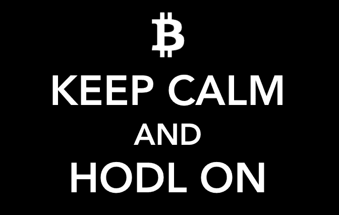

# 不要把比特币当成股票

> 原文：<https://medium.com/hackernoon/stop-treating-bitcoin-like-stock-86f39f094091>

## 不是的。

我不知道你怎么想，但在我的生活中，我从来没有像上周看比特币时那样感到如此不得不喝酒。这就像看着一架纸飞机在风中弹跳，它可能随时俯冲，也可能赶上另一股快速向上的阵风。

我明白了。它看起来就像一只非常不稳定的股票，在一些骰子的滚动中，它已经成熟，可以快速获利或财务死亡，如果我们继续这样对待它，它将一直保持下去。

[投资股票可以推动更好的商品和服务的生产，但是货币不是一种会因为自身的衰退而贬值的商品。这不是一项会在几年内失去公众吸引力的服务。知识产权是一个更接近的比喻，但具有讽刺意味的是，一美元永远不会拥有内在价值，除非有一天它被视为古董。](https://hackernoon.com/tagged/investing)

> 货币的真正魅力在于，它并不以物质形式存在，也没有任何内在价值。

就其本质而言，如果加密货币本身被认为是有价值的，它就不能准确地代表价值，只要我们不再把它视为以另一种货币重新分配财富的手段，它就可以回到真正的工作上来——促进公平可靠的可问责交换。如果这不是你参与其中的最终目的，那么你应该完全退出，因为你正在挫败这个目的。

我们正在见证的可以说是近代历史上最盛大的展示是对现状的不满，兑换的每一美元都是一种反叛行为，一种抗议，以及对每一家“大到不能倒”的银行的中指。随着比特币价格的上涨，一个集体赌注也在增加，即人们可以比有国界的孤立的中央系统更可靠地管理我们自己的交易。它反复无常的手势是一场全球谈判，争论如何最好地处理我们的交易。将钱投入任何加密货币都不是投资。这是一次投票。

## 比特币会赢吗？

谁知道呢？这完全取决于我们。如果包括美元在内的任何一种货币崩溃，那是因为消费者对它失去了信心，而不是因为它无法持续满足某些需求。所以如果你从我身上拿走一样东西，那就是这个:

> 称比特币为泡沫是一个自我实现的预言。

有很多钱在里面，想看到它成长？那就别管了。如果我们都同意这一观点，比特币可能会成为明天新的全球储备，你将不会用你从比特币中*赚来的所有钱，而是用*比特币在*购物。我们不会问要兑换多少美元，而是会争先恐后地把剩下的钱存进去。当你把法定价值换成加密货币时，你应该问自己一个问题:这是我宁愿花钱的方式吗？如果比特币不是你的答案，那就别买。*

比特币不是第一个，也显然不是最后一个；这是目前最成功的，因为人气是任何大规模交易系统的核心，从长远来看，成功才是最重要的。那么既然这个东西才刚刚起步，我们是不是应该换来换去？当然，去吧。有些事情不可避免地会浮出水面，否则我们都将在很长一段时间内陷入某种炼狱般的经济困境。当公众对管理交易的法定效率和当前的财富分配感到满意时，这可能会发生，但在此之前，把你的钱投在你有信心的地方。这样，我们就有了一个我们真正想要的系统。

如果你对美元满意，那就留着你的美元吧。毕竟你已经有了参与菲亚特体系的优势。如果你想赚更多的钱，就购买由美元产生的股票，而不是加密货币，因为如果你追求的是法定利润，主流金融分析师是对的——将你想要的货币从其参与系统中取出来是一种可怕而有风险的投资。