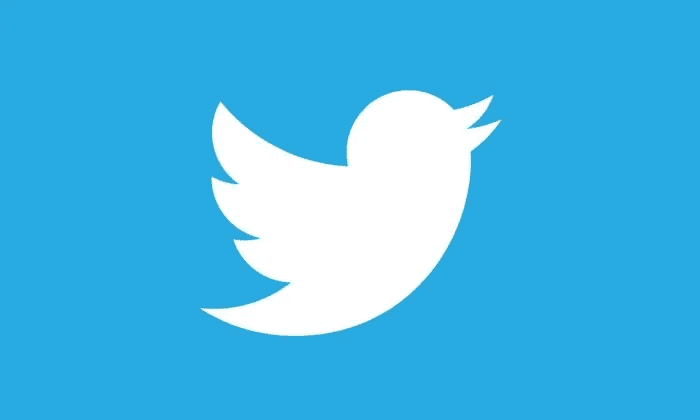

# 停止浪费时间，使用 Twitter 保持消息灵通

> 原文：<https://medium.com/hackernoon/stop-wasting-time-and-use-twitter-to-stay-informed-d7e7363b58d3>

也许，像我一样，你花了太多的时间阅读新闻、博客、日志。你不喜欢它。

内容不再只是每天到达一次，而是持续不断。很容易用这种浅薄的追求来填满每一个空余时间。刷新网页并检查更新。本可以更好利用的时刻。

对一些人来说，突然戒除法可能有用，但我不想完全脱离新闻。我喜欢关注时事。我只想减少依赖。尽量减少我的阅读时间。让我的钱得到最大的回报。

原来答案一直就在我眼前。藏在众目睽睽之下。推特。

不，我不是指 Twitter 那个无尽的时间槽，那个无底的滚动厄运列表。我的意思是 Twitter 是精心策划的低噪音新闻的丰富来源。这就是我的意思:

*   @[BBC 新闻](https://twitter.com/BBCNews)—[BBC 新闻](http://www.bbc.co.uk/news)的新闻、特写和分析
*   [@ HN tweets](https://twitter.com/HNTweets)—[黑客新闻](https://news.ycombinator.com/)首页故事
*   [@多边形](https://www.polygon.com) —来自[多边形](https://www.polygon.com/)的视频游戏覆盖
*   [@verge](https://www.theverge.com/) —科技和娱乐内容来自 [The Verge](https://www.theverge.com/)
*   [@ xkcd 经济](https://twitter.com/xkcdComic) —供稿自 [xkcd 网络漫画](http://xkcd.com/)

将这些整合成一个推特列表给了我自己的个性化新闻源。我保持消息灵通的成本已经缩减到每天两次，每次 5-10 分钟——把我剩下的时间腾出来做更深入的追求。新的平衡让我开心多了。

我希望这也能激励你重新利用你的时间！

最初发表于[jamesfmackenzie.com](http://www.jamesfmackenzie.com/2017/01/08/stop-wasting-time-and-use-twitter-to-stay-informed/)

> [黑客中午](http://bit.ly/Hackernoon)是黑客如何开始他们的下午。我们是 [@AMI](http://bit.ly/atAMIatAMI) 家庭的一员。我们现在[接受投稿](http://bit.ly/hackernoonsubmission)，并乐意[讨论广告&赞助](mailto:partners@amipublications.com)机会。
> 
> 如果你喜欢这个故事，我们推荐你阅读我们的[最新科技故事](http://bit.ly/hackernoonlatestt)和[趋势科技故事](https://hackernoon.com/trending)。直到下一次，不要把世界的现实想当然！

