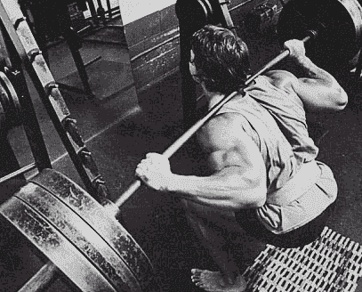

# 别抱怨了，赶快完成吧——举重运动员理财指南

> 原文：<https://medium.com/hackernoon/stop-whining-just-get-it-done-a-weightlifter-s-guide-to-finance-65a60008e389>

> 乔恩·诺斯:“唐尼，你介意我问你一个问题吗？”
> 
> 唐尼·尚克尔:“是的，兄弟，有什么问题？”
> 
> 琼恩·诺斯:“你怎么变得这么强壮？”
> 
> 多恩·尚克尔:“该死的兄弟，你必须坚强！”

乔恩·诺斯和唐尼·尚克尔都是美国的奥运会举重运动员。乔恩·诺斯是一名前瘾君子，后来成为一名举重运动员，有着超乎寻常的个性。唐尼·尚克尔是一位导师，一只野兽，一位鼓舞人心的举重运动员。当乔恩·诺斯第一次见到唐尼时，他感到害怕和紧张。他想知道唐尼一生都做了什么才变得如此强壮，当他问时，唐尼回答说:“你必须变得强壮！”

这五个字的回答包含了任何人成功所需的一切。

杰伊和我与人的大多数对话都是从这样一个问题开始的:“我如何打入投资银行业？”我们通常会问自己一个问题，目的是更多地了解我们的谈话对象，并了解我们如何才能最好地制定一个计划来帮助他们实现目标。唐尼对乔恩的回应，虽然与我们通常的做法不同，但却提供了一个有趣的视角来看待进入[金融界](https://hackernoon.com/tagged/finance)的职业生涯。

我 2015 年的个人目标是硬拉 500 磅。我过去曾硬拉过 490 磅，但我从未能打破 500 磅的神奇纪录。我研究了不同的训练计划，与教练交谈，了解我可以做些什么来变得更强壮，戒酒，然后拼命工作。

随着年底的临近，上周我决定是时候试着减掉 500 磅了。我装上酒吧，做我的热身设置，并开始接近我的最大值。我做了 2 次 460 磅，然后在杠铃上加了 500 磅。我盯着酒吧，尖叫，然后失败的代表。

托举最难的部分不是重量本身，而是对我头脑中重量的恐惧。当我去拉杠的时候，我心想，如果我在拉杠的时候受伤了怎么办？也许在我尝试之前，我应该减少训练量。

在我的尝试失败后，唐尼的话在我脑海中浮现。我要硬拉 500 磅的唯一方法，就是我去举起 500 磅。这并不意味着我只是加载了酒吧，并希望我的结果将是不同的下一次。这意味着我必须走出去，通过纪律，饮食，休息，建立我的弱点和信心，使结果不同。无论你从某个你钦佩的人那里得到了多么好的建议和见解，除非你走出去，为自己制定一个计划并执行它，否则这些建议和见解都是完全无用的。

你需要了解其他人是如何闯入投资银行业的。你需要努力学习，取得好成绩。你需要练习和准备面试。你需要有信心，克服你的弱点。

进入这个行业有多种方式，你必须找到适合你的策略，然后去做。那么，如何打入投资银行业呢？你只是让它发生！

这是昨天的事。坚持不懈。

> [黑客中午](http://bit.ly/Hackernoon)是黑客如何开始他们的下午。我们是 [@AMI](http://bit.ly/atAMIatAMI) 家庭的一员。我们现在[接受投稿](http://bit.ly/hackernoonsubmission)，并乐意[讨论广告&赞助](mailto:partners@amipublications.com)机会。
> 
> 如果你喜欢这个故事，我们推荐你阅读我们的[最新科技故事](http://bit.ly/hackernoonlatestt)和[趋势科技故事](https://hackernoon.com/trending)。直到下一次，不要把世界的现实想当然！

