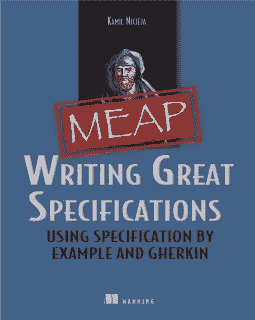

# 停止编写反应式小黄瓜场景。出去-进去！

> 原文：<https://medium.com/hackernoon/stop-writing-reactive-gherkin-scenarios-go-outside-in-5446718fc1a3>

## 由外向内场景大纲的简单指南

> (文章摘自我的书， [*写作大规范。*](https://www.manning.com/books/writing-great-specifications) 今天可以拿 *WGS* 39 折——查看帖子结局。)

熟悉[小黄瓜](https://github.com/cucumber/cucumber/wiki/Gherkin)或[黄瓜](https://cucumber.io)的人可能已经知道，[场景](https://hackernoon.com/tagged/scenario)轮廓是类似场景的模板。但是这些人*不知道的是，他们最可能使用的方法是被动的，而不是主动的。在本文中，我将向您展示一种用[小黄瓜](https://hackernoon.com/tagged/gherkin)编写场景大纲的主动方法。*

由于有了场景大纲，您不必在您的特性文件中重复相同的假设。

所以如果我们有两个非常相似的场景

```
Feature: Shipping Scenario: Shipping PDFs Given a PDF book in Simona’s cart
     When she pays for it
     Then the book should be sent to a mobile device Scenario: Shipping audiobooks Given an audiobook in Simona’s cart
     When she pays for it
     Then the book should be sent over email
```

我们可以很容易地用两个这样的例子将它们合并成一个场景大纲

```
Feature: Shipping Scenario: Shipping methods Given a <format> book in Simona’s cart
     When she pays for it
     Then the book should be <shipped> Examples:
      | format    | shipped                 | 
      | PDF       | sent to a mobile device |
      | audiobook | sent over email         | 
```

合并冗余场景是创建场景大纲的一种方式，但不是唯一的方式。我喜欢把另一种方法叫做*由外向内的方法，用于编写场景大纲。*

> 一个**由外向内的场景大纲**是直接从团队在分析过程中收集的例子中写出来的，而不是通过合并相似的场景。

由外向内的方法包括两个步骤:

1.  以表格的形式为您的规范收集真实世界的示例；
2.  根据表格编写场景大纲，根据数据调整步骤和参数。

由外向内的方法要求你先分析例子，再写场景。您在第一步中创建的表甚至不必是小黄瓜表。它可以是在 Excel 中创建的简单电子表格。另一方面，只有当您注意到冗余和规范变得难以管理时，合并方法才假设将场景演进为场景大纲。从这个意义上来说，由外向内的方法比合并方法更主动——因为成为一个主动的交付团队比被动的团队更好，所以由外向内的场景大纲最终会成为您开发工作的巨大资产。

## 介绍一些业务背景

出于本文的目的，假设您为一家像 Amazon 这样的电子商务购物应用程序公司工作。这家公司希望成为图书、电影、音乐和游戏以及电子产品、玩具、服装、运动、工具、杂货和花园用品的网上零售商。卖书是这家公司最初的目的。之后，它决定扩张，增加电子阅读器、平板电脑和耳机等产品，以适应商店的阅读环境。现在我们必须处理运输所有这些不同种类的产品。前面还有很多工作要做，而且业务已经多样化了——谢天谢地，有很多不同的例子可以用来编写场景。

# 1.在表格中收集示例

为了从示例中获得场景大纲，我们首先需要一些示例。为了获得示例，我们需要实现一个新特性。幸运的是，我们理论上的公司所有者会欣然从命。该公司目前的首要任务是让更多商品进入商店，扩大市场。事实证明，与大型出版商和生产商的谈判很困难，管理层希望向既能出售新品又能出售旧品的个体商户开放商店。商人将从我们先进的运输基础设施中受益，而我们将从他们的利润中提成。

经过一番分析后，销售和营销部门就定价模型达成一致，该模型遵循以下规则:

*   商家可以免费创建自己的账户，列出新商品；
*   商品成功售出后，我们会从中抽成；
*   我们的分成取决于买家的运输地点，因为由于我们的运输基础设施，商家必须付费才能访问全球客户数据库。

现在让我们确定价格范围，并将我们的列表重新制作成示例表的草稿(表 1)。佣金是根据我们的美国运营基地和我们在每个地区的基础设施的运输距离而设计的。

**Table 1**

该表可能是来自销售和市场营销的非技术涉众与程序员、测试人员和设计人员的交付团队之间的对话结果。人们不需要任何技术技能来创建或理解它，因为还没有涉及到小黄瓜。如果您担心场景大纲过于技术性，那么您可以在您的规范研讨会期间将您的示例保持在非技术级别。这没什么不好。

# 2.从收集的例子中推导出给定的何时何地

既然我们已经有了示例表，我们就可以编写假设条件了。要做到这一点，我们需要找到一个与我们的表的结构配合得很好的场景模板。例如，您能否看到区域行就像一个问题，佣金行就像每个问题的答案？

*   北美？我们抽取购买量的 10%。
*   南美？下调幅度为 11.4%。
*   欧洲和亚洲？佣金是 12.9%。
*   非洲？准备好放弃 13.5%。

从技术角度来看，在我们决定收取多少佣金之前，问题定义了系统的状态，而答案则根据所选的状态定义了结果。系统状态由给定描述，结果应该写成给定。我们已经准备好写下三分之二的场景了！

```
Given a purchase from <region>
 Then we should take <commission> of the price
```

这看起来很有希望，但是因为这是一个关于卖家的场景，而不是买家，我们可以添加另一个给定的场景，指定商家是我们的主要参与者。例如，我们可以称小商店为快船。

```
Given a merchant called Quick-Ship
  And a purchase from <region>
 Then we should take <commission> of the price
```

有了这三个步骤，我们还需要一个步骤，它将指定场景的主要动作。

```
Given a merchant called Quick-Ship
  And a purchase from <region>
 When Quick-Ship gets paid for the purchase
 Then we should take <commission> of the price
```

# 3.将该表添加到您的场景中

我们需要做的最后一件事是将我们之前准备的示例表与给定的时间结合起来，并添加剩余的关键字，如特性或场景大纲。

```
Feature: Selling items through individual merchants Scenario Outline: Merchant commissions Given a merchant called Quick-Ship
      And a purchase from <region>
     When Quick-Ship gets paid for the purchase
     Then we should take <commission> of the price Examples:
      | region        | commission |
      | North America | 10%        |
      | South America | 11.4%      |
      | Europe        | 12.9%      |
      | Asia          | 12.9%      |
      | Africa        | 13.5%      |
```

正如您所看到的，通过一点创造性，我们很容易就达成了一个完整的场景大纲。然而，选择例子来导出我们的轮廓是一门独立的艺术，并且需要更多的空间来适当地涵盖它——所以我们不会在本文中涉及它。但是现在，我们知道如何编写由外向内的场景大纲！

# 4.利润！

一般来说，我更喜欢由外向内的方法。通过合并得到的场景大纲通常看起来过于程序化，这使得业务人员不愿意阅读大纲。我认为这与“不要重复自己”原则有关，这是合并技术的创始原则。优雅的结构和删除冗余的代价通常是牺牲小黄瓜的自然语言，将太多的东西放入括号和参数中。相比之下，由外向内的方法强调从非小黄瓜表(任何非技术人员都可以阅读)到小黄瓜场景(如果他们阅读了示例就不需要)的逐渐演变。这种演变通常会使最终的轮廓看起来更自然。



要了解更多关于场景、场景大纲、小黄瓜以及它们如何帮助您的企业像顶级企业一样运营，**下载免费的第一章** [***编写伟大的规范***](https://www.manning.com/books/writing-great-specifications) ***。***

## 以三分之一的价格买下 WGS！

您也可以在 [Slideshare](http://www.slideshare.net/thion/specifications-for-the-real-world) 上阅读我的演示文稿，找到 39%的折扣代码！

[](http://bit.ly/HackernoonFB)[](https://goo.gl/k7XYbx)[](https://goo.gl/4ofytp)

> [黑客中午](http://bit.ly/Hackernoon)是黑客如何开始他们的下午。我们是 [@AMI](http://bit.ly/atAMIatAMI) 家庭的一员。我们现在[接受投稿](http://bit.ly/hackernoonsubmission)，并乐意[讨论广告&赞助](mailto:partners@amipublications.com)机会。
> 
> 如果你喜欢这个故事，我们推荐你阅读我们的[最新科技故事](http://bit.ly/hackernoonlatestt)和[趋势科技故事](https://hackernoon.com/trending)。直到下一次，不要把世界的现实想当然！

