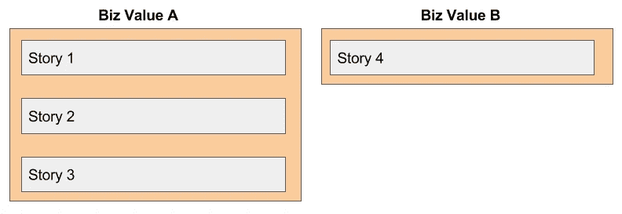
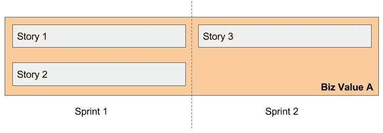
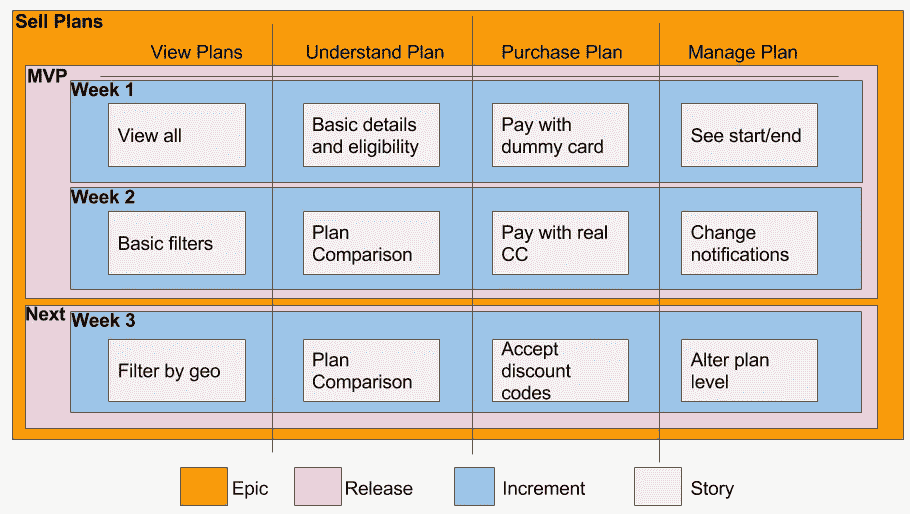
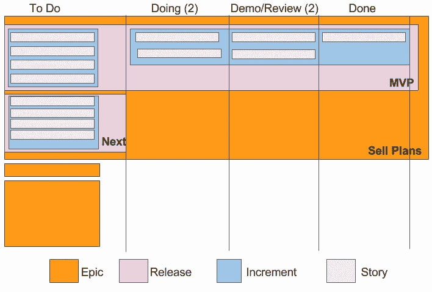
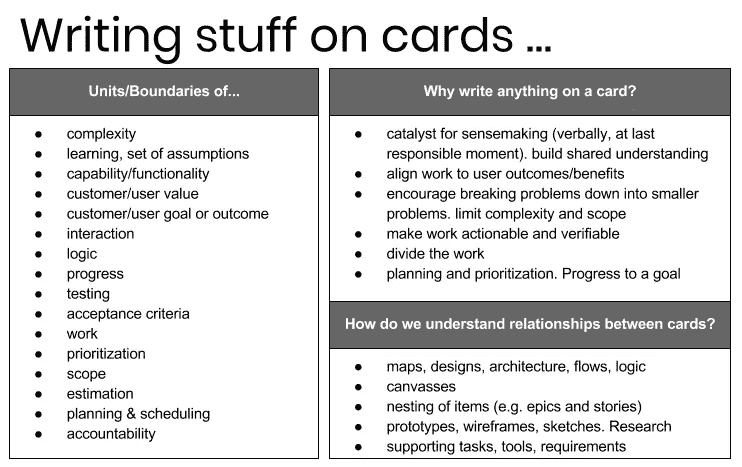

# 故事和史诗

> 原文：<https://medium.com/hackernoon/stories-vs-epics-d773118420d2>

## 嵌套层次、边界、独立性和价值…

## 故事和史诗(以及独立价值)

*   **故事** =一个*小到足以*适合短跑的故事
*   **史诗** =一个*太大*不适合冲刺的故事

在 Scrum 中，史诗被分解成故事(因为一切都需要适合 sprint)。故事应该是有价值和独立的([见投资](https://www.agilealliance.org/glossary/invest/))。由此我们得出一个明显的矛盾:如果这个故事发展成一部史诗，这个故事真的是独立的吗？而故事*独立有价值*吗？[可能，但是值被锁定](https://www.scrumalliance.org/community/articles/2014/march/stories-versus-themes-versus-epics):

> 虽然组成史诗的故事可以独立完成，但它们的商业价值只有在整个史诗完成后才能实现。

嗯。好的。因此，下面的故事 1 从“业务”的角度来看*不是*独立有价值的(尽管从学习的角度来看可能非常有价值，这对业务肯定是有价值的)。故事 4 *从商业角度来看是有独立价值的。*

## 潜在可释放

如果你参加过 Scrum 培训，你可能已经陷入了将史诗的使用与短跑的[定义相协调的困境:](https://www.scrum.org/resources/what-is-a-sprint-in-scrum)

> 一个月或不到一个月的时间盒，在此期间创建一个“完成的”、可用的和**潜在可发布的**产品增量。

棘手的说法是“潜在可释放”。如果一些故事被分配给史诗，而史诗——根据定义——太大而不适合 Sprint，我们怎么能有潜在的可发布的产品增量呢？

这个谜题也有答案！肯·鲁宾([Essential Scrum](https://www.amazon.com/Essential-Scrum-Practical-Addison-Wesley-Signature/dp/0137043295)的作者)为谷歌集团贡献了[这个金块:](https://groups.google.com/forum/#!topic/scrumalliance/R55_NL1XSZQ)

> 需要明确的是，“潜在可运输”并不意味着建造的东西必须实际运输。**运输是一项业务决策，经常受到诸如“我们是否有足够的功能或足够的客户工作流来证明客户部署的合理性？”或者“考虑到我们两周前刚刚发布了一个版本，我们的客户能接受另一个变化吗？”**
> 
> 潜在可交付性更好地被认为是一种信心状态，即在 sprint 中构建的东西实际上已经完成，这意味着**在我们可以从 sprint 中交付结果之前，不存在需要完成的重大未完成工作**(例如重要的测试或集成等等)，如果交付是我们的业务需求的话。"

在[新框架——增量中，](http://ronjeffries.com/articles/017-08ff/new-framework-increment/) [Ron Jeffries](https://medium.com/u/a45b68b1ab11?source=post_page-----d773118420d2--------------------------------) 定义了增量(与 Ken Rubin 的描述相吻合):

> 每隔一段时间，最好是一周或两周，开发人员提供一个集成的、运行的、经过测试的软件版本，即“增量”，包含项目中迄今为止已经完成的所有特性和功能**。增量必须处于可用状态，并且必须符合所有约定的完整性和正确性标准。**

摘要:已经交付了一定数量的价值(即使该价值依赖于 1)正在完成的其他项目，2)现在可能的学习和反馈功能，和/或 3)将可以部署的“某些东西”组合在一起的纯粹行为)。而且理论上作品是可以发布的。

## 故事地图

我们认为开始销售我们 Widget 服务的订阅计划是有价值的。以下是史诗、发行版、增量版和故事使用用户故事地图的外观([查看此处了解更多信息](http://jpattonassociates.com/user-story-mapping/)):

注意这些是如何组合在一起的:

*   我们根据用户旅程创建一个水平流程
*   我们使用**故事**将我们的努力集中在对用户有影响的功能上(对这些故事的反馈可以是即时的和连续的)
*   我们使用**增量**来定期**检查和调整**
*   我们使用**发布**来协调决策，让新的东西呈现在我们的用户面前
*   我们使用**史诗**作为商业价值的容器(或者至少是关于商业价值的假设)

## 增量检查/调整

理解了增量的价值后，团队决定每周进行一次回顾。在一轮实验中，AcmeTeam 放弃了他们的用户故事估计，而是努力使用户故事“尽可能小，但不能更小”。这就像 Scrum，但是不用担心故事点承诺/冲刺计划。嫁接到看板板上，看起来有点像这样:

不好看(我更喜欢故事图)，但还是有帮助的。

每周四，团队承诺回顾“到目前为止在项目中已经完成的特性和能力”(见演示/回顾)。根据不同的周，该演示应涵盖 2-4 个故事。*有些事情已经完成，有些事情正在演示。现在，它可能不是故事地图中描述的漂亮整洁的第一周端到端增量，但它是*的东西*。团队没有等到下周末——直到*全部完成*——而是得到了有意义的反馈。*

> 但是，只有四个故事一起演示时，演示才有意义！

也许吧。那么，也许诀窍是把演示安排在这四个故事完成的那一天？

## 那又怎样？

我要带着这些去哪里？考虑到我们最初对史诗的定义是受 Sprint 约束的。但是让我们把短跑从等式中去掉。

归根结底，核心问题是:

1.  我们能把问题分解成更小、更谨慎的问题吗？
2.  团队完成工作需要什么样的边界？作为项目经理，我可能关心的边界是端到端的客户价值。对于编写测试的开发人员来说，更窄的范围是合适的。
3.  我们如何保持**关系**(包括层级关系和相邻关系)
4.  我们如何确保**将工作与用户成果/收益结合起来**
5.  我们如何根据我们的进展**检查和调整**？

经验不足的团队在定义史诗、用户故事、任务和子任务时容易出错。现实情况是，软件产品开发通常是一个很大的嵌套层次，而且非常混乱。需要额外的工具——如地图、画布、设计、线框、逻辑图——来将心智模型整合在一起。

经理们把各种各样的含义强加到“卡片”上——作为要求，作为时间安排，作为责任，作为给人分配东西，作为衡量速度的单位——而失去了它们本质上的联系(并挤出了手头任务的灵活性和定制化)。

你也许可以完全去掉用户故事和史诗这两个词，而用它们来代替:

*   山
*   小山
*   巨砾
*   岩石
*   (捷)斯托内；(瑞典)斯托内；(英)斯通
*   水晶透镜
*   小麦

我只是半开玩笑。

我将用一个表格来结束这篇文章，这个表格解释了为什么我们很难确定如何描述我们的工作的“标准”定义。我们的工作遍布下面的地图。共享理解是困难的。伟大的团队知道如何保持他们的心智模型准确。

