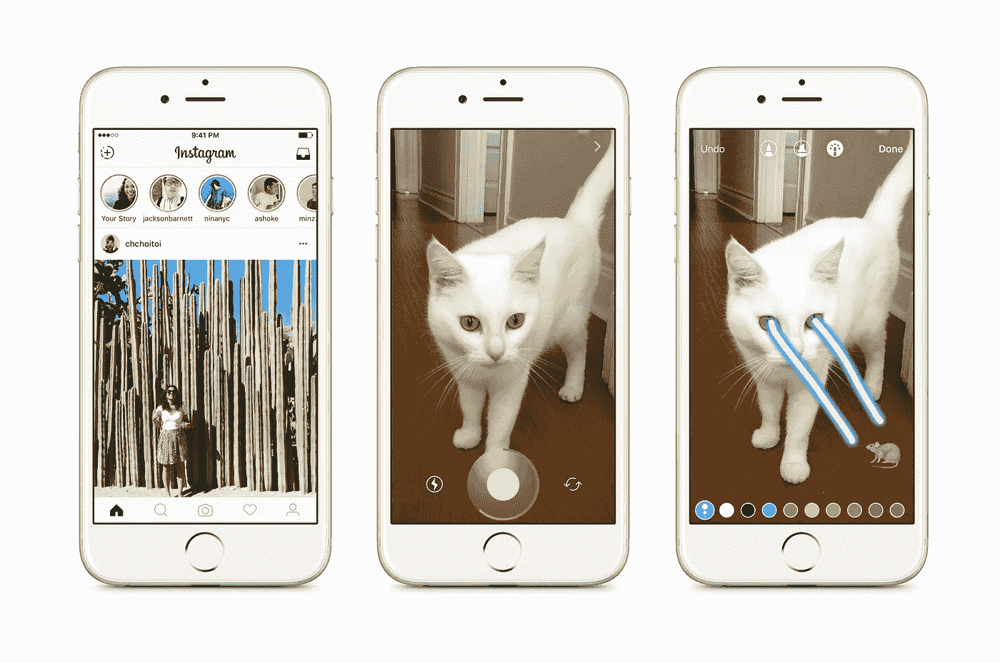

# 故事大战:推特风暴

> 原文：<https://medium.com/hackernoon/stories-wars-a-tweetstorm-ca6e1b2ed828>

*(今天转载自我的 Twitter 消息)*

1/ Instagram 与 [Snapchat](https://hackernoon.com/tagged/snapchat) 在故事上的竞争将是一个迷人的镜头，通过它可以分析大规模网络效应的影响

2/拥有大型内置网络的现有 Snapchat 用户可能不会立即转向 Instagram

3/然而，不在 Snapchat 上的 Insta 用户或 Snapchat 新手(像我一样)会在 Instagram 上看到更多的参与

4/对一个[故事](https://hackernoon.com/tagged/story)的社会认可(例如，浏览量)是用户参与的重要动力

5/对于 Insta 用户来说，不断打开各种各样的其他社交应用也是一个很大的麻烦(“应用疲劳”)

随着越来越多的 Insta 用户成为 Stories 用户，Snapchat 优先用户尝试 Insta Stories 的理由变得更有说服力

7/我认为 Instagram *钉*故事功能，使 Insta 故事的论点更有说服力

8/但是，Snapchat 在自发性和高内容量方面优化得更好；该应用程序直接在相机中打开

9/ Instagram 有一种精心整理照片的文化，它需要努力建立一个 Snapchat 质量的故事网络

10/我很好奇谁会赢得故事比赛；我认为这将是一场皇家战役

> [黑客中午](http://bit.ly/Hackernoon)是黑客如何开始他们的下午。我们是 [@AMI](http://bit.ly/atAMIatAMI) 家庭的一员。我们现在[接受投稿](http://bit.ly/hackernoonsubmission)并乐意[讨论广告&赞助](mailto:partners@amipublications.com)机会。
> 
> 如果你喜欢这个故事，我们推荐你阅读我们的[最新科技故事](http://bit.ly/hackernoonlatestt)和[趋势科技故事](https://hackernoon.com/trending)。直到下一次，不要把世界的现实想当然！

