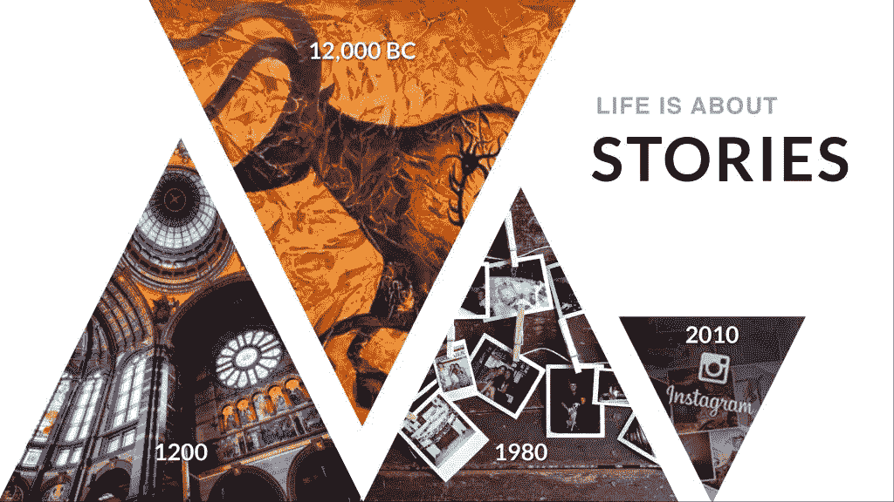
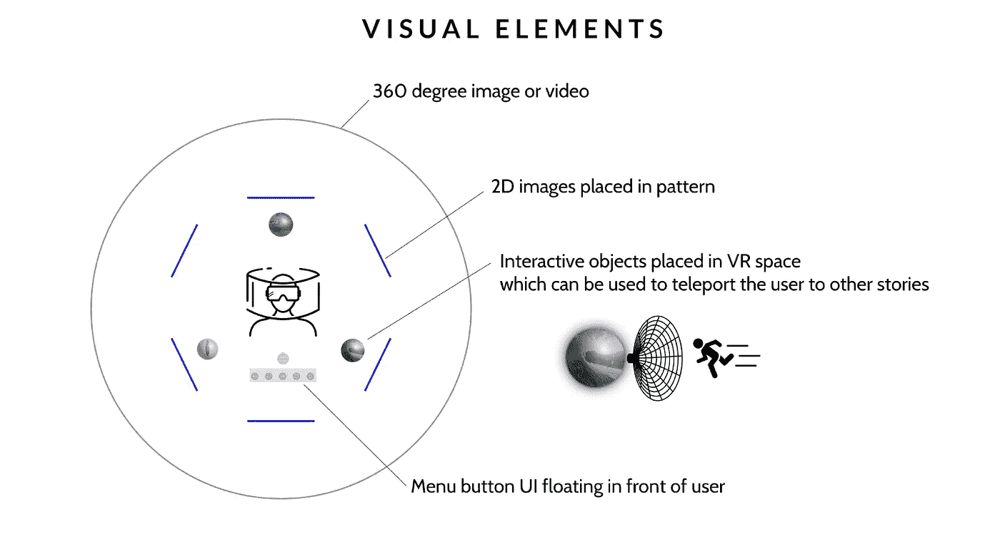
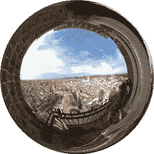

# 虚拟现实中的讲故事

> 原文：<https://medium.com/hackernoon/storytelling-in-virtual-reality-cf8efc5e78f1>

生活是关于故事的，自古以来，人类就一直保留着他们的记忆。它始于墙上有画的洞穴。它转移到有彩色玻璃窗的教堂。我们的父母有宝丽来。我们的孩子有 Instagram。但是现在虚拟现实来了，它将改变我们保存记忆的方式。

虚拟现实中的故事讲述还处于初级阶段。当所有新媒体首次出现时，我们只是将现有的媒体投射到虚拟现实中。正如第一批电影制作人过去常常将摄像机对准剧场看台，拍摄演员的表演一样，我们现在拿着摄像机，将照片和视频投射到虚拟现实中。但是随着时间的推移，在虚拟现实中讲述故事的新方法将会出现。

# 在虚拟现实中讲故事有什么不同

迄今为止，我们的媒体一直局限于二维世界。我们的屏幕、报纸和电视都是平面媒体的投影。虚拟现实把它解放出来，让它身临其境。当体验媒体时，大多数虚拟现实的第一个观众的第一句话通常是:“感觉就像在那里”。对这些图像的反应更加情绪化。人们会对快动作视频感到恶心，而 360 度拍摄的恐怖故事更恐怖。地方和记忆的沉浸式照片比在普通屏幕上看到的照片能引发更深层次的反应。

> 首次使用虚拟现实的用户最常说的第一句话:**感觉就像身临其境！**

但是在虚拟现实中讲故事不仅仅是在拍摄 360 度镜头时躲开。我们今天在屏幕上体验媒体的方式就像去博物馆，仔细分析每一幅画。在虚拟现实中浏览故事的方式更像是孩子们在操场上奔跑。他们探索他们的环境，以他们的速度发现故事的谜题，就像一个捉迷藏的游戏。

在 Weavr，我们使用一种通用的方法来实现这种探索。故事创作者可以选择在 360 度沉浸式环境中添加静态或交互式元素。静态元素可以用来解释环境的细节。我们支持透明位图，它允许创建者为这些元素选择任何形式。交互元素就像超链接，把用户带到一个新的环境。我们称这种导航为“心灵传输”，因为这就是它的感觉。

# 我们在创作互动虚拟现实故事方面的第一个收获

我们用这种格式创作了一些互动故事。我们使用了一些电影中流行的“球体”类比。这个球形的导航球体投射下一个场景的预览。故事创建者也可以选择显示带有对目标场景描述的文本。

故事创作者需要为用户的自由选择和故事的流动找到正确的平衡。我们已经试验了几种类型的故事:

线性故事，类似于幻灯片，但有 360°的内容。我们试验了多种时间设置，每张幻灯片 10 到 15 秒似乎是个不错的值。它允许观众环顾四周，而不会被下一个过早出现的场景吓到。

*   航海故事。在这些故事中，我们使用球体在故事的其他部分中导航。我们了解到，在故事中让导航球可见之前，最好等待几秒钟。我们还了解到，使用太多的球体会让观众感到困惑。最好坚持一个“红色药丸 vs 蓝色药丸”的类比。

下面的视频显示了一个用户在 VR 中浏览这样一个故事的截屏视图。

该视频展示了一个基于威廉·莎士比亚的罗密欧与朱丽叶故事的导航故事。它是用在意大利城市维罗纳拍摄的 360 张静态图像创建的，展示了用户如何选择球体传送到故事的不同部分。这允许用户在观看这个故事时选择她自己的路径。

我们在试验这些故事时学到的一个重要经验是，用户需要指导和返回主菜单的方法。虽然球体确实提供了一些关于故事走向的视觉反馈，但观众需要知道她是否已经看过了故事的那个分支。否则观众会感到困惑。故事的结尾需要清楚地标记出来，让观众明白这种经历已经结束了。

# 主要要点

*   在虚拟现实中讲故事不能是线性的
*   用户应该决定探索故事的哪些部分
*   通过自动将观众移至故事的下一部分(幻灯片)，减少观众的工作量
*   限制拐点的数量，让人们更容易理解如果走那条路会发生什么
*   提供一个清晰的信号，说明故事已经结束了
*   允许用户在任何时候“退出”故事。

如果你准备好尝试在虚拟现实中讲故事，请查看我们的 Oculus Rift 和 Vive 查看器[这里](http://weavr.space/)。

如果你想尝试在虚拟现实中创作故事，请点击这里使用我们的[编辑器](http://weavr.space/account.aspx)

如果你想从佛罗伦萨观看一个身临其境的线性故事，使用这个[链接](http://vr.weavr.space/ShowStory.aspx?id=762f3c14-0135-45cc-88e1-c2cce5911028)

我们期待看到虚拟现实中的故事讲述将如何发展。欢迎在评论区与我们分享你的想法

> [黑客中午](http://bit.ly/Hackernoon)是黑客如何开始他们的下午。我们是 [@AMI](http://bit.ly/atAMIatAMI) 家庭的一员。我们现在[接受投稿](http://bit.ly/hackernoonsubmission)，并乐意[讨论广告&赞助](mailto:partners@amipublications.com)机会。
> 
> 如果你喜欢这个故事，我们推荐你阅读我们的[最新科技故事](http://bit.ly/hackernoonlatestt)和[趋势科技故事](https://hackernoon.com/trending)。直到下一次，不要把世界的现实想当然！

