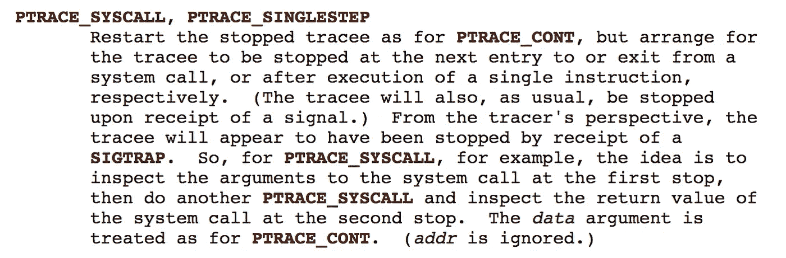

# 60 行围棋中的 Strace

> 原文：<https://medium.com/hackernoon/strace-in-60-lines-of-go-b4b76e3ecd64>

*这篇文章是我在* [*GopherCon talk 期间写的一篇简单的*](https://gophercon.com/speakers/27) [*strace 实现*](http://github.com/lizrice/strace-from-scratch) *的演练，一篇关于 Syscalls* *的 Go 程序员指南。你会在这里找到*[](http://github.com/lizrice/strace-from-scratch)**的代号。**

*为了探索 Linux ptrace syscall 的一些特性，我认为编写自己的基本 strace 的实现会很有趣——这个工具显示一个可执行文件使用了哪个 syscall。这篇文章简要分析了这个程序是如何工作的。如果您有时间的话，我们将在讲座中介绍更多细节和精彩内容:*

# *对子进程设置断点*

*我们的程序将捕获我们传入的任意命令发出的所有系统调用。它使用`exec.Command()`来设置子进程将要运行的任何命令，并且我们通过在命令的`SysProcAttr`结构中设置`Ptrace`为真来指定我们想要在这个子进程上使用 ptrace。下面是来自`main()`函数的这段代码:*

```
*fmt.Printf("Run %v\n", os.Args[1:])cmd := exec.Command(os.Args[1], os.Args[2:]...)
cmd.Stderr = os.Stderr
cmd.Stdin = os.Stdin
cmd.Stdout = os.Stdout
cmd.SysProcAttr = &syscall.SysProcAttr{
    Ptrace: true,
}cmd.Start()
err := cmd.Wait()
if err != nil {
    fmt.Printf("Wait returned: %v\n", err)
}*
```

*这使得子进程在创建后立即进入断点状态。如果我们在`main()`中运行这段代码，我们可以看到`cmd.Wait()`返回一个非零错误:*

```
*root@vm-ubuntu:myStrace# ./myStrace echo hello
Run [echo hello]
Wait returned: stop signal: trace/breakpoint trap
root@vm-ubuntu:myStrace# hello*
```

*我们还可以看到 *hello* 文本输出也被打印出来，这乍一看似乎很奇怪，因为我们刚刚将子进程(它执行打印)置于断点状态。如果您在`cmd.Wait()`之后插入一个小的延迟，您将会看到这不会发生，直到父进程完成。这里发生的事情是，父进程将子进程保持在断点状态，但是当父进程退出时，就没有什么可以再阻止子进程了——所以子进程继续它将要做的事情，并显示 *hello* 。*

# *从子进程的寄存器中获取当前的系统调用*

*下一步是找到子进程寄存器的当前值(其进程 ID 可以在`cmd.Process.Pid`中找到)。这是通过 PTRACE 的 PTRACE_GETREGS 子命令完成的。Go [syscall 包](https://golang.org/pkg/syscall/)为我们提供了几个函数，使得调用各种 Ptrace 子命令变得容易，包括这个。*

```
*pid = cmd.Process.Pid
err = syscall.PtraceGetRegs(pid, &regs)*
```

*这将返回一个结构，显示子进程所有寄存器的当前值。在 x86 CPU(我的 MacBook Pro 有)上，syscall 标识符在`Orig_rax`字段中找到。(`sec`是我给`seccomp/libseccomp-golang`包的导入别名。)*

```
*name, _ := sec.ScmpSyscall(regs.Orig_rax).GetName()
fmt.Printf("%s\n", name)*
```

# *运行到下一个系统调用*

*我们现在希望允许子进程继续运行，直到它遇到下一个系统调用。PTRACE_SYSCALL 子命令就是这样做的，Go syscall 包给了我们一个[函数](https://golang.org/pkg/syscall/#PtraceSyscall)来用这个子命令调用 SYS_PTRACE。*

```
*err = syscall.PtraceSyscall(pid, 0)*
```

*当这种情况发生时，我们会得到一个信号陷阱，我们需要等待。*

```
*_, err = syscall.Wait4(pid, nil, 0, nil)*
```

# *并重复*

*在这一阶段，我们希望再次读取寄存器以获取 syscall 标识符，之后我们希望子进程运行到下一个 syscall，依此类推——因此我们可以简单地在整个进程周围添加一个 for 循环。*

*当子进程完成时，我们需要停止这个循环。在我的简单实现中，当 PtraceGetRegs 失败时，我简单地退出 for 循环。(我们看到的错误是，它试图读取不存在的进程的寄存器——这在子进程已经完成时是有意义的。)*

# *然而*

*运行这段代码将生成一个系统调用列表，但是只有一个问题:每个系统调用都输出两次。这是因为 PTRACE_SYSCALL 实际上在 SYSCALL 运行之前和完成之后都会停止子进程。下面是手册页中的相关描述:*

**

*我添加了一个名为`exit`的布尔值来跟踪它是退出还是进入，并在每次 for 循环中简单地翻转它的状态。我只计算退出时的系统调用。这里是循环，包括跟踪出口。*

```
*for {
    if exit {
        err = syscall.PtraceGetRegs(pid, &regs)
        if err != nil {
            break
        } name, _ := sec.ScmpSyscall(regs.Orig_rax).GetName()
        fmt.Printf("%s\n", name)
    } err = syscall.PtraceSyscall(pid, 0)
    if err != nil {
        panic(err)
    } _, err = syscall.Wait4(pid, nil, 0, nil)
    if err != nil {
        panic(err)
    } exit = !exit
}*
```

# *汇总系统调用*

*我编写了一些[实用程序代码](https://github.com/lizrice/strace-from-scratch/blob/master/syscallcounter.go)来记录每个 syscall 代码被使用的次数，并打印出摘要。*

# *好了*

*如果你试一试，你会发现它给出的东西与`strace`给我们的东西是一致的。这里有一个很短的演示，展示了我们在`echo hello`上使用这段代码时的输出，以及`strace -c`的输出。您将会看到它们为每个系统调用显示了相同的计数。*

*[](https://asciinema.org/a/TcEvXJvxXS6YyzCtowWpOfq6z) [## 从头开始演示

### https://github.com/lizrice/strace-from-scratch

asciinema.org](https://asciinema.org/a/TcEvXJvxXS6YyzCtowWpOfq6z) 

完整的实现还显示了每个系统调用的参数。如果你想构建我们的简单版本来做这件事，我们可以[从其他寄存器](http://syscalls.kernelgrok.com/)映射它们。* 

*在演讲中，我继续演示了如何使用 [seccomp 安全模块来阻止特定的系统调用](http://blog.aquasec.com/new-docker-security-features-and-what-they-mean-seccomp-profiles)。您可以通过取消对`disallow()`调用的注释来亲自尝试一下。这实际上只是让您了解一下使用 seccomp 过滤器时会发生什么——我不建议每个人都开始在生产应用程序中手工编写代码来确定他们可以调用哪些系统调用！如果你喜欢自我沙箱化应用的想法，你应该[看看 Jessie Frazelle](https://www.google.co.uk/url?sa=t&rct=j&q=&esrc=s&source=web&cd=1&cad=rja&uact=8&ved=0ahUKEwitiNyuipDVAhXrAMAKHYl5BqMQtwIIKzAA&url=https%3A%2F%2Fwww.youtube.com%2Fwatch%3Fv%3DBuFTHOgsgAY&usg=AFQjCNEvLzasIbNnh-u61pkQJtH6rssj7Q) 的演讲。*

**大量感谢*[*@ nelhage*](https://medium.com/u/92606ca29d25?source=post_page-----b4b76e3ecd64--------------------------------)*[*C 中 strace 的实现*](https://blog.nelhage.com/2010/08/write-yourself-an-strace-in-70-lines-of-code/) *和*[*micha zowicki*](https://medium.com/u/5b90d60d16b7?source=post_page-----b4b76e3ecd64--------------------------------)*[*深*](/golangspec/making-debugger-for-golang-part-i-53124284b7c8) [*潜*](/golangspec/making-debugger-in-golang-part-ii-d2b8eb2f19e0)***

**[](http://aquasec.com)**