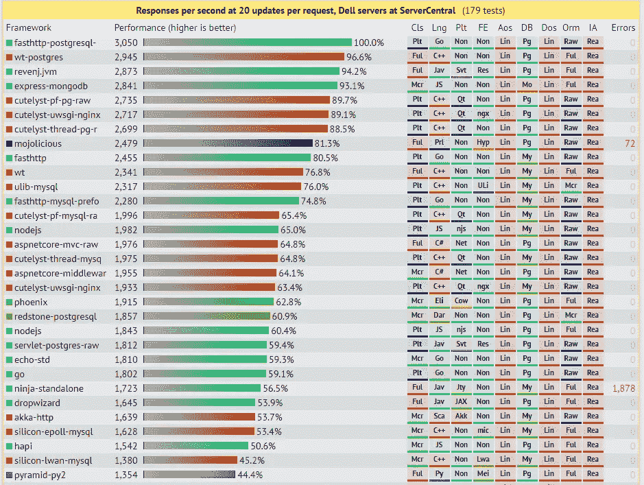
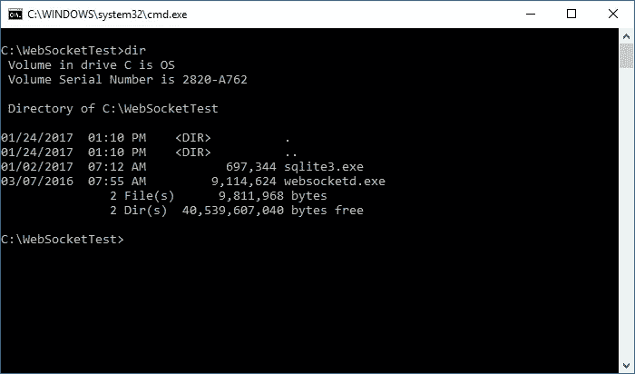
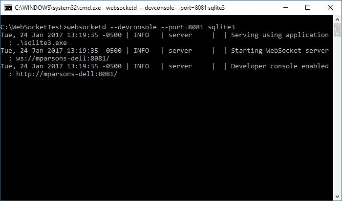
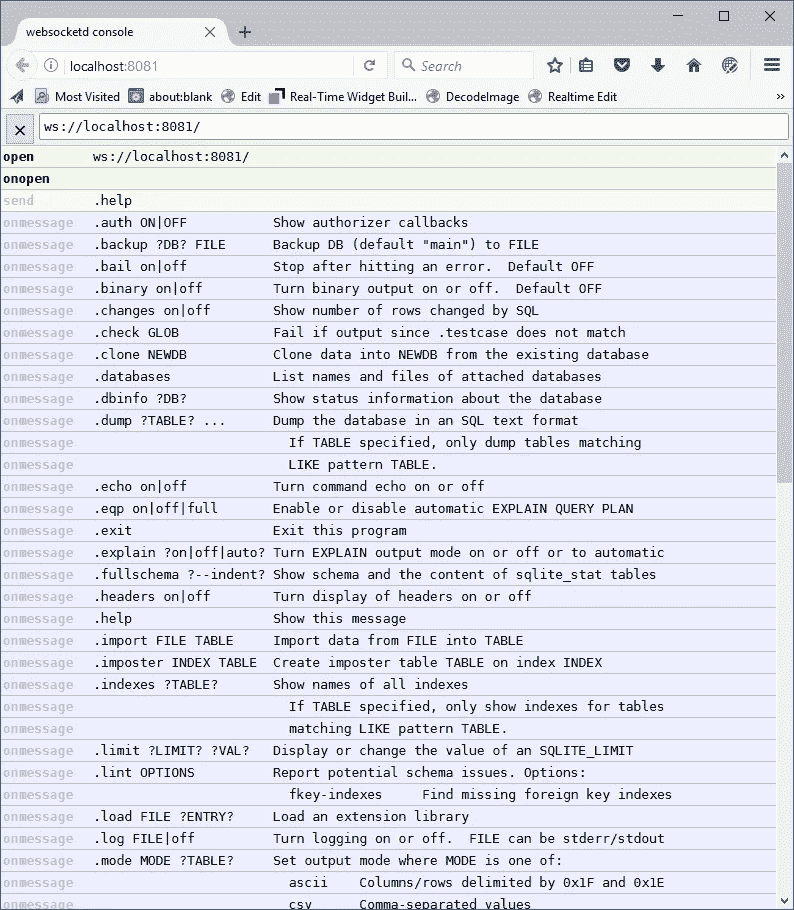
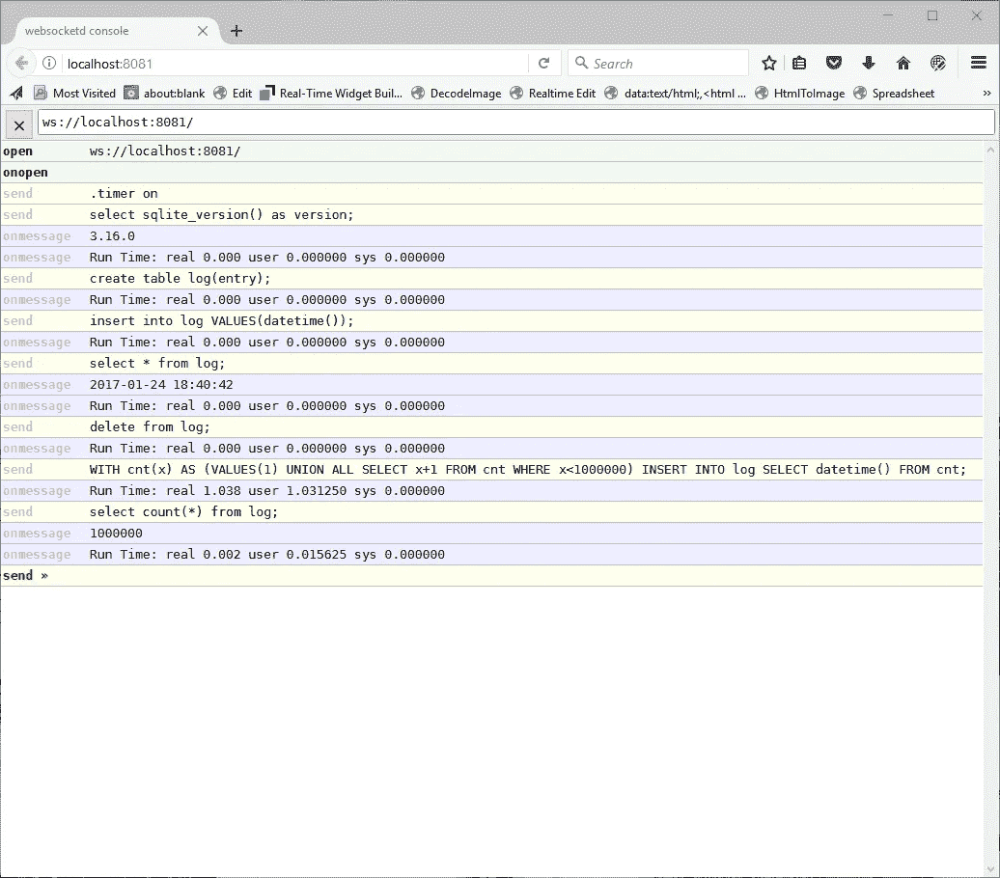
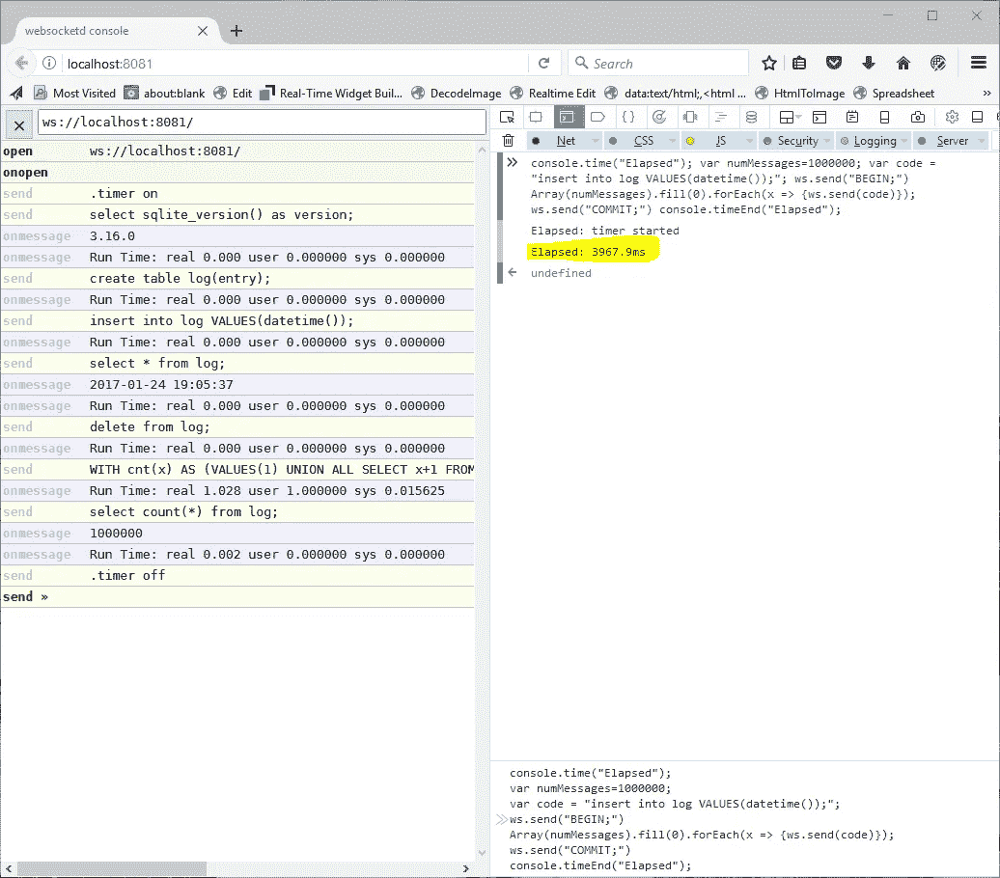

# 在几秒钟内从单个浏览器客户端传输一百万个 WebSocket/SQL 请求…

> 原文：<https://medium.com/hackernoon/stream-a-million-websocket-sql-requests-from-a-single-browser-client-in-a-few-seconds-e7a2b068974c>

我喜欢突破现有浏览器堆栈的性能界限。在之前的一篇文章中，我展示了如何利用 Web Workers 和 WebAssembly 在浏览器中执行一百万条 SQL 语句。

[](https://hackernoon.com/execute-millions-of-sql-statements-in-milliseconds-in-the-browser-with-webassembly-and-web-workers-3e0b25c3f1a6) [## 使用 WebAssembly 和 Web Workers 在浏览器中以毫秒为单位执行数百万条 SQL 语句。

### 这是一个相当长的标题，但希望它能引起你的注意！

hackernoon.com](https://hackernoon.com/execute-millions-of-sql-statements-in-milliseconds-in-the-browser-with-webassembly-and-web-workers-3e0b25c3f1a6) 

虽然这很有趣，而且肯定展示了浏览器 [JavaScript](https://hackernoon.com/tagged/javascript) 引擎的强大威力，但是让浏览器孤立地做事情限制了用例。更有用的是连接到后端，这样我们可以在服务器上处理我们的 [SQL](https://hackernoon.com/tagged/sql) 。事实上，这是大多数 web 应用程序的基础。我使用 Web Sockets 已经有一段时间了，浏览器的简单性和性能给我留下了深刻的印象。

对于这个例子，我想看看从一个浏览器客户端可以实现多少 WebSocket 请求。为了使测试更加真实，我让服务器在每个 Web Socket 请求上向 Sqlite 数据库插入一个简单的记录。作为参考，下面是使用备受推崇的 TechEmpower 基准测试的直接 HTTP 的结果:

[](https://www.techempower.com/benchmarks/#section=data-r13&hw=ph&test=update) [## TechEmpower Web 框架性能比较

### 使用社区贡献的测试对各种 web 应用程序框架和平台进行性能比较…

www.techempower.com](https://www.techempower.com/benchmarks/#section=data-r13&hw=ph&test=update) 

此图列出了数据库更新的最佳表现者:



我的测试并不是与该基准进行比较，而是提供给读者一个类似用例的参考点，即通过浏览器进行数据库更新。

要运行测试，您需要一个 Web 套接字服务器和一个数据库引擎。我将使用两个我最喜欢的应用程序，每当我提供新的黑客环境时，我都会立即安装这两个应用程序:

来自此处的 websocketd:

[](https://github.com/joewalnes/websocketd) [## Joe wannes/websocketd

### 将任何使用 STDIN/STDOUT 的程序转换成一个 WebSocket 服务器。类似于 inetd，但用于 WebSockets。

github.com](https://github.com/joewalnes/websocketd) 

和 Sqlite:

[](http://sqlite.org/) [## SQLite 主页

### SQLite 是一个独立的、高可靠性的、嵌入式的、全功能的、公共域的 SQL 数据库引擎。SQLite 是…

sqlite.org](http://sqlite.org/) 

当您需要快速而强大的工具来进行原型设计或头脑风暴时，我不能推荐这些应用程序。

> “Websocketd 可以把任何使用 STDIN/STDOUT 的程序变成 WebSocket 服务器。像 inetd，但是是针对 WebSockets 的。”
> 
> “SQLite 是一个独立的、高可靠性的、嵌入式的、全功能的、公共域的 SQL 数据库引擎。SQLite 是世界上使用最多的数据库引擎。”

我最喜欢这些工具以及我另一个最喜欢的黑客工具 PhantomJS 的一点是，它们都是自包含的可执行文件，可以在任何环境下运行，从基于云的超级计算机到精致的 RaspberryPi。没有安装，依赖或打包…只是一个很好的旧命令行可执行文件。

要运行测试，创建一个本地目录，并将 websocketd 和 sqlite 可执行文件复制到该目录中。根据您的环境，您可能需要对这些文件授予执行权限。对于我的测试，我运行在 Windows 10 机器上，配置如下:

```
Dell XPS
Processor Intel(R) Core(TM) i7–4770 CPU @ 3.40GHz, 3401 Mhz, 4 Core(s), 8 Logical Processor(s)24 Gigs of RAM
256 SSD Drive
```

我创建了一个名为 WebSocketTest 的目录，如下所示:



运行服务器就像执行以下命令行一样简单:

```
websocketd --devconsole --port:8081 sqlite3
```

您应该得到类似下面这样的消息，让您知道服务器正在运行:



为了确保您的环境正在工作，请从您的浏览器导航到 [http://localhost:8081](http://localhost:8081) 。我在最新版本的 Firefox 上做了测试:


导航到 [http://localhost:8081](http://localhost:8081) 可以让您访问一个交互式 REPL，它允许您测试您的环境。在这种情况下，因为我们使用 Sqlite 命令 shell 作为我们的“服务器”，所以您可以执行通常使用命令行 shell 执行的任何命令:



基本上，websocketd 所做的是包装您的命令行可执行文件，并将标准输入和标准输出通过管道传输到一个 Web 套接字连接，您可以从浏览器访问该连接。很明显，这不是你想在生产环境中做的事情，但是这对于原型创意来说是很棒的。您可以在 devconsole 中尝试更多的示例，例如:

```
.timer onselect sqlite_version() as version;create table log(entry);insert into log VALUES(datetime());select * from log;delete from log; 
```

**确保你包括结尾；终止您的 SQL 命令！**

为了让您了解 Sqlite 数据库引擎有多快，让我们使用以下命令向日志表中插入一百万条记录:

```
WITH cnt(x) AS (VALUES(1) UNION ALL SELECT x+1 FROM cnt WHERE x<1000000) INSERT INTO log SELECT datetime() FROM cnt;
```



所以它花了大约

## 向日志表中插入一百万行大约需要 1 秒钟

…真是令人印象深刻！

在我们继续之前，**确保您通过输入以下命令关闭 Sqlite 计时器**

```
.timer off
```

在 REPL！这可以防止客户端在我们的大更新时被来自服务器的消息淹没。

当然，这并没有真正测试我们的 Web 套接字，因为上面的命令是作为单个 Web 套接字发送到服务器的，在那里执行。为了测试发送一百万个 Web 套接字请求需要多长时间，我们将使用浏览器控制台直接执行我们的代码。

按 F12 键在浏览器中打开开发人员工具，并从控制台粘贴以下代码:

```
console.time("Elapsed");
var numMessages=1000000;
var code = "insert into log VALUES(datetime());";
ws.send("BEGIN;")
Array(numMessages).fill(0).forEach(x => {ws.send(code)});
ws.send("COMMIT;")
console.timeEnd("Elapsed");
```

您应该得到如下所示的内容:



如你所见，在我的机器上…花了

## 发送 100 万个请求大约需要 4 秒钟

到服务器并执行 SQL 插入！

要进行验证，请关闭开发人员工具(再次按 F12 ),并在 REPL 中重新执行以下命令:

```
select count(*) from log;
```

您应该看到现在日志表中有 1，000，000 条记录。

显然，根据您的机器配置和浏览器选择，您的结果可能会有所不同。在任何情况下，在一个受控的环境中，您应该能够轻松地每秒处理数十万个 Web 套接字请求。

由于这只是使用来自单个客户端的单个 Web 套接字连接，我怀疑如果我们利用多个客户端，我们每秒可以处理数百万个请求。我的下一个测试将集中在使用 Web Workers 利用多个 Web Sockets 所以请继续关注。

如果你喜欢这篇文章，也喜欢我其他关于 Medium 的文章，请推荐！

[](https://hackernoon.com/@mikeptweet) [## 迈克·帕森斯-黑客正午

### 阅读麦克·帕森斯在《黑客正午》中的文章。软件研究极客。每天，迈克·帕森斯和成千上万的其他人…

hackernoon.com](https://hackernoon.com/@mikeptweet) 

谢了。

[](http://bit.ly/HackernoonFB)[](https://goo.gl/k7XYbx)[](https://goo.gl/4ofytp)

> [黑客中午](http://bit.ly/Hackernoon)是黑客如何开始他们的下午。我们是 [@AMI](http://bit.ly/atAMIatAMI) 家庭的一员。我们现在[接受投稿](http://bit.ly/hackernoonsubmission)，并乐意[讨论广告&赞助](mailto:partners@amipublications.com)机会。
> 
> 如果你喜欢这个故事，我们推荐你阅读我们的[最新科技故事](http://bit.ly/hackernoonlatestt)和[趋势科技故事](https://hackernoon.com/trending)。直到下一次，不要把世界的现实想当然！

