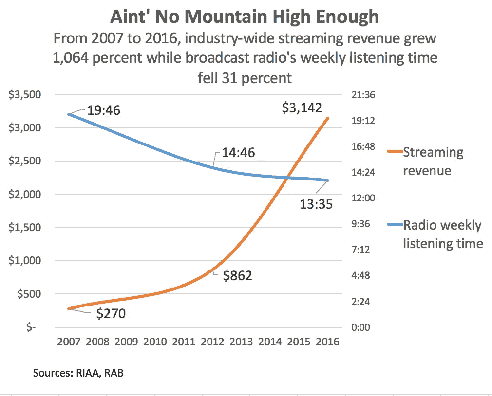
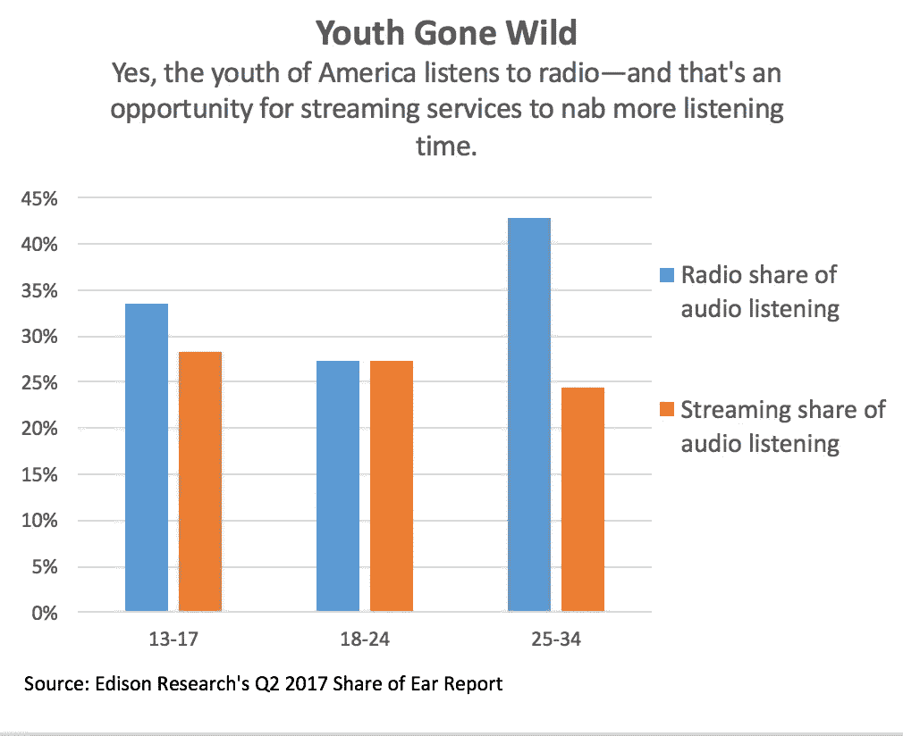
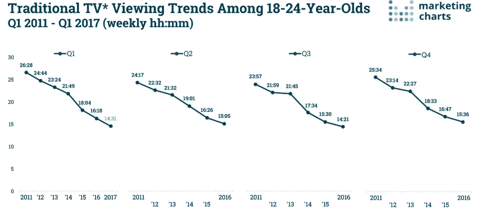

# 流媒体服务可以在 AM/FM 每年 1760 亿小时的收听时间中找到增长

> 原文：<https://medium.com/hackernoon/streaming-services-can-find-growth-in-am-fms-176-billion-annual-listening-hours-7e30e0b3428e>

## 随着收听转移到网上，广播电台每年价值 150 亿至 170 亿美元的广告是潘多拉等广告支持的流媒体服务的金矿。

由格伦人民，潘多拉音乐见解和分析

*   **在美国，AM/FM 广播每年有 1760 亿小时的收听时间**
*   **美国无线电市场每年价值 150 至 170 亿美元。**
*   **普通美国人每天听 2 个小时的 AM/FM 广播，只有 36 分钟的流媒体服务。**
*   最年轻的美国人正在接受流媒体服务，但他们几乎没有放弃 AM/FM 广播。

在成为几十年来唯一的游戏之后，广播电台现在正在与提供更好功能和截然不同的收听体验的互联网服务展开竞争。广播(AM/FM)市场——不是因为其规模，而是因为其规模——对于任何寻求收听时间和广告收入的流媒体服务来说，都是一个绝佳的增长机会。

**如果您没有进一步阅读，请了解 AM/FM 收音机市场每年约有 1760 亿个收听小时，价值 150 至 170 亿美元。古列尔莫·马可尼的发明给其竞争对手蒙上了一层阴影。任何来源的流媒体服务——Pandora 只是其中之一——平均每天需要 36 分钟的音频收听。相比之下，AM/FM 占两个小时左右。**

人们不禁会想起 1848 年至 1855 年的北加州淘金热。成千上万的美国人去西部寻找黄金，旧金山变成了一个繁荣的城市，李维·斯特劳斯公司在申请一种新型粗斜纹棉布的专利之前成为了一家成功的干货公司。今天的音乐市场也像淘金热。在过去的 15 年里，数十家音乐流媒体服务公司涌入数字音乐领域，在这个全球最大的市场上寻求财富。这些服务中的大部分已经破产，但许多更好、更强的公司留下来，在争夺美国人的耳朵的同时不断创新。

尽管流媒体收入在过去十年中大幅增长，但仍远低于广播电台，广播电台是一个巨大、有影响力、有价值的市场，代表了美国 1830 亿美元广告业务的很大一部分。Pandora 首席财务官兼临时首席执行官纳文·乔普拉(Naveen Chopra)在 7 月 31 日的收益电话会议上指出:“广播广告市场仍然很重要，约为 150 亿至 170 亿美元。

**美国广播电台的价值，大致相当于全球录音音乐业务的规模，来自 2.43 亿 12 岁及以上的美国听众，他们每年收听约 1760 亿小时，这是潘多拉从尼尔森 2016 年第四季度的数据中收集的估计。当思考音乐的未来时，这是 AM/FM 的世界。**

美国人平均每天收听的四个小时的音频中，AM/FM 广播占了一半。为什么它不占优势呢？它有一个很好的开端。第一个广播节目据说是 1906 年在平安夜播出的，当时，将演讲引入无线电波的工程师雷金纳德·费森登播放了自己演奏的《平安夜》并朗读了圣经章节。广播电台广告也比在线广告领先几十年。纽约皇后区公寓楼的卖家[在 1922 年从纽约的 WEAF 购买了第一个广播广告](http://adage.com/article/adage-encyclopedia/history-1920s/98699/)——这比潘多拉的发射早了 83 年！

There is no good way to make a direct comparison between per-person radio and streaming hours. Since there is no good data for streaming hours until 2013, and as a result no per-person streaming hours, streaming revenue (according to RIAA) is used as a proxy for streaming hours.

今天，流媒体服务的旋转正在成为新的广播旋转，通常在广播电台播放之前为曲目提供初始动力。事实上，唱片公司的推广者把流媒体数据交给电台的节目总监，作为歌曲受欢迎的证据。“看看这些旋转，”推销者可能会说。“你们市场的人喜欢这首歌。”流媒体是一种新的*广播。* Pandora 提供所有类型的音乐，这些音乐很少或根本没有广播电台播放。它有 16 个金属站；古典的 16；雷鬼 30 名；19 为民谣和创作歌手；37 为跨越国家和大陆的世界音乐；爵士的 23；四个是蓝草音乐专用的！这种类型的个性化源于流媒体的一对一特性，任何听众在任何时间都可以使用，这是一对多的无线广播电台所无法比拟的。

有比看上去更大的潜力。音乐通常被描绘成一种对等的竞争。也就是说，一家流媒体公司确实与其他流媒体公司开战，一家广播网确实与其他广播网开战。但任何人的音频收听都有各种来源:AM/FM 广播、流媒体、卫星广播、电视音乐、播客以及 CD 和 MP3 等自有音乐。**流媒体不是零和游戏。流媒体时间并不是唯一的目标。AM/FM 收听时间是更大的目标。数字服务可能会相互竞争，但与此同时，它们也在争夺根深蒂固的 AM/FM 公司的收听时间。流媒体是 AM/FM 及其每年 1760 亿小时收听时间的替代品，肯定是在家里，越来越多地在汽车上。越来越多的消费者将流媒体视为广播电台的替代品，收听体验越来越好，越来越多的收入和收听时间将从旧的技术转移到新的技术。**

Young listeners still spend time with AM/FM radio, although streaming fares well.

年轻听众代表着眼前的机会。与流行的观点相反，美国的年轻人仍然把 AM/FM 作为主要的收听来源。根据 Edison Research 的研究，对于 13-17 岁的演示者，Z 世代的年轻人，广播占音频收听的 34%。18-24 岁年龄组是 Z 世代的老年人群，27%的人收听 AM/FM。25 岁至 34 岁的千禧一代是 AM/FM 的忠实听众，占 43%。这些数字与其说是流媒体服务的失败，不如说是 AM/FM 广播的持续吸引力。潘多拉和其他流媒体服务应该把年轻人对 AM/FM 的兴趣视为一个机会。

潘多拉偷走 AM/FM 时间的能力是互联网扰乱传统市场的本质。在流媒体出现之前，录音音乐已经经历了一个世纪的巨变。光盘在 2001 年达到顶峰，那是男孩乐队和大盒子零售商大幅打折时代的末期。iTunes 于 2003 年在美国推出，99 美分的歌曲和 9.99 美元的专辑，一炮而红，并建立了合法下载市场。七年后，随着 CD 销售萎缩，下载销售帮助数字收入首次超过实体销售。然而，这种等级秩序是短暂的。到 2011 年，[数字下载已经达到顶峰](http://www.billboard.com/biz/articles/news/5657728/business-matters-why-us-download-sales-peaked-in-2011)，下一个数字技术将开始崛起。

**一个转折点出现在 2016 年，当时流媒体占了美国唱片销售的大部分——准确地说是**[**50.3%**](http://www.businesswire.com/news/home/20120105005547/en/Nielsen-Company-Billboard%E2%80%99s-2011-Music-Industry-Report)**——考虑到五年前其份额仅为 9%**，这是一个令人难以置信的壮举。(广播电台没有包括在统计中，因为法律上不要求广播电台向唱片公司支付版税。)随着购买音乐不再受欢迎，Pandora 等服务为人们提供他们想要的音乐敞开了大门:在手机上(大多数没有调频天线)，在网络上，在汽车上，通过 Sonos 等家庭数字系统，以及通过 Echo 和 Google Home 等智能扬声器。具有讽刺意味的是，流媒体正让音乐回归本源。就像 AM/FM 广播一样，流媒体让人们获得了音乐，而不是所有权。

了解调幅/调频广播在美国文化中的地位，就是欣赏它的持久力。它的规模和影响力使得它几十年来几乎无处不在。在电视出现之前，调幅/调频在电视广播中占主导地位，并在二战后汽车销量激增期间得到发展。它有相当大的优势:覆盖面广，汽车使用率高，在华盛顿 DC 有强大的游说力量。但是它也有弱点的迹象。尽管纽约大学斯坦哈德音乐商业项目主任拉里·米勒在最近的[白皮书](http://musonomics.com/musonomics_report_paradigm_shift_why_radio_must_adapt_to_the_rise_of_digital_08.29.2017.pdf)中描绘的前景并不黯淡，但 AM/FM 的一个重要指标在过去十年中已经下降:**平均每周收听量下降了 31%，从 2007 年的** [**19:46 分钟**](http://www.rab.com/whyradio/images/full_fact_sheet_v2.pdf) **下降到**[**13:35 I**](http://www.rab.com/whyradio/reportresults.cfm)**一方面，收音机在美国成年人中的普及率仍然高达 91 %,这个数字多年来基本保持稳定。这么高的普及率应该是音频界羡慕的对象。但另一方面，市场渗透率并不等同于收听时间。也就是说，13:35 的百分之九十一小于 19:46 的百分之九十一。**

倾听习惯的微小变化会产生巨大的后果。传统电台损失的 100 万小时收听时间可能意味着数千万美元广告收入的流失。仅电台每日收听时间的 10%就相当于近 180 亿个收听小时，足以让任何单一流媒体服务受益。按照目前的趋势，流媒体在每日收听中的份额无疑将从目前的每天 36 分钟增加，占据 AM/FM 的一些每日小时数，并获得其 150 亿至 170 亿美元收入的一部分。这种价值交换不仅仅是不可避免的，它已经发生了。**在过去四个季度(截至 6 月 30 日)中，Pandora 的广告收入已增长至 10.9 亿美元**。吸引广播资金一直是该公司战略的关键部分。为了获得广播收入，流媒体公司需要表现得像广播公司一样。因此，四年前，利用 Triton Digital 的测量数据，Pandora 整合了 Strata 和 MediaOcean 购买平台，以利用广播电台的广告预算。

Young millennials are abandoning traditional TV viewing—network and cable TV—for online-only alternatives like Netflix, Hulu, Sling TV, DirecTV Now, and YouTube TV.

有迹象表明，媒体的干扰远远超出了广播..根据尼尔森的数据，二月份，使用联网设备(苹果电视、Roku、Chromecast 等) [**观看的人数与去年**相比激增了 56%](https://www.mediavillage.com/article/traditional-tv-viewing-trends-ott-still-growing-pivotal-research/)**。与此同时，国家电视台推出了相互竞争的流媒体包，以遏制亏损，适应新的现实。在数字广告的财务挑战下，报纸一直在努力制作新闻；数字优先，全球新闻网站已经获得了传统报纸难以企及的读者群。这些都不足为奇:传统行业中根深蒂固的参与者通常对更灵活的初创公司刺激的市场趋势反应迟钝。这是美国调幅/调频广播的现状。广播电台已经让出了一部分听众给潘多拉、播客和其他新来者——但每年仍有 1760 亿小时的收听时间可供利用。**