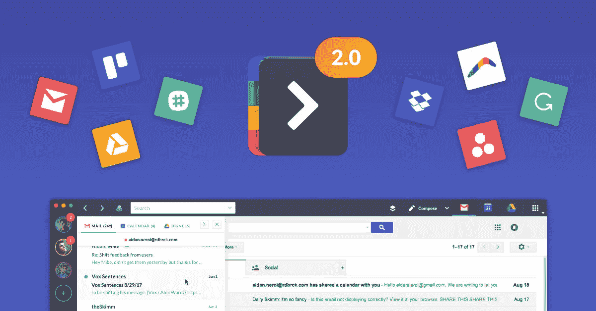
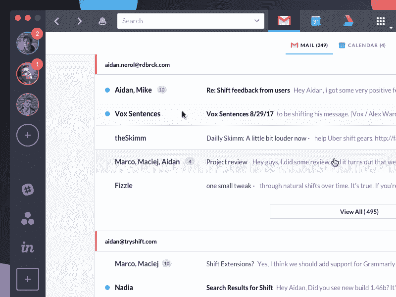
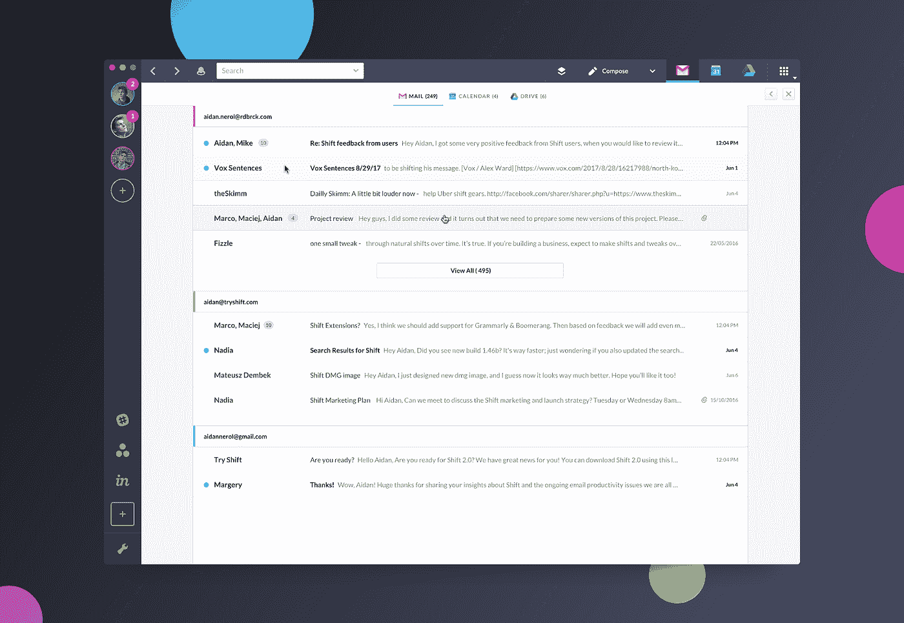
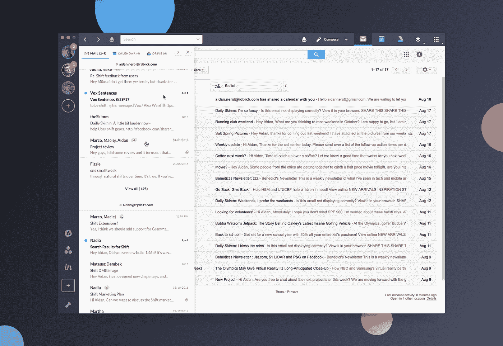
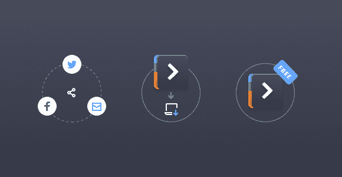
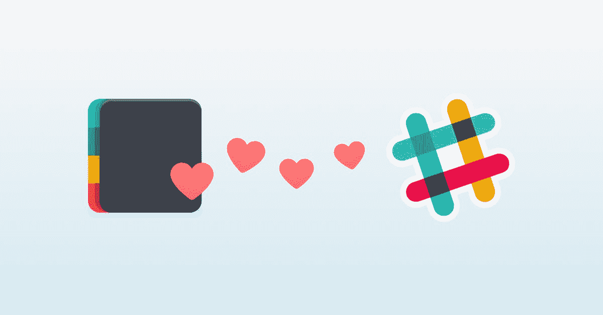

# 像老板一样简化你的工作流程

> 原文：<https://medium.com/hackernoon/streamline-your-workflow-like-a-boss-faf12f62e1bf>

[**轮班**](https://tryshift.com/) 都是为了精简你的工作流程，像老板一样。只需轻轻一点，即可在您所有的[邮件](https://hackernoon.com/tagged/mail)、日历&驾驶账户之间切换！你可以访问 Boomerang、Grammarly、 [Google](https://hackernoon.com/tagged/google) 服务和所有你喜欢的应用。它还允许统一搜索，这意味着您可以在搜索框中进行一次查询，搜索所有邮件、日历和驱动器帐户中的任何内容。

[**凯文·威廉·大卫**](https://medium.com/u/8ea7bd91b1a4?source=post_page-----faf12f62e1bf--------------------------------) 采访了 [**纳迪娅·塔特洛**](https://medium.com/u/4ed65482da29?source=post_page-----faf12f62e1bf--------------------------------) ，营销经理**了解更多。**

****

## **嗨，娜迪亚，给我们讲讲轮班吧？**

**Shift 是一个桌面电子邮件客户端，简化了管理多个邮件、日历和驱动器帐户的过程。我们在大约一年前推出了 Shift，收到了非常热烈的反响；管理多个账户是很多人的巨大痛点。我们非常高兴推出了 2.0，跨账户统一搜索、Chrome 扩展、谷歌服务以及对最流行应用的支持，所有这些都在 Shift 中实现。**

****

## **告诉我更多关于你为什么要建立这个的信息？**

**[**红砖**](https://siftery.com/company/rdbrck) ，Shift 的母公司，是一家位于加拿大维多利亚的产品开发公司。作为加拿大发展第二快的软件公司，我们的团队有一个共同的痛点，管理多个电子邮件帐户，并不断在它们之间切换。从电子邮件到[**Invision**](https://siftery.com/invision)[**Asana**](https://siftery.com/asana)[**吉拉**](https://siftery.com/atlassian-jira)[**Google apps**](https://siftery.com/g-suite-formerly-google-apps-for-work)，还有扩展，不胜枚举，我们对它们的依赖只会越来越大。**

**我们后退一步，审视我们的工作流程，意识到我们需要找到一个更好的方法，所以我们建立了它。**

**从根本上说，我们意识到电子邮件是我们的主要问题，所以我们从那里开始，Shift 也从那里成长和成熟。**

****

## **Shift 与市场上已经存在的有何不同？**

**Shift 以其直观的设计和漂亮的界面而闻名。我们将电子邮件作为用户日常生活的核心部分，这让我们脱颖而出。周围的一切都井井有条了。**

**我们的跨账户统一搜索功能也让 Shift 与众不同。在办公室里，它被称为官方的“收据查找器”。**

****

**Shift 2.0 只是第二个使用 Brave Muon 框架成功集成 Chrome 扩展的主要商业应用，使其成为真正的软件工程壮举。**

****

## **谁使用 Shift？您的客户在他们的公司中担任什么样的角色？**

**Shift 有非常广泛的吸引力，支持 Windows，Mac 和 Linux，跨 Gmail，Outlook 和 Office 365 帐户，我们的客户群真的很广泛！**

**也就是说，我们已经看到咨询顾问和自由职业者，以及众多的客户、产品爱好者、设计师和营销人员广泛采用这种方法。我们还为团队提供轮班服务，以帮助简化企业级别的客户管理。**

****

## **您的客户如何使用 Shift？你能分享一些不同的使用案例吗？**

**自我们首次推出以来，尤其是随着 2.0 版本的发布，Shift 收到了热烈的反响，我们对此感到非常高兴。**

**我们所有用户的共同主题是希望一劳永逸地解决电子邮件效率问题。他们厌倦了处理多种浏览器或标签。他们也厌倦了每天管理这么多不同的应用程序。**

**我们处于信息时代，很难对我们的工作进行优先排序。具有讽刺意味的是，现在有如此多的生产力应用程序，甚至管理它们也成了一个挑战。**

**转变有助于恢复这种关注。**

> **“对于谷歌爱好者来说，Shift 是一个特殊的解决方案。设计简洁，功能直观，对我来说最重要的是，它比笨拙的苹果邮箱有所改进。”—布莱恩·本顿， [**美国天才**](https://siftery.com/company/agbeat)**
> 
> **“如果你是一个严格的 Gmail 用户，你就会知道同时使用多个账户是一件非常痛苦的事情。新人移位(可用于 Windows，Mac 和 Linux)带走了这种痛苦，让你移位(啊哈！)轻松自如地在账户之间。”—里克·布罗伊达，[CNet](https://siftery.com/company/cnet)**

****

> **“老实说，采用 Shift 对我来说非常容易，因为这与我使用 Slack 的方式非常相似；我可以在空闲时加入多个团队，并在一天中根据需要无缝地加入和退出这些团队。不要反复登录。不要在浏览器中输入网址或寻找书签或标签。这一切都在一个地方等着我。”萨拉杜迪，[**《UX 笔记本》**](https://www.theuxnotebook.com/)**

## **是否有您没有想到或预料到的独特的 Shift 用例？**

**我们在发布后就开始为团队提供 Shift，因为我们收到了相当多的企业产品请求。简化你的个人工作流程是一回事，但是增加团队成员之间的一致性会在组织层面带来巨大的价值。**

## **有什么早期的“成长秘诀”或策略促成了你现在的成功吗？**

**我们是一家非常注重业绩的公司，我们也是尝试和测试所有疯狂想法的坚定信仰者。我们有一个才华横溢的团队，所以我们尝试了各种各样的活动，从传统的公关和内容营销到付费的脸书活动，与我们其他一些产品的交叉推广，以及一个真正增加了 Shift 可扩展性的推荐计划。**

****

## **在早期构建产品时，最大的挑战是什么？你是如何解决的？**

**从技术上讲，构建对 Chrome 扩展的支持是一个重大挑战。Shift 最初建立在一个叫做 [**电子**](https://siftery.com/electron) 的框架上。为了增加对扩展的支持，我们让切换到更灵活的 Muon 框架，这是一个支持 Brave 浏览器的开源项目。引用我们的首席执行官 Tobyn Sowden 的话，“这就像更换一栋建筑的地基，然后不得不进去重新铺设每一层楼的电线，”**

**不用说，我们做到了，2.0 在语法上漂亮地支持了 [**回旋镖**](https://siftery.com/boomerang-for-gmail) 和，而且我们正在增加更多的扩展支持！**

## **你加入的最有趣的整合是什么？有什么对你特别有影响的吗？**

**从第一天起，扩展支持就成了我们的用户最常要求的功能。对我们来说，与两个最热门的生产力扩展 Grammarly 和 Boomerang 的集成是一个真正的游戏改变者。**

****

## **在我们结束之前，你运营公司所依赖的顶级产品是什么&你如何使用它们？**

**[Slack](https://medium.com/u/26d90a99f605?source=post_page-----faf12f62e1bf--------------------------------) :我们内部沟通的首选。**

**[Asana](https://medium.com/u/4fecc4c082c?source=post_page-----faf12f62e1bf--------------------------------) :由我们的设计、营销和业务开发团队用于所有项目管理。**

**[视觉](https://medium.com/u/206c13695d27?source=post_page-----faf12f62e1bf--------------------------------):允许我们的设计和营销团队在模型和原型上合作。**

**吉拉:在全公司范围内用于产品和技术方面的所有任务管理。**

**[Stripe](https://medium.com/u/3ecae35d6d66?source=post_page-----faf12f62e1bf--------------------------------) :用于处理所有进入的支付和客户发票。**

**[**GSuite**](https://siftery.com/g-suite-formerly-google-apps-for-work) :用于整个公司所有的电子邮件通信。我们是超级粉丝，我们创建了 Shift 来帮助管理这一切；)**

**SendGrid :一个很棒的电子邮件分发工具，让我们的客户随时了解最新情况。**

**[**HappyFox 服务台**](https://medium.com/u/83c461c10ec3?source=post_page-----faf12f62e1bf--------------------------------) :我们所有的支持和帮助中心相关的咨询都是通过 HappyFox 管理的。这使得我们的团队能够提供出色的客户支持！**

***原载于【siftery.com】**。*****