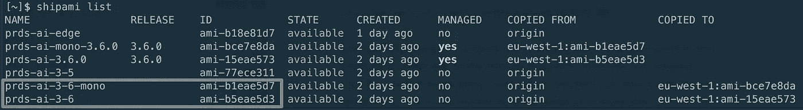
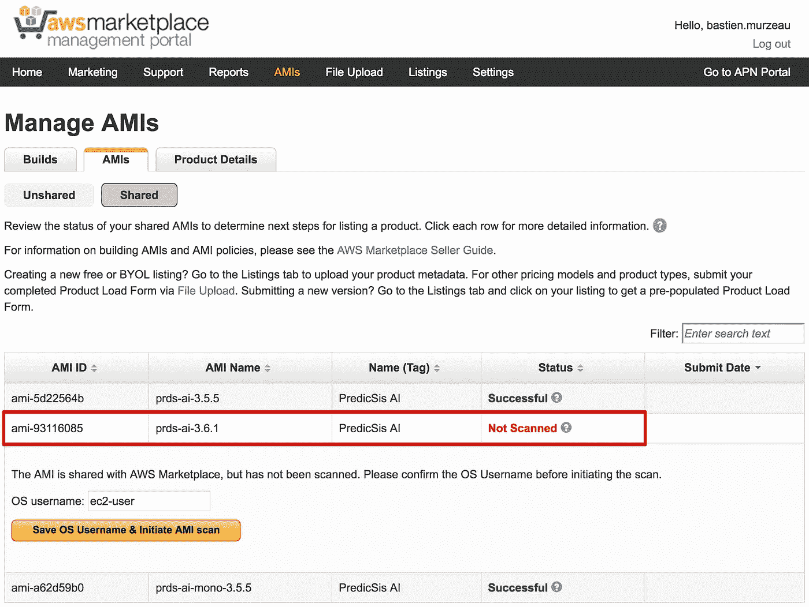

# 简化 AWS 市场 ami 的管理

> 原文：<https://medium.com/hackernoon/streamlining-the-management-of-aws-marketplace-amis-1f2200d7fe58>


The slippy game of AMI management! *(credit:* [*Unsplash*](https://unsplash.com/collections/501656/the-glories-of-man-is-only-fulfilled-by-utter-abandonment)*)*

AWS 市场实际上是我们发布[预测的商店。对于我们的用户来说，这是一种非常方便的方式，可以在几分钟内部署产品。事实上，AWS 市场的简单性是 PredicSis.ai 也从中受益的一个关键特性。我们相信，我们的用户应该在几分钟内而不是几个月内获得他们的第一次预测洞察力，这也是他们可以在没有任何配置的情况下立即配置它的关键。](https://predicsis.ai/#product)

截至今天[基于亚马逊机器镜像(AMI)的产品](https://aws.amazon.com/marketplace/search/results?page=1&filters=pricing_plan_attributes&pricing_plan_attributes=HOURLY&searchTerms=predicsis)有两个版本。创建 AMI 并将其提交给 AWS marketplace 以发布新产品是一个相当简单的过程。困难的部分是自动化生产这些 ami。一旦你实现了这种自动化，你就会面临第二个问题:我如何跟踪这些 ami？

AMI 版本控制是这里的关键。在深入研究版本管理之前，我想简单解释一下 PredicSis.ai 的 ami 是如何构建的。显然，我们不会通过 AWS web 控制台手动创建 ami。PredicSis.ai 基于微服务架构[1]，其中每个微服务都有自己的 Git 存储库。每一个推送到其中一个存储库的新提交都会触发一个由 [AWS 代码管道](https://aws.amazon.com/fr/codepipeline/)处理的新构建。管道的最后一步是用封隔器建造 [AMI。你可以想象，我们最终会有一个很长的 ami 列表😏](https://www.packer.io/)

AWS 管理控制台是一个很棒的[工具](https://hackernoon.com/tagged/tool)，但它并不是为将生产就绪的 ami 推向 AWS 市场而设计的。Grégoire，我们了不起的 DevOps，已经开始开发一个叫做 [ShipAMI](https://github.com/wnkz/shipami) 的工具，它最初只列出 AMI。经过几次迭代之后，它现在使我们能够安全快速地与 AWS Marketplace 帐户共享正确的 AMI。

[ShipAMI](https://github.com/wnkz/shipami) 是一个类似于 [AWS CLI](http://docs.aws.amazon.com/cli/latest/userguide/cli-chap-welcome.html) 的命令行工具。

这里有一个简单的工作流程，演示了我们如何使用 ShipAMI。

**选择一个 AMI 并“释放”它**

PredicSis.ai 的每个主要版本都是由 CodePipeline 自动构建的。我们以 3.6 版本为例。

```
[~]$ shipami **list**
```



ami_id *ami-b5eae5d3* 是该版本的最新版本，经过一些严格的测试后，我们决定在 3.6.1 版本下发布。

```
[~]$ shipami **release** ami-b5eae5d3 3.6.1 --name prds-ai
ami-16ebe570
```

这个新创建的 AMI， *ami-16ebe570* ，将被发送到 AWS 市场。

**“复制”发布 AMI 到 us-east-1 地区**

```
[~]$ shipami --region us-east-1 **copy** ami-16ebe570 --source-region eu-west-1
ami-93116085
```

**“分享”AWS Marketplace 帐户上的 AMI**

成功复制 AMI 后，您可以将其共享到 AWS Marketplace 帐户。同样，ShipAMI 提供了一种简单的方法:

```
[~]$ shipami — region us-east-1 **share** ami-93116085
```

默认情况下，ShipAMI 与 AWS Marketplace 帐户共享 AMI。共享 AMI 现在出现在管理门户上:



任务完成。👏几天之内，你的 AMI 将出现在 AWS 市场上。

**合成**

由于我们的全自动构建链，从开发人员提交新的提交到新的 AMI 准备就绪只需要不到 20 分钟的时间。对于我们的开发团队来说，这是一个巨大的效率提升。更好的是，由于有了 [AWS CloudFormation](https://aws.amazon.com/cloudformation/) ，每个新的 AMI 都被自动部署到 EC2 实例。然后，我们的 QA 团队可以不断地验证新特性或错误修复(当然，他们会在 Slack 中收到通知😏)

如果能在评论中看到你的想法和问题，我将不胜感激。不要犹豫，打开 ShipAMI 的 GitHub 库！

巴斯滕

[1]如果你对构建基于微服务架构的应用感兴趣，我强烈推荐书[《构建微服务》，作者山姆·纽曼](https://info.thoughtworks.com/building-microservices-book)。

文章最初发表在我们的博客上