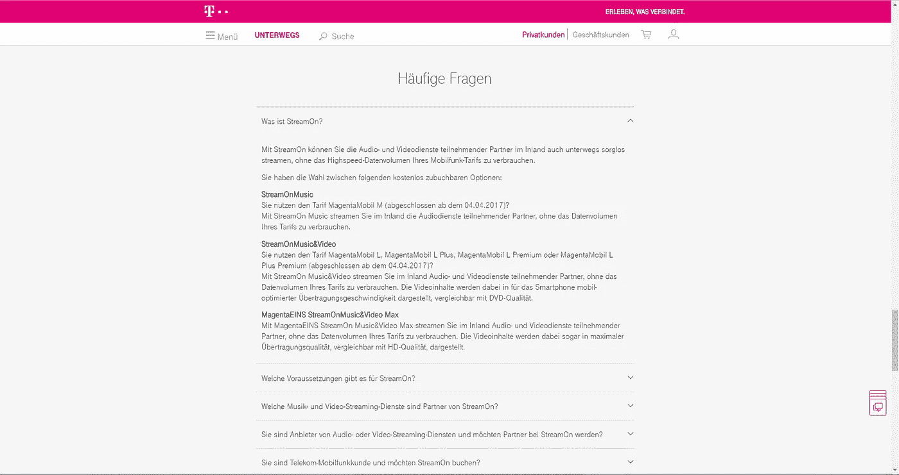
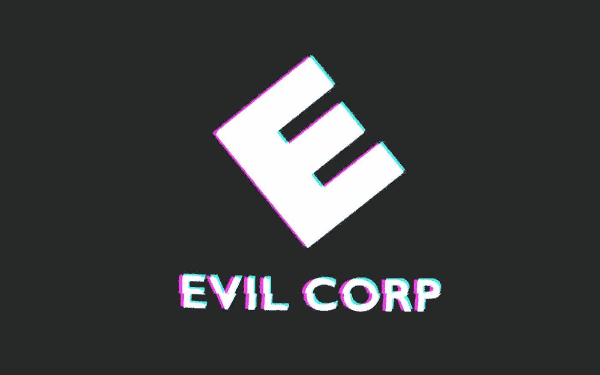

# StreamOn.isTypeOf("邪恶公司")？

> 原文：<https://medium.com/hackernoon/streamon-istypeof-evil-corp-50110c9d100d>

你好，朋友，让我与你分享一个占据我脑海很长时间的想法。但首先声明:

## 我无意引发对德国电信的仇恨。我真的认为他们做了很多好事，只有他们提供的新服务“streamOn”让我感到困扰。

所以我就在那里——在我的一个大学项目中工作到深夜。和往常一样，在恩斯特路透广场旁边的 TEL 大楼里…是的，我的朋友，“TEL”显然代表“Telekom”。德国电信慷慨地让我们(柏林工业大学的学生)使用他们令人敬畏的摩天大楼的两层。

在休息的时候，我发现了一个叫做“StreamOn”的提议。这背后的想法实在是太棒了。它允许客户在不使用宝贵的移动带宽的情况下传输视频和音频数据。听起来是不是很棒？

网址:[https://www . telekom . de/unterwegs/tarife-und-option en/stream on](https://www.telekom.de/unterwegs/tarife-und-optionen/streamon)

仔细阅读我的朋友。是的，你说得对——这里的关键词是“合作伙伴”

*“在内地也有高速流动的流动人口，其中有高速流动人口的流动人口。*******

*这可能会触动你对 2014 年网络中立丑闻的记忆。如果没有——你可能想看看约翰·奥利弗的《最后一周今夜》:*

****“网络中立*** *是指互联网服务提供商和监管大部分互联网的政府必须同等对待互联网上的所有数据，不得因用户、内容、网站、平台、应用、附加设备类型或通信方法而区别对待或差别收费的原则。”**

*现在让我们只陈述显而易见的事实来证明一点:*

*   *假设我们有两家相互竞争的公司，其中一家是 telekom 的合作伙伴，另一家不是。第一家公司相对于另一家公司有着无可争议的优势，这显然是**根据数据来源的不同而产生的数据差异**。*
*   *此外，您还可以观察到数据的另一个层次**差异，即数据的类型** —音频、视频和所有其他数据……它们都被不同地对待。*

*尽管详细阐述这一点很诱人，但我还是想和你分享一些更让我着迷的东西。考虑一下这个:*

*我没有“偶然发现 stream on offer”——我没有在业余时间浏览 telekom 的网站。我的 webtech 作业(是教授和他的研究助理准备的)提到了。涉及网络中立主题的家庭作业指的是该大学最大的赞助商和合作伙伴之一的提议。秘密广告还是完全相反的广告？我不知道，也可能永远不会知道。*

*这就是我所有的朋友。感谢您的时间和关注。*

**

*###############传输结束##########*