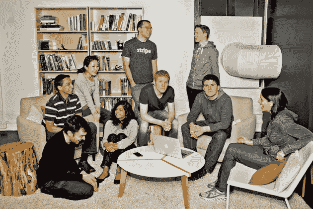
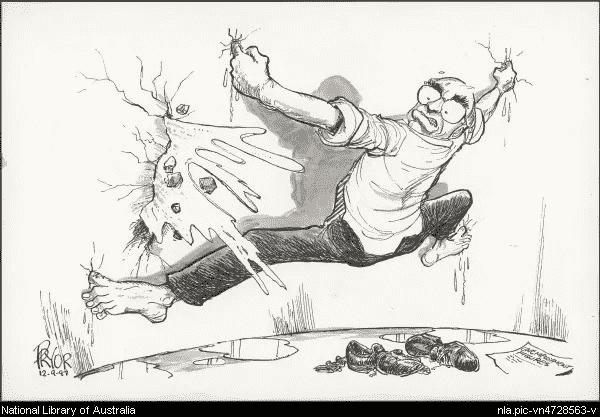
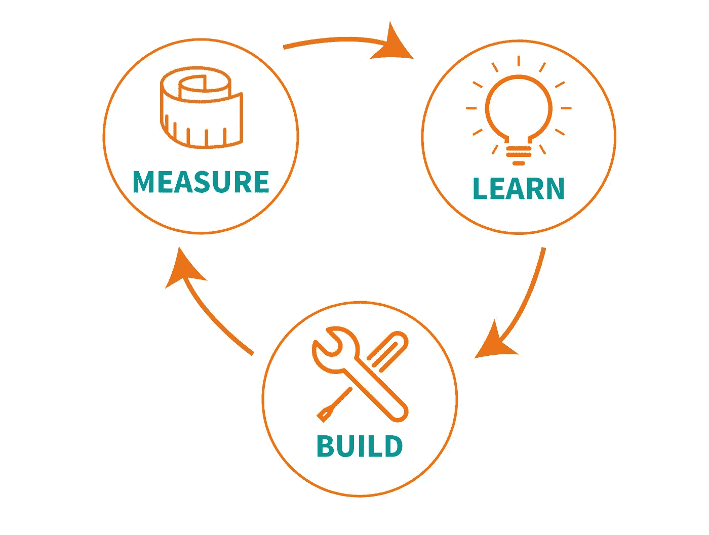

# 团队建设的条纹与教训

> 原文：<https://medium.com/hackernoon/stripe-and-lessons-on-team-building-d2a796f1afea>

Stripe’s original team.

最近加入了一家小的[创业公司](https://hackernoon.com/tagged/startup)，我一直试图尽可能多地从 [Stripe](https://hackernoon.com/tagged/stripe) ( *你可以在本文底部看到 Stripe 的帖子和视频列表，以及我的笔记*)。

我选择专注于 Stripe，因为我真的很佩服他们团队的质量，以及他们对展示而不是讲述的重视。你很少会听到帕特里克或约翰·科利森说“我们雇佣摇滚明星”或“我们只挑选精英中的精英”或类似的话。相反，他们**通过他们产品、网站和博客文章的每一个小细节来展示他们雇佣了优秀的人才。**

Stripe’s Connect landing page is a great example of how they show their quality and attention to detail. In addition to the animations being fluid and beautiful, the physics of simulation is incredibly accurate!

此外，Stripe 的独特之处还在于创始人在组建团队时的长远考虑和深思熟虑。 **Stripe 花了近两年时间招募前 7 名员工**，最初几名员工在加入之前经过了数周的面试。对我来说，在一个企业很容易将员工人数作为进步指标的环境中，这一点尤为独特。

那么我们能从这种团队建设的原始方法中学到什么呢？以下是我学到的高级课程。请注意，它们只是我的观点，而不是事实。

## 经验教训

## 1.为你的团队建立品牌

Apple is the preeminent example of how great branding can complement great products.

*   建立一个伟大的团队需要建立一个品牌。你和你的团队不能只是好。**你得** **被人知道** **才算好**。事实上，在最初的几个招聘中，Stripe 关注的是那些在他们的朋友中被认为很棒的人，这样那些人就能把这个品牌带在身边。
*   如果你想要一个正宗的品牌，你需要**展示**而不是讲述。最好的方法是通过你的产品，写作(高杠杆)，演讲，并为社区提供价值(开源，举办比赛等)。).Stripe 通过他们出色的核心产品、登录页面、[开源务虚会](https://stripe.com/blog/open-source-retreat-2016)、博客帖子和捕获旗帜竞赛来实现这一点。
*   为了建立你的品牌，从写下 3-4 件你想让你的团队出名的简单事情开始。试着超越一般事物，如“聪明”、“热情”等。品牌就是与众不同的 T21。Stripe 的品牌与众不同，它专注于以下独特的东西——工程驱动、细节导向和开发人员关注。

## 2.不管人们是否在看，都要和他们交谈

*   没有什么好时机可以开始和你想雇佣的优秀的人交谈。当一个人正在寻找时，你推荐她加入你的团队的可能性非常低，所以你需要**和那些没有持续寻找的人交谈**！例如，[很明显，帕特里克·科利森花时间与帕特里克·麦肯齐谈论加入，即使后者并没有寻找新工作。](http://www.kalzumeus.com/2016/09/09/im-joining-stripe-to-work-on-atlas/)
*   这需要你采取**长期**和耐心的观点。当这个人准备离开她正在做的事情时，你要确保你的团队是她第一个联系的人。

## 3.建筑结构与堵洞

*   优秀的团队将招聘视为建立长期结构的一种方式，并希望每一次招聘都超越最初的职位。这些团队积极主动地寻找这样的雇员，不会等到有特殊需求时才去找他们。
*   其他人将雇佣视为堵塞漏洞的一种方式。他们注意到自己缺少某个角色，于是去市场上找人填补这个特定的空缺，而没有考虑这个人的长期角色。他们的心态往往是被动的。

## 4.好的招聘会自我强化

*   优秀的员工能让你用更少的人做更多的事，从而给你更多的时间去寻找下一个员工。对我来说，这就是 Stripe 最初招聘如此缓慢的原因。他们最初带来的每个人都非常强大，他们有能力进行更长时间的招聘，并真正有耐心寻找优秀的人才。

## **5。把你的团队想象成一个产品**

The product development process can be applied to team building.

*   组建团队是一个创造性的过程，就像制造产品一样。因此，您可以利用许多与您用来构建优秀产品相同的东西来构建一个优秀的团队，包括以下几点:
*   假设你建立团队的第一次尝试是不完美的(各种各样的初稿)。看看您可以使用哪些指标和信号来改进，以便您可以收敛到更优的解决方案。
*   就像产品一样，看看你如何不断地从内部和外部获得关于团队质量的真实反馈，这样你就可以改进它。

就是这样！这些是我到目前为止收集到的主要信息以及我自己的一些想法。以下是我用来了解 Stripe 的一些资源以及我做的一些笔记。如果你有兴趣在生物学和机器学习的交叉领域帮助建立一个伟大的团队，请联系 dhruv@getathelas.com 大学的我！

## 参考

1.  **帕特里克·科利森与科斯拉风险投资公司的基思·拉布瓦的谈话**

*   [笔记(我自己的)](https://docs.google.com/document/d/1jSmfDnL-0A4wR9AhYUfVGgE8tW7Uac91ewXqV7_062M/edit)

**2。YC 与帕特里克·科利森、约翰·科利森和本·希伯尔曼的创业讲座**

*   [笔记(我自己)](https://docs.google.com/document/d/17X2-MZN17EegiBeVMuh0r9fE4fqyQfuYIKyB56JNGhY/edit)

**3。** [**关于 Stripe 如何打造团队**](http://firstround.com/review/How-Stripe-built-one-of-Silicon-Valleys-best-engineering-teams/) **的第一轮采访 Greg Brockman (Stripe 前 CTO)。**

**4。** [**帕特里克·麦肯齐(Patrick McKenzie)关于他为何加入 Stripe 的博文**](http://www.kalzumeus.com/2016/09/09/im-joining-stripe-to-work-on-atlas/) **。**

*感谢*[*Pranav Ramkrishnan*](https://medium.com/u/a55cb8c3de88?source=post_page-----d2a796f1afea--------------------------------)*和*[*Troy Astorino*](https://medium.com/u/9d84e7df6c75?source=post_page-----d2a796f1afea--------------------------------)*对本帖的帮助。*

> [黑客中午](http://bit.ly/Hackernoon)是黑客如何开始他们的下午。我们是 [@AMI](http://bit.ly/atAMIatAMI) 家庭的一员。我们现在[接受投稿](http://bit.ly/hackernoonsubmission)并乐意[讨论广告&赞助](mailto:partners@amipublications.com)机会。
> 
> 如果你喜欢这个故事，我们推荐你阅读我们的[最新科技故事](http://bit.ly/hackernoonlatestt)和[趋势科技故事](https://hackernoon.com/trending)。直到下一次，不要把世界的现实想当然！

