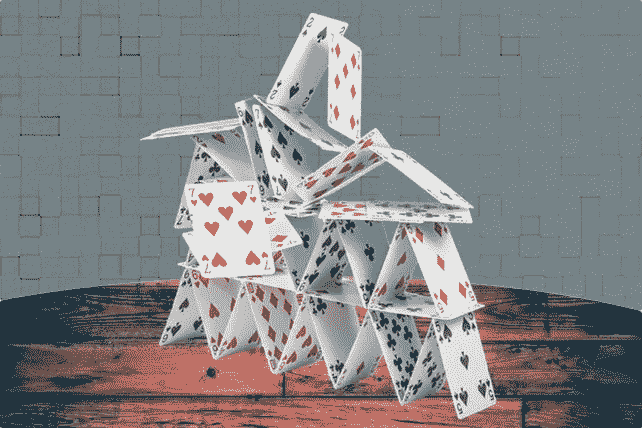

# 结构的整体性

> 原文：<https://medium.com/hackernoon/structural-integrity-31892b503b5e>

这是我们建造一切的基础。我们所做的决定需要与这个基础保持一致。如果不这样做，我们正在建设的核心就会被削弱。

对于公司来说，这个基础就是文化。对于个人来说，这个基础就是诚信。

以下是优秀企业文化的例子。奥雷利媒体文化说“创造的价值要大于我们榨取的价值。”亚马逊是“当客户和公司的利益不同时，选择客户的利益。”

个人诚信可以是“做正确的事情(通常是困难的事情)”这样的东西

起初，拥有结构完整性似乎限制了选择。拥有结构完整性提供了方向，并向我们展示了如何构建。结构完整性迫使我们在正确的范围内寻找解决方案。一个问题有许多潜在的解决方案，重要的是我们要找到正确的解决方案。

➞Please **分享**这篇文章，如果你认为它会帮助别人。

➞Get 我最擅长写作， [**报名参加我的简讯**](https://docs.google.com/forms/d/e/1FAIpQLSeX8Hu86LMIIBiya-9jijTXgKVNLUOHUue_hOAO3uPIxt0NfA/viewform?usp=sf_link) 。