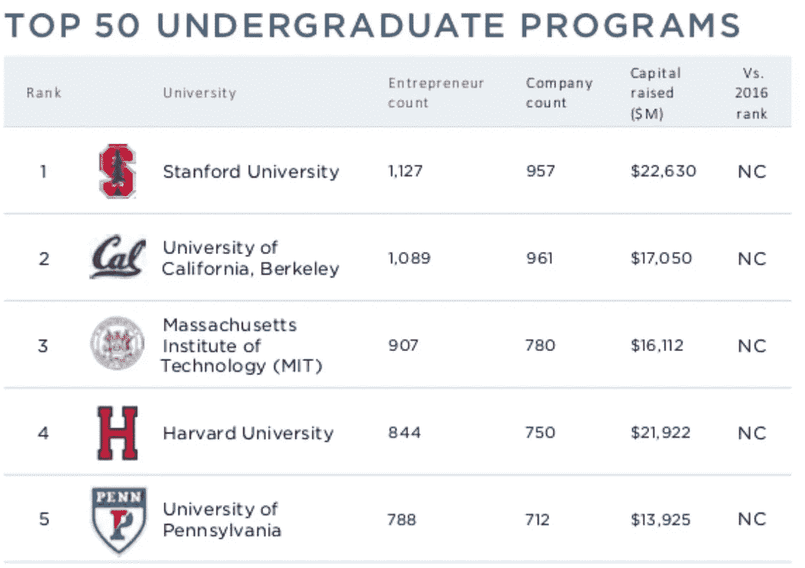

# 加州大学伯克利分校的学生交易侦察员

> 原文：<https://medium.com/hackernoon/student-investors-at-uc-berkeley-182341e0b1a8>

## 校园内风投的完整列表

我在加州大学校园里注意到的一个趋势是，越来越多的学生交易侦察员，通常也被称为品牌大使或校园联络员。对于那些不熟悉的人来说，**交易侦察兵是那些很好地融入学校创业生态系统的学生，他们被风险基金选为他们在校园里的耳目**。这种想法是，像伯克利这样的学校是培养有才华的企业家和工程师的温床，风险投资公司将从跟踪这些可能成为下一件大事背后策划者的学生人才中受益匪浅。

这在加州大学是有意义的，因为在所有本科院校中，我们创办的公司数量最多，企业家数量第二多(仅次于[斯坦弗德](https://www.facebook.com/jeremiah.kim.90/videos/1536757283061442/)😡)，并吹嘘自己的创始人创办了苹果(Apple)、Cloudera、Zynga 和 Warby Parker 等令人惊叹的公司。

[Source: PitchBook 2017 Universities Report](https://pitchbook.com/news/reports/2017-universities-report)

对于学生创业者来说，**这代表着一个重大机遇**。现在，你或你的[初创公司](https://hackernoon.com/tagged/startup)比以往任何时候都更容易受到投资者的关注。不要给同事或合作伙伴发冷冰冰的电子邮件来引起公司的注意，你可以联系一个可能更容易接受并愿意帮助建立联系的同学。毕竟，给学生创业者一天的时间是这些球探的工作。

下面是所有目前在伯克利的学生(本科生和研究生)的名单，他们在一家风投公司担任交易侦察员的角色。

如果你是一个学生交易侦察员，并希望被列入这个目录，请填写这个超级短的[谷歌表格](https://goo.gl/forms/fNABUGBKx25HqpAF3)，我可以尽快添加你。

*为了完全公开，我是 Charles River Ventures (CRV)的一名交易调查员，并有兴趣尽我所能帮助学生创业者。我的邮箱是 Dtao114@berkeley.edu*

*如果你是一名对* [*创业*](https://hackernoon.com/tagged/entrepreneurship) *感兴趣但不确定从哪里开始的学生，请查看我之前的帖子，* [*加州大学伯克利分校创业生态系统学生指南*](https://hackernoon.com/a-students-guide-to-uc-berkeley-s-startup-ecosystem-a50df21d6da6)

我也要感谢我的室友 Matt Yao，感谢他帮助我做这项研究