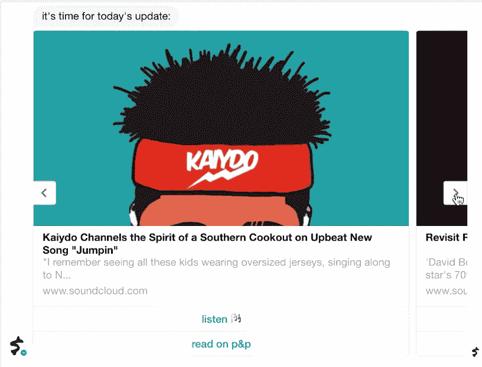
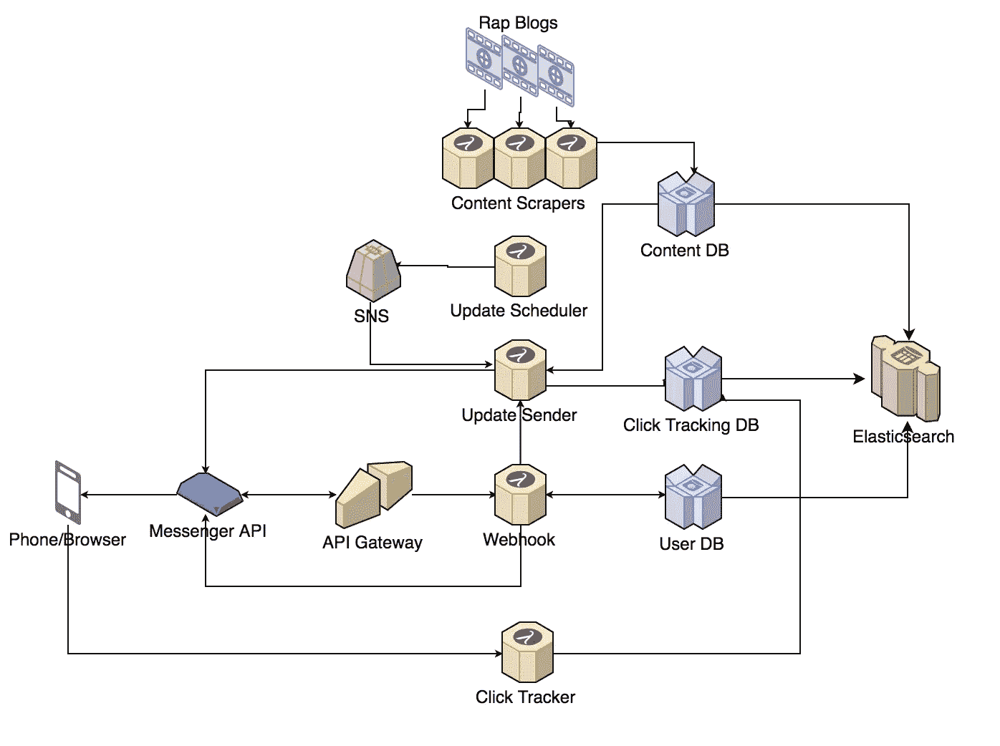
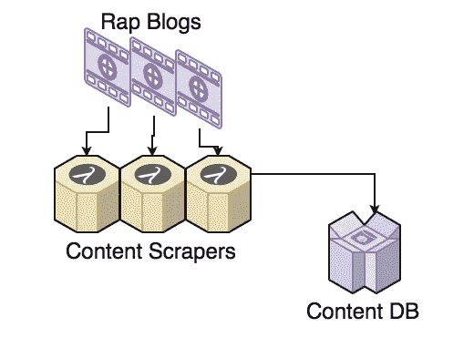
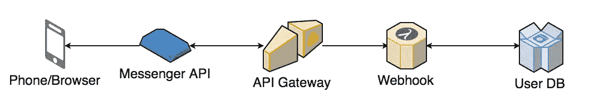
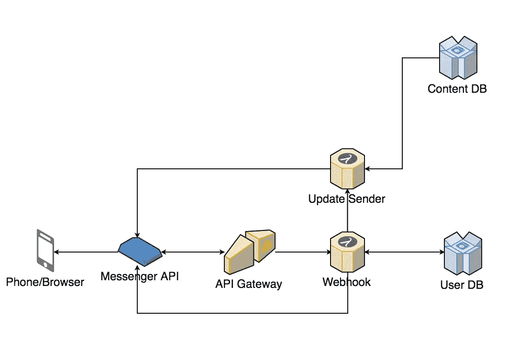
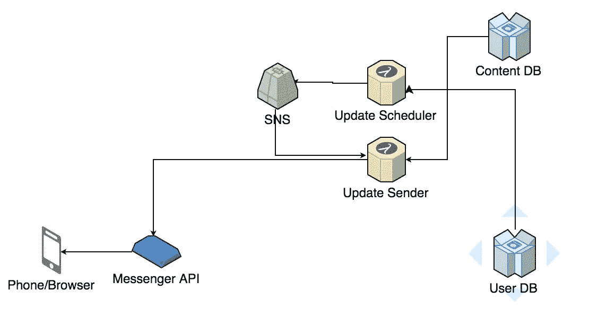
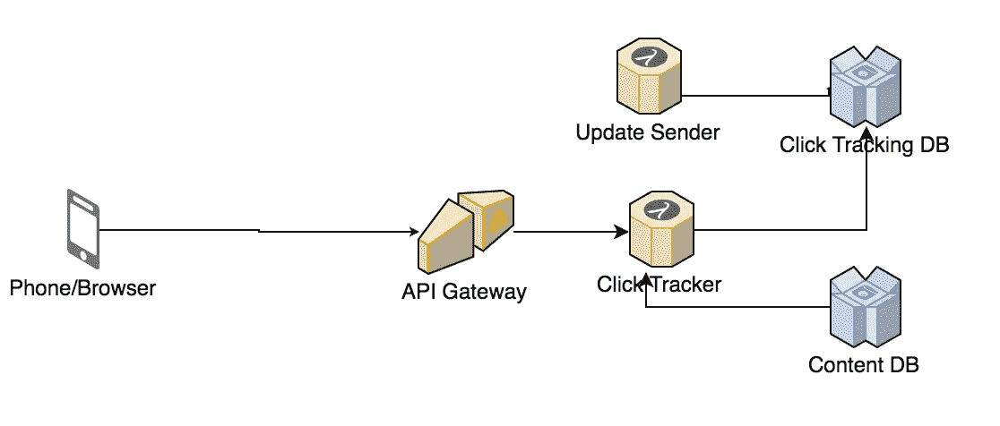
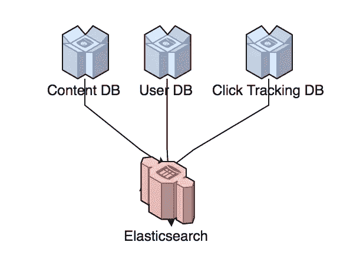

# 构建一个无服务器聊天机器人

> 原文：<https://medium.com/hackernoon/stunts-fm-building-a-serverless-chatbot-ba9d07c7e16a>

我觉得我一直很难找到我喜欢的音乐。我过去常常在 iTunes 里放满我在 Rap Radar 和 Hypetrak 等说唱博客上找到的歌曲，但最近感觉实际内容被编辑帖子淹没了。我最喜欢的音乐发现来源之一曾经是 Complex 的 *5 点 Shuffle* ，这是一个每天从互联网上发布 5 首 mp3 的帖子，但不幸的是，它已经不存在了。为了填补这一空白，我想我应该创建一个[脸书](https://hackernoon.com/tagged/facebook)聊天机器人，它从说唱博客中抓取内容并发送每日更新。所以我做了特技。fm:

An update from a few weeks ago

在制作这个聊天机器人时，我想做的一件事就是使用亚马逊网络服务的 Lambda 服务。Lambda 允许您部署代码，而无需提供任何服务器。这很吸引我，因为我想最小化这个附带项目的运营开销。

我希望我的聊天机器人具有的功能是:

*   从说唱博客收集内容
*   板载新用户
*   允许用户通过机器人请求更新
*   每天自动发送更新
*   跟踪用户点击的内容
*   分析使用模式

这是整个架构的样子:

我将在下面分解我是如何实现我的每一个需求的。

# 收集内容

我通过编写脚本来收集内容，以检查说唱博客 2dopeboyz 和鸽子与飞机的 RSS 提要。每个脚本都被部署为一个独立的 Lambda 函数。这些脚本会查看过去 24 小时的每条帖子，并解析出任何 Soundcloud 或 YouTube 链接。然后，他们会将这些内容以及标题、描述和预览图像等元数据保存到 AWS dynamo db 托管的一个表中。Lambda 服务每天都会自动触发这些脚本。

# 新用户入职

使用脸书的 Messenger API，新用户的加入相对简单。脸书聊天机器人本质上是一个 HTTP 端点，称为 webhook，它接收来自用户的消息事件，处理它们，然后向 Messenger API 发送响应。为了设置这个 webhook，我编写了一个 Python 函数来处理消息事件，并将其部署为 Lambda 函数。我使用 AWS 的 API Gateway 设置了一个 url，它带有一个由这个 Lambda 函数支持的/webhook 端点。每当用户与我的聊天机器人交互时，这个端点都会收到一条消息。webhook 代码做的第一件事是检查我们以前是否见过发送者。如果没有，它知道我们需要装载用户。它会将用户的详细信息保存在 DynamoDB 的用户表中，这样我们就可以稍后给他们发送消息。

# 允许用户请求更新

webhook 端点还负责处理来自用户的所有[未来](https://hackernoon.com/tagged/future)消息。用户可以要求聊天机器人做的一件事是给他们发送今天的内容。当 webhook 代码发现有用户请求时，它会调用另一个 Lambda 函数来查询 DynamoDB 中的内容表，然后向 Messenger API 发送响应。

# 每天自动发送更新

这个机器人每天也会自己发出这个更新。自动触发 Lambda 函数，该函数在 DynamoDB 中查询所有订阅用户的用户表。然后，它向 AWS 的简单通知服务发送每个用户的通知。这些通知触发了 webhook 用来向每个用户发送更新的同一个“更新发送者”Lambda 函数。

# 跟踪用户点击的内容

为了跟踪用户点击的内容，每次“更新发送者”向用户发送消息时，它都会为每个用户/内容组合生成一个唯一的 id，并将其保存到 DynamoDB 中的点击跟踪器表中。然后，它不是向用户发送实际的内容链接，而是发送带有生成的 id 的 API 的 URL。当用户在他们的 Facebook Messenger 应用中点击这些 URL 时，我们的 API 网关调用 Lambda 函数，该函数在点击跟踪器表中跟踪这一点击，然后将它们重定向到实际内容。

# 分析使用模式

为了分析内容、用户和点击，每个 DynamoDB 表都被设置为在每次创建或更新一行时写入一个 Elasticsearch 集群。

> [黑客中午](http://bit.ly/Hackernoon)是黑客如何开始他们的下午。我们是 [@AMI](http://bit.ly/atAMIatAMI) 家庭的一员。我们现在[接受投稿](http://bit.ly/hackernoonsubmission)并乐意[讨论广告&赞助](mailto:partners@amipublications.com)机会。
> 
> 如果你喜欢这个故事，我们推荐你阅读我们的[最新科技故事](http://bit.ly/hackernoonlatestt)和[趋势科技故事](https://hackernoon.com/trending)。直到下一次，不要把世界的现实想当然！

