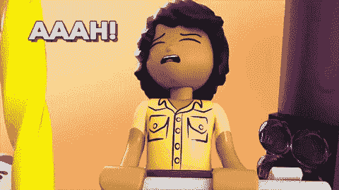

# 样式并确保自动填充数据是正确的

> 原文：<https://medium.com/hackernoon/style-and-ensure-autofill-data-is-correct-c39c0f046b0a>

从[反应到](https://hackernoon.com/tagged/reactjs)的短暂中断。关于我，我来自非传统的计算机科学背景，是一名活动家，倡导为技术空间的多样性和包容性而奋斗。我写关于前端开发、JavaScript、ReactJS 和社会政治话题的博客，比如技术包容。



Browser Stop Messing With MY Form!!

你如何防止浏览器的[自动填充](https://hackernoon.com/tagged/autofill)将错误的数据和样式输入到你的表单中？您可以在表单输入的名称属性中插入一个值。基本上，将您的值添加到您的名称属性中

```
name: *nameKey*
```

[你也可以覆盖浏览器的自动填充样式。](https://css-tricks.com/snippets/css/change-autocomplete-styles-webkit-browsers/)

```
/* Change Autocomplete styles in Chrome*/ 
input:-webkit-autofill, 
input:-webkit-autofill:hover,  
input:-webkit-autofill:focus 
input:-webkit-autofill,  
textarea:-webkit-autofill, 
textarea:-webkit-autofill:hover 
textarea:-webkit-autofill:focus, 
select:-webkit-autofill, 
select:-webkit-autofill:hover, 
select:-webkit-autofill:focus {   
     border: 1px solid green;   
-webkit-text-fill-color: green;   
-webkit-box-shadow: 0 0 0px 1000px #000 inset;   
transition: background-color 5000s ease-in-out 0s; 
}
```