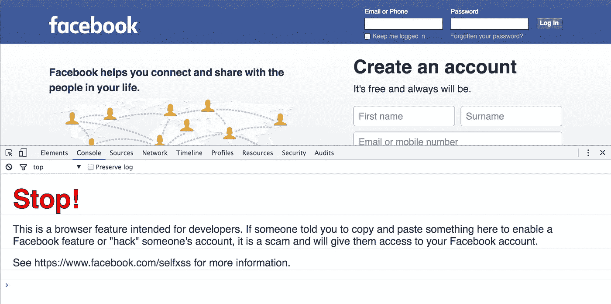
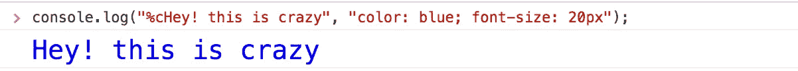
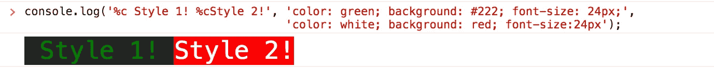
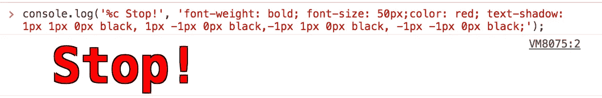
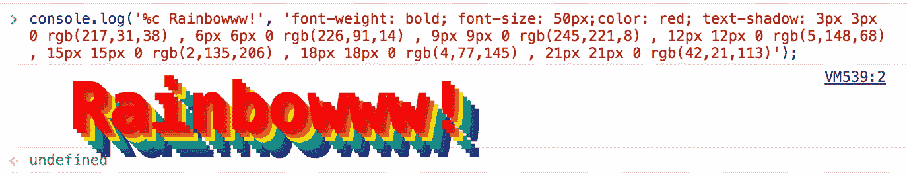

# 在浏览器控制台中设置日志样式

> 原文：<https://medium.com/hackernoon/styling-logs-in-browser-console-2ec0807dc91a>

几天前，我只是玩了玩脸书的 div 元素，以深入了解各种 html divs 是如何构造、呈现的，以及它们如何对各种交互做出反应。

我打开“检查元素”窗口，看到了在控制台选项卡中从未看到的东西。



Image 1: Facebook.com screenshot with console tab on

是，自定义控制台选项卡中的日志样式。

这是样式化日志的完美用例，可以提醒天真的用户注意风险。我发现这很疯狂，于是我开始深入研究并尝试更多的定制日志。

要将样式添加到日志中，该方法要求 console.log()的第一个参数中包含“%c ”,并选取下一个参数作为%c 模式参数文本的 CSS 样式。现在，在该选项卡的控制台窗口中尝试以下基本示例。



Image 2: Basic example for custom log

如果您想添加多个样式，那么只需添加多个%c 文本并分别添加样式参数。



Image 3: Custom log with multiple styles

请注意，有两个%c 模式文本，因此有两个 CSS 样式参数。并且从左到右分别拾取 CSS 参数。

让我们模仿脸书的控制台日志风格。



Image 4: Facebook like danger message on console window

为了实现这一点，我们只需要文本的颜色为红色和它的轮廓。为了获得文本的轮廓，我们将添加四个零像素模糊的文本阴影。[阅读更多关于文字阴影 CSS 样式的](http://www.w3schools.com/cssref/css3_pr_text-shadow.asp)。

我们也可以使用下面的 CSS 生成彩虹样式的文本。

```
console.log('%c Rainbowww!', 'font-weight: bold; font-size: 50px;color: red; text-shadow: 3px 3px 0 rgb(217,31,38) , 6px 6px 0 rgb(226,91,14) , 9px 9px 0 rgb(245,221,8) , 12px 12px 0 rgb(5,148,68) , 15px 15px 0 rgb(2,135,206) , 18px 18px 0 rgb(4,77,145) , 21px 21px 0 rgb(42,21,113)');
```



Image 5: Rainbow styled CSS

自定义日志可以根据其重要性用于不同的场景。这些样式化的日志通常是为一组有足够好奇心去访问控制台日志窗口的用户准备的。

Pinterest.com 的[也很好地利用了定制日志。现在访问 pinterest 的控制台窗口，在控制台标签中键入 joinUs()，它会将你重定向到他们的职业页面。](https://www.pinterest.com/)

Firebug 在 2010 年增加了自定义日志([点击此处](https://github.com/firebug/firebug/commit/b9364983d072dd86ccf93d6426b3a41f7272f3d6))，Webkit engine 在 2012 年正式增加了这一功能([点击此处](http://trac.webkit.org/changeset/130941))。