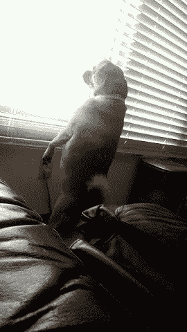
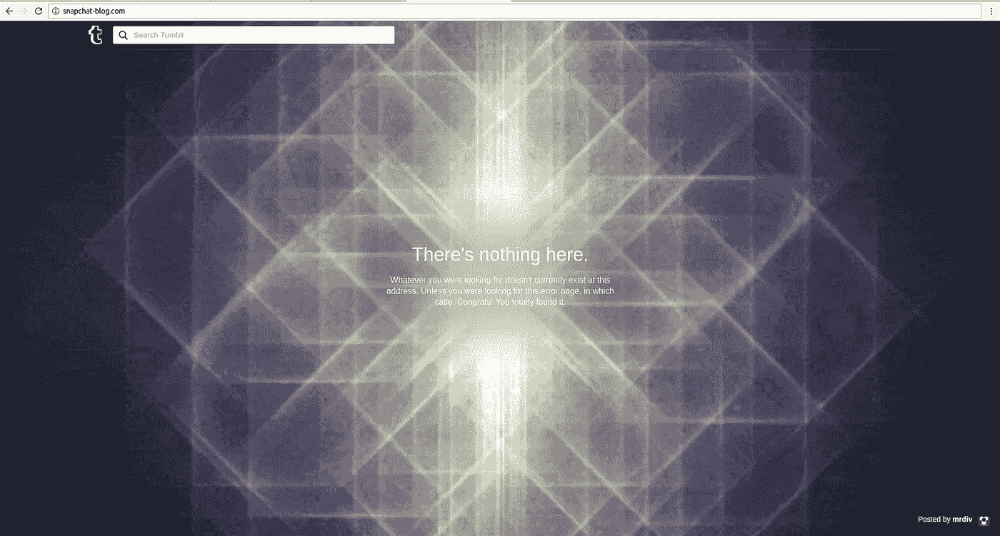
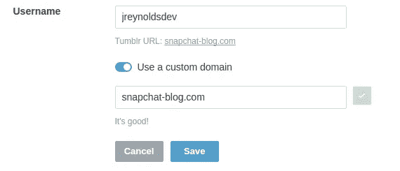

# 子域接管 blog.snapchat.com

> 原文：<https://medium.com/hackernoon/subdomain-takeover-of-blog-snapchat-com-60860de02fe7>

## TL；博士:https://hackerone.com/reports/171942



My dog waiting for the FBI to show up

# 问题

[Snapchat](https://hackernoon.com/tagged/snapchat) 没有很多面向公众的子域名，截至目前，对 pentest-tools.com[的基本子域名扫描显示只有 13 个子域名(相比之下，脸书有 799 个)。我认为像 Snapchat 这样高调的赏金程序会很难测试，所以决定不去打扰。然而，我最近一直在做一些黑客工作，blog.snapchat.com 引起了我的注意。](https://pentest-tools.com)

# 这里什么都没有。

[blog.snapchat.com](http://blog.snapchat.com)的 DNS 记录显示一个 CNAME 记录和一些指向[snapchat-blog.com](http://snapchat-blog.com)的逻辑，解析到下页。



Tumblr 404 page

我对 Tumblr 的经验有限，但我认为这是一个无人认领的博客页面。我的第一个猜测是，在后台他们指向一些网站，如[snapchat.tumblr.com](http://snapchat.tumblr.com)，但那个博客已经被占用，所以这是错误的。

经过一番挖掘，我发现 Tumblr 和许多其他网站有相同的自定义域名设置:

*   通过域名记录将您的域名指向他们的 IP 地址
*   让网站处理 CNAME 的事情。

我能够通过 nslookup 验证这一点，看到 snapchat-blog.com 指向 66.6.32.21，这是 Tumblr 拥有的自定义域名路由的 IP。

```
# nslookup snapchat-blog.comNon-authoritative answer:
Name: snapchat-blog.com
Address: 66.6.32.21
```

查看谷歌缓存的该页面副本显示，该域名在前一天(9 月 24 日)被正确声明。Snapchat 一定是在过去 24 小时内不小心从他们的 Tumblr 账户中删除了自定义域名声明，这可能是为了准备切换到[snap.com/news](http://snap.com/news)进行他们最近的品牌重塑。

在我弄清楚 Tumblr 如何处理 CNAMEs 之后，就像进入我的帐户设置并申请域名一样简单。



Tumblr custom domain settings

# 我的第一个 Tumblr

访问[blog.snapchat.com](http://blog.snapchat.com)(它重定向到[snapchat-blog.com](http://snapchat-blog.com))然后显示如下


Snapchat blog page

我决定将我的名字放在这个子域上作为有效的 PoC，这样他们就知道威胁参与者的活动不是原因，并且如果他们没有首先看到 Hackerone 报告，就可以帮助 Snapchat 修复漏洞。这最终导致我没有得到奖金，因为我没有以更安静的方式处理这件事。这不是我的初衷，但我能理解他们的立场。

# 解决时间线

**2016 年 9 月 25 日**

*   下午 3:08 CDT:在 Hackerone 上向 Snapchat 报告了问题
*   下午 7:18 CDT:Snapchat 确认了漏洞，并要求我重定向到真实博客进行临时修复。他们还将 blog.snapchat.com 的[重新定向到 snap.com/news](http://blog.snapchat.com)的[进行更强的修复。](http://snap.com/news)
*   CDT 晚上 8:33:电子邮件联系开始帮助转让 snapchat-blog.com Tumblr 的所有权

**2016 年 9 月 26 日**

*   美国中部时间上午 9:59:Tumblr 所有权转移至 Snapchat

**10/4/16**

*   CDT 晚上 9:37:报告结束

**10/5/16**

*   下午 1:41 CDT:批准公开披露请求

感谢 Snapchat 快速的响应时间和运行如此伟大的 bug bounty 程序。如果你对他们的节目感兴趣，请访问 https://hackerone.com/snapchat。

[](http://bit.ly/HackernoonFB)[](https://goo.gl/k7XYbx)[](https://goo.gl/4ofytp)

> [黑客中午](http://bit.ly/Hackernoon)是黑客如何开始他们的下午。我们是阿妹家庭的一员。我们现在[接受投稿](http://bit.ly/hackernoonsubmission)并乐意[讨论广告&赞助](mailto:partners@amipublications.com)的机会。
> 
> 如果你喜欢这个故事，我们推荐你阅读我们的[最新科技故事](http://bit.ly/hackernoonlatestt)和[趋势科技故事](https://hackernoon.com/trending)。直到下一次，不要把世界的现实想当然！

[](https://goo.gl/Ahtev1)