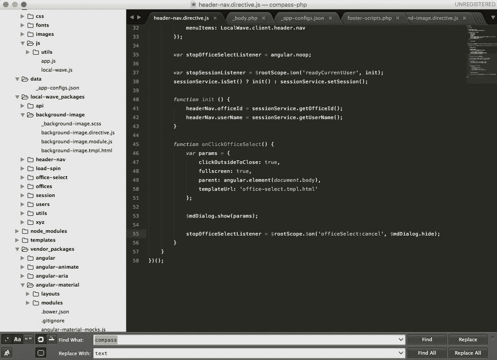
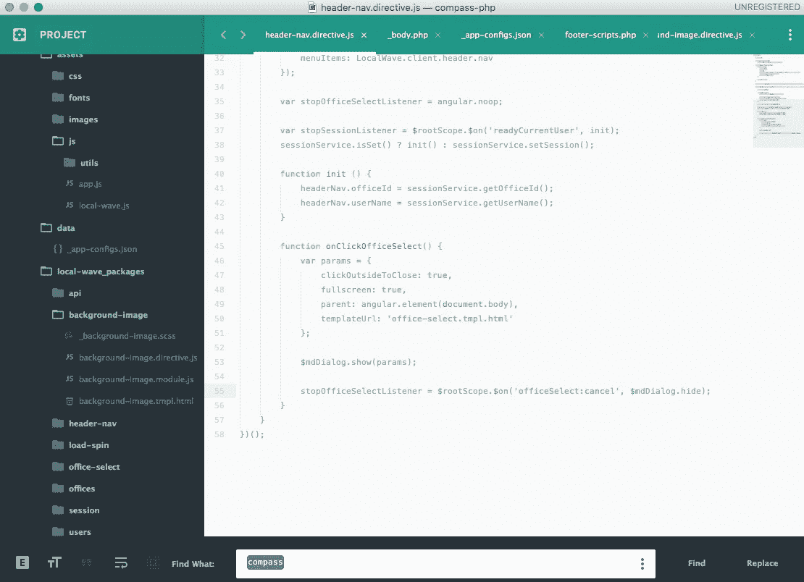

# 崇高文本 101:初学者快速概览

> 原文：<https://medium.com/hackernoon/sublime-text-101-a-quick-overview-for-beginners-7cc5cd1dd9bb>

像其他开发者工具一样，选择一个文本编辑器可能会很棘手，需要做一些实验来找到适合你的。尽管最终，不管您的选择如何，大多数都执行用任何语言开发所需的相同的基本任务。

选择文本编辑器的两个最大因素应该是*个人舒适度*，其次是*团队偏好*。然而，还有一些回旋的余地。例如，Atom、WebStorm 和 Sublime 将提供非常相似的用户体验，但你不会想成为团队中一个拿着记事本的人。个人工具的巨大差异只是配对或共享[编程](https://hackernoon.com/tagged/programming)时不必要的白噪声。

对于这个话题，我将给出 Sublime Text 的概述，因为它是我的最爱，**但是我强烈建议尝试几个编辑器来找到一个非常适合你的。**

我目前的偏好是崇高的文本，但两年前我会说科莫多编辑，两年前我会说文本编辑。随着 TypeScript 的普及，如果两个月后我在使用 Visual Studio，我不会感到惊讶。

# 崇高的文本

开箱即用，Sublime Text 提供了成为开发人员所需的一切。有一套内置的功能，包括语言编译器、项目/工作空间构建器，以及用于一次突出显示/编辑文档的多个区域的方法，但是这个概述不会深入。你可以在这里下载和阅读更多关于崇高的文字[。](https://www.sublimetext.com/)

默认情况下，左侧边栏提供项目文件夹结构的概述，文本编辑面板，当前文档的右侧小地图，以及底部的查找/替换面板。

要真正开始使用 Sublime，我们需要看看它的包系统。下面我将介绍你需要的基本包，然后是一些更高级的包，没有它们我将很难生活。

## 安装软件包

Sublime 包是可安装的模块，其他人已经构建了这些模块来增强 Sublime 的功能。如果你想让 Sublime 做一些事情，很有可能有人已经做了一个包。

> 我建议在盲目安装一个软件包之前，先在谷歌上搜索一下。一些软件包可能比其他的更麻烦，而且通常有不止一个选项可用。去安装的时候最好能明确自己想要什么。

要安装一个包，可以从浏览器下载，然后复制到 Sublime 的包文件夹中。这很乏味也不好玩，但幸运的是你只需要做一次。你安装的第一个包应该是 [**包控制**](https://packagecontrol.io/installation) 。一旦你有了这个包，安装其他的就轻而易举了。

如果你还没有，去[安装**软件包控制**](https://packagecontrol.io/installation) ，然后阅读 [**软件包控制**的使用指南](https://packagecontrol.io/docs/usage)。我会等的。

## 基本套装

现在我们有了一个快速直观的安装包的方法，让我们添加基本的包。这些软件包是如此的实用和基础，以至于我经常忘记它们是附加的。

*   [**Emmet**](http://www.hongkiat.com/blog/html-css-faster-emmet/) 为 HTML 和 CSS 自动完成，也允许省时的速记。对它太好了，你可能会被引诱到 Jade/Pug 开发中😮
*   [**DocBlockr**](https://packagecontrol.io/packages/DocBlockr) 自动完成各种注释样式，但最重要的是它格式化注释以符合大多数文档构建器。对于毫不费力的 JSDocs 甚至 ngDocs 都非常方便！
*   [**彩色荧光笔**](https://packagecontrol.io/packages/Color%20Highlighter) 主要用于大量使用 CSS 的开发，但我总是很高兴看到它出现在我用另一种语言定义颜色的罕见情况中。
*   如果你正在写大量的 JavaScript，你将会写大量的控制台日志。拿着这个。

尽管默认的侧边栏很有用，但它会变得更好！侧边栏增强包在右键菜单中加入了一套直观的方法。不幸的是，此软件包已从软件包控制注册表中删除，因此需要手动安装。按照 Github 页面上的说明开始吧！

> 有一个 Git 包允许你从 Sublime 管理版本控制，但是我建议你坚持使用命令行操作或者使用你的 Git 提供商的官方 GUI。通过文本编辑器的第三方包对我来说就像一场危险的赌博。也就是说，Git 包非常有用，如果你对它没问题，你应该完全使用它。

## 主题和配色方案

崇高的文字 3 与材料设计主题和配色方案

好了，把那些无聊的东西扔掉，休息一下，尝试一些主题和配色方案！

**主题**将改变崇高的整体面貌。这包括文本和背景颜色以及所有界面元素的间距。

**配色方案**将改变编辑面板的语法高亮和背景颜色。

我是由肯·惠勒制作的主题为 的 [**节目的超级粉丝。无论屏幕亮度如何，亮暗布局都非常有利于可视性，而且(这可能是大多数主题出错的最重要的特征)查找/替换栏很宽敞。**](https://packagecontrol.io/packages/Theme%20-%20Brogrammer)

几周前我转到了 [**素材主题**](https://packagecontrol.io/packages/Material%20Theme) ，我终于从 Brogrammer 中脱离出来了。Google Design 的布局概念和侧边栏图标的整合非常漂亮。整体审美舒适，使用方便。Protip:设置材质主题为你的主题后，设置材质-主题-浅色为你的配色方案。这当然是一个国际海事组织，但在国际海事组织看来，这是唯一的出路。

## 高级包

为增强您的体验，针对特定语言的软件包层出不穷。这些只是我推荐使用的几个例子，但是请注意还有更多，你也应该这样做！

*   [降价预览](https://packagecontrol.io/packages/Markdown%20Preview)
*   MarkdownTOC
*   [HTML5](https://packagecontrol.io/packages/HTML5)
*   [SCSS](https://packagecontrol.io/packages/SCSS)
*   [JSFormat](https://packagecontrol.io/packages/JsFormat) (对 JSON 也有效！)
*   [更好的 JavaScript](https://packagecontrol.io/packages/Better%20JavaScript)
*   [jQuery](https://packagecontrol.io/packages/jQuery)
*   [安古拉吉斯](https://packagecontrol.io/packages/AngularJS)

# 收场白

事实上，任何人在这个问题上能给出的最佳建议可以归结为他们的个人偏好和观点。如果你不习惯使用推荐的文本编辑器，那么它就没什么用，所以去找一个适合你的吧。

非常感谢你的阅读，希望你找到有用的东西！

> [黑客中午](http://bit.ly/Hackernoon)是黑客如何开始他们的下午。我们是 [@AMI](http://bit.ly/atAMIatAMI) 家庭的一员。我们现在[接受投稿](http://bit.ly/hackernoonsubmission)并乐意[讨论广告&赞助](mailto:partners@amipublications.com)机会。
> 
> 如果你喜欢这个故事，我们推荐你阅读我们的[最新科技故事](http://bit.ly/hackernoonlatestt)和[趋势科技故事](https://hackernoon.com/trending)。直到下一次，不要把世界的现实想当然！

