# 使用 OpenCV 3.2 和 Go 的数独解算器

> 原文：<https://medium.com/hackernoon/sudoku-solver-w-golang-opencv-3-2-3972ed3baae2>

几周前，我渴望开始学习[Go…和 OpenCV。我决定通过开发一个由 OpenCV 和](https://hackernoon.com/tagged/learning) [Go](https://hackernoon.com/tagged/go) 支持的数独解谜网络应用程序来解决这个问题，并启动一点机器学习。这个想法很简单:

*   上传一张图片，用 OpenCV“解析”谜题，例如找到网格和数字
*   使用来自样本谜题的数字测试集来训练机器学习模型以识别数字
*   使用我在参与 [Udacity AI nanodegree](https://www.udacity.com/ai) 项目时学到的一些约束传播算法来解决这个难题

一路上，钻研 OpenCV 让我开始接触 C++，花了相当多的时间理解 CGO(Go 和 C/C++之间的桥梁)和一些 Docker 知识的新知识。这里有一个快速演示它是如何结束的:

请继续阅读，了解它是如何形成的…

# 用 OpenCV“解析”数独图片

OpenCV 当前的 3.x 版本公开了一个 C++ API，所以我为 Visual Studio 代码安装了 [C/C++工具插件](https://marketplace.visualstudio.com/items?itemName=ms-vscode.cpptools)，并开始阅读 OpenCV 示例代码。我希望能够检测到“数字拼图”图片，如左边的图片，以及可能有一些倾斜和光线不足的拼图图片，如右边的例子。

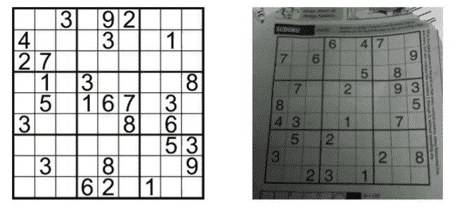

Original Sudoku Puzzle Images

最后，我完成了以下图像处理步骤:

**转换为灰度并调整大小** —后续步骤不依赖于颜色，假设大小一致使得一些后续处理更加简单

**提取并“解开”网格**—下一个任务是检测图像中的数独网格。仅支持“数字拼图”图像会容易得多，但报纸图像需要更多的工作。它从一些[去噪](http://docs.opencv.org/3.2.0/d1/d79/group__photo__denoise.html#ga4c6b0031f56ea3f98f768881279ffe93)和[自适应阈值](http://docs.opencv.org/3.2.0/d7/d1b/group__imgproc__misc.html#ga72b913f352e4a1b1b397736707afcde3)开始。

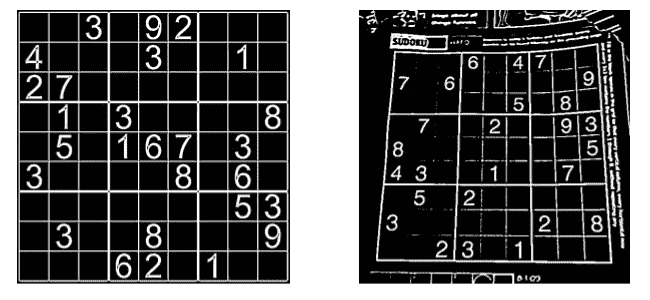

Thresholding and Denoising Applied

这些步骤为 [Canny 边缘检测算法](https://en.wikipedia.org/wiki/Canny_edge_detector) ( [OpenCV docs](http://docs.opencv.org/3.2.0/dd/d1a/group__imgproc__feature.html#ga04723e007ed888ddf11d9ba04e2232de) )做准备，该算法进一步将图像中的信息减少到仅仅是物体边缘，就像我们正在寻找的网格。

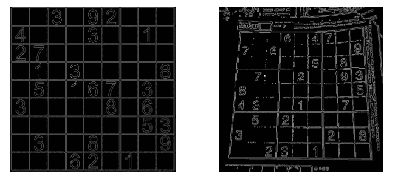

Canny Edge Detection Algorithm

现在我们可以使用 OpenCV 的`[findContours](http://docs.opencv.org/3.2.0/d3/dc0/group__imgproc__shape.html#ga17ed9f5d79ae97bd4c7cf18403e1689a)`算法来检测图像中的形状；`[RETR_EXTERNAL](http://docs.opencv.org/3.2.0/d3/dc0/group__imgproc__shape.html#ga819779b9857cc2f8601e6526a3a5bc71)`模式用于将搜索限制在极端的**外部**轮廓，跳过任何位于*内部的*其他轮廓。

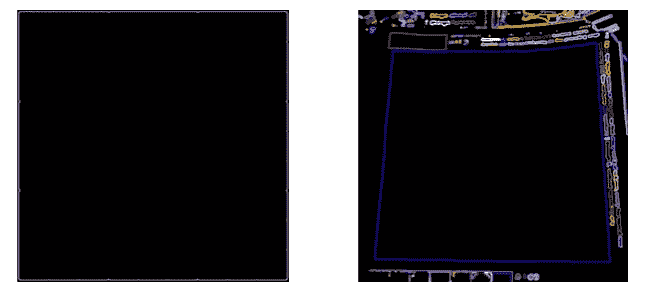

Contour Detection (there is a single contour in the image on the left if you look close)

有了一系列轮廓，这些轮廓只是“跟踪”形状的 X/Y 坐标列表，下一个任务是在`[contourArea](http://docs.opencv.org/3.2.0/d3/dc0/group__imgproc__shape.html#ga2c759ed9f497d4a618048a2f56dc97f1)`的帮助下找到最大的轮廓，然后通过在轮廓覆盖的区域的每个象限内找到轮廓的最外点来识别哪个 X/Y 坐标是网格的角。

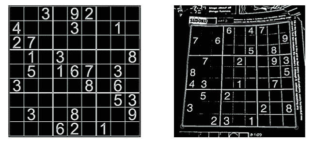

Detecting Perspective Transform Points for the Largest Contour

然后用 OpenCV 的`[getPerspectiveTransform](http://docs.opencv.org/3.2.0/da/d54/group__imgproc__transform.html#ga8c1ae0e3589a9d77fffc962c49b22043)`和`[warpPerspective](http://docs.opencv.org/3.2.0/da/d54/group__imgproc__transform.html#gaf73673a7e8e18ec6963e3774e6a94b87)`使用这些角来“解扭曲”图像的网格部分。虽然“数字拼图”没有太大的变化，但现在我们的报纸照片和“数字拼图”图像在后续处理中处于更加平等的地位。

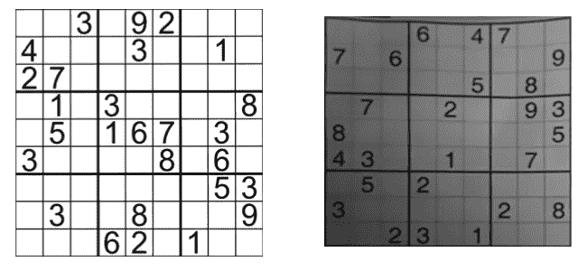

Perspective Transform Applied to Detected Grid

**消除网格线** —在我们寻找图像的数字区域之前，去掉网格线是很有用的。一个[结构化元素](http://docs.opencv.org/3.2.0/d4/d86/group__imgproc__filter.html#gac342a1bb6eabf6f55c803b09268e36dc)(我使用了 1px 水平和垂直内核)被传递给`[erode](http://docs.opencv.org/3.2.0/d4/d86/group__imgproc__filter.html#gaeb1e0c1033e3f6b891a25d0511362aeb)`和`[dilate](http://docs.opencv.org/3.2.0/d4/d86/group__imgproc__filter.html#ga4ff0f3318642c4f469d0e11f242f3b6c)`，以便清理网格线。`[findContours](http://docs.opencv.org/3.2.0/d3/dc0/group__imgproc__shape.html#ga17ed9f5d79ae97bd4c7cf18403e1689a)`再次被使用，但是这次轮廓通过纵横比被过滤成接近水平线和垂直线的轮廓。

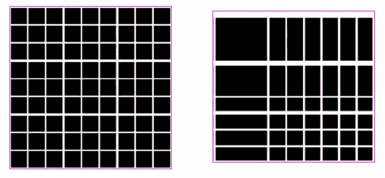

Grid lines detected in each image (pink is just the image border)

有时报纸的线条仍然太“弯曲”或模糊，不能像这里的例子那样作为网格线(在这个实现中)传递。这些区域然后被稍微扩展，并且从图像中减去**得到下面的结果。**

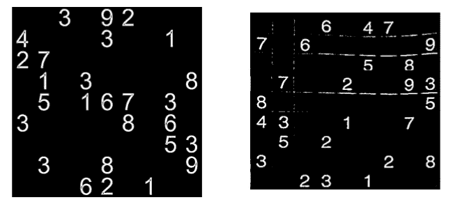

Removing Grid Lines and Denoising to Prepare for Digit Detection

**寻找数字** —终于到了检测图像的数字区域的时候了。再次使用`[findContours](http://docs.opencv.org/3.2.0/d3/dc0/group__imgproc__shape.html#ga17ed9f5d79ae97bd4c7cf18403e1689a)`，之后是另一个长宽比过滤器，灵感来自我的朋友[凯文·卡兹米耶扎克的文章](https://hackernoon.com/building-a-gas-pump-scanner-with-opencv-python-ios-116fe6c9ae8b)。这个过滤器允许我们跳过右边报纸图像中一些水平伪影的轮廓。

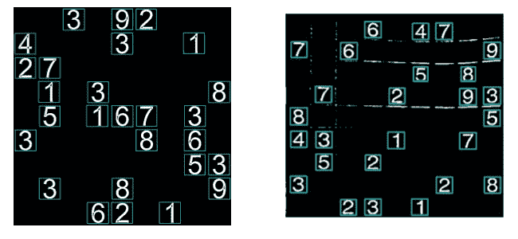

Detecting Digit Regions of the Image

# 使用 OpenCV 进行机器学习

找到图像中的数字区域后，下一步是识别每个数字图像中出现的数字。我仔细观察了几个样本图像，并将样本数独图像和它们包含的数字放在一起，形成了一个简单的 csv 数据文件，如下所示:

然后，每个样本图像都经过前面描述的“解析”逻辑，以找到手指区域。每个数字区域的中心与图像上的 9x9 网格的最近中心点相匹配，然后根据。csv 文件。然后将每个数字的大小调整到一致的大小，并组合成一个整体的“训练”图像，其中顶行包含所有的“1”图像，第二行包含所有的“2”图像，依此类推。这成为我们训练机器学习模型的原始数据。

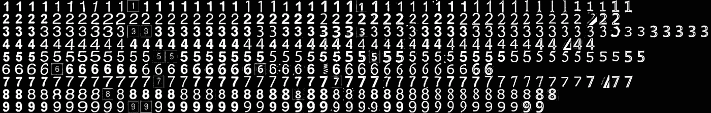

Digit regions extracted from several sample Sudoku puzzle images and combined together

有大量的数字识别教程，但我发现萨提亚·马利克的《T2》有着特殊的价值，因为它的解释清晰而详细。我为这个项目采用了他的方法。为了快速总结，为每个数字图像计算梯度描述符的[直方图(参见](http://docs.opencv.org/3.2.0/d5/d33/structcv_1_1HOGDescriptor.html#a723b95b709cfd3f95cf9e616de988fc8) [Satya 对 HOG 描述符的精彩解释](http://www.learnopencv.com/histogram-of-oriented-gradients/))。这些描述符的 80%连同数字标签(从我们的训练图像中的行推断出)然后作为我们的“观察”被馈送到 [OpenCV 的](http://docs.opencv.org/3.2.0/d1/d2d/classcv_1_1ml_1_1SVM.html) `[SVM](http://docs.opencv.org/3.2.0/d1/d2d/classcv_1_1ml_1_1SVM.html)` [类](http://docs.opencv.org/3.2.0/d1/d2d/classcv_1_1ml_1_1SVM.html)中以训练模型。然后，使用经过训练的 SVM 模型来为剩余的 20%的数字预测合适的数字。

我构建了一个[小型 C++ CLI 工具](https://github.com/jamesandersen/go-sudoku/blob/master/sudokuparser/cli/sudoku_parser_cli.cpp)来调用训练过程，最终在我收集的*尽管有限的*样本谜题集上获得了 97.73%的准确率。经过训练的 SVM 模型被保存并在以后再次加载，以用于解决新奇的谜题。

# OpenCV 3.x C++通过 CGO 与 Go 集成

到目前为止，所有的工作都是用 C++完成的(如果你看一下代码**【温柔点，我在写这篇文章的时候还是个 C++新手*)。从 Go 中调用这个结果比我预期的要复杂，*对于我在 Go 中的第一个作品来说不是一个容易的场景。**

*使 Go 能够使用一个特殊的注释调用 C 代码，该注释被称为“C”包的特定导入(该导入应该单独在一行上)的前导，如下所示。请注意，序言支持特定于平台的值，以支持在不同平台上交叉编译安全代码库，例如 darwin(我的本地设置)和 linux(为运行此应用程序而创建的 docker 容器)。*

*引用[文档](https://golang.org/cmd/cgo/)(重点是我的):*

> *当 Go 工具发现一个或多个 Go 文件使用了特殊的导入“C”时，它会在目录中寻找其他非 Go 文件**，并将它们编译成 Go 包的一部分。任何。c，。s，或者。s 文件将用 C 编译器编译。任何。抄送，**。cpp** ，或。cxx 文件**将用 C++编译器**编译。***

*这看起来很简单，但是由于我上面强调的几点，我浪费了时间:*

*   ***CGO 让我们称之为 C 代码(不是 C++代码)**——那么提到用 C++编译器编译的`.cpp`文件是怎么回事？嗯，作为一个 C/C++的新手，我花了一段时间才明白，`cgo`将从正在导入的 C 代码中编译被[引用](https://isocpp.org/wiki/faq/mixing-c-and-cpp#call-cpp) *的 C++。然而，您不能直接导入 C++代码，这意味着像`[string](http://www.cplusplus.com/reference/string/string/)`和`[vector](http://www.cplusplus.com/reference/vector/vector/?kw=vector)`这样的 C++类型必须转换成它们的 C 等价类型。**
*   ***CGO 只编译同一目录中的文件**——我最初的 C++数独谜题解析代码被组织到 src/和 include/目录中，我的`cgo`序言试图包含子目录中的 C 头文件。这不起作用。*

*我以下面的目录结构结束，让`cgo`正确地编译并链接我的 C++ OpenCV 代码到导入的“C”包中*

*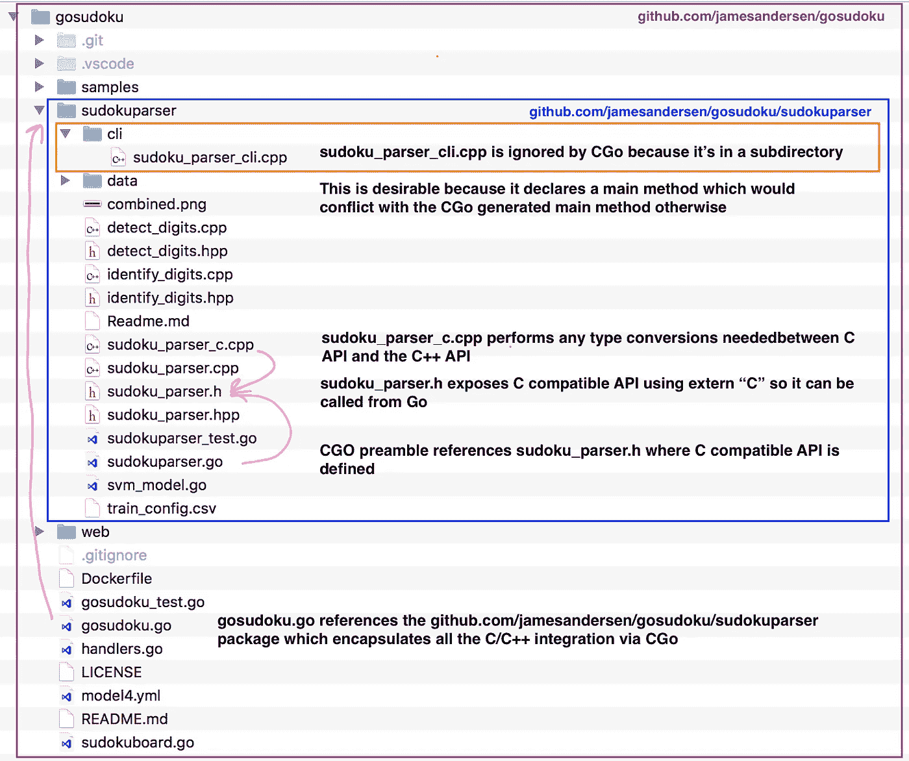*

*还有一些更值得注意的问题:*

*   ***用 CGO** — [Delve](https://github.com/derekparker/delve) 调试，围棋调试器牛逼。然而，一旦我开始使用`cgo`，我就不能让它工作了。我不知道它是否真的被支持，或者我只是有问题。我发现单独启动和调试 C++代码更容易*
*   *[**注意你的指针！**](https://golang.org/cmd/cgo/#hdr-Passing_pointers) —早些时候，我从 C++传回一个字符串，它代表“解析”的数独谜题，并断断续续地得到奇怪的垃圾结果。最后，我提前分配了 C 内存，并将指针传递给 C 代码，允许它从分配的内存中读取/写入。Go 的`defer`和`C.free()`确保我们完成后释放它。下面是一个例子。*

*这个调用的结果只是一个 81 个字符的字符串，标识从图像中检测到的数字:*

# *解决数独难题*

*本文的主要重点是研究如何解决给定数字的数独难题。如果这就是你想要的，看看彼得·诺维格的方法和解释。然而，我要指出的是，主要的技术是约束传播，其中我们本质上使用问题域上的约束来限制要搜索的选项的数量。如果我们 ***天真地*** 将数独棋盘想象成一个 9x9 的网格，其中每个单元格可以取 1-9 之间的值，那么我们就有了 9⁸可能的棋盘状态(超过 30 亿)。当然，我们知道有许多约束限制了搜索空间:*

*   *已知的起始数字*
*   *每行必须包含所有数字 1-9*
*   *每列必须包含所有数字 1-9*
*   *等等。*

*通过应用这些约束，我们可以大大减少可能的搜索空间。一旦应用了一个约束来缩小搜索空间，我们可以重新评估其他约束，以迭代地缩小拼图中每个单元格的有效值。当约束不能消除所有可能性时，结合搜索算法，大多数谜题可以在几秒钟或更短的时间内解决。查看`[sudokuboard.go](https://github.com/jamesandersen/go-sudoku/blob/master/sudokuboard.go)`了解本项目中使用的 Go 实现。*

*除了 Sudoku 求解代码之外，项目的 Go 部分还包含一些不起眼的代码，用于为项目 UI 所在的 web 内容的静态目录提供服务，并接受一个多部分文件上传，Sudoku 谜题图像将被发送到该文件中。它还使用 [NY Times Gzip 处理器](https://github.com/nytimes/gziphandler)来压缩响应。*

# *Docker 部署*

*好了，我们已经有了 OpenCV 代码来“解析”一张拼图图片(作为字节数组传递)，我们已经将其与一个简单的 Go web 应用程序集成，该应用程序接收一张拼图图片，将其交给 OpenCV 进行解析，然后解决缺失的数字。太好了！但是在哪里部署呢？*

*对 OpenCV 的依赖意味着我们没有一个独立的二进制文件，并且排除了类似谷歌云平台上的 [Go 标准环境](https://cloud.google.com/appengine/docs/go/)的东西。集装箱化的解决方案是下一个合乎逻辑的选择*

*[围棋图像](https://hub.docker.com/_/golang/)？✔*

*OpenCV 图片？很多人！*

*Go **和** OpenCV 3.x？☹*

*…所以我拼凑了我对 DockerHub 的第一个贡献，这是一个基于 Alpine Linux 的映像，带有 Go 1.8.3 和 OpenCV 3 库，幸运的是这些库在 Alpine Linux*Edge[中](https://pkgs.alpinelinux.org/packages?name=opencv&branch=&repo=&arch=&maintainer=)可用。*这里有一些困难，例如让[符号链接设置](https://github.com/jamesandersen/alpine-golang-opencv3/blob/master/Dockerfile#L11-L17)到版本特定的 opencv 库，但最终这个容器，加上之前看到的平台特定的`cgo`序言，让我成功地在 docker 容器内构建了应用。*

*在阅读了 Kelsey Hightower 关于 Go 应用程序的微型 Docker 容器的文章后，我意识到，虽然我可以从这个图像运行我的应用程序，但它会被夸大，因为所有的 Go 工具仍然存在。对我来说幸运的是，自从凯尔西写了他的文章，Docker 团队在 Docker 17.05 中添加了[多阶段构建](https://docs.docker.com/engine/userguide/eng-image/multistage-build/)，现在，在**单个**Docker 文件中，我可以构建应用程序，**用 SDK 工具丢弃构建映像，等等。将前一阶段的 Go 二进制文件复制到一个干净的轻量级映像中！伟大的工作码头团队！***

*感谢 [Hyper.sh](https://hyper.sh) 的人们为 docker 容器的简单托管提供了一个免费层。*

# *结论*

*如果你坚持了这么久…谢谢！我希望有对你有价值的东西。求解器绝不是万无一失的；它对一些图像仍然有问题，要么无法解析它们，要么解析不正确，导致无法解决它们(因为它可能解析为无效的谜题)。目标当然是增加一些新技术，从这个角度来看，这个项目是有价值的。*

*解算器在[http://gosudoku.jander.me/](http://gosudoku.jander.me/)上线(截至本文撰写之时),如果你感兴趣的话[源代码在 GitHub](https://github.com/jamesandersen/go-sudoku) 上。如果你觉得有用或有任何后续问题，请给我留言。谢谢！*