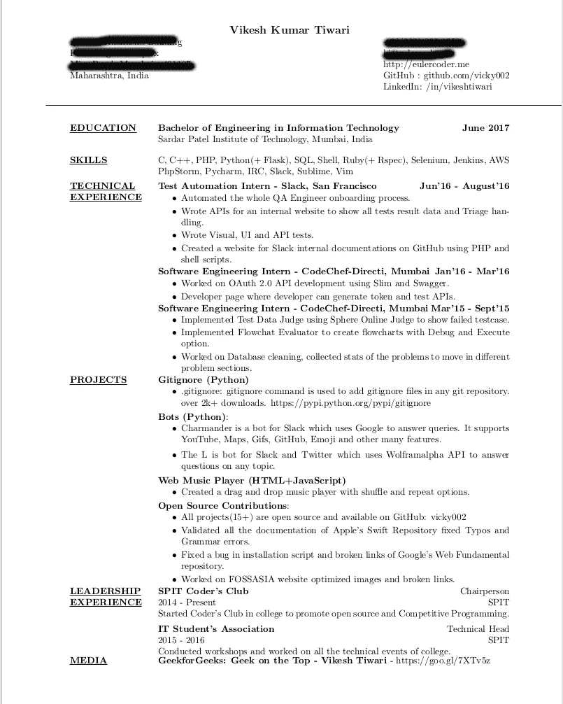

# 暑期实习:获得实习机会的终极指南！

> 原文：<https://medium.com/hackernoon/summer-internship-the-ultimate-guide-to-get-one-1b9be19deff7>

Photo by [Benjamin Davies](https://unsplash.com/photos/FiZTaNTj2Ak?utm_source=unsplash&utm_medium=referral&utm_content=creditCopyText) on [Unsplash](https://unsplash.com/?utm_source=unsplash&utm_medium=referral&utm_content=creditCopyText)

作为一名学生，我们每个人都有一个梦想。梦想做一份很棒的实习工作，并在一家你真正热爱并想为之工作的公司找到一份工作！有数不清的网站、文章、博客文章和视频介绍如何获得实习机会。很有可能，你已经读过或知道了 98%的建议:编辑和校对你的简历和求职信，穿着得体去面试，准时或提前 15 分钟去面试，发送感谢信等等。在这篇博文中，你不会得到任何这样的建议。本帖将带你从零到一。准备好笔记本和笔，这将是一篇很长的文章。拿些零食，开始记下你认为对你未来有帮助的要点。

我假设你现在是第二年，你会在第三年申请你梦想中的实习。你已经知道 C/C++或任何面向对象的编程知识和基础数据结构，如链表、堆栈、队列等。

让我们把博客分成三个部分。

# 申请实习前需要做的事情。

大多数美国公司在 12 月份就开始了他们的暑期实习面试。在第二年的第四个学期结束后，你将有 1.5-2 个月的假期(取决于你的大学)，这是提高你的计算机科学和编码技能基础的最佳时间。

我面试了 5-6 家公司，根据我的经验，这里列出了你应该知道的话题(如果你还没有决定你的领域)。

## 但是薇琪，我会申请特定职位的实习。我的清单在哪里？

给你！

我没有在这里列出像使用 Ubuntu、Curl 和 telnet 命令等非常基础的东西。

**注意:**你不需要知道上表中提到的一切。算法和数据结构对破解任何面试都非常重要，所以你应该花大部分时间学习和练习问题。

## Vicky，这是一个很大的列表！有什么好的资源可以利用吗？

是啊！所有有用的网站，pdf 和文章链接都在帖子末尾提到了。

进入面试入围名单是最艰难的部分，为此，你的简历应该非常有力，质量非常高。那么招聘人员希望在你的简历上看到哪些不同的因素呢？

*   **学院**
*   是的，在申请实习之前，确保你有一些好的项目可以在简历中提及。将你的代码上传到 [GitHub](https://github.com/vicky002) 上，使其开源，并在你的简历中添加代码链接。如果你在寻找项目创意，我有一个超过 500 个项目的清单。
*   **开源贡献:**在 GitHub 上搜索好的项目[贡献](https://github.com/explore)改进文档，修复 bug，做一些增强。公司真的很喜欢！如果你没有好的 GPA，那么项目和开源贡献真的会增加你简历的价值。
    **阅读:**[Euler coder 上的开源指南](http://eulercoder.me/2017/07/getting-started-open-source/)入门
*   **过往实习经历**(如果有的话) :在申请美国或印度的顶级公司之前，你应该在任何一家创业公司实习至少一次。创业实习真的是一个在很短的时间内学到很多东西的好地方。不要考虑薪水，如果你真的喜欢他们的想法，就发邮件问他们实习职位。有很多网站可供创业实习网站列表可以在帖子底部找到。
*   领导素质:在非营利组织做志愿者，并成为大学委员会的一员。
*   **编程技巧**
*   **平均绩点**(罕见)

# 申请时需要做的事情

好了，现在你有了一些高质量的项目，你知道了 cs 基础的基本知识，你对数据结构和算法有了很好的了解。这是写好简历的时候了！

你的简历应该包括以下几个部分。

1.  **学历:** 学历及流向，学院名称，现年份，毕业年份。如果你的绩点低于 7/10，就不要包括在内。
2.  **技巧** 在这里要诚实，只有真正了解的情况下才提到语言和框架。一旦你被列入面试的候选名单，招聘人员可能会问任何关于这个的问题，你会被搞得一团糟。
3.  **技术经验**(如果有)
    用过去式写句子。使用“创建”、“实施”、“设计”、“固定”等词语。使用 Y 实现了 X 或者使用 Y 实现了 X 来修复 Z，其中 X =任何新特性，Y =语言或框架，Z =问题。
4.  **项目** 同样的要点也适用于项目。如果有的话，不要忘记添加代码或网站的链接。
5.  **领导经历** 在这一节添加你的志愿服务或委员会工作。
6.  **课外活动** 你所有的竞争性编程排名、奖项和黑客马拉松相关的东西都在这里。
7.  工作授权你将申请美国公司，所以别忘了加上这一行。

自从上两个月以来，我没有更新过我的简历，但是看过一次。忽略客观部分，这只是浪费空间。

My Resume

一旦你创建了你的简历，校对 2-3 次。请你的朋友和员工仔细阅读你的简历，最后将你的简历[贴在这里](https://www.reddit.com/r/resumes/)。这个 subreddit 很牛逼，人也很乐于助人。这将是残酷的，但他们会精彩地评论你的简历。

现在你有一份非常好的简历，并且你知道 cs 的所有基础知识。申请最好的实习机会的时候到了！

# 这正是时候！

是啊！这是 2016 年 12 月，2017 年夏天的实习过程刚刚开始。我已经为你创建了一个表！打开[这张纸](https://docs.google.com/spreadsheets/d/1-0M50QEHjB64WhdcMFDlAbp4atND8QrlWJwKkfpNJ2k/edit?usp=sharing)给自己复印一份。根据您的喜好编辑公司。

到处适用！不要认为你没有一份完美的简历，只要访问他们的职业网站或 [LinkedIn 实习岗位](https://www.linkedin.com/vsearch/j?keywords=Internship&title=Internship&sb=Jobs%20for%20Internship%20titles&trk=tyah&trkInfo=clickedVertical%3Asuggestion%2CclickedEntityId%3A166%2Cidx%3A1-1-1%2CtarId%3A1457835727447%2Ctas%3Ainternship%20)并填写表格即可。我今年申请了 20 多家公司。

一旦你入围面试，在 Glassdoor、Geeksforgeeks 和 reddit 上到处搜索关于过去实习面试过程的问题。当我进入 Slack 实习的候选名单时，我到处搜索面试过程和提问。除了 reddit 上的一个帖子，我什么也找不到。如果你什么也没找到，就去这个分支网站发帖提问或者在 LinkedIn 上搜索过去的实习生，把他们添加到你的个人资料中，然后直接给他们发信息。十分之三的人会给你一个完美的答复，这对你来说已经足够了！

我的一些建议:

*   正确阅读邮件，搜索关键词。
*   为不需要编程知识的技术问题做好准备。
*   回复邮件时要有礼貌。(搜索如何向招聘人员发送电子邮件:p)
*   在面试之前，仔细阅读邮件，列出所有可以提问的问题。
*   列出所有的行为问题及其答案。

我从不同的资源收集了一些顶尖公司的面试经验。我希望你觉得这个有用。

# 资源

## 创业实习

*   [AngelList](https://angel.co/)
*   [你好实习生](https://www.hellointern.com/)
*   [HeySuccess](http://heysuccess.com/)
*   [录用](http://hired.com/)
*   [Internshala](http://internshala.com/)

## 算法和数据结构

*   [Geeksforgeeks](https://www.geeksforgeeks.org/) (网站)。
*   [算法设计手册](http://sist.sysu.edu.cn/~isslxm/DSA/textbook/Skiena.-.TheAlgorithmDesignManual.pdf)(书— PDF)
*   [LeetCode](https://leetcode.com/) (练习用)
*   [TopCoder](https://topcoder.com/) (练习用)
*   编程面试要素(书)[亚马逊](https://amzn.to/2trD6pl)
*   Narasimha Karumanchi 编写面试问题[亚马逊](https://amzn.to/2tMlYcX)

## 建立工作关系网

*   [HTTP —明确指南](https://drive.google.com/file/d/0BwKu-h8_pNchRWhMSWczU29jVTA/view?usp=sharing) (Book — PDF)
*   [网络基础](https://www3.nd.edu/~cpoellab/teaching/cse40814_fall14/networks.pdf)(网站)
*   [计算机网络](https://docs.google.com/file/d/0B3ABfanK6Vkya2dsVHdMQ0l5bkk/edit)

## 操作系统

*   [操作系统概念](http://infoman.teikav.edu.gr/~stpapad/OS_8th_Edition.pdf)(书籍 PDF)

## 网络材料

[FreeCodeCamp](http://freecodecamp.com/) [最佳 JavaScript 教程](https://learn.javascript.ru/)(是一个用 Chrome 翻译的俄罗斯网站) [W3Schools](http://www.w3schools.com/)

## 面试准备

[GeeksforGeeks —面试](http://www.geeksforgeeks.org/about/interview-corner/)[IndiaBix](http://www.indiabix.com/)[career cup](http://www.careercup.com/)[Kate mats](http://katemats.com/hiring-interviews/)

## 其他的

*   [牛逼](https://github.com/sindresorhus/awesome)(这里包含了你需要的一切！)

其他强烈推荐的[书籍](https://hackernoon.com/tagged/books)。——[破解编码面试](https://amzn.to/2trYdri)——[编程面试曝光](https://amzn.to/2sPdmFd)

最后一件事:

不断和比你有更多知识的人交谈和询问，人际关系网真的很重要。

那么还在等什么呢？

Go get it!

*本文原载于我的博客:*[*http://Euler coder . me*](http://eulercoder.me)

*如果有什么不清楚的地方，想要更深入的了解某件事，请写邮件给我—*[*hi @ Euler coder . me*](mailto:hi@eulercoder.me)*。您也可以* [*订阅我们的邮件列表*](http://eepurl.com/bRklFn) *来接收我们关于实习和工作的最新帖子的每周更新！*

谢谢大家！