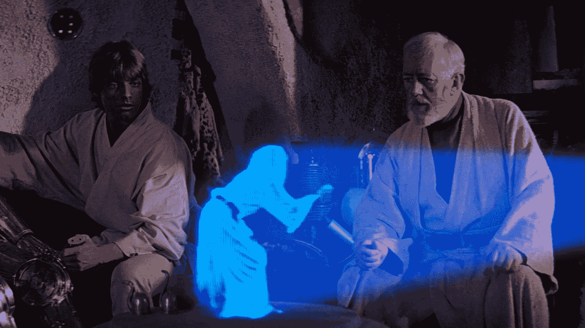
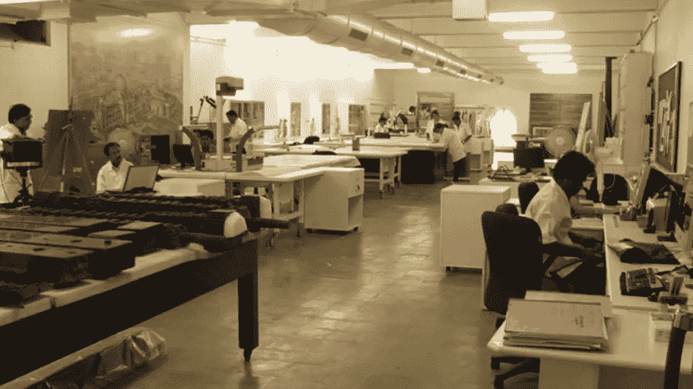
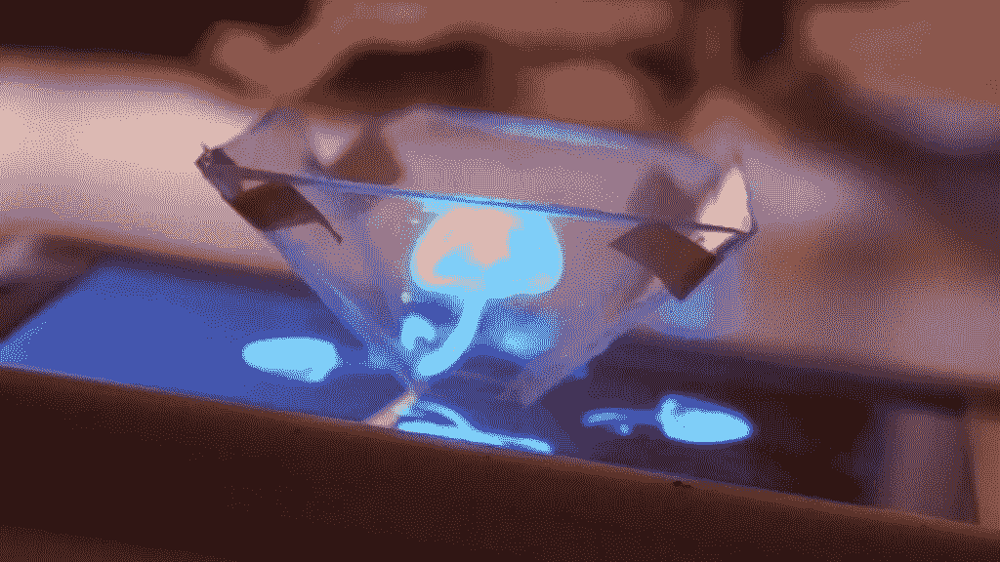
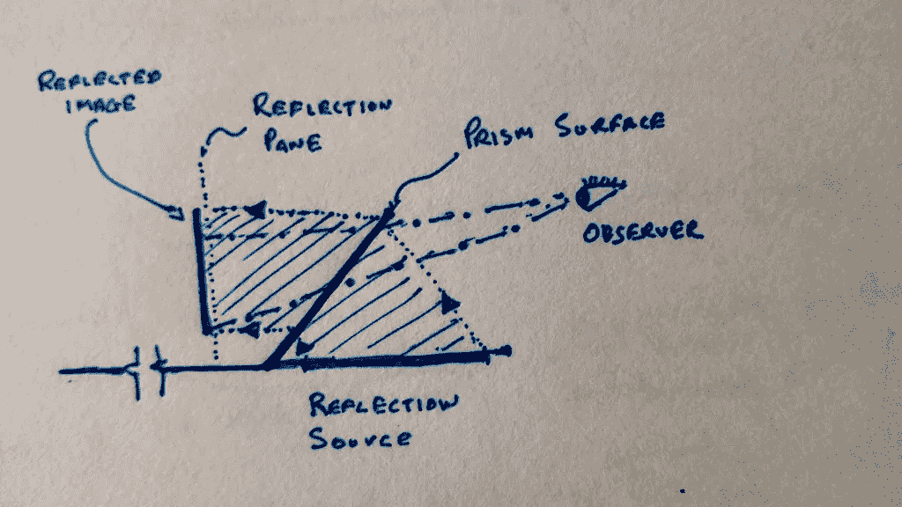
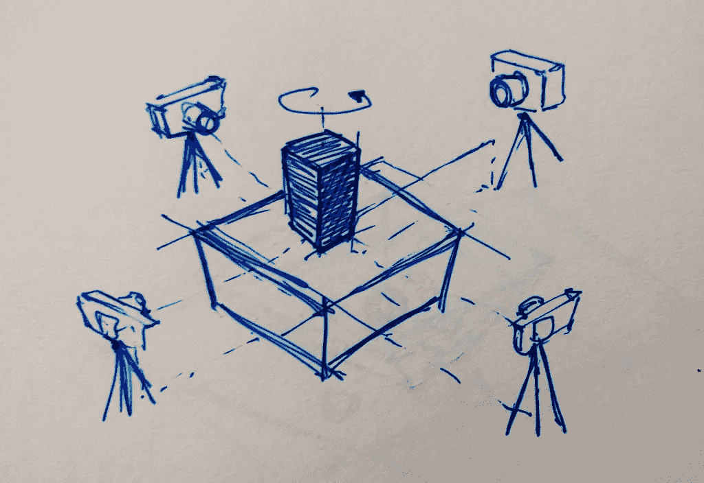
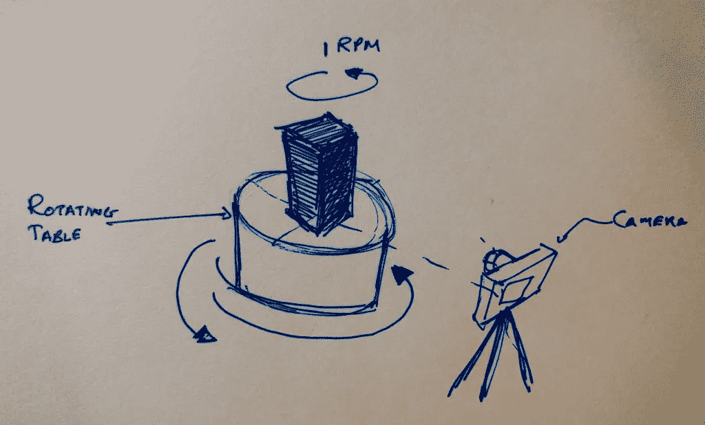
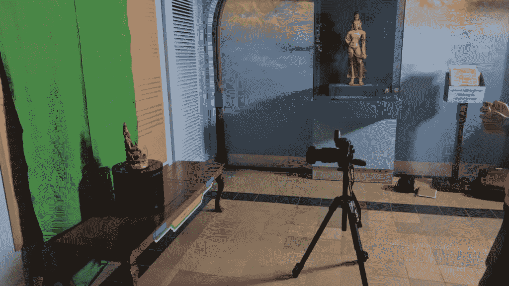
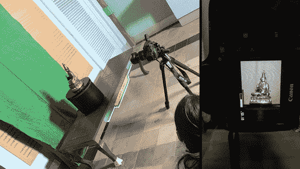
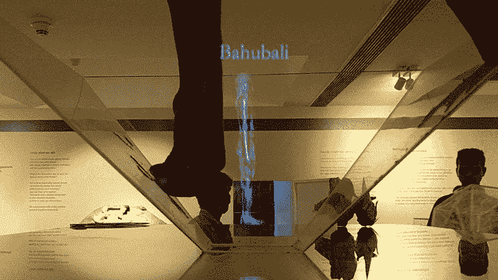
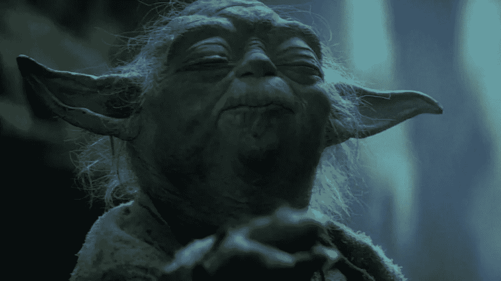

# 如何构建简单的全息图

> 原文：<https://medium.com/hackernoon/summon-the-jedi-e06db54ab92e>

Princess Leia’s holographic message

> “救救我，欧比万·克诺比，你是我唯一的希望*静电*救救我，欧比万·克诺比，你是我唯一的希望。”――在《星球大战:第四集》中，莱娅公主给欧比万·克诺比的全息信息

我对全息图的热爱始于钢铁侠系列。每当我必须解释它们是什么的时候，这就是我给出的事实上的例子。我很想举一个《星球大战》的例子，然而，与我的假设相反，我认识的大多数人都没有真正看过/关注过《星球大战》(或者也许我那时和错误的人在一起……这是以后讨论的问题)。

我们都在《星球大战》系列、《钢铁侠》中见过全息图，甚至《哈利·波特》也向我们展示了这种混合现实的一些实例。全息图一旦成为日常生活的一部分，肯定会增强我对人类创造神奇事物能力的信心。我们已经看到了这一现实的一瞥，现在已经停止的[谷歌眼镜](https://en.wikipedia.org/wiki/Google_Glass)项目和令人敬畏的[微软全息透镜](https://www.microsoft.com/microsoft-hololens/en-us)。我不完全相信混合现实的头戴显示器的想法，但我可能是错的；也许有一天，我们可以通过隐形眼镜嵌入混合现实设备。更好的是，未来的几代人生来就有嵌入其中的混合现实，在这个意义上，它成为他们唯一的现实。

## 开始

在孟买的 CSMVS 博物馆协助 Sarah Kenderdine 博士进行 Domelab 项目时，我被介绍给了博物馆遗产保护实验室的负责人 Anupam Sah 先生(以下我称他为先生)。老实说，这是一个令人惊叹的空间。这是一个充满保护专家、历史学家和科学家的实验室，他们一丝不苟地工作，如此专注，以至于这个空间对我这个怪胎来说几乎是神圣的。

The Lab

先生和我开始谈论我们做了什么，关于实验室保存的即将到来的展览，出现的问题和我能做些什么来帮助。那些在研究生院认识我的人都知道我对数据可视化的热爱，我从一开始就非常确定其中会有 dataviz 元素。然而，这是次要的。出现的主要问题是缺乏物理空间，这是博物馆展览中一个相当普遍的问题。平均来说，博物馆只能展示他们保留的 5%的物品，其中许多在画廊和其他博物馆之间流动。没有地方展示文物，怎么展示？一种直觉是在电视屏幕上有一个简单的图片库，其优点是屏幕的高分辨率和易于设置这样的系统。2D 表面非常适合远距离观看图像或绘画，但并非所有的人工物品都具有相同的性质。那么 3D 物体会发生什么呢？我想如果我们不能重新创造真实的物体，我们总是可以创造一个它的幻觉。那时，我们想出了创造物体全息图的主意，这些物体不能成为展览的一部分，但我们希望它们成为。

## 如何

A Mobile Phone Hologram (DIY)

全息摄影作为一个概念，由匈牙利科学家丹尼斯·加博尔发明，已经有五年多的历史了。我记得在 Youtube 上看过这个用透明 OHP 片制作的智能手机小全息图的 DIY 项目。本质上，我在展览中使用的是一个类似的概念，4 个图像/视频在丙烯酸棱镜上同步内反射；在一个光线平面上重建的场景。

How holograms work — Schematic

我不想解释全息图是如何工作的细节，但对于那些足够好奇的人来说，这里有几个链接可以入门:
[http://science.howstuffworks.com/hologram.htm](http://science.howstuffworks.com/hologram.htm) [http://holocenter.org/what-is-holography](http://holocenter.org/what-is-holography) [https://en.wikipedia.org/wiki/Holography](https://en.wikipedia.org/wiki/Holography)

在做这个项目的时候，我正在看埃隆·马斯克的传记，并且已经完成了《创新的力量》，这两本书都强调了少花钱多办事的理念。我也倾向于同样的观点。挑战在于用尽可能少的设备和资源创造这些全息图。

> 一点点常识，完成事情的意愿，以及相信我们能解决这个问题的信念是做任何事情都需要的最重要的，通常也是唯一的品质。

当然，任何已经完成的事情都可以做得更好，这就是对新手的挑战。我在这里，有了这张空白的画布，在没有任何经验的情况下，我决定为这个国家一个非常著名的博物馆制作全息图。有史以来最好的决定，对吗？

老实说，我有疑虑。我相信，一点点常识、完成事情的意愿以及相信我们能够解决这个问题，是做任何事情最重要的，也是唯一需要的品质。

目标是创建不同时期的大约 20 个物体的全息图，这些物体由不同的材料制成，来自该国的不同地区。我最初的想法是拍摄一个物体的四个面，因为我们使用的是四面棱镜。这种方法面临一个明显的问题；物体在棱镜上反射的静态图像产生了一种三维的错觉。然而，它们无法向观察者显示这些表面边缘的有趣细节，我们很快决定使用视频来减轻这些“边缘情况”。第一个想法是使用四个摄像头面对物体的四个侧面，并旋转物体一整圈。摄像机将同时捕捉旋转的四个视点，并在后期处理中生成单个视频。然而，我们可以使用的相机和镜头都是完全不同的，这意味着后期处理方面的大量工作，更不用说我们必须支付的设备租金了。还记得我给自己的挑战吗？是的,“少花钱多办事”的那种。我本想用佳能 5D 马克四型相机来拍摄视频，结果租出去三部(博物馆的店里有一部)用几个星期会很贵。

Using four cameras to capture a single hologram image.

找到了。

我们决定只使用一个摄像头，以恒定的转速旋转物体，而不是使用四个摄像头。我总能在后期处理中从一个视频生成四个视频。

博物馆想买一张旋转桌，这是个好时机。我们也可以使用属于博物馆的一个佳能 5D 马克四。因此，与我们之前不得不花费的 10 万卢比相比，拍摄视频对我们来说基本上是免费的。这太棒了。旋转桌预定几周后到达，这给了我们时间来计划。我们找到了最佳位置、照明、绿色屏幕和其他细节。对其中一个对象进行了试运行，这似乎是一个合法的解决方法。保护实验室也有时间列出一系列可以制作全息图的物品，并获得拍摄许可。旋转桌一到，我们就为拍摄做了三天的计划。

Using a single camera and a rotating table to achieve the same holographic image

所有视频都是以恒定的 1 RPM 拍摄的。一旦视频拍摄完毕，就该进行后期处理了。绿色屏幕背景被擦除。

The setup

Capturing for the hologram

这些视频是物体的 360 度旋转。每个视频的时间范围被分成四个部分，即 15 秒。从基础视频生成四个视频，使得每个视频看起来像是从四个分割中的一个开始，并在相同的位置结束，从而产生从特定视点观看的错觉。这四个视频合成为一个视频，用于生成全息图。

Final Holograms — This was shot with a low res smartphone camera

## 后来添加的东西

> 我们倾向于将我们的经验判断为各种感觉的组合，而不是各个部分；室温刚刚好的时候食物味道更好。

像任何项目一样，这也有其局限性。由于时间和成本的限制，我们不得不放弃一些最初的想法，包括在平板电脑上创建一个可以用来浏览全息图的界面。尽管努力获得尽可能高的分辨率，经济地制作清晰的全息图仍然是一个遥不可及的梦想。要生成完美的全息图像，分辨率至少要高 1000 倍。在目前的情况下，我使用了博物馆拥有的标准 40 英寸电视屏幕来显示倒影，所以有人担心它的分辨率。读了一些之后，我意识到任何一种互动总是比看上去的要多。一次好的经历通常会涉及多种感官。一位名叫 Russ Neuman 的社会科学家进行了一项观众对展示质量反应的实验。他设置了两个相同的显示器，并要求一组参与者观看显示器并判断其质量。两台显示器之间的唯一区别是，其中一台显示器使用了更高质量的音响系统，而另一台使用了标准音响系统。实验结果显示，在声音质量更好的情况下，许多受试者报告了相当好的图像质量。两次展示都是一样的。我们倾向于将我们的经验判断为各种感觉的组合，而不是各个部分；室温刚刚好的时候食物味道更好。

全息界面似乎是人机交互(HCI)未来的有力竞争者，尽管我认为不同的环境需要不同的界面。随着语音识别和认知的进步，语音界面似乎将占据人类与机器交互的很大一部分模式。有什么比指向一个物体并命令它为你服务更方便的呢，就像瓶中精灵一样？最好的用户界面是没有用户界面。像 Siri、Alexa、谷歌助手、Cortana 等语音界面代理已经开始创造自己的个性。将来，这些个性将根据用户的年龄、性别、国籍、社会结构、关系等为每个人定制。这些数字人物可能会开始以物理形式出现，也许你会有 Siri 或 Cortana 的全息图在你的整个房子里跑来跑去，要求为你跑腿或宣读为你策划的新闻。

全息图可能只是艺术和技术交汇处那些真正激发思考的罕见时刻之一；一种非常迷人的混合现实形式，其想法几乎是神奇而富有诗意的，因为它实现了真实和虚拟之间的无缝交互，将我们变成现实生活中的巫师。这是一个比虚拟现实更美好的现实，但也更难实现。像生活中的大多数事情一样，这也是一个聪明的错觉。

## 承认

我感谢阿努帕姆·萨先生给我这次机会。感谢 Nidhi Shah，Renuka M，Onkar Abhyankar，Rajesh Poojari 和 CSMVS 博物馆工作人员的支持。

页（page 的缩写）s:全息图可以在 CSMVS 博物馆的 Premchand Roychand 画廊看到，直到 2016 年 11 月 1 日。它们是正在进行的 CITI 自然保护展的一部分。

## 参考

*   指令
*   [数字化——尼古拉斯·尼葛洛庞帝](https://amzn.to/2ulb0NC)

免费赠品！下载一个棱镜模板来创建自己的全息图:
[PDF (illustrator 可编辑)](http://akor.in/download/museumhologram.pdf) [SVG](http://akor.in/download/museumhologram.svg) *经验法则:对于一部 5 英寸的智能手机，缩放每个部分，使最短的边长为 1 厘米。始终以相同的纵横比缩放，即 Shift+Scale*

Now that you feel wiser, here’s a picture of Master Yoda…