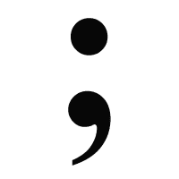

# 用 JS 里那些该死的分号来 Sup？

> 原文：<https://medium.com/hackernoon/sup-with-those-damn-semicolons-in-js-bcd9ebe83eb0>

## 它们真的有必要吗？他们很丑！

# 历史

JavaScript 并不完美，尽管自 Netscape(早期浏览器)问世以来已经有了显著的改进。它被设想为 Java 在 web 上构建脚本的一个更简单的替代方案。马克·安德森(网景公司的联合创始人)聘请布伦丹·艾希制作一个原型，他只用了 10 天就完成了。JavaScript 诞生了。

从一开始，JavaScript 就是网络语言。鉴于这种语言是为初学者设计的，它有一些不幸的怪癖，我们需要注意，分号可能是您最先遇到的。

# 分号



初学者被告知在每一行的末尾加上分号(或者"[语句](/@PrintSupWorld/statements-expressions-and-values-7727a0011565)")来表示一行结束，没有太多的解释。

```
var i = 0; // good
var j = 0  // bad
```

## 其他编程语言不需要它们，为什么 JavaScript 需要呢？

JavaScript 不注意间距(为了“更简单”)，所以它不知道你在新的一行，它需要一个分号来知道这一点。

## 但是当我省略分号时，我的代码仍然运行！

```
var i = 0
i // 0
```

它*在很多时候确实*有效，但*并不总是*！JavaScript 使用“自动插入分号”来帮助可能忘记放置分号的初学者。上述代码被解释为:

```
var i = 0;
i;
```

问题是也有例外。我们鼓励初学者使用分号，这样他们就不必学习这些异常，但是让我们来复习一下。

# “自动分号插入”例外

## 以“`("`开头的行

```
// initial
var i = 0;
(function(){console.log(i)})(); // 0// no semicolon
var i = 0
(function(){console.log(i)})() // TypeError: 0 is not a function// how engine sees above
0() // TypeError: 0 is not a function
```

JavaScript 尽最大努力来确定一行的结束，但是它不确定你是否试图用下一行的`()`之间的输入来调用函数`0`，比如`0()`。显然`0`不是一个函数，它是一个数字，所以我们得到一个错误。

*注意:我使用了一个“立即被调用的函数”,因为它需要用圆括号括起来才能工作，参见* [*这篇文章*](/@PrintSupWorld/immediately-invoked-function-expressions-6b4bd7c1b59d) *的快速解释。*

## 以“`["`开头的行

```
var i = 0;
[1,2,3].pop(); // 3var i = 0
[1,2,3].pop(); // TypeError: Cannot read property 'pop' of undefined0[1,2,3]; // undefined
```

解释器不确定你是否表达完了`i`的值。它认为也许你会尝试索引一个叫做`0`的数组，比如`0[1]`，但是`0`不是一个数组，所以最后一行是`undefined`。我们试图在没有任何属性的`undefined`上调用名为`pop`的`Array`方法时出错。

## `Return`报表

```
function foo() {
  return
  1
}foo() // undefined
```

`return`作为`return;`运行，所以该函数不返回任何内容，即`undefined`。分号会自动插入到 return 语句的末尾，因此请确保您返回的值位于同一行(如`return 1`)，因为`return`下面的行将不会被执行！

# 没有自动插入的有趣案例

## 函数声明、条件、循环

分号*被*插入(自动)在[函数表达式](/@PrintSupWorld/function-hoisting-declarations-vs-expressions-7f4d385a5d7f)之后，而不是“函数声明”之后。

```
// function expression
var foo = function() {
  return 0;
};
```

此处未插入:

```
// function declaration
function foo() {
  return 1
}// conditional statements
if (condition) {
  console.log("true");
} else {
  console.log("false");
}// loops
for (var i = 0; i < 10; i++) {
  console.log(i);
}
```

> 分号不插在波形括号`{ }, except for objects`之后。

```
// semicolons inserted after object
var obj = {};
```

## 所以…我可以不用那些该死的东西了吗！？

许多受人尊敬的程序员避免用分号来混淆他们的代码。如果你现在确信你理解了它们是如何工作的，你也可以选择省略它们！

就我个人而言，我相信使用分号会让你的代码对你和未来的读者更具可读性(也让它看起来更合法)。此外，您可以最小化遇到分号相关错误的风险，这对于初学者来说尤其重要(同样，您不太可能遇到那些模糊的异常)。我也喜欢他们给一个声明加上一个结尾，就像这个时期一样。

请欣赏由 [Mattias Petter Johansson](https://medium.com/u/5b25bc58c2e?source=post_page-----bcd9ebe83eb0--------------------------------) (不使用分号的“备受尊敬的程序员”之一)制作的这个[视频](https://www.youtube.com/watch?v=Qlr-FGbhKaI)，它是这篇文章的灵感来源！我*高度*推荐他的[好玩好玩功能](https://www.youtube.com/channel/UCO1cgjhGzsSYb1rsB4bFe4Q)频道。我沉迷于此。派人来帮忙！

请用反馈/问题来评论，并按下拍手按钮！