# 增压您的崇高文本 3，以提高您的生产力

> 原文：<https://medium.com/hackernoon/super-charge-your-sublime-text-3-to-increase-your-productivity-5d02c2c1b356>

> (编辑)这篇文章我加了一些 gif。

很高兴你喜欢**崇高文字 3** ！事实上，我是一个死忠球迷，我一直在使用它的年龄(自 ST2)。我有几个小技巧想和你分享。

> **这不是一篇面向语言的文章。**

这篇文章涵盖了 ST3 的基础知识和高级用法，我们将学习并实践:

*   模糊搜索基础。
*   `User`文件夹下的文件是什么。
*   一些重要的功能作为提醒。
*   使用单词和线条。选择和删除技术。
*   有用的键和高级**导航**技术。
*   项目管理。
*   安装一些方便的插件。
*   通过改变一些设置进行优化。
*   将缺少的**命令**添加到*命令面板。*

如果你不知道如何打开命令面板，点击`ctrl+shift+p`。此`ctrl+p`是为*转到*文件，也称为*转到*文件。

# 模糊搜索

它是这样工作的:如果你在任何调色板中寻找一个术语，例如`Preferences: Key Bindings`，你不需要输入全部内容。我会选择符合条件的`kybi`。也不需要空间。

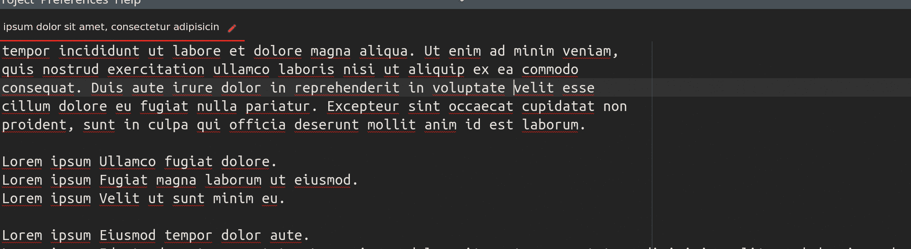

# 用户文件夹下的文件

`~/.config/sublime-text-3/Packages/User`下面还有一些**文件**。我用的是 GNU/Linux，但是其他操作系统的原理是一样的。内容应该是有效的 **JSON** 格式，否则不起作用。

`Preferences.sublime-setting`用于全局设置。可以通过命令面板(*首选项:设置*)访问。

`Default (Linux).sublime-keymap`是你可以添加快捷键的地方。它可以在命令面板中访问(*首选项:按键绑定*)。

`Default (Linux).sublime-mousemap`包含鼠标动作。现在你只能通过浏览目录和编辑来打开它。然而在这篇文章中，我将向你展示如何轻松地将它添加到命令面板中。

默认情况下，该文件夹中不存在另一种类型的文件，但是您可以创建一个，这种文件**扩展了**命令面板**的**功能，我将在下面解释。

# 基本功能和概念

**多光标**可通过以下方式调用:

选择多行，然后点击`ctrl+shift+l`

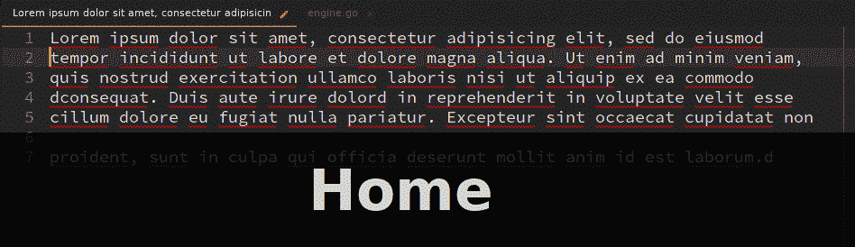

`ctrl+left-click`在不同的地方

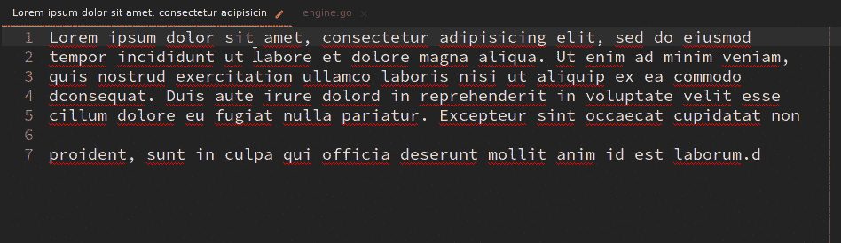

在展开下查找。把你的光标放在一个单词上，然后点击`ctrl+d`它将选择那个单词。然后在创建新光标的同时，再按几次`ctrl+d`来查找相似的单词。它也适用于部分选择的单词(几个字符或几个单词/行)。

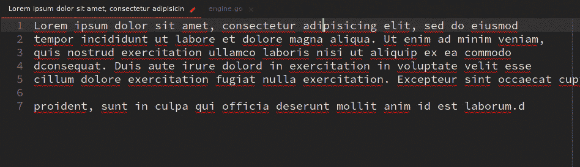

找到所有:`ctrl+f`并点击`Find All`


**在侧边栏中显示文件**显示当前文件在侧边栏中的位置并高亮显示。右击视图并选择`Reveal In Sidebar`。我们将在下面为它创建一个命令，因为它还不存在。

**通过点击`ctrl+k ctrl+b`来切换侧边栏**。如果您愿意，也可以为此创建一个命令。

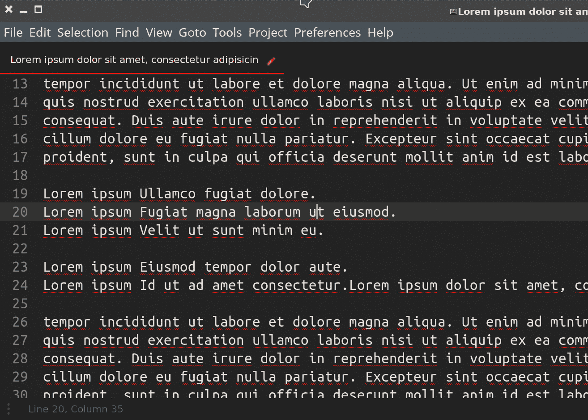

**去做任何事情**都是重要的一件。您可以通过`ctrl+p`调用它的调色板。它显示了当前项目中可用文件的列表(见下文)。它也遵循模糊搜索规则。你可以用它做更多的事情:

*   `@`显示您可以导航到的符号(类/函数/方法)列表。
*   `:`通过输入行号转到某一行。
*   `#`显示了一个单词列表(它们可以在`.tmLanguage`文件中设置，通常会随你安装的插件一起提供)

如果您不键入任何文件名，它们将处理当前文件。

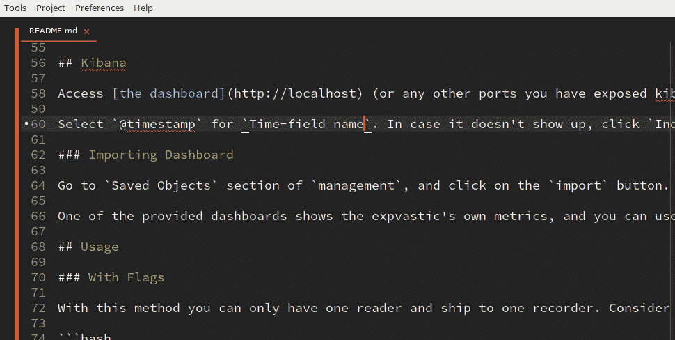

永远记住你的项目和可能的符号名称，并使用这个调色板导航。

**例 1:**

如果你想进入一个名为`brew_beer.go`的文件，并且你知道你想登陆一个名为`Ingredients()`的函数，在面板中输入这个:`bre@ingrd`。这只是一个例子，字母除了匹配之外没有任何意义。你需要确保目标文件被聚焦，然后将`@`添加到混音中。

**例二:**

如果你想转到一个名为`drunk_snake.py`的文件的第`18`行，你可以键入`drnksnk:18`。

文件的新视图对于在多个窗格中使用非常有用(在折纸部分有更多信息)

**保持光标不动的同时滚动**可以通过`ctrl+up/down`完成。请注意，如果您没有任何选择，光标将移动到视图的边缘。如果你想避开并保持光标不动，选择一个单词并滚动。它会保留光标位置。

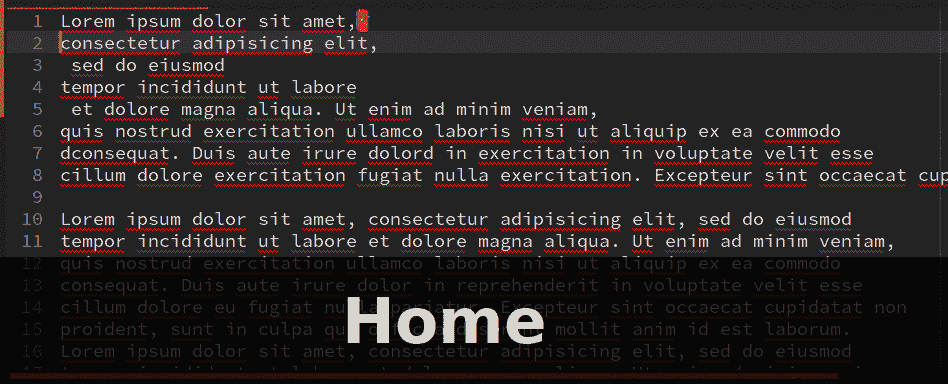

当你的线条很长，不适合视图时，换行很方便。您可以使用命令面板调用它。

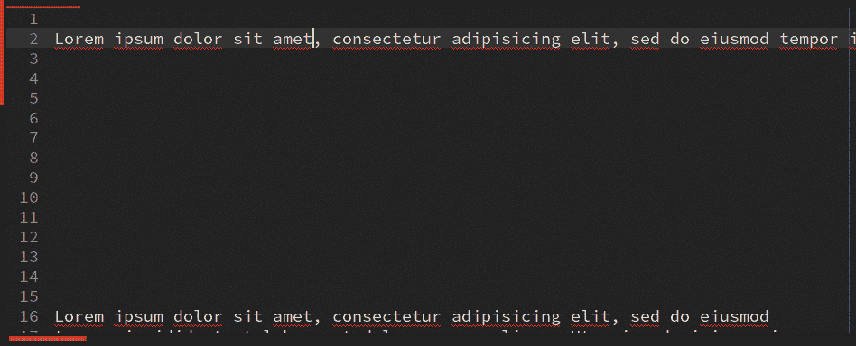

**换行一段**可以用`alt+q`完成。它使用标尺位置来换行。

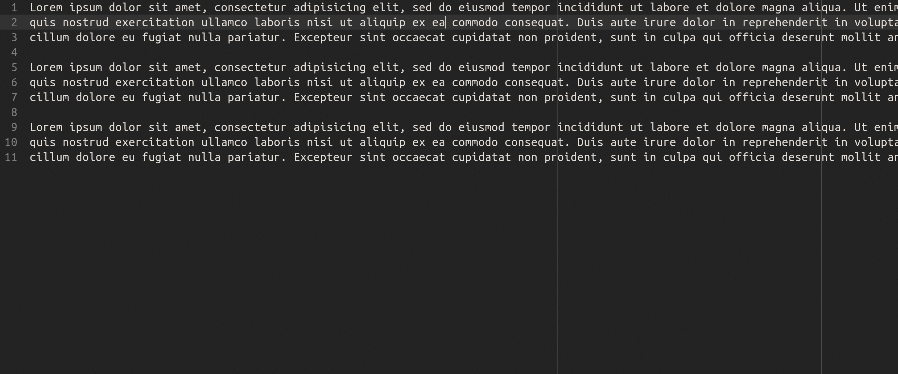

更多有用的操作将在本文的其他部分提到，请继续阅读。

# 使用单词和线条

假设您将光标放在一个单词/行上，并且您想要:

转到下一个/上一个单词:`ctrl+right/left`

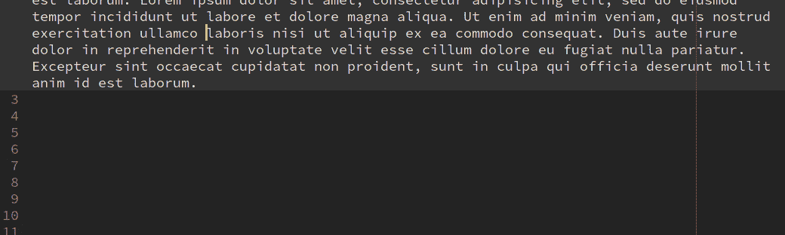

转到匹配括号:`ctrl+m`。如果你不是支架，也是一样。它会将您导航到最近的括号。


选择**当前字**:点击`ctrl+d`。请不要转到单词的结尾/开头做`ctrl+shift+left/right`，那些组合有不同的目的。这不是一个*忍者*会做的事！

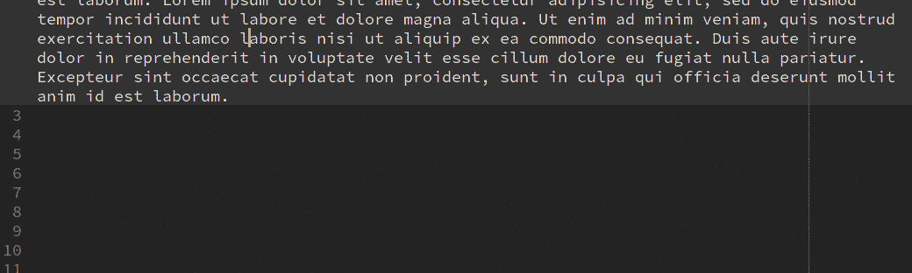

选择下一个/上一个单词:`ctrl+shift+right/left`

删除到**结尾的一个字** : `ctrl+delete`

删除到**开头的一个字** : `ctrl+backspace`

删除到行的**结尾:`ctrl+shift+delete`**

**重复**行:`ctrl+shift+d`

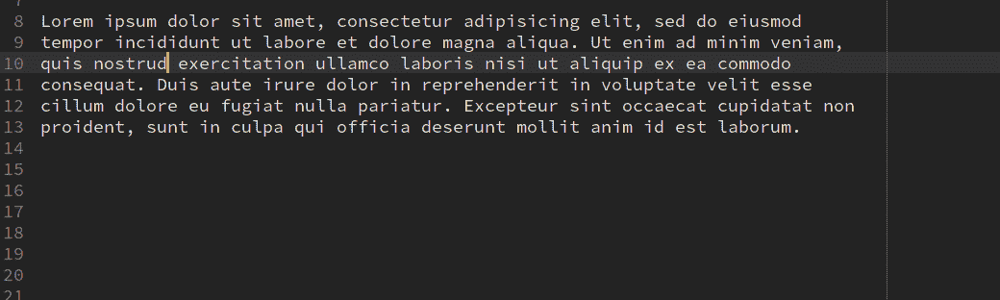

将当前行全部删除:`ctrl+x`

**交换线**向上/向下 **:** `ctrl+shift+up/down`

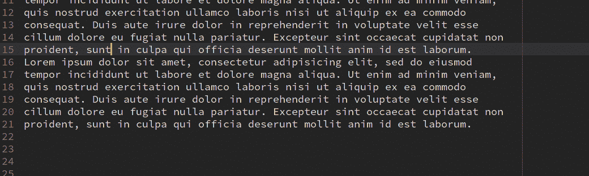

**展开选择:** `ctrl+shift+space`。它以块为单位展开选择，如果您点击它更多次，它会展开更多，直到它选择整个文件。

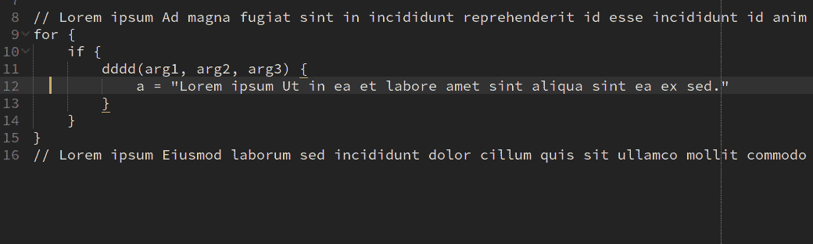

删除一个块:点击`ctrl+shit+space`直到你覆盖了你想要删除的块，然后删除。

左缩进:`ctrl+[`右缩进:`ctrl+]`

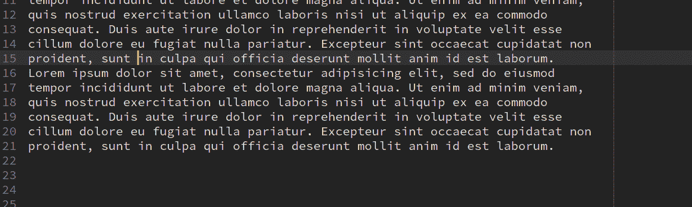

向前和向后跳转(本文中的所有设置):当您在项目中移动时，您总是可以前后跳转到您所在的位置。这对于检查项目很方便。

在 ST3 坚持要完成的地方插入一个标签:`shift+tab`

(编辑 1)当你在 ST3 复制/剪切东西时，它会将它们保存在历史中。如果你这样做了，它会弹出一个历史记录，你可以选择粘贴它。这个超级有用！

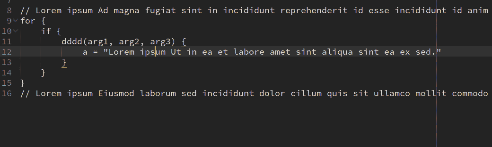

加入线条:`ctrl+j`

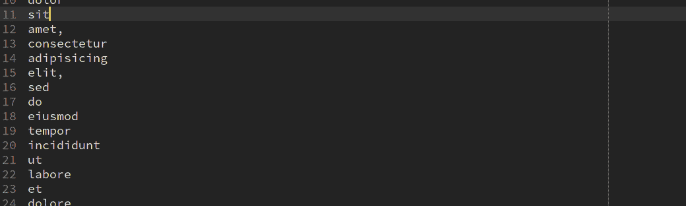

# 项目管理

## 项目

项目包含一系列添加到项目中的文件/文件夹。如果愿意，您可以将多个文件夹添加到一个项目中。在我的`Projects`文件夹中有一个名为`Sublime Text`的文件夹，在那里我保存了我所有的 ST3 项目。我还将它们放入各自的子文件夹中，以管理不同的工作空间。我建议你也这样做，因为如果你有很多项目，它会把整个文件夹弄得乱七八糟。您可以通过调用命令面板中的`Project: Edit`来打开项目设置。这里有一些提示:

```
"folders": [
  {
     "file_exclude_patterns": ["*.test", "*.out"],
     "folder_exclude_patterns": ["tmp"],
   ],
   "path": "/path/to/project/folder",
  }
 ],
```

## 工作区

每个项目可以有多个工作空间。它们与其父项目共享相同的设置，因此当您更改项目设置时，它会应用于其所有工作空间。如果您在处理项目时有不同的布局或不同的关注点，请使用它们。您可以通过选择`Project> Save Workspace As..`菜单将它们保存在保存 ST3 项目的同一个文件夹中。您也可以从`Project`菜单为当前项目创建一个全新的工作空间。

## 快速交换项目

每次你打开/创建项目或工作空间，ST3 都会记录你所做的工作。然后，您可以点击`ctrl+alt+p`在项目或工作区之间轻松导航。

# 便捷的插件

**对齐**对于对齐光标很有用。我已将密钥绑定更改为

```
{ "keys": ["super+a"], "command": "alignment" }
```

制作一个多光标，点击`super+a`对齐它们。它将移动真正方便的文本。你可以在你的文件中创建这样的景象:

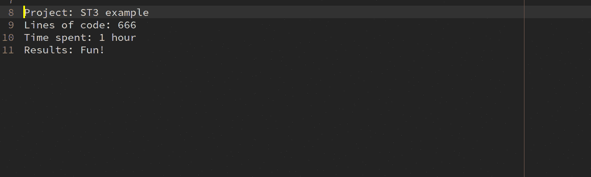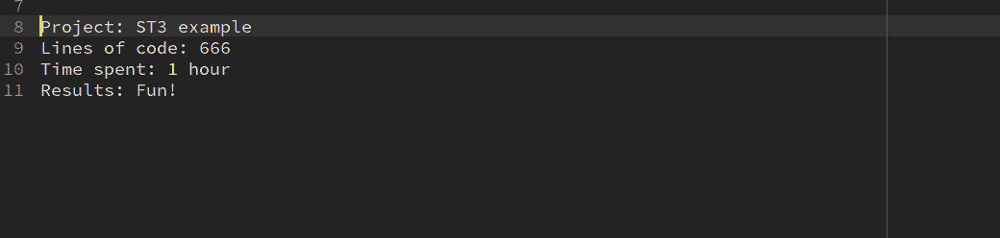

**括号荧光笔**向您显示括号的开始和结束对。我用它来识别我正在工作的模块。

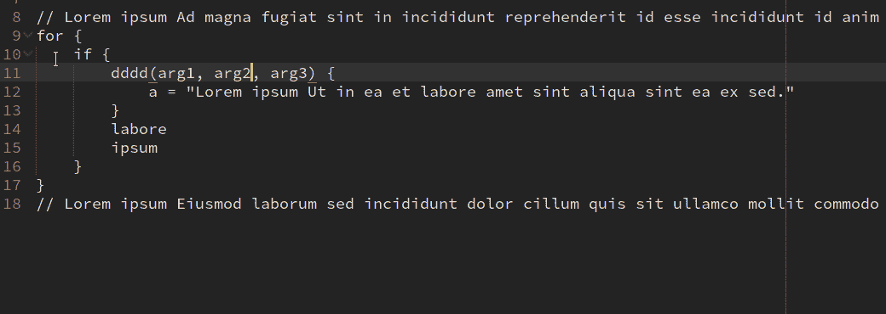

**大小写转换**可以改变单词/字符的大小写。它有以下模式:

*   蛇 _ 案例
*   茶包
*   帕斯卡凯斯
*   点. case
*   仪表板
*   分离单词
*   用正斜杠分隔
*   用反斜杠分隔
*   在 snake_case、camelCase 和 PascalCase 之间切换

**文件重命名**可以更改文件名。我用这个来减少对鼠标的依赖。

**Git 槽**显示槽中的 Git 变化。您还可以查看差异并回滚它们，非常方便。

T21:我一直都在使用它。您可以将光标放在缩进区域(可能是一个括号或一行的开头),然后点击`alt+up/down`跳转到相应的缩进。

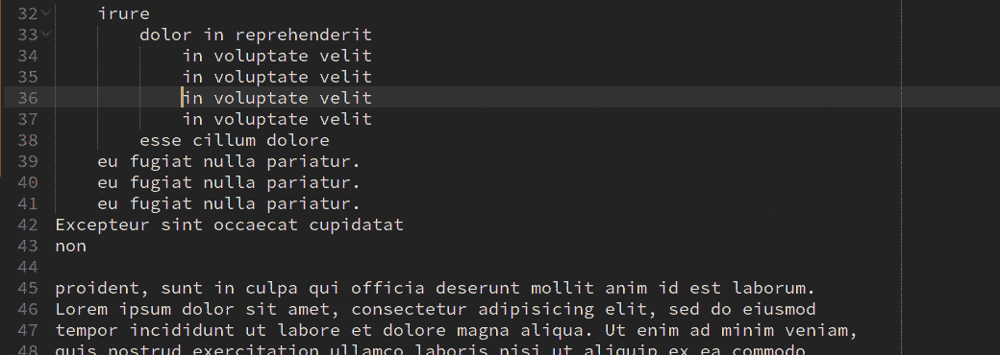

**HaoGist** 是你在 github 上做`gists`必有的一个。只需在你的 github 帐户上生成一个令牌(只有 gist 启用权限)并将其添加到插件中。你再也不需要浏览 gists 网页来寻找你的 gists 了。你也可以载入要点，编辑并保存它。它会自动更新要点。

**MoveTab** 可以像在浏览器中一样移动标签。

**增量选择**在增加数字时很有用。创建一堆光标并键入`0`，然后选择所有这些零并点击`ctrl+alt+i`。它产生一系列递增的数字。你可以用任何数字做种子。

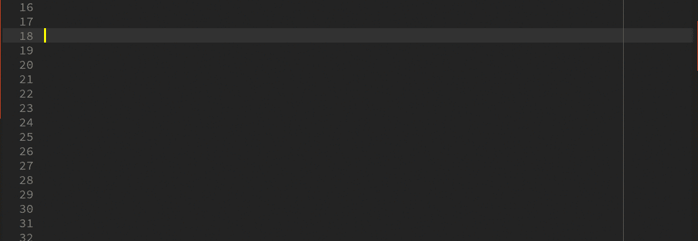

**PlainTasks** 是另一个必须有插件来做待办事项列表。它还跟踪每项花费的时间。它非常简单，安装时会有自己的教程，所以这里不需要解释。

**侧边栏增强**将增强你的侧边栏。确保你安装了这个。

**Sublime 书签**是 Sublime 的书签系统的更好版本。您可以给书签命名，并在命令调板中导航它们。非常方便。

**素材主题**看起来真的很酷，试试吧。

这个令人敬畏的插件为多光标功能增加了一些很酷的功能。例如，您可以编辑单个光标，同时保留 who 多光标状态。您还可以循环浏览光标并编辑它们！前往其页面查看完整描述。

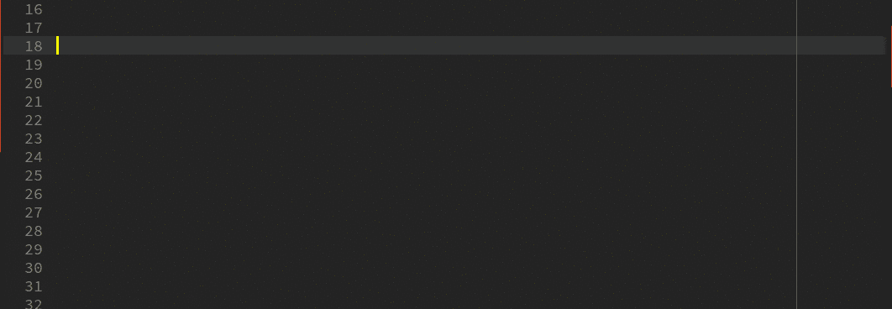

**折纸:我最后提到这个，因为我也想告诉你一个小故事。请阅读这部分，因为我解释了我设置这个非常重要的插件的决定。**

我离不开`tmux`。与 tmux 相比，ST3 处理窗格的方式很原始，在我开始使用折纸之前，我在 ST3 的工作流程有点慢。在使用折纸之前，我很少使用窗格，只依赖 goto。我第一次看到折纸的时候，它让我大吃一惊，但很快我就离开了它，原因如下:

*   快捷方式与我的 tmux 设置不同
*   这让我编码速度变慢了，因为感觉不自然

我的 tmux 前缀是`ctrl+a`，我不能用它来折纸，因为它也是**选择所有**功能。直到我问自己这些问题:

*   我一天中选择了多少次整个文件的内容？
*   全选和拥有更灵活的工作空间哪个有助于提高我的工作效率？

第二个问题的答案很明显，咄！然而，第一个问题的答案非常有趣:一天最多 10 次！

现在是另一个障碍:**我怎样才能让这两者兼得**？以下是我想到的方法，对我来说非常有效，我成了一个更快乐的程序员。我将全选更改为:

```
{ "keys": ["ctrl+a", "ctrl+a"], "command": "select_all" }
```

并且把折纸的所有`ctrl+b`前缀都改成了`ctrl+a`。现在情况是这样的:

*   我的窗格控制/导航与 tmux 的设置完全一样，对我来说感觉非常自然。
*   如果我想选择所有，我做两次`ctrl+a`，为什么不呢？！

问题已解决。

我还禁止创建空窗格，这真的很烦人。这意味着如果你做了一个`ctrl+a right`，它会创建一个空窗格，里面什么也没有，除非你想创建一个新文件，否则这是没有用的。你可以通过`ctrl+a shift+right`创建一个新文件并把它移到一个新的窗格中来实现。在 origami 的用户设置中，我有:

```
"create_new_pane_if_necessary": false,
```

在首选项中，我添加了这个来在最后一个文件关闭时关闭空窗格:

```
"origami_auto_close_empty_panes": true
```

这里有一些折纸的小技巧。我在这里称之为*前缀*，键我已经设置为`ctrl+a`默认为`ctrl+b`。让我们称`up/down/left/right`方向键为方向。例如，这个组合`prefix, ctrl+direction`意味着你点击`ctrl+a`然后点击`ctrl+up`。

*   **前缀，ctrl+方向**在方向上创建窗格。
*   **前缀，ctrl+shift+方向**破坏该方向的窗格。
*   **前缀，方向**行进方向。
*   **前缀，shift+方向**边走边把文件带到方向。
*   **前缀，alt+方向**克隆(在文件上创建一个新视图)，同时将新视图带到方向。
*   **前缀，ctrl+z** 缩放窗格。
*   **前缀，ctrl+shift+z** 取消缩放窗格回到正常。
*   **前缀，ctrl+c** 显示一个输入框，用于输入窗格水平(列)尺寸的比例。我一会儿再解释。
*   **前缀，ctrl+r** 显示一个输入框，输入窗格的垂直(行)尺寸的比例。

尺寸是这样工作的:

*   如果你所在的窗格只有一面(或上面/下面):0.3 意味着你所在的**窗格占据了整个空间的 30%。**
*   如果你在中间的窗格:0.2，0.9 意味着最左边(或顶部)的窗格得到 20%，右边的窗格得到 90%，你得到其余的。

在第一点中，我的意思是，如果你有三个窗格，而你在第一个窗格上，它就像只有两个窗格一样计算百分比，并推动其他窗格腾出空间。

**提示**:你可以在一个文件中制作更多的**视图，并把它们并排放置，以便在文件的不同部分工作，并在窗格中导航，而不是上下跳跃。**

折纸有一个保存布局的概念。您还可以创建布局并保存工作空间。哪一个都行，但我更喜欢保存布局。

现在你可以摆脱侧边栏，享受更多的空间。

## 更改一些设置

我发现这些设置很有用:

```
{
    "bold_folder_labels": true,
    "close_windows_when_empty": true,
    "detect_slow_plugins": false,
    "enable_tab_scrolling": false,
    "ensure_newline_at_eof_on_save": true,
    "fade_fold_buttons": false,
    "font_face": "Inconsolata-g for Powerline",
    "font_options":
    [
        "subpixel_antialias",
        "gray_antialias",
        "directwrite"
    ],
    "font_size": 11,
    "line_padding_bottom": 3,
    "line_padding_top": 3,
    "margin": 0,
    "caret_extra_bottom": 0,
    "caret_extra_top": 0,
    "caret_extra_width": 1,
    "caret_style": "wide",
    "tab_size": 4,
    "spell_check": true,
    "dictionary": "Packages/Language - English/en_GB.dic",
    "file_exclude_patterns":
    [
        "*.sqlite3",
        "*.exe",
        "*.pyc",
        "*.pyo",
        "*.dia"
    ],
    "folder_exclude_patterns":
    [
        ".svn",
        ".git",
        ".gitignore",
        ".hg",
        "CVS",
        "_build",
        "dist",
        "build",
        "site"
    ],
    "highlight_line": true,
    "highlight_modified_tabs": false,
    "indent_guide_options":
    [
        "draw_active"
    ],
    "match_brackets_angle": true,
    "material_theme_accent_orange": true,
    "material_theme_contrast_mode": true,
    "material_theme_small_statusbar": true,
    "material_theme_small_tab": true,
    "material_theme_tabs_autowidth": true,
    "origami_auto_close_empty_panes": true,
    "save_on_focus_lost": false,
    "shift_tab_unindent": false,
    "show_encoding": true,
    "show_line_endings": true,
    "show_tab_close_buttons": true,
    "theme": "Material-Theme-Darker.sublime-theme",
    "translate_tabs_to_spaces": true,
    "trim_trailing_white_space_on_save": true,
    "use_tab_stops": true,
    "word_wrap": "false"
}
```

请注意，file_exclude_patterns 和 folder_exclude_patterns 也在项目设置中，当您在这里设置它时，它会应用到您拥有的每个项目。我已经排除了。git 是因为我不想让 ST3 在我搜索所有东西的时候搜索那些文件。

# 命令

以任何名称和`sublime-command`扩展名创建文件。像这样:`arsham.sublime-command`并把这个加到文件里:

```
[
{"caption": "Open Mouse Settings", "command": "open_file", "args": {"file": "${packages}/User/Default (Linux).sublime-mousemap"}},
]
```

然后调用命令面板，输入`Open Mouse Settings`。它将打开你的鼠标映射文件(我在本文前面提到过)。您可以执行多种命令。事实上，我想让你做一个实验。通过点击`ctrl+``打开`Console Panel`，然后在那里输入:

```
sublime.log_commands(True)
```

在不关闭控制台的情况下，做一些崇高的事情。比如切换*侧边栏。*快捷键是`ctrl+k ctrl+b`。你可以在控制台上看到它说:

```
command: toggle_side_bar
```

现在您知道了命令名，您可以将它添加到您的命令中:

```
{"caption": "Toggle My sidebar please", "command": "toggle_side_bar"}
```

并使用命令面板调用它。去吧，多试几个！

以下是一些有用的命令:

```
{"caption": "Reveal File In SideBar", "command": "reveal_in_side_bar"},
{"caption": "Open Mouse Settings", "command": "open_file", "args": {"file": "${packages}/User/Default (Linux).sublime-mousemap"}},
{"caption": "Open Project", "command": "prompt_open_project_or_workspace"},
{"caption": "Fold Comments", "command": "fold_comments"},
{"caption": "Unfold Comments", "command": "unfold_comments"},
{"caption": "Fold One", "command": "fold_by_level", "args": {"level": 1}},
{"caption": "Fold Two", "command": "fold_by_level", "args": {"level": 2}},
{"caption": "Fold Three", "command": "fold_by_level", "args": {"level": 3}},
{"caption": "Fold Four", "command": "fold_by_level", "args": {"level": 4}},
{"caption": "Fold Five", "command": "fold_by_level", "args": {"level": 5}},
{"caption": "Fold Six", "command": "fold_by_level", "args": {"level": 6}},
{"caption": "Fold Seven", "command": "fold_by_level", "args": {"level": 7}},
{"caption": "Fold Eight", "command": "fold_by_level", "args": {"level": 8}},
{"caption": "Fold Nine", "command": "fold_by_level", "args": {"level": 9}},
```

以下是一些有用的键绑定:

```
{ "keys": ["super+a"], "command": "alignment" },
{ "keys": ["alt+left"], "command": "jump_back" },
{ "keys": ["alt+right"], "command": "jump_forward" },
{ "keys": ["ctrl+0"], "command": "reset_font_size" },
```

如果你有任何改进这篇文章的建议，请在评论中告诉我，谢谢！

# 结论

Sublime Text 3 真的很快，并且有很多功能。当用插件扩展时，它可能是最好的编辑器。请尽量使用键盘，减少对鼠标导航的依赖。

尽情享受吧！

[](http://bit.ly/HackernoonFB)[](https://goo.gl/k7XYbx)[](https://goo.gl/4ofytp)

> [黑客中午](http://bit.ly/Hackernoon)是黑客如何开始他们的下午。我们是 AMI 家庭的一员。我们现在[接受投稿](http://bit.ly/hackernoonsubmission)并乐意[讨论广告&赞助](mailto:partners@amipublications.com)机会。
> 
> 如果你喜欢这个故事，我们推荐你阅读我们的[最新科技故事](http://bit.ly/hackernoonlatestt)和[趋势科技故事](https://hackernoon.com/trending)。直到下一次，不要把世界的现实想当然！

