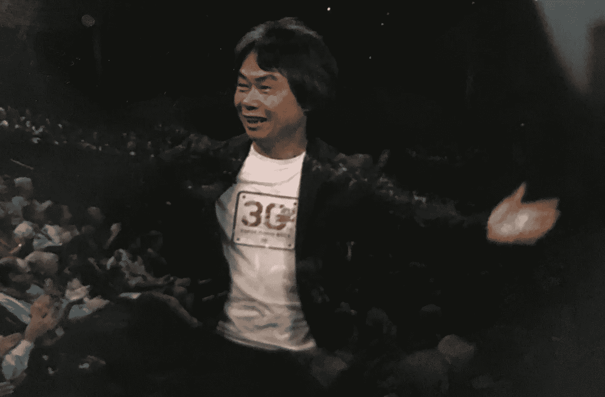
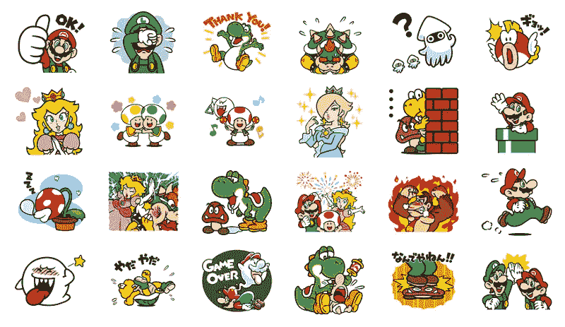
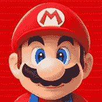
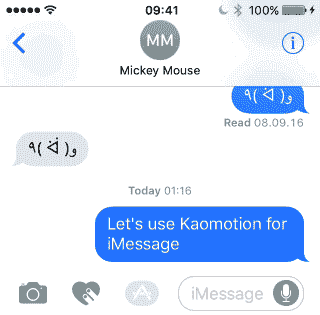

# 超级马里奥贴纸即将登陆 iOS 10 的 iMessage

> 原文：<https://medium.com/hackernoon/super-mario-stickers-coming-to-imessage-on-ios-10-1317ef358b21>

马里奥之父宫本茂刚刚在三藩市登台，宣布一款马里奥游戏将于今年晚些时候登陆 T2 iOS(显然是为了假期)。虽然他们对发布日期的细节知之甚少，但任天堂已经宣布了推出 iOS 的一些小东西:

【iMessage 的马里奥贴纸包。那会是什么样子？

同样，宫本没有透露任何细节，但如果你在韩国或日本的任何地方，你可能会知道任天堂已经在网上发布了一些马里奥贴纸。

因此，在我们等待 iOS 版《马里奥》下架的时候，这里有一些值得期待的东西:

这一切都是有道理的，任天堂开始秘密宣传他们即将在 iOS 上的重生，而苹果则确保其 iMessage 贴纸平台在正确的目标群体中获得一些真正的可见性。我对这个被忽视的平台即将发生的变化充满希望和好奇。

对于所有不能等待游戏发布的人，任天堂在它的[超级马里奥 Run 登陆页面](https://itunes.apple.com/us/app/super-mario-run/id1145275343?mt=8)增加了一个通知按钮。对于每个对实际游戏的更多细节感兴趣的人来说，这里有一个《时代》在节目结束后对宫本进行的[有见地的采访](http://time.com/4482878/super-mario-run-apple-iphone-shigeru-miytamoto/)。我们迫不及待地想在你附近的任何 iPhones 上看到你，马里奥。

所有 img 的学分/版权在 2016 年 9 月 7 日的苹果特别活动直播流上要么给 Line/任天堂，要么给苹果。

如果你喜欢这篇文章，我相信你会喜欢我的所有者贴纸包 kaomotion。下面看看它是如何工作的，在 App Store 这里找到:[*iMessage 的 Kaomotion。*](https://itunes.apple.com/app/id1148389257)

Kaomotion stickers for iMessage

> [黑客中午](http://bit.ly/Hackernoon)是黑客如何开始他们的下午。我们是 T21 家庭的一员。我们现在[接受投稿](http://bit.ly/hackernoonsubmission)并乐意[讨论广告&赞助](mailto:partners@amipublications.com)机会。
> 
> 如果你喜欢这个故事，我们推荐你阅读我们的[最新科技故事](http://bit.ly/hackernoonlatestt)和[趋势科技故事](https://hackernoon.com/trending)。直到下一次，不要把世界的现实想当然！

