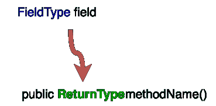
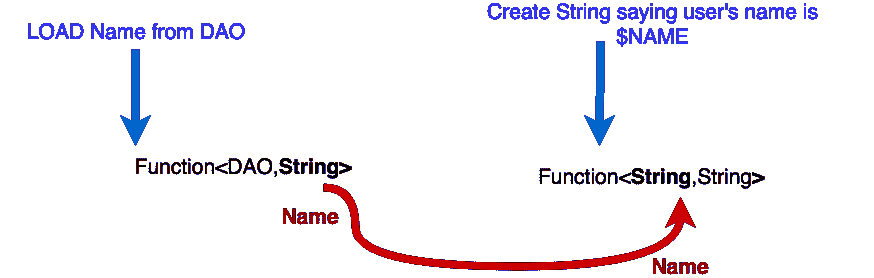
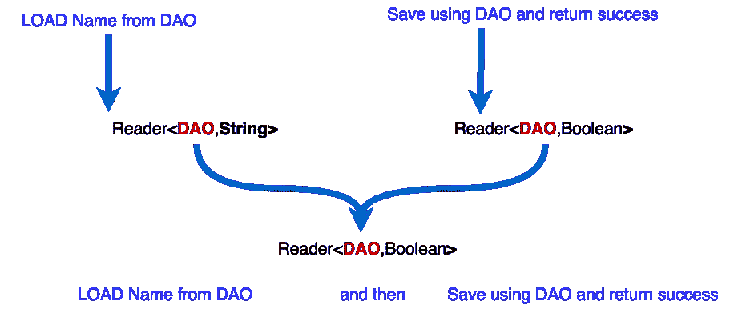
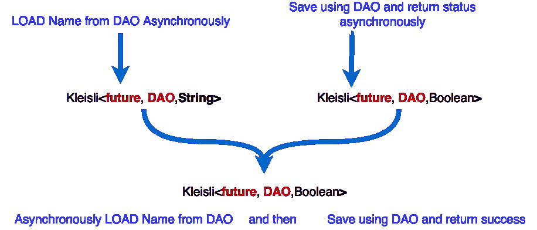

# Java 中依赖注入的函数式方法

> 原文：<https://medium.com/hackernoon/superkleisliisfantasticframeworksareatrocious-a-functional-approach-to-dependency-injection-in-e7bc8c4993fa>

## superkleisliisfantiaticframeworksareatrocious

通常在 [Java](https://hackernoon.com/tagged/java) 中，我们使用在运行时解决依赖关系的框架，这通常会导致很难跟踪部署中的错误。一个功能性更强的替代方法是稍微改变我们程序的结构，这样就可以以一种类型安全的方式惰性地注入依赖项。编译器而不是运行时将为我们识别和捕捉错误。让我们从一个问题开始:

# 我们如何转换方法的签名，以便将输入参数转移到返回类型？


给定下面的 Java 方法签名，我们是否可以重构代码，使 DAO 成为返回类型的一部分，而不是方法参数？

```
**public** String loadName(DAO dao, long id);
```

想象一下，如果我们的 loadName 方法实现如下

```
**public** String loadName(DAO dao, long id){
   return  dao.loadRecord(id)
              .getName();} 
```

## 一种解决方案是返回一个函数。


如果我们要返回一个函数而不是一个字符串，我们可以将道安输入到该函数中，并将其作为方法参数移除。

```
**public** Function<DAO,String> loadName(long id);
```

现在我们将急切的实现切换到懒惰的实现。

```
**public** Function<DAO,String> loadName(long id){ 
    return dao ->  dao.loadRecord(id)
                      .getName();
}
```

为了实际加载用户名，我们需要传入一个 DAO 实例。

```
String name = loadName(10l).apply(dao);
```

## 惰性依赖注入

在上面的例子中，当调用 loadName 时，我们已经移除了对拥有 DAO 的硬性依赖。正如我们将在本文的其余部分看到的，可以将函数调用链接在一起，使用加载的名称，并且只在代码中我们手头有依赖项的地方提供依赖项(DAO)。

正如我们可以延迟解决方法调用中注入的依赖关系一样，我们可以使用函数来延迟我们可能存储为字段的对象的注入。



转换上面的对象以返回注入 FieldType 的函数，看起来与前面执行的方法级重构非常相似。


# 构成函数

到目前为止，我们已经定义了一种方法，通过这种方法，我们可以在一个方法调用深度中惰性地注入一个依赖项。当我们调用 loadName 时，我们接收到一个函数，通过执行这个函数，我们可以访问这个名字。


Photo by [Jakob Owens](https://unsplash.com/photos/n5wwck8ES4w?utm_source=unsplash&utm_medium=referral&utm_content=creditCopyText) on [Unsplash](https://unsplash.com/?utm_source=unsplash&utm_medium=referral&utm_content=creditCopyText)

不执行函数而处理返回的名字是可能的，但是有点复杂。我们可以对返回的函数进行链式操作。

要使用该方法的早期版本构建包含用户名的字符串，我们可以编写

```
publicString loadName(DAO dao, long id);String userData = "User's name is " + **loadName**(dao,10l);
```

但是对于懒惰版本，我们需要使用函数的**和**方法

```
publicFunction<DAO,String> loadName(long id);**loadName**(10l).**andThen**(name->"User's name is "+ name);Function<DAO,String> sentence = **loadName**(10l).**andThen**(name->"User's name is "+ name);System.out.println(sentence.apply(dao));
```



当一个函数的输出类型与另一个函数的输入类型匹配时，我们可以使用 and 将它们链接在一起。

## 链接方法调用

然后允许我们将函数调用链接在一起，但是要链接返回函数的方法，我们需要更强大的东西。

```
publicFunction<DAO,String> loadName(long id);
publicFunction<DAO,Boolean> updateName(long id, String name);
```

使用 and，我们将得到一个嵌套的数据结构(返回函数的函数)。

```
**Function**<DAO,**Function**<DAO,Boolean>> fn = loadName(10).andThen(s->updateName(10,+” -suffix”));
```

为了调用我们的函数，我们需要应用我们的 DAO 两次

```
System.out.println(fn.apply(dao).apply(dao));
```

## Reader Monad:嵌套数据结构的一种有用模式

单子是函数式[编程](https://hackernoon.com/tagged/programming)中处理嵌套数据结构的一种非常有用的模式。这是他们擅长的事情。例如，我们可以在 Optional 的操作链中合并对返回 Optional 的方法的调用，结果仍然有一个很好的未嵌套的单个 Optional。flatMap 运算符将嵌套的选项展平成一个可选的。

虽然我们可以手动展开函数调用，这样它们就不会嵌套，但是函数有一个单子——读取器单子。

```
**Function**<DAO,Boolean> fn = dao->updateName(10,loadName(dao)+" -suffix"));
```

Reader Monad 允许我们使用 flatMap 和 Map(就像 Streams 和 Optional 一样)来代替。要从使用函数切换到读取器，只需将函数替换为读取器作为返回类型。([阅读器](https://static.javadoc.io/com.aol.simplereact/cyclops-react/2.1.0/cyclops/control/Reader.html)通常被实现为扩展功能)

```
public **Reader**<**DAO**,String> loadName(long id);
public **Reader**<**DAO**,Boolean> updateName(long id, String name);Reader<**DAO**,Boolean>  r= loadName(10).flatMap(s->updateName(10,s));
```

当直接构造函数时，输出类型应该映射到输入类型，当使用读取器单子构造方法调用时，更重要的是返回的读取器的输入类型是相同的。在平面映射/映射操作期间，输出类型作为参数提供。



composition of returned Readers all accept DAO

## 为了理解

一旦我们开始将许多方法调用链接在一起，嵌套的平面图和映射会变得有点笨拙。为了便于理解，使用 a 来构造我们的调用可以帮助我们保持代码更加整洁。让我们介绍一种记录成功和失败的新方法

```
publicbooleanlogIfFail(longid, String name, booleansuccess);
```

将调用链接到此方法会导致更复杂的表达式

```
 Reader<DAO,Boolean>  r= loadName(10).**flatMap**(s->updateName(10,s)

                            .map(success->logIfFail(10,s,success));
```

为了便于理解，我们可以用 a 来简化事情

当在链的更上游引入另一个方法调用时，我们可以看到 for comprehensions 的真正好处，没有 for comprehensions，事情会变得非常混乱。

```
public Reader<DAO,Long> findNextId();
```

我们的调用序列可能会变成

```
Reader<DAO,Boolean>  r= findNextId().flatMap(id->loadName(id).flatMap(s->updateName(10,s)

.map(success->logIfFail(10,s,success)));
```

当为了理解而表达时，看起来更清晰

太棒了，所以现在我们可以延迟像 DAO 这样的关键依赖项的注入，让我们的方法返回 Reader Monads，它将懒洋洋地接受我们的 DAO，并使用 for comprehensions 将它们链接在一起。为了执行我们的函数链，我们可以将 DAO 传递给我们的读者，我们链接在一起的所有方法都将执行。

```
boolean success = updateName.apply(dao);
```

## 异步读取器=复杂类型签名！

但是当我们有返回其他单子类型的方法时会发生什么呢？读写远程存储是 IO 绑定的操作，也许我们的方法应该利用未来？我们的类型签名要变得混乱了！

```
public **Reader**<DAO,**Future**<Long>> findNextId();
public **Reader**<DAO,**Future**<String>> loadName(long id);
public **Reader**<DAO,**Future**<Boolean>> updateName(long id, String name);
public **Reader<Future<**Boolean**>>** logIfFail(longid, String name, booleansuccess);
```

即使对于将 loadName、updateName 和 logIfFail 链接在一起的稍微简单的用例，我们的 for 理解也变得非常复杂！

# 克莱斯利来救援了

Kleisli 是一个返回一元类型的函数。它一般可以表示一个函数，返回一个未来的、流的、可选的或任何其他的 Java 中的单子类型。与 Reader 非常相似，我们也可以为它定义 map 和 flatMap 方法。神奇的是，尽管下面两种类型是等价的，但使用 kleisli 比使用 reader 要简单得多。

```
**Reader**<DAO,Future<Long>> reader;
**Kleisli**<future,DAO,Long> kleisli;
```

让我们重写我们的方法来返回 Kleisli

```
public **Kleisli**<**future**,DAO,Long> findNextId();
public **Kleisli**<**future**,DAO,String> loadName(long id);
public **Kleisli**<**future**,DAO,Boolean> updateName(long id, String name);
public **Future<**Boolean**>** logIfFail(longid, String name, booleansuccess);
```

我们可以使用 flatMap 和 Map 通过 Kleisli 将方法调用链接在一起，但是与我们之前的例子不同的是，我们现在有了依赖项的延迟注入和异步执行。

```
**Kleisli**<**future**,DAO,Boolean>  k= loadName(10).flatMapK(s->updateName(10,s));
```

当编写返回读取器实例的方法调用时，我们必须保持输入类型(注入的依赖)不变。当组合返回 Kleisli 实例的方法调用时，我们需要保持 monad 类型和输入类型相同。



## 链接加载和保存操作

在 Debashish Gosh 令人敬畏的[功能和反应域建模](https://www.manning.com/books/functional-and-reactive-domain-modeling)中，他展示了如何使用 Kleisli 在 Scala 的一个方法中链接异步调用来贷记和借记一个帐户。我们可以在 Java 中使用同样的技术。

如果我们根据 Kleisli 定义异步加载和保存方法

一个处理方法可以通过平面映射 Kleisli 调用来利用这些来加载、转换和保存数据。

调用 process 会产生一个 Kleisli 实例，它负责加载、转换和保存，但不执行它。我们通过调用 apply(并传入一个 DAO 实现)来执行方法链，当我们这样做时，我们的代码将异步执行。

## 更干净的代码

有了 Kleisli，我们可以回过头来重构我们的代码，搜索下一个用户 Id，修改和更新用户名以使用 Kleisli 进行理解(在 cyclops-react 2.2.0 中)

## 许多受支持的 Java Monad 类型

> 创作所有的东西

cyclops 集成模块为 [Vavr](https://github.com/aol/cyclops/tree/master/cyclops-vavr) 、 [Functional Java](https://github.com/aol/cyclops/tree/master/cyclops-functionaljava) 、 [RxJava](https://github.com/aol/cyclops/tree/master/cyclops-rx) 、 [RxJava 2](https://github.com/aol/cyclops/tree/master/cyclops-rxjava2) 、 [Reactor](https://github.com/aol/cyclops/tree/master/cyclops-reactor) 、 [JDK /cyclops-react](https://github.com/aol/cyclops-react) 甚至[番石榴](https://github.com/aol/cyclops/tree/master/cyclops-guava)类型提供了更高级的编码。

下面显示了受支持类型的一个小示例

## 基于 AnyM 的等价

[cyclops-react 提供了一个强大的抽象 AnyM](/@johnmcclean/a-type-safe-java-monad-api-part-i-with-vavrs-future-and-try-7beaea28d351) 来处理常见的 monad 类型，并提供了 KleisliM，它是通过 AnyM 处理 monad 时的 Kleisli 等价物。

## 类型安全惰性依赖注入和异步执行


Kleisli 为类型安全依赖注入提供了一个非常强大的机制。与传统的 Java 依赖注入技术不同，我们不会因为未实现的依赖关系(或循环定义的依赖)而出现运行时错误。更重要的是，我们能够在不依赖于运行时 AOP 或代理对象的情况下将懒惰的异步效果链接在一起，更多种类的错误将由编译器而不是运行时来检测。