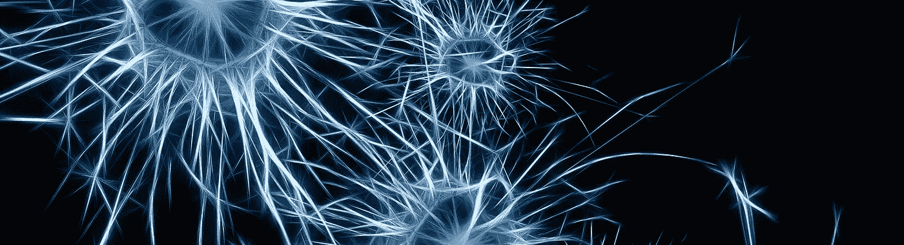

# 面向新手的深度学习[第一部分]

> 原文：<https://medium.com/hackernoon/supervised-deep-learning-in-image-classification-for-noobs-part-1-9f831b6d430d>

深度学习已经兴起一段时间了。最近人们已经开始在许多领域使用深度学习。如果你想直接进入代码，那么进入第二部分。

在本系列中，您将学习解决一个简单的问题，即检测图像中的单个对象(如猫或狗)。在这个解决方案的过程中，您将了解一种深度学习。您还将能够在 Keras 和 Tensorflow 中编码，这是该技术中两个著名的库。我不打算谈论深度学习背后的数学。该系列有两部分。第一部分讲述了深度学习的基础和陷阱。在这个系列的第二部分，我们将看看如何在 Keras 中创建你自己的模型。

在我们开始之前，我先自我介绍一下。本人计算机科学 Engg，目前工作@ Practo。早先我在脸书平台*(以前是个东西)*上做过游戏，后来又做过手机游戏。

> 那么什么是深度学习呢？为什么叫深？系统实际上是在学习吗？

让我们从一点历史开始。深度学习是神经网络的最新酷词，它们从 60 年代就已经出现了。如果你不知道什么是神经网络，那么不要打扰，我将在本文的后面部分解释。大约在 2006 年，一个叫做*的聪明人 Geoffrey Hinton* 和其他人一起完成了一篇论文。那篇论文对一种类型的神经网络进行了有趣的实现。2012 年，Hinton 的两名学生以两倍于最接近的竞争对手的优势赢得了一场比赛(ILSVRC)。这向全世界表明，辛顿的工作可以解决非常有趣的问题。

我们正在努力解决**图像分类**这个问题。通过*分类*我们试图做的是拍摄一幅图像，并试图理解该图像中的内容。当前的范围限制了该解决方案在只有一种类型的对象的图像上工作。图像要么是一只猫，要么是一只狗。为了简单起见，我们目前不打算对有一只狗坐在车里的图像进行分类。

在神经网络中，有 n 个神经元，它们以线性方式相互连接。一个输入图像从输入端通过，网络决定作为输出的类别。训练一个网络意味着传递大量不同类别的图像作为输入。这些图像中的每一个都已经被标记到一个类中。

Basic figure depicting cross section of a Convolutional Neural Network

神经网络是一个简单的数学公式，看起来像这样:

> x * w = y

假设 *x* 是你的输入图像， *y* 是网络定义的类的输出。 *x* 是常数，因为只有一组固定的图像。网络给出 *y* 作为输出。我们只能换 *w* 。我们称 *w* 为单个神经元层的权重。训练过程由两部分组成，正向传递和反向传播。在前向传递中，我们将图像作为输入( *x* )提供给网络，网络生成一些*y’*输出类。y '和 y 的接近程度就是网络的误差。在反向传播中，网络试图通过调整权重来减小误差。很多行话把 *w* 叫做超参数，内核，过滤器。神经网络的问题在于所有层都将整个数据从一层传递到另一层。为了解决这个问题，我们将使用卷积神经网络。那么什么是卷积呢？让我们看看下面。

# 卷积层

Convolution Layer

神经网络是完全连接的，这意味着一个神经元层会将整个数据集传递给下一层。下一层将处理整个数据，等等。这适用于 8x8 甚至 36x36 的简单图像。但是实际图像的大小是 1024x768，这就变成了一个巨大的计算任务。图像本质上通常是静止的。这意味着图像的一部分的统计数据与任何其他部分相同。因此，在一个区域学习的特征可以在另一个区域进行类似的模式匹配。在一个大图像中，我们取一个小截面，并将其穿过大图像中的所有点。当经过任何一点时，我们将它们卷积或合并成一个位置。相反，试着想象一个大盒子的数据变成了下一层神经元的小盒子的数据。这有助于在不损失数据精度的情况下加快计算。通过大图像的每一小部分图像转换成一个小过滤器。稍后根据反向传播数据配置滤波器(我们稍后会谈到这一点)。

# 汇集层

接下来是共用。池只不过是图像的下采样。它再次帮助处理器更快地处理事情。有许多汇集技术。一个是最大池，我们取一个片段的最大像素值。平均池，平均池也完成了。我们不计算最大像素，而是计算平均值。汇集使得网络在形状、大小和比例上的平移不变。最大池通常占主导地位。

A simple example of Max Pooling, where we are taking the largest pixel value in each coloured square.

# 活化层

单个神经元表现为线性分类器。神经元有能力根据输入数据的某些连续部分打开或关闭。我们称神经元的这种特性为激活。激活函数是数学函数，其行为非常像阀门。假设有一个阀门，当有足够的压力时，它就会像高压锅一样打开。使激活函数变为真的数据将神经元标记为活动的。我们根据网络中所有神经元被激活的情况对图像进行分类。激活函数有很多，但 ReLu 是其中最著名的。为什么选择 ReLu 超出了本文的范围。我将很快写另一篇文章，讨论不同的激活功能。

# 反向传播

反向传播是我们试图降低误差的过程。我说的错误是指 *y* 和*y’的差异。*这将帮助 *w* 适应我们给网络的数据集。我们使用梯度下降过程执行反向传播。这个过程试图使误差值接近零。

# 下一步是什么？

以上文献对于开始研究应用的# CNNs 已经足够了。当您陷入实现阶段时，您可以阅读关于该特定主题的更多信息。请将问题留在评论区，我会一一解答。这就把我们带到了这个系列的这一部分的结尾。本文的第二部分已经完成，你可以找到下面的链接。

你可以在这个[链接](/@debarko/deep-learning-for-noobs-part-2-43d5098e61f6#.csd7uhg52)找到这个系列的第二部分。请在 twitter 上关注我，你也可以注册一个由我维护的小而不常见的邮件列表。如果你喜欢这篇文章，请点击❤按钮推荐它。这将有助于其他媒体用户找到它。

> [黑客中午](http://bit.ly/Hackernoon)是黑客如何开始他们的下午。我们是 AMI 家庭的一员。我们现在[接受投稿](http://bit.ly/hackernoonsubmission)并乐意[讨论广告&赞助](mailto:partners@amipublications.com)机会。
> 
> 如果你喜欢这个故事，我们推荐你阅读我们的[最新科技故事](http://bit.ly/hackernoonlatestt)和[趋势科技故事](https://hackernoon.com/trending)。直到下一次，不要把世界的现实想当然！

