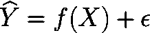
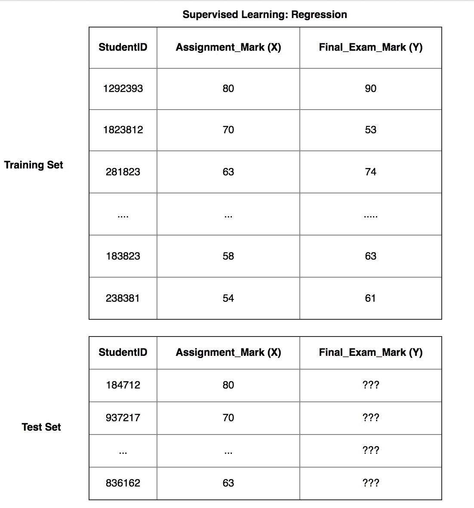
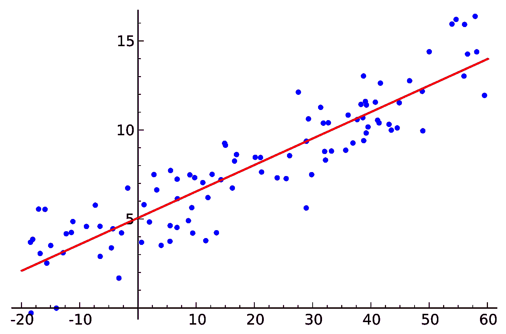
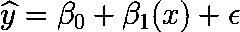
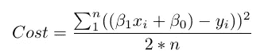
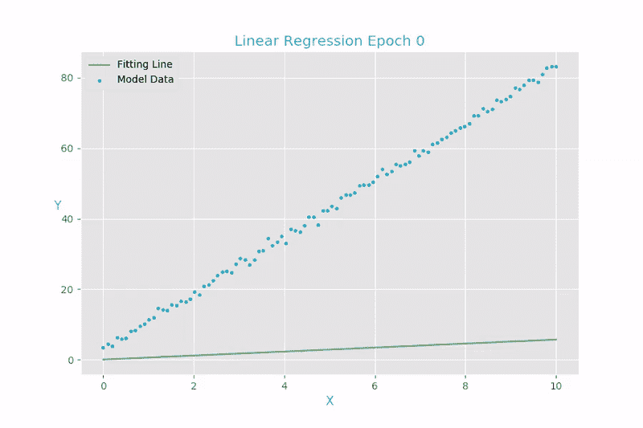
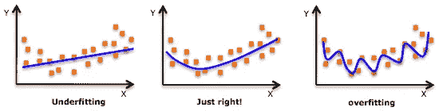
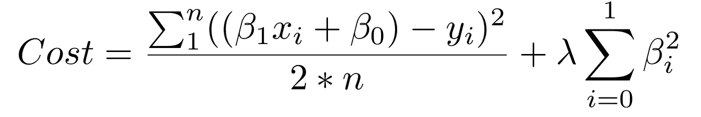

# 无监督机器学习 Python 中的线性回归

> 原文：<https://medium.com/hackernoon/supervised-machine-learning-linear-regression-in-python-541a5d8141ce>


[Source/CCo](https://deathtothestockphoto.com/)

```
**Update [17/11/17]:** The full implementation of Supervised Linear Regression can be [found here](https://github.com/Chippasaur/Supervised-Learning-Linear-Regression).
```

# 介绍

最近，[机器学习](https://hackernoon.com/tagged/machine-learning)的概念在某种程度上已经成为一种时尚，从小型初创企业到大型企业的公司都在大声疾呼，希望通过引用、集成复杂的自动化和预测分析来实现技术支持。

这导致了一种印象，即机器学习非常模糊，集成系统超出了普通公众的理解范围。这与事实相去甚远。相反，我认为机器学习更倾向于计算统计领域，而不是一些神秘的黑盒，在黑盒中，有人挥动魔杖，咒语，就能够变戏法般地做出一些神奇的预测。

# 动机

*这个系列的动机是让任何对机器学习领域感兴趣的人都能够* [*开发*](https://hackernoon.com/tagged/develop) *，理解并实现自己的机器学习算法。*

这将是我计划写的一系列文章的第一篇；我希望你喜欢。

在我们开始之前，有几个重要的术语:

*   **自变量(特征):**自变量是被操纵来决定因变量的值的变量。简单地说，它们是我们想要用来预测 y 的某个给定值的特征。它也可以被称为解释变量
*   **因变量(目标):**因变量依赖于自变量的值。简单地说，这就是我们试图预测的特征。这通常也被称为响应变量。

# 简单和多元线性回归

你受教育的预期收入是多少？根据你以前的分数，期末考试的预期成绩是多少？你赢得梦中女孩芳心的机会有多大(我开玩笑的)

尽管如此，线性回归是统计学和机器学习中可用的最强大的工具之一，可用于预测给定一组**特性或特征(X)** 的某个**值(Y)** 。

鉴于它是如此强大的工具，对于对数据科学和机器学习领域感兴趣的个人来说，这是一个很好的起点来了解，*“机器如何学习进行预测”。*

为了说明线性回归是如何工作的，我们可以研究一下学生在大学时面临的一个普遍问题。根据我以前的成绩，我期望的期末考试分数是多少？这个问题在数学上可以定义为我们的**自变量(X)** 和对应的**期末考试分数(Y)** 之间的某个函数。



```
**X (input)** = Assignment Results
**Y (output)** = Final Exam Mark
**f =** function which describes the relationship between X and Y
**e (epsilon)** = Random error term (positive or negative) with a mean zero (there are move assumptions for our residuals, however we won't be covering them)
```

根据经验，你可能会得出这样的结论，“如果我的作业分数是 73%，那么我的期末考试分数通常是 1.1x，大约是 80.3%”。虽然这可能是真的，但这种近似方法相当不正统，并且缺乏准确性，因为我们人类在我们的近似中隐含着偏见。此外，随着我们增加更多的独立变量，这变得越来越难以预测。

另一方面，当提供一组逻辑序列时，计算机被优化为表现非常好，因为与人类相比，它们不会遭受偏见。而且计算机在精度和计算速度上都更高效；我们可以利用计算机来预测我们想要了解的特征。

对于我们的例子，我们将使用一个监督的“训练和测试”集来预测学生的预期期末考试成绩。我们将通过将数据集分成训练集和测试集来实现这一点。训练集的目的是使机器能够学习学生的作业结果和他们各自的期末考试分数之间的关系。这样，我们就可以使用学习过的函数来估计学生的期末考试成绩，并将其应用于我们的未标记测试集，以预测学生的预期期末考试分数。



```
**Regression****Y = f(X) + e,** where X = (X1, x2...Xn)**Training:** Machine learns (fits) f from labelled training set**Test:** Machine predicts Y from unlabeled test set***Note:*** f(x) can be derived through matrices to perform least square linear regression. However this beyond the scope of this tutorial, if you'd like to learn how to derive regression lines [here is a good link](https://www.youtube.com/watch?v=Qa_FI92_qo8) . Also, X can be a tensor with any number of dimensions. A 1D tensor is a vector (1 row, many columns), 2D tensor is a matrix (many rows, many columns), and higher dimensional tensor.
```

为了简单起见，我们将只使用一个独立变量(赋值)来预测我们估计的期末考试分数，它是一个 **2D 张量**。

# 线性回归(普通最小二乘法)

> 如何通过画直线来预测未来？是的，这算机器学习。

普通最小二乘回归(OLS)的目标是学习一个线性模型(线)，我们可以用它来预测 **(Y)** ，同时试图减少误差(误差项)。通过减少误差项，我们反过来增加了预测的准确性。从而改善我们的学习功能。



Source: [Wikipedia ’Linear Regression’](https://commons.wikimedia.org/wiki/File:Linear_regression.svg)

因为线性回归是一种参数方法:样本数据来自一个总体，该总体遵循基于一组固定参数的概率分布。因此，关于与 X 和 Y 相关的函数的形式，必须满足各种假设——参见附加注释中的进一步阅读。我们的模型将是一个给定特定 x 预测 y-hat 的函数:



This can be interpreted as, for a one unit increase in X, holding all else constant, Y increases *β1*

## 解释

***β0* :** 为 x = 0 时的 y 截距。即当你的作业成绩为 0 时，你预测的期末考试分数是 Y 截距( *β0 )*

***β1* :** 是我们这条线的斜率。也就是说，你的作业分数每增加一个单位，我们的期末考试分数就会增加多少。

提醒一下，我们的目标是学习使我们的误差项最小化的模型参数，从而增加我们的模型预测的准确性。

> 要找到最佳模型参数:
> 
> 1.定义一个成本函数，或损失函数，衡量我们的模型预测有多不准确。
> 
> 2.找到使损失最小化的参数，即尽可能使我们的模型精确。

从图形上看，这可以用笛卡尔平面来表示，因为我们的模型是二维的。这会变成一个三维的平面，等等…


Where Y is our Final Exam Mark, and X is our Assignment Mark

> **维度注意:**为了简单起见，我们的示例是二维的，但是这是不现实的，通常您的模型中会有更多的特征(x)和系数，因为通常您会有不止一个特征对解释您的因变量有重要意义。此外，线性回归深受 [**维数灾难**](https://stats.stackexchange.com/questions/169156/explain-curse-of-dimensionality-to-a-child) 之苦，因为一旦我们处理高维空间，每个数据点都会变成离群值。

## 价值函数

一开始，成本函数的公式可能会让您望而生畏。但是，理解起来极其简单直观。



Cost Function (Error Term) of our linear model

简单地说，成本函数表示取每个真实数据点 **(y)** 和我们的模型预测**(ŷ)**之间的差，求差的平方以避免负数，并惩罚较大的差。最后相加，取平均值。除了不是除以 n，而是除以 2*n，这是因为数学家认为这样更容易推导。你可以把这个带到数学法庭去。然而，为了简单起见，请记住我们取 2*n。

对于二维的问题，我们可以简单地推导出使损失函数最小化的最佳β参数。然而，随着模型变得越来越复杂，计算每个变量的 beta 参数变得不再可行。因此，我们需要一种叫做**梯度下降**的方法来最小化我们的损失函数。

# 梯度下降:学习我们的参数


[Source: Youtube](https://www.youtube.com/watch?v=riplXsNf_zs) [Mwamba Capital](https://www.youtube.com/channel/UClR00RTNrUcjr3l36kyTzgA)

> 想象你站在一座山上的某个地方**(A 点)**。你想尽可能快地降到最低，所以你决定采取以下步骤:
> 
> -你检查你现在的高度，你的高度向北一步，向南一步，向东一步，向西一步。利用这一点，你弄清楚你应该朝哪个方向走，以便在这一步中尽可能降低你的高度。
> 
> —重复，直到踏向任何方向都会使你再次上升**(B 点)**。
> 
> 这是梯度下降

目前，梯度下降是用于参数优化的最流行的方法之一。它经常与神经网络一起使用，我们将在后面介绍。尽管如此，理解*做什么*，以及*如何工作*是很重要的。

梯度下降的目标是通过迭代获得越来越好的近似来找到我们的模型的成本函数的最小点。这是通过迭代实现的，在地面最陡峭的方向上移动，直到向任何方向移动都会使你再次上升。



[Source: PyData](http://songhuiming.github.io/pages/2017/05/13/gradient-descent-in-solving-linear-regression-and-logistic-regression/)

看看我们在回归中看到的损失函数:


我们看到这其实是两个变量的函数: *β0* 和 *β1* 。所有其余的变量都是确定的，因为 X、Y 和 N 是在训练期间给定的。因此，我们想尽量减少这种功能。


Source: [Github Alykhan Tejani](https://alykhantejani.github.io/a-brief-introduction-to-gradient-descent/)

函数为( *β0* ， *β1* ) = *z* 。为了开始梯度下降，我们首先猜测使函数最小化的参数 B0 和 B1。

接下来，我们求损失函数关于每个β参数的偏导数:[ *dz* /d *β0* ， *dz* /d *β1* 。偏导数表示如果稍微增加 *β0* 或 *β1* ，总损失增加或减少了多少。如果 *dz* /d *β1* 的偏导数是负数，那么增加 *β1* 是好的，因为这将减少我们的总损失。如果是正数，你要减少 *β1* 。*如果它是零，我们不改变β1，因为这意味着我们已经达到最优。*

我们这样做，直到我们到达底部，即算法收敛并且损失已经最小化。

# 过度拟合

> **过度拟合:**“夏洛克，你对刚才发生的事情的解释太针对具体情况了”。“不要把事情弄得太复杂，夏洛克。”你多说一个字我就揍你一顿。**超参数( *λ* )** :“这是我每多一个字就揍你一拳的力量”[归功于 Vishal Maini](/@v_maini)

当经过训练的模型在模型学习的训练数据上表现得太好，但在测试数据上不能很好地概括时，就会发生过度拟合。过度适应的问题不仅限于计算机，人类通常也好不到哪里去。例如，假设你有一次与 XYZ 航空公司的糟糕经历，可能是服务不好，或者是航班经常延误。你可能会忍不住说 XYZ 航空公司的所有航班都很糟糕。这被称为**过度适应**,借此我们过度概括了一些事情，否则，可能只是我们过了糟糕的一天。



Source: [Quora: Luis Argerich](https://www.quora.com/What-is-overfitting)

当一个模型*从训练数据中过度学习*到开始挑选不代表真实世界模式的特质时，过度拟合就发生了。随着模型变得越来越复杂，这就变得尤其成问题。拟合不足是指模型不够复杂，无法捕捉数据中的潜在趋势。


Source: [Scott Fortmann-Roe](http://scott.fortmann-roe.com/docs/BiasVariance.html)

```
**Bias-Variance Tradeoff****Bias:** is the amount of error introduced by approximating real-world phenomena with a simplified model.**Variance:** is how much your model’s test error changes based on variation in the training data. It reflects the model’s sensitivity to the idiosyncrasies of the data set it was trained onAs a model increases in complexity and it becomes flexible, its bias decreases (it does a good job of explaining the training data), but variance increases (it doesn’t generalise as well).
```

> 最终，为了有一个好的模型，你需要一个低偏差和低方差的模型

记住，我们唯一关心的是*模型在测试数据上表现如何。您希望在学生的期末考试成绩被打分之前预测他们的分数，而不仅仅是建立一个基于训练集对学生分数进行 100%准确分类的模型。*

**对抗过度拟合的两种方法:**

1.**使用更多的训练数据:**你拥有的数据越多，就越难通过从任何单个训练示例中学习太多来对数据进行过度拟合。

2.**用户规则化:**在损失函数中添加一个惩罚，用于构建一个对任何一个特征赋予过多解释能力或允许考虑许多特征的模型



上面总和的第一部分是我们的正常成本函数。第二部分是一个**正则化术语**，它增加了对大 beta 系数的惩罚，这些系数对任何特定特征给出了过多的解释力。

> 有了这两个元素，成本函数现在在两个优先级之间进行平衡:解释训练数据和防止解释变得过于具体。

成本函数中正则化项的λ系数是一个**超参数:**您的模型的一般设置，可以增加或减少(即**调整**)以提高性能。较高的 lambda 值对可能导致潜在过拟合的较大 beta 系数不利。为了决定 lambda ( *λ* )的最佳值，您将使用一种被称为**交叉验证**的方法，该方法涉及在训练期间保留我们的一部分训练数据，然后查看您的模型如何解释保留的部分。我们将在以后的系列文章中更深入地讨论这个问题。

```
For those whom are interested in the full implementation of Supervised Learning: Linear Regression. It can be [found here](https://github.com/Chippasaur/Supervised-Learning-Linear-Regression) 
```

# 哇哦。！您已经涵盖了监督学习的要点:线性回归！

以下是我们在本节中介绍的内容:

*   如何使用**监督数据**使计算机能够**学习一个功能**，而无需明确编程。
*   **线性回归**，参数化算法**的基本原理**
*   使用**梯度下降**学习**参数**
*   **过拟合**和**调整**

# 进一步阅读和练习

为了更全面地理解线性回归，我推荐 Trevor Hastie 的'**统计学习的元素'**。这是一本很棒的书，涵盖了使用线性代数进行统计学习的要点。

对于逻辑回归，我推荐 David W. Hosmer 的'**Applied logistic regression**n '。它在逻辑回归可用的不同方法和途径中进行了更详细的描述。

***为修行:***

对于实践，我建议使用用于预测房价的数据集， [**波士顿住房数据**](http://www.cs.toronto.edu/~delve/data/boston/bostonDetail.html) 最受欢迎。否则考虑 [**薪资预测**](https://www.kaggle.com/c/job-salary-prediction/data) **。**

对于数据集，考虑实现监督学习:线性回归。我建议继续使用[**Reddit/datasets**](https://www.reddit.com/r/datasets/)或 [**Kaggle**](https://www.kaggle.com/kernels) 来练习，看看你能做出多准确的预测。

[](https://hackernoon.com/supervised-machine-learning-dimensional-reduction-and-principal-component-analysis-614dec1f6b4c) [## 监督机器学习——降维与主成分分析

### “使用 Python 进行维度缩减和主成分分析的初级课程”

hackernoon.com](https://hackernoon.com/supervised-machine-learning-dimensional-reduction-and-principal-component-analysis-614dec1f6b4c)