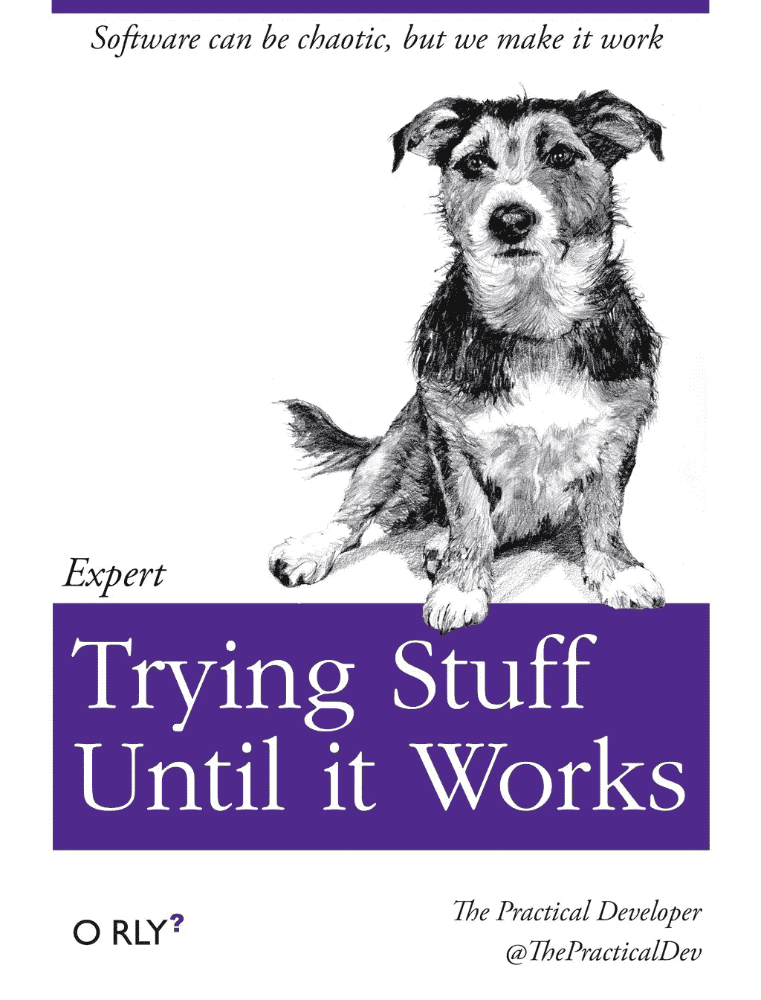

# 成为更好的程序员的万全之策

> 原文：<https://medium.com/hackernoon/surefire-ways-to-become-a-better-coder-b52c8cb33161>

如果你正在读这篇文章，那么很有可能你觉得自己没有发挥出作为一名程序员的全部潜力，或者你只是一个头脑发热的初学者。我完全能够感同身受——我也曾站在你的立场上——见鬼，我已经编码将近 4 年了，但我仍然觉得这是我上学的第一天。别担心。我花了很多时间与比我优秀得多的程序员交谈，通过这些交谈，我学到了一些如何快速有效地改进的东西。现在我想和你分享一些建议，希望你能在压力小的情况下提高水平。让我们开始摇滚吧。

# 只是代码宝贝*

好吧，我们从免责声明开始。我讨厌人们把事情说得如此明显，以至于你想揍他们的脸。真的。所以，请听我说完这件事。我在 r/webdev 上看过很多帖子，人们想知道他们下一步应该做什么，或者问他们如何才能成为更好的程序员。请这样想——如果迈克尔·乔丹只是坐在家里阅读有关篮球的书籍，你认为他会打得多好？如果他只用右手投篮会怎么样？我们永远也不会听说过他。他通过每天打篮球变得伟大——带着竞争的激情打篮球，并在比赛的每个方面挑战自己。如果你想成为一名更好的程序员，你必须:

1.)天天码

2.)总是比以前更努力地鞭策自己。

如果你不是每天都编码，但仍在发帖问“我怎样才能更好地编码”的问题，请停止阅读，去查代码；)

既然“明显队长”已经宣布他的脸超级有冲击力，这里有一些实用的方法让你每天以有趣的方式编写代码，挑战你:

*   在 [Dribbble](https://dribbble.com/search?q=music+player) / [Behance](https://www.behance.net/search?field=102&content=projects&sort=appreciations&time=week&search=form&country=US) 上找到布局，并尝试在 [Codepen](http://codepen.io/) 中重新创建它们。
*   从[可编程网络](https://www.programmableweb.com/apis/directory)或 [Todd 座右铭列表](https://github.com/toddmotto/public-apis)中抓取一些开放的 API，并想出新颖的方法来清洗、重新排列&显示数据。
*   只用纯 JavaScript 构建一个[单页面 pong 克隆](https://robots.thoughtbot.com/pong-clone-in-javascript)。
*   尝试编码“现实生活”的布局。我的意思是从一本杂志中获取一个布局，然后挑战自己用代码重新创建这个布局。
*   以不同方式进行实验。如果您发现在 jQuery 的帮助下构建某些东西很容易，那么尝试只使用纯 JavaScript 和 Web APIs 来构建相同的东西。

# **建造一些真实的东西**

我试着学了几次编码，然后才恍然大悟。事后看来，原因是显而易见的——我被困在了教程跑步机上。教程跑步机是指你花所有的时间来构建待办事项应用程序和创建一次性代码，而这些代码并不真正做任何事情。这肯定会让你失去动力和灵感。

当我决定开发一个对我有实际意义的 web 应用程序时，我的个人编码之旅真正开始了。当你决定建造一些个人的东西时，意想不到的挑战会从各个角度向你袭来，当这些挑战出现时，通过解决它们，你将开始建立一个处理它们的技术库。我开始为我的朋友构建一个简单的聊天程序，到最后，我开始与 API 接口，处理用户认证，集成动画库，配置服务器等等。*当我开始旅程时，我不知道我会做这些事情，但是一旦你有了一个项目的核心，这些事情就会在你建造它们的时候自然出现。*

> 当你向他们展示你成功复制并粘贴了 12 个 Scotch.io 教程时，没有人会雇佣你

建立一个真实的东西的额外好处是，如果你决定准备进入就业市场，你有一些实质性的东西可以与面试官和公司分享。你肯定希望在面试中拿出几个这样的项目——当你向他们展示你已经成功复制并粘贴了 12 个 Scotch.io 教程时，没有人会雇佣你。你还应该使用像 Github 这样的版本控制系统来管理你的 Real Thing 的代码，这意味着你可以随时将回购地址添加到你的投资组合和简历中。

# **看职业代码**

如果你是为 web 开发的，那么每次打开浏览器，你都有机会看到专业开发人员是如何工作的——就像在浏览器上打开开发工具并检查代码一样简单。你可以学习技巧和诀窍，只要看看专业人士如何安排他们的 HTML，利用 CSS 动画或集成库，使魔术发生。如果你认为你访问的网站看起来不错，感觉很快，质量很好——打开看看他们是怎么做的。

除此之外，有比你在 Github 上读到的更多的高质量代码等着你克隆到你的本地机器上。选择一个拥有超过 500 颗恒星的库，但不要太大——一些非常有用和受欢迎的东西，但不要太大。您可以自由地检查代码，看看它们是如何实现结果的。仅仅通过在头脑中逆向工程代码来弄清楚软件是如何工作的，你就会学到很多东西，并且在这个过程中，你很可能会看到正确注释和良好配置的代码。这是一个免费和宝贵的资源，只等着你得到你的手脏！

最后——你可能开始足够好地理解代码，从而可以开始考虑改进它的方法。他们写的代码有多模块化？他们使用的是可以分解成更小、更易读的单元的整体功能吗？他们是在高效地使用对象，还是导入整个库来完成一个简单的任务？当你开始注意到这些事情时——当你可以说“*不确定他们为什么做 X，我会像 Y* 那样做”——你会知道你在进步。

# **学习一门不同的语言**

编程偏好有时会演变成[个人电脑竞赛](https://www.youtube.com/watch?v=aDMsGl_XxTk)的争论，其中语言 X 代表无可争议的冠军，而 Y 代表可耻的菜鸟。虽然 PHP 确实很烂(开玩笑！..算是吧，[编程](https://hackernoon.com/tagged/programming)语言的美妙之处在于每一种都有长处和短处。有一句归功于马克·吐温的老话:***对于拿着锤子的人来说，一切看起来都像钉子***，这种心态会妨碍你成为你能成为的最好的程序员。

虽然 NodeJS 和 [Universal JavaScript](/@ghengeveld/isomorphism-vs-universal-javascript-4b47fb481beb) 的兴起意味着用 [JavaScript](https://hackernoon.com/tagged/javascript) 编写项目的前端和后端是可能的——有时甚至更好——但这并不总是最有效的。JavaScript 最初是一种处理基于浏览器的功能的可爱的小语言，在过去的十年里像疯了一样发展成为网络语言，但还有其他语言以不同的方式闪耀着光芒:

*   Ruby 和 Python 是多用途语言，具有非常易读的语法和坚如磐石的框架(Ruby on Rails，Django)。近年来，Python 已经成为机器学习事实上的标准。
*   Java、c#——这些语言的知识可以加强对“编程实际上是如何工作的”的更严格的理解(必然的)。十多年来，Java 一直处于热门编程职位的顶端或接近顶端。
*   c 是一种编译语言，可以直接转换成机器代码——它非常“接近金属”,学习这种语言将迫使你理解计算机科学的物理和理论基础。
*   APL 是一种编程语言，看起来更像 T2 古梵语，主要由 T4 操作 8 级或更高级的梵语使用。

你不必出去学习世界上所有的其他语言，但是了解其他语言做什么、它们是如何做的以及人们为什么使用它们会让你对编码生态系统有更丰富的理解。

# 做一些便宜/免费的自由职业项目

虽然普遍的共识是你应该[永远不要使用 Upwork 来获得自由职业者的工作](https://hackernoon.com/why-you-should-never-use-upwork-ever-5c62848bdf46)，但我认为这实际上是提高你的编码技能的一个非常有用的方法。听着——经济竞争到底从来都不是一个好主意，但另一方面，需求是发明之母。如果你在 Upwork(或类似的自由职业平台)上承担一个小项目，你不仅要模拟真正的自由编码工作的条件，还要承受一些时间压力，这是你自己的项目通常不会提供的(除非你对自己非常严格)。

即使报酬少得可笑，你也可以把它想成是你拿工资来学习——这并不是一个坏交易，因为学习通常是要花钱的。你还会感受到一点额外的压力，要交付高质量的工作，这将迫使你学习最佳实践，并在将工作标记为完成之前进行研究。

如果你在道德上反对 Upwork 等人，你甚至可以通过向非营利组织和当地慈善机构提供服务来增加一些感觉良好的果汁。这样做的好处不仅仅是你会感到内心温暖&黏糊糊的，而且当你从一个 90 年代的代码库升级本地汤厨的网站时，门槛一般不会提高那么高。免费代码营(FreeCodeCamp)和类似的网站为你贡献时间提供了很多选择，这是一个双赢的局面。

# **你永远不会结束**

意识到你永远不会“完成”。没有什么异常冷静的代码忍者在冰雪覆盖的山顶上等着宣布“赢家！”一旦你成功地组装了一个功能正常的 Webpack 而没有骂人，你汗渍斑斑的翻领上就别上徽章。不幸的是。

> 100k LOC 的旅程从一个 LOC 开始。

不管你学到了什么，编码只是继续进行。你可能是你专业领域的头号专家，但几年后你就彻底失业了。即使当你对自己的技能非常自信的时候，也要记住，有一些超级键盘手在华尔街的交易公司工作，他们梦想着二进制代码和 poops 算法。不要担心——尽你所能做到最好，继续编码。

祝你好运！

###

如果你想知道你是否准备好获得一份开发人员的工作，我正在建立一个平台来帮助你找到答案。Jumpjet 通过与专业开发人员进行技术访谈，帮助您成为更好的程序员。获得反馈，获得聘用。查看这里: [https://www.jumpjet.io](https://www.jumpjet.io)

> [黑客中午](http://bit.ly/Hackernoon)是黑客如何开始他们的下午。我们是 [@AMI](http://bit.ly/atAMIatAMI) 家庭的一员。我们现在[接受投稿](http://bit.ly/hackernoonsubmission)并乐意[讨论广告&赞助](mailto:partners@amipublications.com)机会。
> 
> 如果你喜欢这个故事，我们推荐你阅读我们的[最新科技故事](http://bit.ly/hackernoonlatestt)和[趋势科技故事](https://hackernoon.com/trending)。直到下一次，不要把世界的现实想当然！

