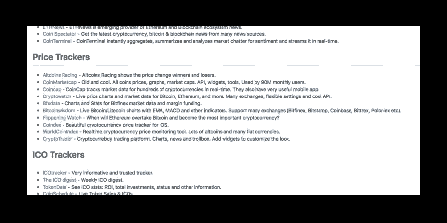
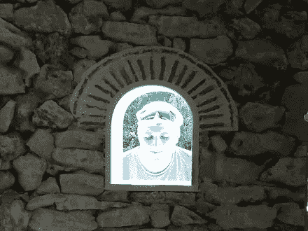
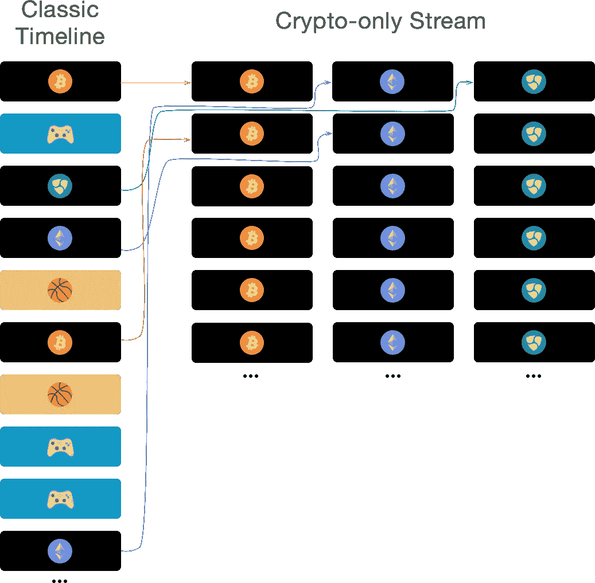
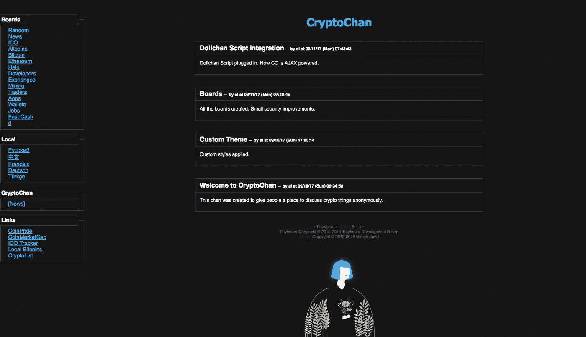
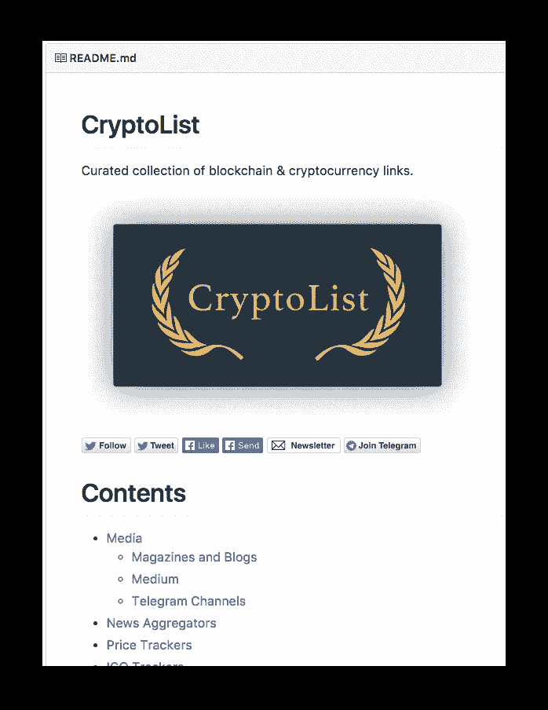
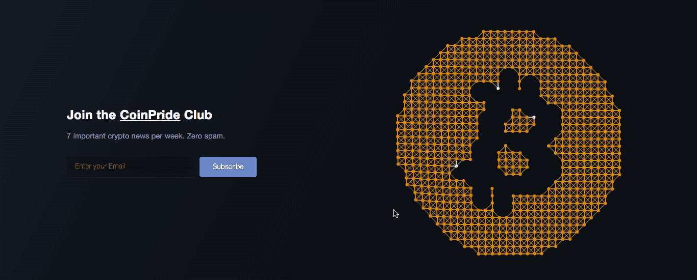

# 幸存的隐热🦁

> 原文：<https://medium.com/hackernoon/surviving-cryptofever-d7579ecce83e>

## 单人黑客马拉松:6 天 6 个项目。

问候！👋

我叫亚历山大·伊索拉。我是来自设计公司 [itmeo](https://itmeo.com) 的一名网络开发人员，也是一名密码爱好者。

今年赋予了[加密货币](https://hackernoon.com/tagged/cryptocurrency)很多关注。这就是为什么我称 2017 年为*隐热年。许多企业家被比特币及其底层技术的诱惑所吸引。这导致了:*

*   大量新 ICO
*   成吨的新硬币
*   大量的网络服务和加密相关的应用

2017 年也教会了我[区块链](https://hackernoon.com/tagged/blockchain)。我读了无数关于这项技术的维基百科和媒体文章，并立刻爱上了分布式账本的想法😍

作为一名有抱负的开发人员，我不能让世界范围的聚会错过，决定跳上火车。
幸运的是，我还有 6 天未使用的假期，所以我决定找点乐子，给自己定了个目标:*在 6 天内开发 6 个加密货币&区块链相关的 web 项目*。

目标是创建这样的 web 项目:

*   展示我喜欢的概念和想法
*   或者有趣，或者有用，或者两者兼而有之
*   看起来不错，有很好的品牌

在一周内创建 6 个完整的网站听起来似乎是不可能的。但是，如果你只解决一个问题，并且专注于这个问题并准确地解决它，结果总是很棒的。

> 成功需要一个单一的目标——文斯·隆巴迪

这就是为什么我 100%相信我会按时完成所有事情:动力空前高涨，青年动力十足，技巧娴熟。*就这么办吧！*

# 第 1 天—研究和规划

我搜索了整个互联网，收集了一堆最好的应用程序、网络服务和工具，并为它们写了简短的描述。即使在今天，这份完整的清单仍然很有帮助。
顺便说一下，后来我用各种类型的各种其他加密资源填充了它:媒体、聊天、论坛、API、指南和 [**开源**](https://github.com/coinpride/CryptoList) it。

创建清单至关重要——它是我灵感的源泉。盯着清单看对产生新想法很有帮助。这就像一个开发者的 moodboard。

Generating ideas in the Aladzha Monastery, Bulgaria.

# 第二天——coin buzz

现代社交网络看起来就像一盘由 10 种成分组成的杂乱沙拉。作为一个典型的极客，你想关注网络新闻、科学新闻和小工具新闻。让我们在你的时间表中加入一些个人的东西:篮球和电子游戏。作为一个社会动物，你也想知道你的朋友和亲戚的更新。放下 10 个加密货币资源，我保证你永远不会看到重要的新闻。你只是不能在身体上抓住所有的邮件。有一个解决办法:拥有多个 Twitter 或脸书个人资料，但这种设计很糟糕。烂透了*，尤其是*，如果你是一个会说多种语言的人。

(我梦想有一天社交网络会更加关注极客的问题，但这永远不会发生😁)

解决时间线混乱的方法之一是分类。所有分类的时间线都应该在某一类别的一个流中表示:

**Black** — cryptocurrency category news item, **blue** — videogames category news item, **orange** — basketball category news item.

有一些 cryptonews 聚合解决方案(像[超过 50%的脸书用户仅通过移动设备登录](https://medium.com/u/655cadce8d9f#t-673913)。因此，预测移动加密货币钱包应用的全球普及不应该是先知。
最终，你将需要一个二维码来接受人群中的加密货币。

而这正是你需要的合适工具:[**https://bitcoinqrcodegenerator . win**](https://bitcoinqrcodegenerator.win)

# 第 5 天——CryptoChan

我喜欢匿名交流的概念。虽然没有名字，人们离开他们的面具，感到自由。尽管，自由让人变得疯狂🌰
这就是为什么 [imageboards](https://en.wikipedia.org/wiki/Imageboard) (像 4chan)需要大量的控制和不断的调节。

谁会想要建立一个反复无常的论坛，需要大量的推广，并且用大量的图片淹没你的服务器磁盘呢？你知道答案——一种隐秘的狂热😂

所以我决定创建[密码更改](https://cryptochan.party)。
它运行在[维昌](https://github.com/vichan-devel/vichan/)发动机上，在安全性和造型上做了一些修改。我也注射了 [dollchan](https://github.com/SthephanShinkufag/Dollchan-Extension-Tools) 。这个可怕的脚本增加了大量的开箱即用的酷功能:像 AJAX 发布、自动更新和拖放文件上传。

CryptoChan contains 16 crypto boards to discuss all things crypto.

虽然 imageboard 在技术上 100%完成并已经推出，但我不打算用吸引人的内容来推广它。当新用户开始到来时，我根本没有足够的时间来协调整个变化。如果有人想统治某个特定的棋盘甚至整个棋盘，请随时[联系我。](mailto:alexanderisora@gmail.com)

image board:[**https://crypto chan . party**](https://cryptochan.party)

# 第 6 天—密码列表和时事通讯

有大量的加密货币列表。最引人注目的当然是迪伦·达姆斯马的《https://cryptominded.com》。今天的 CryptoMinded 远不是一个简单的链接列表。这是一个庞大的社区，有 1300 多名成员。

然而，就像其他名单一样，隐密者也面临着被禁止的风险。仅仅是因为他们都依赖于一个人，而这个人可能会失去动力或者只是缺少时间。

这就是我创建 CryptoList 的原因。这是一份来自互联网上最伟大的加密货币/区块链/比特币相关链接的 opesourced 列表。它包含许多工具、网络/移动应用、媒体、博客、媒介、电报聊天、论坛、API 和更多的东西。请[贡献一个漂亮的链接](https://github.com/coinpride/CryptoList/blob/master/CONTRIBUTING.md)。

密码列表:[https://github.com/coinpride/CryptoList](https://github.com/coinpride/CryptoList)

每小时都有数十亿起加密货币事件发生。即使你只是想跟踪重要新闻，你也需要成为一个真正的硬汉，拥有充足的空闲时间。最难的事情是跳进这个新闻海洋，不被大多数媒体每天发布的点击诱饵/垃圾/搜索引擎优化的东西所消耗。至于 Twitter……嗯，在 Twitter 上关注所有的秘密英雄并捕捉重要信息几乎是不可能的。

我一直梦想有一种超人，他收集所有重要的链接和推文，然后过滤废话。然后过滤不重要的东西。最后，编辑一个好看的简短摘要，每周发送到我的收件箱。

As you wish, Gandhi.

这就是为什么我成立了 CoinPride 俱乐部。这是一份**每周简讯**，面向那些只需要来自庞大密码世界的顶级、最重要、最引人注目、最激动人心的新闻的人。
零胡说八道，零 ICO 垃圾邮件。

第二个目标是创建一个真正性感的登陆页面。蒂姆·霍尔曼的这个[代码笔](https://codepen.io/tholman/pen/AmptL)非常有用。我喜欢牢不可破网络的想法——这是对比特币概念的完美比喻。

加入俱乐部:[https://club.coinpride.com](https://club.coinpride.com)

# 我错过了什么

我必须在项目中创建一致的品牌。由于所有项目的[根站点](http://coinpride.com)的徽标上都有一个 leo，所以主上下文一定是 lions。因此，密码黑客更适合被命名为“CryptoLions”，coin buzz——“coin safari”和 Altcoins。《赛车》依次错过了主屏幕上两只奔跑的狮子。

# 现在

所有的项目我还有很多事情要做。他们每个人都有自己的路线图，我将继续发展和改进。

为什么我决定创建这么多的应用和服务，而不是像哈瑞克里希纳那样专注于一件事？嗯，我一直想创建所有这些项目，但总是推迟它们的创建。在我的隐热中幸存下来的时候，我受到了强烈的冲击，一种感觉就像*是时候开始做了。*那个小小的冲动释放了我的能量和潜力，所以我开始创作。
我创造了。全部都是。甚至更多。天哪，不到一周。

加密热给我的教训是，开始你梦想中的项目的正确时间是现在。这是一个微不足道的想法，但是——有趣的事情！—所有这些媒体文章都是为了提醒你无数被我们用来遗忘的重要的小想法。

祝你度过你的秘密发烧🦁

*下一步去哪里:*

*   [https://coinpride.com](https://coinpride.com)—根网站。
*   https://twitter.com/coinpridecom——这条推特关注了 55 名区块链有影响力的人，并转发了一些重要内容。
*   【https://t.me/join_cryptomemes —有趣的加密货币图片。
*   [https://t.me/join_cht](https://t.me/join_cht)—与加密黑客聊天。

感谢[https://twitter.com/@MattOCrypto](https://twitter.com/@MattOCrypto)审阅这篇文章。