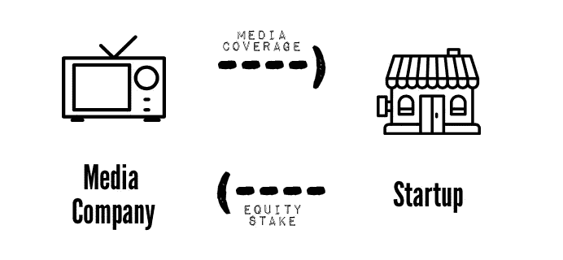
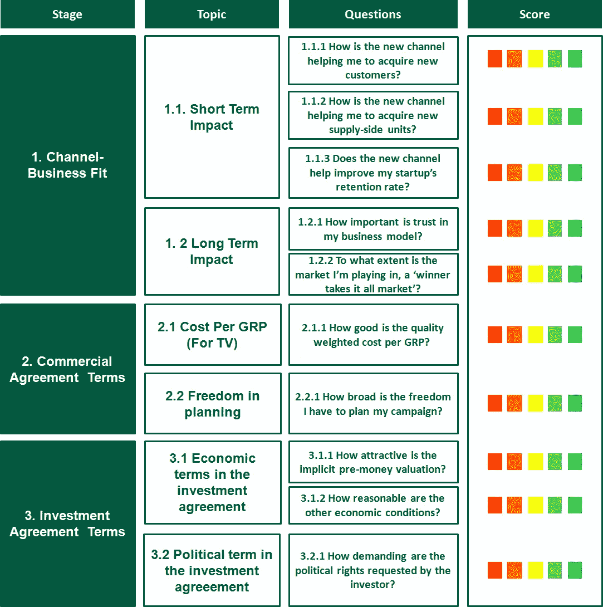
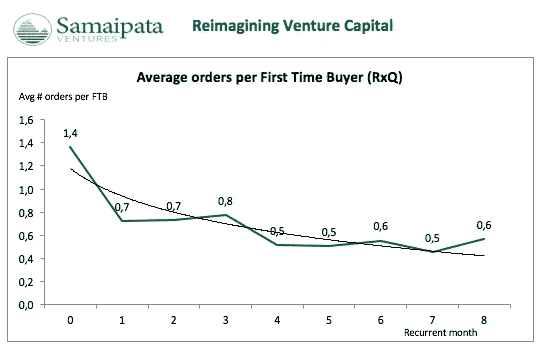

# SV 的 M4E 交易记分卡

> 原文：<https://medium.com/hackernoon/svs-scorecard-for-m4e-deals-10068195ea7c>

[*Samaipata Ventures*](http://samaipataventures.com)*是一家专注于南欧种子期* [*市场*](/@samaipataV/samaipata-ventures-framework-for-marketplaces-madrid-edition-1yearin1hour-789b698d6c25) *和 DNVB 的风险投资公司。如果你不想错过我们的新闻和帖子，请在 Medium、*[*Twitter*](https://twitter.com/samaipataV)*上关注我们，或者订阅我们的* [*简讯*](http://eepurl.com/clpsDf) *。今天，我们将展示我们的媒体换股权交易记分卡，这是我们七年来参与的十几次此类交易。*

# 什么是 M4E？

M4E 或“媒体换股权”是一种投资模式，初创企业用股权换取媒体报道。一般来说，一家媒体公司会向一家初创企业投资现金，并通过一份 M4E 协议，确保投入的资本随后将用于在他们可用的渠道做广告。

M4E 可以申请所有类型的媒体，然而，我们将根据自己的经验专注于“tv4 公平”。

这张记分卡是在面对 M4E 交易的决策时要遵循的思维路径。因此，这只不过是一个复杂操作的工具，通过分解影响您决策的不同因素，帮助您看到广阔的图景，并有希望做出合理的决策。

让我们从记分卡开始:

Samaipata Ventures’ scorecard for M4E deals.

# 1.渠道—商业契合度

电视作为我的企业营销渠道的效果/效率如何？

A month ago Samaipata Ventures led a seed round in [21 Buttons](https://www.21buttons.com/). The startup used a media-for-equity investment model with Spain’s *Mediaset* to stimulate rapid growth in downloads and DAU. Take a look at the advert!

## 1.1 短期影响

## 1.1.1 新渠道如何帮助我获得新客户？

毫无疑问，大众媒体是获得顾客的有力手段，然而最重要的问题是，与在线营销或其他以前使用的渠道相比，大众媒体的效率如何。

衡量大众媒体宣传活动成功与否的最常见方法是通过 CAC(客户获取成本),将宣传活动前的混合 CAC 与正在播放的混合 CAC 进行比较(例如，您的广告贯穿整个二月份→您将一月份的 CAC 与二月份的 CAC 进行比较)。或者，您可以查看营销活动后的 KPI 来评估营销活动前的改进。

经验法则:

*   如果你的“播出”CAC 是“播出前”CAC 的 2-3 倍，你应该开始担心了！
*   你的 CAC 回报不能超过 24-36 个月，即使你的广告正在播出。
*   活动后混合 CAC 应显著降低。

## 1.1.2 新渠道如何帮助我获得新的供应方单位？(针对市场)

大众媒体营销的一个影响是，你的公司将面临品牌认知度的急剧上升，以及随之而来的市场信任度。

通常，品牌意识与需求创造相关。然而，由于这些突然的增长，与供应方单位相关的进店率和转换率大幅提高并不少见(例如，如果你是一个食品配送市场，你的平台上的餐厅数量会增加)。很难将大众媒体宣传活动的一部分成本分配给供应方，但作为一个独立的驱动因素，它肯定需要被考虑在内。

## 1.1.3 新渠道有助于提高我的初创企业的留存率吗？

习得很难，但保留/重复要难 10 倍；公司为了生存，需要客户的回报和消费！如前所述，大众媒体可能会增加品牌知名度和信任度，这些增加可以刺激你的创业公司的保留率。

评估保留率/重复率有助于在大众媒体活动前后进行您自己的群组分析，以真正了解您的活动对 a.o .客户保留率的影响。[点击此处](/samaipata-ventures/samaipatas-3-step-5-cohort-analysis-5cf6024d454d)访问我们的群组分析模板。

From the Samaipata Ventures [cohort analysis](/samaipata-ventures/samaipatas-3-step-5-cohort-analysis-5cf6024d454d)

## 1.2 长期影响

## 1.2.1 信任在您的商业模式中有多重要？

在某些商业模式中，信任可能是你的神圣目标！(例如平均分票高的车型或者照顾孩子等敏感服务！).通过在电视上宣传你的品牌，增加你的知名度，你可能会体验到信任的相应增加，但你需要评估在你的情况下，这是否值得。

## 1.2.2 我所在的市场在多大程度上是一个“赢家通吃”的市场？

在一些市场中(通常在市场中),由于市场本身的内在特征，我们会看到本地/全球“w-t-i-a”动态。

如果是这样的话，稍微牺牲你的支出效率，以更快的速度获得客户(或供应方单位)，并通过品牌建设建立进入壁垒，这可能是有意义的。这在多大程度上有意义，可以通过 CAC 回收期计算来合理化。

The intrinsic characteristics of certain markets led to ‘winner takes it all’ structures

# 2.商业协议条款

传媒公司提供的广告协议有多好？→媒体换股权交易中需要分析的一个关键因素是合作媒体公司为您提供的商业条件。这些条件将在广告合同中具体说明。

## 2.1 每组成本(电视)

## 2.1.1 每个 GRP 的质量加权成本有多高？

好消息是，电视和效果营销可以很好地衡量！感谢上帝。有一种方法可以衡量你购买的所谓“单位”。在电视上，这些单位被称为 [GRP 的](http://www.nielsenmedia.com/glossary/terms/G/G.html)(总评分点)，用来衡量媒体曝光率。

公式:%达到的目标市场 x 暴露频率=覆盖率 x OTS。例如，假设您的广告达到了目标市场的 25%(例如，西班牙成年人，指 16 岁以上的人)，并且被浏览了 5 次→ 25 x 5= 125 GRPs(西班牙成年人> 16 岁)。

> OTS:是对“有机会看到”的简略描述。该术语用于量化一项活动应计划的曝光次数/平均频率。也就是说，在整个广告活动期间，我们目标受众中的普通人应该有 OTS 3 或更多的广告。—尼尔森媒体

根据经验，每个目标受众的 OTS 超过 7-10 次的活动可以给我们提供足够的信息来连贯地理解特定目标对曝光的反应。

所以当谈到电视时，你不应该把广告看作是插播广告，而应该把它们看作是 grp，这才是真正的衡量标准！独立公司通过几千个家庭的样本统计来跟踪观众数据，他们量化观众的行为(例如在西班牙，Kantar Media)。

只要你有一个标准的衡量方法，你就能把它和市场价格进行比较。

**每组成本的主要驱动因素是什么？**

Think about the week, the day, the channel, the program and the time, to target your audience ;)

有某些因素可以证明较高的玻璃钢价格是合理的。考虑以下几点，以获得交易的这一方面:

*   黄金时段与白天时段:grp 在黄金时段的价格可能高达白天成本的两倍。
*   定位:与中间时段相比，紧接着演出的前 3 个时段和演出开始前的后 3 个时段往往要贵得多。
*   季节性:根据一年中的月份和当时播放的节目，grp 的费用会有很大的不同；例如，8 月通常比 12 月便宜很多。
*   插播时长:10 秒的插播时长往往是 20 秒广告时长的一半以上。

有时，媒体公司会给初创公司一个“测试期”，以验证所涉及的媒体渠道和广告的曝光率，然后再投入到全面的电视宣传和 M4E 协议中。这将是初创公司了解所有驱动因素的最佳方式。

> 最后，媒体公司提供的更有价值的东西，可能是在策略和/或优化方面提供的潜在建议。

## 2.2 规划自由

## 2.2.1 我有多大的自由来计划我的活动？

创始人/ CMO 控制 grp 部署的能力是与媒体公司达成一致的关键部分。根据经验法则:

*   自由度越高(意味着每周安排 grp 的灵活性和可执行性)，效果越好。资产的流动性更强，因此更容易控制。
*   自由度越小，影响的可预测性就越小，因此价值也就越低。

# 3.投资协议条款

## 3.1 投资协议的经济条款

投资协议的经济条款有多好？就像在任何其他股权投资协议中一样，我们看到两种类型的经济条款:投资前估值和其他典型的经济条件。

## 3.1.1 隐性前钱估值有多大吸引力？

要评估估值有多好，显而易见的做法是查看你最近或同时进行的几轮投资。如果没有，关于初创企业估值的标准理论就适用了。估值越高>稀释越低→对创业者越有利(抱歉，这肯定是引用了“傻瓜创业”)但请记住，你需要确保估值从长远来看是可持续的。

## 3.1.2 其他经济条件的合理性如何？

当谈到其他经济条件时，通常会出现两个主要条件:流动性偏好和反稀释条款。前一个条件赋予投资者在其他任何人之前清算其股票的权利，给予他/她将股权转换成现金的优先权。后一个条件是防止创业公司在任何时候稀释投资者在公司的股权。

## 3.2 投资协议的政治条款

投资协议的政治条款有多好？

## 3.2.1 投资者要求的政治权利有多苛刻？

这里你要问自己的关键问题是，就政治权利而言，媒体公司的要求与另一个投资相同资本的投资者相比如何。你需要努力在请求和资本之间找到一个公平的平衡，以获得并维持一个富有成效的投资者-被投资者关系。

最后，浏览记分卡，作为你决策的思考路径，并验证给定 M4E 交易的价值。你可能已经注意到了，截面不是黑的或白的。这个决定与权衡你的利益和寻求双赢的局面有关。最终你们会成为合伙人。

# 额外收获:在你竞选的第二天

除了你的供给、需求、经营市场、商业协议等特征。在优化方面有大量的工作要做，这主要取决于启动端。在执行广告活动时，需要记住以下几点:

1.  在发起新的大众媒体活动的前几周，保持每日甚至每小时 KPI 的领先。
2.  管理意想不到的反应(好的和坏的),从你的消费者那里学习。
3.  做好服务器崩溃的准备！不幸的是，并不总是这样
4.  结合不同来源(Kantar、Web、App 等)的信息，实现超级数据驱动。)并每天提取 SoWhats。

我们希望你能更好地面对 M4E 的决定。祝你好运。任何[评论/反馈](http://samaipataventures.com/)都将非常受欢迎。

> [黑客中午](http://bit.ly/Hackernoon)是黑客如何开始他们的下午。我们是 [@AMI](http://bit.ly/atAMIatAMI) 家庭的一员。我们现在[接受投稿](http://bit.ly/hackernoonsubmission)，并乐意[讨论广告&赞助](mailto:partners@amipublications.com)机会。
> 
> 如果你喜欢这个故事，我们推荐你阅读我们的[最新科技故事](http://bit.ly/hackernoonlatestt)和[趋势科技故事](https://hackernoon.com/trending)。直到下一次，不要把世界的现实想当然！

