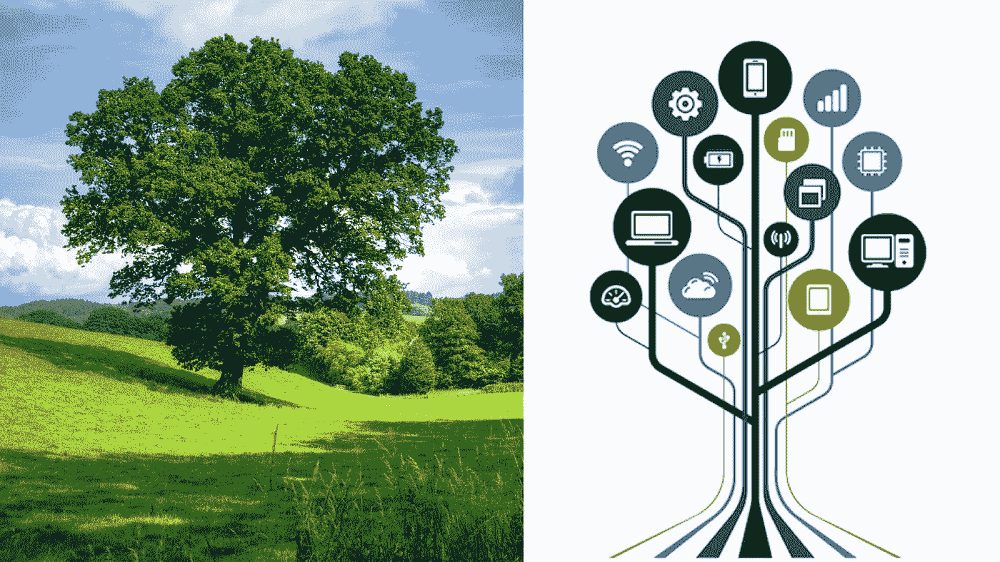
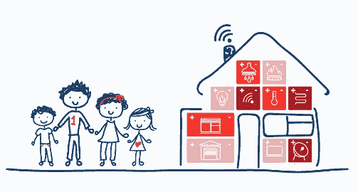
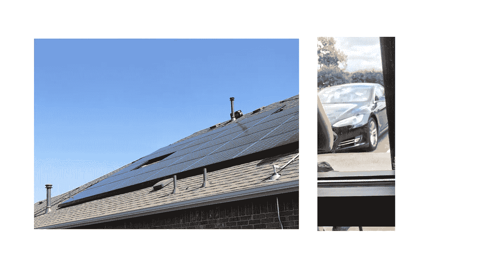

# 蜂拥而至& 100 万辆电动汽车/特斯拉在我们的道路上的力量

> 原文：<https://medium.com/hackernoon/swarming-the-power-of-1m-evs-teslas-on-our-roads-cab1bfa1615>

An Antifragile/Swarm Grid borrows it’s complex system adaptivity from nature.

7 月 28 日星期五，在大张旗鼓和惯常的奉承声中，埃隆·马斯克交付了三十(30)辆[特斯拉](https://hackernoon.com/tagged/tesla) Model 3 电动汽车。预计在未来 2 年内将交付近 50 万台。为了实现这一目标，[特斯拉可能通过债券](https://www.ft.com/content/463e6db4-7b90-11e7-ab01-a13271d1ee9c)筹集 15 亿美元。虽然这是将电动汽车带入主流的一大步——对交通行业的影响经常被讨论——但对公用事业行业的影响几乎同样深远。特别是，电动汽车的商品化(如果你可以称之为 50 万辆)将影响公用事业行业，迫使其比传统公用事业计划的更快地采用[虚拟发电厂](https://www.greenbiz.com/article/get-ready-virtual-power-plants)。特斯拉虽然仍是公用事业雷达上的一个亮点，但该领域有 50 多家公司，市值在 40 亿至 600 亿美元之间，由于一种称为群集的概念，它将变得更加可怕。

## 蜂拥

目前在路上行驶数千英里的每辆新特斯拉都在获取如何在人类出没的道路上导航的知识。每辆车每多行驶一英里，就会获得更多的集体知识，并将其存入一个中央数据库，在那里使用机器学习进行实时分析。我们听到很多关于汽车在几年内将如何自动驾驶的说法。较少讨论的是集体系统在如何管理储存在数十万辆特斯拉中的**能量方面获得的知识。肯尼·H·琼斯在他的论文《工程抗脆弱系统:设计理念的改变》中建议**

> [群体是为共同目的运行的非中央控制的自主车辆的集合。因此，他们必须自我组织和合作来完成任务。另一个特点是蜂群是由大量相对便宜的可消耗单位组成的:80%的个体失败仍可能导致 100%的任务成功](http://www.sciencedirect.com/science/article/pii/S1877050914007042)

虽然 swarm 是一种有用的工具，可以作为自动驾驶汽车的一个单元来管理汽车，但它也非常有助于管理**分布式能源，即每辆特斯拉**中的电池。群体收集关于每个单独电池的数据，其中一些知识以

*   电池需要充电前的最佳循环次数
*   所用能源的成本以及
*   从电池中释放的功率以及它如何影响电池寿命。

这些数据，以及更多的数据，通过大数据分析(甚至是机器学习)变成了海量的知识。这些知识成为如何管理虚拟电力公司的实时洞察力。加上 Powerwall 和 Solarcity 面板，swarm 就变成了一个*公用事业公司*，将每个 Tesla Model 3/Solarcity 面板/Powerwall 作为电网上的分布式能源(DER)节点进行管理。再加上雪佛兰 Bolts 和宝马 i3，这就不仅仅是一家公司的颠覆，更多的是一种过时的[商业](https://hackernoon.com/tagged/business)模式的颠覆。

正如我在关于特斯拉的[真实价值的文章中提到的，这是随着 Model 3 的推出而释放的真正的颠覆。这种破坏是直接从大自然的剧本中借来的。](https://www.linkedin.com/pulse/teslas-high-stock-price-has-less-do-withelectric-cars-seyi-fabode)

## 生物拟态

我在 SXSW Eco 2015 上第一次沉浸在所有生物模拟中。我听了一些会议和演讲，包括生物学家、作家和创新顾问 Janine Benyus 的一次。

仿生学简单来说就是 [*利用从大自然中获得灵感或复制的设计来解决人类的问题*](http://amzn.to/2fcd8n7) 。根据 Janine Benyus 在“[仿生](http://amzn.to/2vnJm51)”中的说法，大多数生物系统都有一个通信系统，使系统能够抑制任何浪费并奖励高效的行为。她认为，最成熟和最有效的系统不是那些从高层传播必要的系统控制信息的系统，而是那些从基层将信息分散到整个系统以管理这种奖励效率、防止和惩罚浪费的结构的系统。通俗地说，大多数有机系统不是集中管理的，但仍能有效运行。我们中最聪明的人总是从自然中借鉴来构建技术；1951 年，当马文·明斯基还是哈佛大学的学生时，他毕业于麻省理工学院，是人工智能的创始人之一，他使用了一种简单形式的强化学习，并模仿老鼠在迷宫中行走。

这种信息传播机制就像一个丰富的反馈系统，使系统能够在变化发生时快速适应。这种机制还有助于系统在受到任何攻击时保持其完整性。这就是我们在树叶如何设法捕捉、利用和资源化它们所依附的树的其余部分，而不成为整棵树的负担中所看到的。这就是为什么当树叶不再有助于树的完整性时，它们会从树上脱落。脱落的树叶分解成肥料，滋养其他树叶/树木。这种系统适应看起来很像抗脆弱性；系统的一部分受到任何冲击都会变得更强。这就是蜂群能做到的。

通过模仿自然，家庭中的一群电动汽车、太阳能电池板、电池和节能设备可以被制成由许多节点组成的虚拟发电厂。如果一个节点受到攻击或危害，比如一个家庭受到网络攻击，虚拟发电厂不会受到危害，只会切断该节点。但是虚拟发电厂从那个节点学习。虚拟发电厂通过从受损但现已禁用的节点获得的实时洞察力变得更加强大。群体/虚拟电厂受益于抗脆弱性。

## 抗脆弱或“百万刀斩”

当谈到创新和商业模式变化时，公用事业公司正在向其股东传递一个信息，即这种向抗脆弱电网的过渡将在没有太大干扰的情况下完成。公用事业行业未能告知其股东，未来的抗脆弱商业模式对现有结构没有任何亏欠。

不要把这种观点误认为天真，认为这是我们当前电网的广泛系统的[复杂性，以及改变它的难度。因为特斯拉向一小部分市场销售昂贵的汽车并不等同于颠覆。该公司可能在这一点上过度杠杆化，但它预示着一个可能和破坏性的未来。正如我在我的书](https://www.linkedin.com/pulse/convergence-systems-utilities-built-space-seyi-fabode)[抗脆弱电网](https://www.amazon.com/dp/B072875DFJ)中所讨论的，虽然为电动汽车的大规模采用提供基础设施还有很多工作要做，但基础设施已经在这个电网的智能家居/a 节点中铺设好了。

这里有一个例子可以说明这种破坏是如何从一个节点(我的家)发生的。我的屋顶上有一个 [7kw 的太阳能发电系统](http://share.solarcity.com/1945texoma)(下图)。今年夏天有几天，我消耗的能量比太阳能电池板产生的能量还少。我的 Nest 恒温器帮助我确保高效利用能源。Nest、Solarcity 应用程序和我自己的个人电子表格让我清楚地知道我产生和使用的所有能源。我不断地捕捉数据，这在目前来说甚至算不上先进的技术。有了可用的数据，我不断地*了解*我的家庭“系统”,我已经意识到有些下午我需要有人帮我拿电，因为我(还)没有 Powerwall。

Solar panels on my home and the Tesla belonging to one of my coffee shop neighbors. What if he could pay me to charge during the day? I’m planning to ask him.

原来我有一个开特斯拉的邻居(上图),他或许可以在发电量过剩的时候从我手里接过特斯拉。我的邻居也在我们当地的咖啡店工作(我小心翼翼地拍了这张照片),白天他在那里停车。他可以把特斯拉停在我家，用我的太阳能电池板充电。我可以通过一个简单的应用程序来管理这笔交易。或者我们可以使用 Venmo 进行同行支付。或者，如果我们真的想变得有趣，我们可以创建一个[区块链，并签订智能合同来跟踪](https://blockgeeks.com/guides/smart-contracts/)合同遵守情况。我附近有三个邻居，他们的屋顶上也有太阳能电池板。和几个有电动车的邻居。谁说我们不能在我们之间建立自己的迷你电网系统？为了确保每个人都能看到正在发生的事情，我可以在一个简单的账本上记录我们所有的使用和生成信息。**而且，虽然在一个非常非常非常小的水平上，在你可以说‘电’之前，我刚刚成为我们的小型电网的公用事业。**

但是公用事业公司认为这还需要一段时间。我不这么认为。考虑到我们基础设施的状况，一般来说，特别是公用事业行业，我认为我们比他们意识到的更接近这个现实。套用海明威在《T2》中的话，《太阳照常升起》

> [**“老公用事业是怎么死的？”两种方式。渐渐地，然后突然。".**](http://amzn.to/2wqCkKw)

*请分享、点赞、推文。***使用我们的定制工具写你自己的博客，并注册*[*polymathy 每月简讯*](https://www.getrevue.co/profile/seyifabo?utm_campaign=Issue&utm_content=forwarded&utm_medium=email&utm_source=Seyi+Fabode)*——如果你已经读到这里，我敢打赌你会喜欢这两个。* [***哦，你可以在亚马逊上买抗碎网格***](https://www.amazon.com/dp/B072875DFJ) *。**