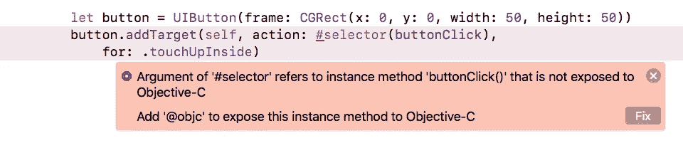
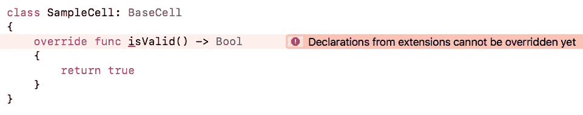
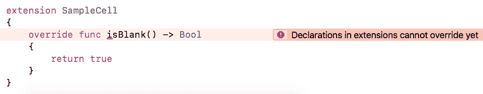
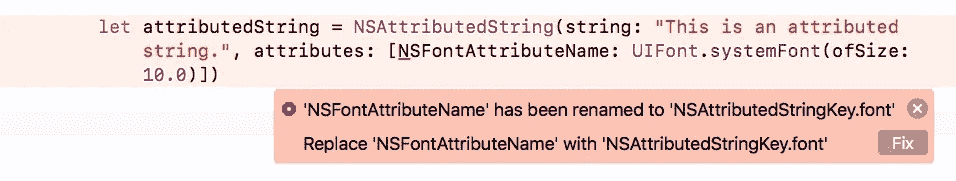

# Swift 4.0 迁移—错误..！！错误..！！

> 原文：<https://medium.com/hackernoon/swift-4-0-migration-error-error-8fbf13c2ec2>

担心的..？今天不行..😎

既然 Swift 4 已经在这里，我们迟早要迁移我们的代码。

早些时候，当雨燕 3 号抵达⚔️.时，迁移似乎是一项单调乏味的任务 *Swift 3* 包含了一些非常重大的 API 变化。当然， *Apple* 为我们提供了 migrator 工具来减少人工开销，但正如我们所说的，无论我们如何努力，总会留下一些漏洞。即使在 swift migrator 工具完成了大部分工作之后，开发人员自己仍有许多工作要做😰。

现在我们又要处理另一个这样的迁移🤢。但是不要担心，这次没有以前那么难了。现有的 API 并没有太多大的变化。虽然，一些新的 API 肯定会添加到框架中，但这不是我们现在关心的。我们目前唯一关注的是，我们需要在使用更改后的 API 的代码中进行哪些更改。

# 我们开始吧..！！！🚀

让我们看看在将您的代码迁移到 Swift 4.0 时可能出现的主要错误和警告。

## 1.@objc 推断

> 在 Swift 4 之前，编译器将一些 **Swift 声明自动提供给 Objective-C** 。例如，如果从 NSObject 派生出一个子类，编译器会为这类中的所有方法创建 Objective-C 入口点。该机制被称为@objc 推理。
> 
> **在 Swift 4 中，这种自动@objc 推理被弃用**,因为生成所有这些 Objective-C 入口点的成本很高。当“Swift 3 @objc 推论”设置为“开”时，允许旧代码工作。但是，它会显示需要解决的弃用警告。建议“修复”这些警告，并将**设置切换为“默认”**，这是新 Swift 项目的默认设置。

我面临的问题是关于 ***选择器。*😐**

> 选择器表达式允许您访问用于引用 Objective-C 中的方法或属性的 getter 或 setter 的选择器。
> 
> *方法名*和*属性名*必须是对 Objective-C 运行时可用的方法或属性的引用。

简而言之， *Swift* 中的*选择器*与*Objective-C*API 交互，因此需要一个 *@objc* 推理。早期它是由编译器自动处理的。但是在 *Swift 4* 中，需要明确定义。

***在 Swift 3.2***

Swift 4.0 中的***—使用 Swift 编译器建议的修复程序*😬它会将@objc 推理添加到选择器方法中。**

## 2.扩展中的声明还不能被覆盖

在 *Swift 3* 中，对于来自*类* *扩展*或在其中的方法重写没有限制。但是在 *Swift 4* 中，你就是不能 ***还不能*** (可能在不久的将来会有)。

> *扩展*为现有的类、结构、枚举或协议类型添加新的功能。这包括扩展您无法访问原始源代码的类型的能力
> 
> 扩展可以向类型添加新功能，但不能重写现有功能。

在迁移到 *Swift 4* 时，您会得到 ***编译时错误*** 🙈如果您使用了扩展来重写方法。

***在 Swift 3.2***

**isValid() is defined in BaseCell’s extension**

***isBlank() is defined in BaseCell original source code and overridden in SampleCell’s extension***

***在 Swift 4.0 中——只需将被覆盖方法的定义移到原始类源代码中🎯***

## 3.非属性字符串属性的键名

在 *NSAttributedString* API 中引入了一个非常直接的变化——与*属性化字符串*的*属性*相对应的 ***键名*** 现在将使用*枚举****nsattributed stringkey 来引用。***

***举例:***

1.  *NSFontAttributeName* 现在将被称为*nsattributedstringkey . font*
2.  *NSForegroundColorAttributeName*现在将被称为*nsattributedstringkey . foregroundcolor*等*。*

***在 Swift 3.2***

Swift 4.0 中的***—只需使用 Swift 编译器建议的修复程序，它将为您完成所有工作*😅**

# 促销

别忘了阅读我的其他文章:

1.  [你一直想知道的关于 iOS 中通知的一切](https://medium.freecodecamp.org/ios-10-notifications-inshorts-all-in-one-ad727e03983a)
2.  [拖动&放入收藏&表— iOS 11](/@p.gpt10/drag-it-drop-it-in-collection-table-ios-11-6bd28795b313)
3.  [Swift 4 中关于可编码的一切](https://hackernoon.com/everything-about-codable-in-swift-4-97d0e18a2999)
4.  [用渐变给它上色——iOS](https://hackernoon.com/color-it-with-gradients-ios-a4b374c3c79f)
5.  [关于 iOS 10 中的今日扩展(Widget)你需要知道的一切](https://hackernoon.com/app-extensions-and-today-extensions-widget-in-ios-10-e2d9fd9957a8)
6.  [uicollectionview 单元格选择变得简单..！！](https://hackernoon.com/uicollectionviewcell-selection-made-easy-41dae148379d)

随着迁移的深入，我将更新文章。更多关于 ***【雨燕 4】***的信息，敬请关注本空间。

如果你有任何疑问，请随时发表评论。🙂🙃