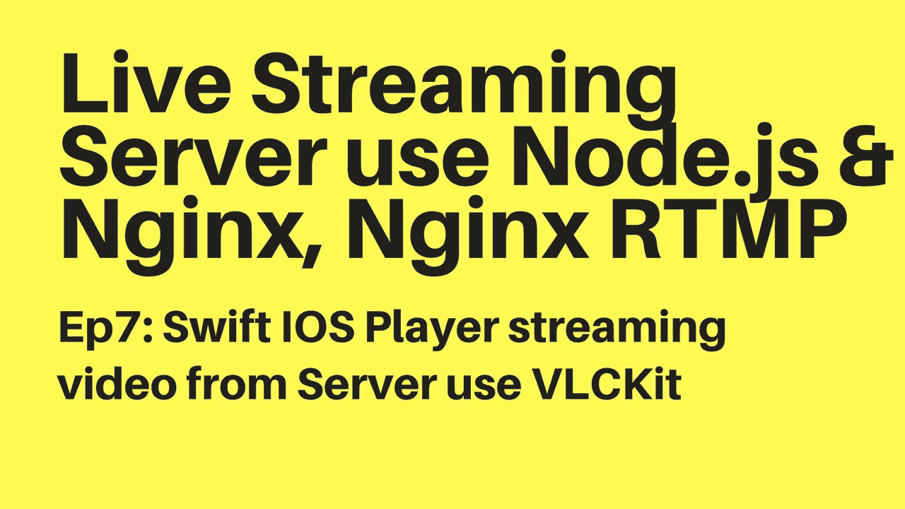

# Swift 4 IOS 应用程序播放器来自 Nginx 的实时流视频，Nginx-RTMP 使用 VLCKit

> 原文：<https://medium.com/hackernoon/swift-4-ios-app-player-live-stream-video-from-nginx-nginx-rtmp-use-vlckit-f2162134ae5c>



创建您的一个简单的视频播放器，从 Nginx RTMP 服务器，如:rtmp://your-domain . com/live/[Stream-key]

## VLCKit

VLCKit 是一个通用的多媒体库，可以在 macOS、iOS 和 tvOS 上播放任何音频或视频。

它基于 libVLC，流行的媒体播放器 VLC 的引擎。

它支持回放，但也支持 Mac 上的活动流和媒体文件对话。

它是在 LGPLv2.1 或更高版本下许可的开源软件，可以从 VideoLAN 网站上以源代码和二进制形式获得。

## 安装 CocoaPods

CocoaPods 是 Swift 和 Objective-C Cocoa 项目的依赖管理器。它有超过 41，000 个库，在超过 290 万个应用程序中使用。CocoaPods 可以帮助你优雅地扩展你的项目。从[官方网站](https://guides.cocoapods.org/using/getting-started.html#getting-started)查看文档或在您的终端上运行以下命令。

```
# Xcode 8 + 9
$ sudo gem install cocoapods 
```

## Xcode &创建新项目

从[苹果官方链接](https://developer.apple.com/xcode/)下载 Xcode 工具在本教程中，我确实使用了 Xcode 9.x，打开 Xcode 并创建了新的单视图应用程序。示例将项目保存在~/Downloads/myProject

开放终端

```
cd ~/Downloads/myProject
pod init 
```

编辑 Podfile

```
nano Podfile
```

并插入**pod‘MobileVLCKit’**

您的 Podfile 应该是这样的，将“Stream”替换为您的项目名称

相当 Xcode 和运行

```
pod install
```

一旦完成，在 Xcode 中再次打开项目，记住打开文件的扩展名是:**。xcworkspace**

```
[open myProject.xcworkspace](https://github.com/tabvn/video-streaming-service/tree/master/ios/Stream.xcworkspace)
```

## 看视频

> **Youtube**:[https://www.youtube.com/watch?v=N_u9nsXNvn4](https://www.youtube.com/watch?v=N_u9nsXNvn4)
> 
> **Github**:[https://github.com/tabvn/video-streaming-service](https://github.com/tabvn/video-streaming-service)