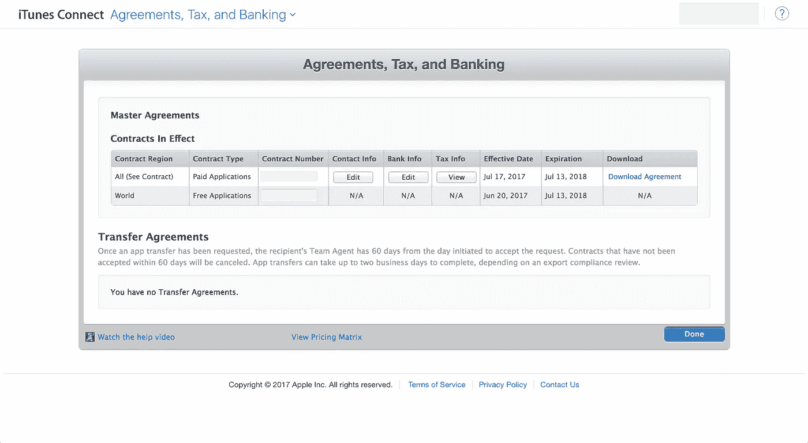
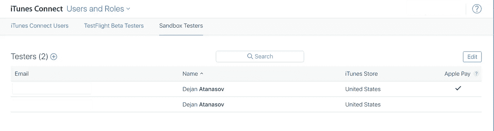
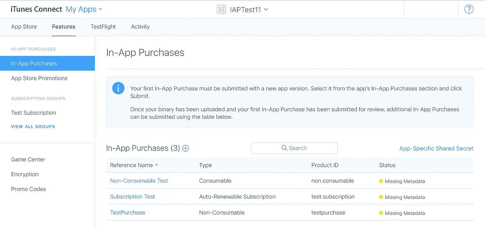

# [SWIFT]如何在您的 iOS 应用中添加应用内购买

> 原文：<https://medium.com/hackernoon/swift-how-to-add-in-app-purchases-in-your-ios-app-c1dc2fc82319>


## **简介**

[应用内购买(IAP)](https://support.apple.com/en-us/HT202023) 是从你的 iPhone、iPad、iPod touch 或 Mac 应用中赚钱的好方法。你可以通过进入应用程序页面来检测某些应用程序是否提供 [IAP](https://hackernoon.com/tagged/iap) ，并查看在价格、购买或获取按钮附近是否有“提供应用内购买”或“应用内购买”。IAP 主要用于解锁你的应用程序中你想从中获利的一些额外内容。不管你喜不喜欢，苹果会对你的应用成功完成的每笔交易收取 30%的费用。

IAP 示例:

*   在摄影应用中，你可以花 x.xx 美元购买额外的效果；
*   打开 Medium [iOS](https://hackernoon.com/tagged/ios) app，可以在设置下看到一个“成为会员”按钮，提供包月服务，里面有很多优质内容；
*   在游戏中购买硬币或其他虚拟货币，这样可以进步更快。

## **IAP 的 4 种类型:**

1.  **消耗品**——用户每次想要这些物品的时候都需要购买。消费品购买的例子是购买游戏币、提示、健康等。
2.  **非消耗品**——一旦买了这个，就永远拥有了。这是一次性购买，您也可以在使用同一个 AppleID 连接的设备之间转移它。例子是:升级应用程序到专业版，删除广告，城市指南地图等。
3.  **非续费订阅**——在固定的时间段内使用 app 内容，结束后可以再次购买。比如一个运动赛季。
4.  **自动更新订阅** -你可以订阅应用程序在特定时期内提供的内容或服务。该期限过后，它会自动续订。例子、报纸订阅、网飞、游戏等。

通过本教程，你将了解到关于应用内购买的所有信息。为了更好地理解，我将尽可能详细地介绍本教程，并将它分成多个步骤:

1.  iTunes Connect 设置
2.  代码
3.  使用代码
4.  测试

# 1.iTunes Connect 设置

## 输入您的银行账户详细信息

获得 IAP 工作最重要的部分是输入你的银行信息。这可以通过进入 [iTunes Connect](https://itunesconnect.apple.com) 中的**协议、税收和银行**部分来完成。如果没有此设置，您将无法使用 IAP 服务。应该如下图所示…



## 创建沙盒用户

然后我们需要创建一个**沙盒用户**。要创建这种用户，导航到**用户和角色**并选择**沙盒测试员**部分。请记住使用不与任何 Apple ID 关联的电子邮件。你需要沙盒用户来创建测试支付，否则，你不能测试他们。



## 创建 iTunes 应用程序

转到**我的应用**部分，创建一个应用。或者，如果您已经有一个应用程序，请使用现有的应用程序。要创建应用程序，您必须从您的[开发者帐户](https://developer.apple.com)创建一个应用程序 ID。

## 创建 IAP 产品

点击您的 iTunes 应用并导航至**功能**部分。您可以在那里创建新的 IAP 产品。点击+图标，从我上面解释的 4 种类型中选择一种。然后输入与该 IAP 相关的所需元数据。请注意**产品 ID** ，因为您将需要在您的应用程序中使用该标识符来调用所需的 IAP。这是它应该看起来的样子。



Here are some examples of IAP's that I have created. The warnings are completely normal.

*我们已经完成了 iTunes Connect 的设置。如果你清楚了，那么让我们进行下一步，我将向你解释代码。*

# 2.代码

将代码放在单独的类中。我已经把我的名字命名为 **IAPHandler，**，但是如果你不喜欢这个名字，可以随意更改。在这个课程中，我们将存储与应用内购买相关的所有内容。为了更好地理解，我将附上整个 GIST 文件，并将解释文件中的每个函数…

## 变量

您需要做的第一件事是从您的 IAP 产品 ID(在我的例子中是 consumer _ PURCHASE _ PRODUCT _ ID 和 NON _ consumer _ PURCHASE _ PRODUCT _ ID)创建变量。此外，我们将创建用于处理 IAP 请求的变量和存储所有可用 IAP 产品的数组。

## 类函数

1.  **canMakePurchases()** —返回一个布尔值，无论设备是否能够进行购买。
2.  **purchaseMyProduct(index:Int)**—使用此功能发起购买。该功能将弹出付款对话框。发送**索引**以从 iapProducts 数组中获取正确的 IAP 产品。
3.  **restore 回购()** —恢复 IAP 的功能。如果用户更换设备，并且他已经在您的应用中拥有一个非消耗性 IAP，则使用此选项。
4.  **fetchAvailableProducts()**—通过将所有产品 ID 添加到一个 [NSSet](https://developer.apple.com/documentation/foundation/nsset) 对象中，创建一个您想要使用的产品 ID 集合。记得设置 delegate 方法，这样就可以取回 SKProduct 结果。

## 委托方法

1.  **products request(_ request:SKProductsRequest，did receive response:SKProductsResponse)**—返回所有可用的应用内购买，并填充 iapProducts 数组。调用**函数 fetchAvailableProducts()** 后触发。
2.  **paymentqueuerestorecompletedtransactionsffinished(_ queue:SKPaymentQueue)**—**处理用户成功恢复 IAP 的情况。**
3.  ****payment queue(_ queue:SKPaymentQueue，updated transactions transactions:[SKPaymentTransaction])**—调用 purchaseMyProduct(index:Int)**函数**后触发此委托方法。**在这个回调中，您将获得与 IAP 交易相关的所有信息(比如某个商品是否已被购买或失败)。****

## ****回调处理程序****

****作为奖励，我添加了回调处理枚举。创建一个闭包 **purchaseStatusBlock()，**，它返回各种 IAP 事务状态以获得更清晰的代码。为了使它更好，我创建了一个名为 IAPHandlerAlertType 的枚举类型，它将为合适的情况返回一条消息。****

## ****滚动到 GIST 文件下面，了解如何使用这个类。****

# ****3.使用代码****

****转到您的 UIViewController，然后在您的 in viewDidLoad()函数中，获取产品并添加闭包，在那里您将获得用户所做事务的响应。****

```
**IAPHandler.shared.fetchAvailableProducts()IAPHandler.shared.purchaseStatusBlock = {[weak self] (type) in
            guard let strongSelf = self else{ return }
            if type == .purchased {
                let alertView = UIAlertController(title: "", message: type.message(), preferredStyle: .alert)
                let action = UIAlertAction(title: "OK", style: .default, handler: { (alert) in

                })
                alertView.addAction(action)
                strongSelf.present(alertView, animated: true, completion: nil)
            }
        }**
```

****然后创建一个初始化事务窗口的操作。下面的示例将从 iapProducts 数组中获取第一个产品。****

```
**@IBAction func consumable(btn: UIButton){
    IAPHandler.shared.purchaseMyProduct(index: 0)
}**
```

# ****4.测试****

****使用您的沙盒用户在 iOS 设备上登录，导航到您的应用程序，然后单击操作以启动交易。不用担心交易窗口上的价格。因为您使用的是沙盒用户，所以不会从您的帐户中收取任何费用。****

> ****注意:你不能在 iOS 模拟器上测试应用内购买。请使用真实设备。****

## ****这就是本教程的内容，如果对你有帮助，请👏或者分享这个故事，让其他像你一样的人也能找到它。感谢您的关注！🚀****

****[](http://bit.ly/2KkkwGL)****

## ****查看我的最新项目:****

****[](https://apps.apple.com/app/football-score-prediction-bets/id1517623538) [## 足球比分预测赌注

### 我们提供专业的足球比分预测投注提示，胜率高。每个比赛模拟包含一个…

apps.apple.com](https://apps.apple.com/app/football-score-prediction-bets/id1517623538) [](https://play.google.com/store/apps/details?id=betting.tips.goals) [## 足球博彩技巧和比分——赌进球 Google Play 上的应用程序

### 我们提供高胜率的专业足球技巧。每个比赛模拟包含一个预测，代表…

play.google.com](https://play.google.com/store/apps/details?id=betting.tips.goals) [](https://apps.apple.com/app/zoom-profile-picture-stories/id1514925024) [## 缩放个人资料图片和故事

### ZoomPic for Instagram 是匿名查看大型高清个人照片和故事的最简单、最方便的方式…

apps.apple.com](https://apps.apple.com/app/zoom-profile-picture-stories/id1514925024) [](https://apps.apple.com/app/long-video-story-for-instagram/id1511499427) [## Instagram 的长视频故事

### Instagram 的 Long Story 是一个非常棒的工具，允许您录制或选择任意长度的视频并进行转换…

apps.apple.com](https://apps.apple.com/app/long-video-story-for-instagram/id1511499427) 

## 阅读更多我在媒体上的作品:

[](https://hackernoon.com/introducing-clean-swift-architecture-vip-770a639ad7bf) [## 引入干净的 Swift 架构(VIP)

### 忘了 MVC 吧，现在！

hackernoon.com](https://hackernoon.com/introducing-clean-swift-architecture-vip-770a639ad7bf) [](https://medium.freecodecamp.org/how-you-can-use-the-google-maps-sdk-with-ios-using-swift-4-a9bba26d9c4d) [## 使用 Swift 4 在 iOS 上使用 Google Maps SDK 的终极指南

### 许多 iOS 应用程序使用谷歌地图。这是一个非常普遍的特点，所以我决定准备一个终极指南…

medium.freecodecamp.org](https://medium.freecodecamp.org/how-you-can-use-the-google-maps-sdk-with-ios-using-swift-4-a9bba26d9c4d) [](/theappspace/swift-custom-uiview-with-xib-file-211bb8bbd6eb) [## SWIFT —带有 XIB 文件的自定义 UIView

### 用 XIB 文件定制 UIView 是 iOS 开发中非常常见的做法。自定义 UIView 类不包含 XIB 文件…

medium.com](/theappspace/swift-custom-uiview-with-xib-file-211bb8bbd6eb) [](https://hackernoon.com/how-to-add-spotlight-support-to-your-ios-app-4a89054aff89) [## 如何将 Spotlight 支持添加到您的 iOS 应用程序

### Swift 教程将使您的应用程序在 Spotlight search 中可用

hackernoon.com](https://hackernoon.com/how-to-add-spotlight-support-to-your-ios-app-4a89054aff89) [](https://hackernoon.com/core-data-relationships-d813ed66ba8c) [## 核心数据关系

### 理解一对一和一对多关系

hackernoon.com](https://hackernoon.com/core-data-relationships-d813ed66ba8c) [](https://hackernoon.com/understanding-auto-layout-in-xcode-9-2719710f0706) [## 了解 Xcode 9 中的自动布局

### 所有你需要知道的关于自动布局

hackernoon.com](https://hackernoon.com/understanding-auto-layout-in-xcode-9-2719710f0706) 

## 订阅我的时事通讯:****