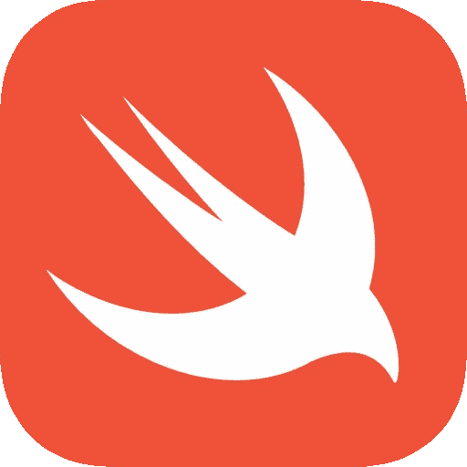

# Swift 选项

> 原文：<https://medium.com/hackernoon/swift-optionals-7adbcca7481c>

与它的前辈 C 和 Objective-C 不同，Swift 有`Optional`类型的概念。默认情况下， [Swift](https://hackernoon.com/tagged/swift) 中的变量不能设置为`nil`，除非它们被定义为`Optional`类型。这在语法上是通过在类型末尾附加一个`?`来表示的。例如，如果你有一个任务`var s: String = “”`，你可以将`String`改为`String?`。这将允许您将`s`设置为`nil` : `s = nil`。

## 打开

然而，要使用一个`Optional`类型的变量，它必须被解包。有几种方法可以做到这一点:使用 if-let 语句、guard-let 语句或使用`?.`操作符。`?.`操作符类似于`.`操作符，除了它在[展开](https://hackernoon.com/tagged/unwrapping)变量并继续`.`操作之前检查变量是否为`nil`。

由于`str1`不为 nil，所以对`str1`的展开值调用`lowercased()`方法，而`str2`为 nil，不能调用该方法，所以表达式结果为`nil`。

还有另一种稍微危险一点的解开`Optional`的方法，那就是用`!`操作符代替`?`，它解开一个可选的，不检查它是否是`nil`。这告诉编译器你“知道”你要强行打开的变量实际上不是`nil`。例如，使用上面的代码，`str1!.lowercased()`将和`str1?.lowercased()`一样工作。但是，如果变量是`nil`，那么就会抛出一个致命错误，如果`str2?.lowercased()`被改为`str2!.lowercased()`，就会出现这种情况。

虽然`?.`是这里描述的唯一操作符，但是您也可以在订阅(`[...]`)和调用之前使用`?`。

## 隐式展开选项

一个`Optional`类型也可以被定义为隐式展开的，这是通过在类型的末尾附加一个`!`来表示的，例如`String!`。这意味着`Optional`类型的变量将被强制解包，而不需要`?`或`!`操作符。由于变量仍然可以是`nil`，如果使用不当，可能会导致致命错误。

## If-let 和 guard-let

也许 Swift 中最有用的语句之一是 if-let 及其兄弟 guard-let。如上所述，如果值不是`nil`，if-let 允许您打开可选类型，并在 if-let 语句体中使用它。

上面的 if-let 获取`str`，检查它是否是`nil`，如果不是，则将`unwrappedStr`赋给`str`的值，并执行花括号内的代码，允许访问`unwrappedStr`，否则它将执行`else`语句。注意，一旦超出 if-let 块，`unwrappedStr`就不再可用。

现在，警卫队几乎做了与 it 队相反的事情:

在上面的例子中，guard-let 获取类型为`Optional`的变量`str`，检查它是否为`nil`，如果不是，则将`str`的值赋给`unwrappedStr`，否则执行块内的代码。请注意 guard-let 中的 return 语句:您必须有一个`return`或`break`(或其他会导致代码终止的东西，如`throw`)，因为`str`是`nil`，所以它不能被解包，`unwrappedStr`也不能被使用。

如果你有任何关于`Optional`类型或任何 Swift 的问题，或者如果你喜欢你所读到的，并想知道更多 Swift 的事情，请在这里留下评论或在 Twitter 上发 [tweet 或 PM me。快乐的雨燕！](https://twitter.com/jjacobson93)

> [黑客中午](http://bit.ly/Hackernoon)是黑客如何开始他们的下午。我们是 [@AMI](http://bit.ly/atAMIatAMI) 家庭的一员。我们现在[接受投稿](http://bit.ly/hackernoonsubmission)并乐意[讨论广告&赞助](mailto:partners@amipublications.com)机会。
> 
> 如果你喜欢这个故事，我们推荐你阅读我们的[最新科技故事](http://bit.ly/hackernoonlatestt)和[趋势科技故事](https://hackernoon.com/trending)。直到下一次，不要把世界的现实想当然！

