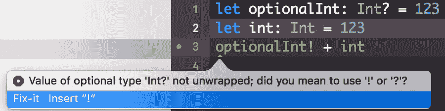

# 简单解释了 Swift 选项

> 原文：<https://medium.com/hackernoon/swift-optionals-explained-simply-e109a4297298>

Image made with [https://imgflip.com/](https://imgflip.com/)

你有没有和各种“？”纠结过还有“！”Swift 代码中到处都是符号？或者曾经发现自己对“强制解包”、“可选绑定”、“零合并”、“隐式绑定”或“可选链接”这样的短语感到困惑吗？你来对地方了！

选项是 Swift 语言中的一个强大功能，用于解决不存在值的问题。来自 Java 并经历了 NPEs 的地狱，我真的对 Swift 的这一特性感到兴奋。

Image credit [www.raywenderlich.com](http://www.raywenderlich.com)

# 什么是选装件，我们为什么需要它们？

*可选*只是 Swift 语言中的一个类型，没什么花哨的。 **Int** 和 **Int？**(可选 Int) 是两种不同的类型，如果你的变量恰好是类型 **Int** 你可以绝对肯定它总会有一个整数值，如果你的变量是类型 **Int？**它要么有一个整数值，要么没有任何值(换句话说，它将是 **nil** )。

把*可选的*看作一个包装器类型。它就像一个礼物盒，里面包裹着价值，而像现实生活中的盒子一样，*可选*可以包含一些东西，也可以是空的。

An optional which contains integer value of four, as if to write **let myOptional: Int? = 4**

An optional that doesn’t contain any value, as if to write **let myOptional: Int? = nil**

将价值包装在盒子里的高层次想法是，我们可以安全地使用盒子，而不用担心里面是什么。Swift 选项背后有一个强大的函数式编程概念——单子*和*。我强烈建议深入研究单子，这样你就能对这一切有一个更大的了解。最后，我将提供一些好的原始资料。

下面的*可选*类型仅仅是一个有两种情况的枚举——**None**表示没有设置值，而 **Some** 表示设置了值，并且是与之相关联的值。

# 强制展开

当试图执行一些“无辜的”操作时，你见过这个恼人的编译器错误吗？乍一看，你并没有做错什么，只是试图将两个整数相加，只是第一个是可选的，但它肯定有一个整数值，所以为什么编译器一直抱怨呢？

因为编译器不知道如何把一个盒子加到一个整数里。为了实现这一点，我们需要*打开*选项，换句话说，我们需要打开盒子，提取里面的值。为此，我们把“！”在变量名后做标记，意思是“我确定这个盒子里包含了什么，提取那个值并使用它”。这叫做*强制解包。这通常是一件“危险”的事情，因为如果盒子是空的，应用程序会在运行时崩溃。一个好的做法是在打开包装前检查**是否为零**。*

引擎盖下*强制解包*只是一个开关语句。

# 可选绑定

像*强制解包一样，可选捆绑*是一种打开盒子的方式，但它比*强制解包*做得更巧妙，污染更少。它允许检查*可选*，并将其值提取到常量或变量中，作为单个动作的一部分。当我们需要在 *if* 主体中多次使用展开的值时，这很有用。

这将被解读为“如果 **optionalInt** 有值，则将该值提取到 **constantInt** 中，并在 *if* 主体中使用，否则打印该值为零”。注意，我们没有使用“！”用 **constantInt** ，那是因为它代表 **optionalInt** 已经解包的值。所以我们只需打开它一次，就可以在 *if* 体内多次使用。

在引擎盖下*可选绑定*的工作方式类似于*强制展开*，除了在这种情况下它只是断开开关而不是抛出异常。

# **隐式展开选项**

有时候，我们真的真的确定，在第一次设置之后，我们的可选值总会有一个值。在这种情况下，没有必要在每次我们想要使用它的时候打开可选的，因为假设我们有一个值是安全的。在这种情况下，它有点像是在说“解开这个家伙一次，然后在任何你想要的地方使用这个值”。

*隐式展开的选项*用“！”声明标记他们的类型。因此，对于隐式展开的字符串可选，我们将有**字符串！**为其型。

请注意，我们没有使用“！”用**假设**标记，因为它是一个*隐式展开的可选*。

# 零合并

有时，当可选值为零时，我们希望使用默认值。让我们来看看这个例子:

这可以通过使用三元运算符(“？”)减少到一行下面代表三元运算符)。

零合并允许我们进一步缩短这个时间。

这仅仅意味着“如果 **optionalInt** 为 **nil** 则使用零，否则使用其展开值”。

# 可选链接

*可选链接*是一个特性，允许调用可选的属性和方法，这些属性和方法目前可能是空的。与会导致运行时异常的*强制展开*不同，当可选链接为零时，*可选链接*会正常失败。

让我们来看看这个例子:一个人可能有也可能没有银行账户，而银行账户肯定有余额。因此，如果我们想获得一个人的银行账户的余额，我们可能需要首先检查他/她是否有银行账户，如果答案是肯定的，就获得其余额。这就是*可选链接*和不用打开盒子就能使用盒子的想法发挥作用的地方。

而不是放“！”为了解开**银行账户**，我们把“？”在它之后说“如果这个人有银行账户，那么继续并得到它的余额，如果**银行账户**是**零**，就返回**零**作为它的**余额**”。因此，*可选链接*的结果总是一个*可选*。所以本质上*可选链接*允许我们不用担心叫做 **bankAccount** 的盒子里面是什么。如果盒子是空的，我们得到一个空盒子作为结果，如果盒子有一个值，我们得到包装在另一个盒子里的预期结果。

# **总之**

期权并没有那么可怕，对吧？我们刚刚了解到，它们代表一种包装器类型，它们就像一个包装一个值的盒子，盒子可以以 3 种不同的方式打开
1) *强制解包*(嘿，我确定盒子不是空的，请打开它，如果我错了，就通过崩溃我的应用程序来惩罚我)
2) *可选绑定*(嘿，我不确定盒子里面是什么，小心打开它，如果是空的， 不要对它执行任何操作)
3)我*简单地打开选项*(嘿，我确信一旦它第一次被设置，我就会有一个值，我不想在我的代码中到处麻烦地打开它)
我们了解到，由于 *nil 合并*，在空框的情况下，我们可以有一种非常简洁的方式来使用默认值。
最后我们了解了*可选链接*。我们了解到，我们并不总是需要打开盒子才能使用它，这就是*选装件*的全部魅力所在。我没有深入那个主题来谈论*地图*和*平面地图*，因为它会让初学者(本文一般针对他们)的事情变得复杂，但是现在当你理解了如何处理*选项时，*我强烈鼓励你深入。底部有一些非常棒的资源。

# 参考资料和有用的来源

**参考资料** :
[Swift 编程语言指南](https://developer.apple.com/library/content/documentation/Swift/Conceptual/Swift_Programming_Language/TheBasics.html#//apple_ref/doc/uid/TP40014097-CH5-ID309)
[理解 Swift 选项的完整指南](http://matteomanferdini.com/complete-guide-to-swift-optionals/)Matteo Manferdini 著。绝对推荐看这本简书。您也可以通过电子邮件订阅获取 Matteo 的其他有用指南和文章。
[用 Swift 开发 iOS 9 应用——斯坦福大学课程](https://itunes.apple.com/us/course/developing-ios-9-apps-swift/id1104579961)

**理解选项为单子的来源** :
[Swift 函子、应用程序和图片中的单子](http://www.mokacoding.com/blog/functor-applicative-monads-in-pictures)
[Brian Beckman:不要害怕单子](https://www.youtube.com/watch?v=ZhuHCtR3xq8)
[一些伟大的 Quora 答案](https://www.quora.com/What-are-monads-in-functional-programming-and-why-are-they-useful)
[Swift 选项的 Map 和 FlatMap 的力量](http://blog.xebia.com/the-power-of-map-and-flatmap-of-swift-optionals/)

如果您有任何问题或反馈，请不要犹豫，张贴出来，我将很高兴回答您的问题或得到您的宝贵反馈。祝您愉快地学习 Swift！

> [黑客中午](http://bit.ly/Hackernoon)是黑客如何开始他们的下午。我们是阿美族家庭的一员。我们现在[接受投稿](http://bit.ly/hackernoonsubmission)并乐意[讨论广告&赞助](mailto:partners@amipublications.com)机会。
> 
> 如果你喜欢这个故事，我们推荐你阅读我们的[最新科技故事](http://bit.ly/hackernoonlatestt)和[趋势科技故事](https://hackernoon.com/trending)。直到下一次，不要把世界的现实想当然！

