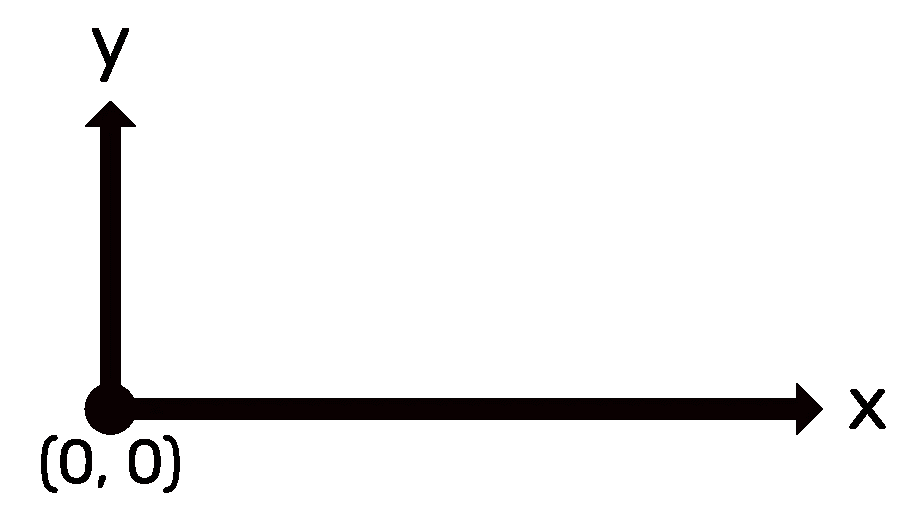
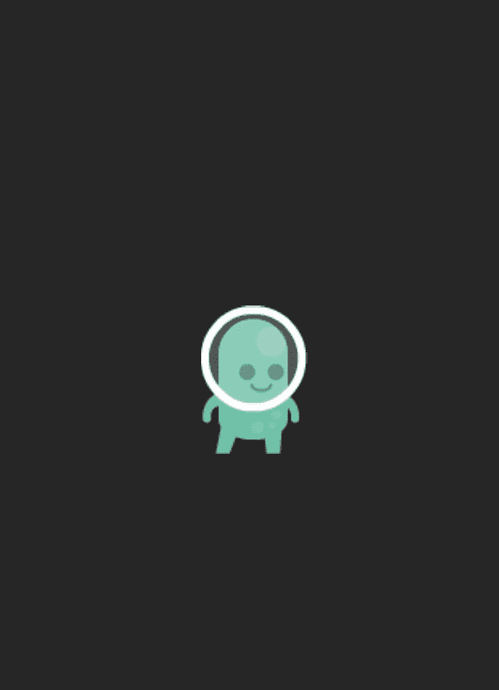

# Swift 精神基础

> 原文：<https://medium.com/hackernoon/swift-spritekit-basics-94b1798ab639>

想在 [iOS](https://hackernoon.com/tagged/ios) 、macOS、tvOS、*甚至* watchOS 上构建 2D 游戏？SpriteKit 为您提供从渲染精灵到物理模拟所需的一切。

SpriteKit 游戏中的一切都存在于`SKScene`类的一个实例中。该对象是所谓的节点层次结构的根，节点层次结构是具有父子关系的节点的集合。例如，您可能有一个效果节点，它是您的播放器节点的子节点，而该播放器节点是根节点(场景)的子节点。


Node Hierarchy

所有这些奇特的层次结构都可以工作，因为每个 SpriteKit 类都是从`SKNode`继承的。该类包含构建场景中节点的父子关系的逻辑。

```
let scene = SKScene()
let player = SKSpriteNode(imageNamed: "player")
scene.addChild(player)
```

`addChild`调用将我们的玩家节点放置在场景中。你可能已经注意到了，我们的玩家是一个`SKSpriteNode`，另一个你会在[精灵](https://hackernoon.com/tagged/spritekit)游戏中无数次用到的有价值的职业。顾名思义，`SKSpriteNode`从您的资产目录中提取一个精灵，在本例中是一个名为`"player"`的精灵，并创建一个节点。

由于`SKSpriteNode`继承自`SKNode`，我们在 sprite 上获得了一个名为`position`的属性，这是一个`CGPoint`(一个简单的结构，它有自己的两个属性，`x`和`y`)。`position`属性默认为点`(0.0, 0.0)`，相对于父节点的`anchorPoint`。让我们把这些都分解一下。

首先，需要注意的是，在 SpriteKit 中 y 轴上的`0`在屏幕的左下方，不像在 UIKit 或 AppKit 中，y 轴上的`0`在左上方。



x and y-axes in SpriteKit

场景有一个由它的`anchorPoint`，它的高度和宽度的百分比决定的原点。假设我们的场景和我们的屏幕一样大，恰好是 480 像素高，320 像素宽，`anchorPoint`就是`(0.25, 0.75)`。这意味着场景的原点在宽度的 25%和高度的 75%，确切地说是`0.25 * 320 = 80`和`0.75 * 480 = 360`，所以原点是`(80, 360)`。

在上面的例子中，我们将我们的玩家节点添加到场景中，而没有设置玩家的位置，所以它将位于`(0, 0)`，相对于场景的原点。因此，在屏幕上我们将看到坐标为`(80, 360)`的玩家节点。出于更实际的目的，让我们将场景的`anchorPoint`设置为`(0.5, 0.5)`(使用 Xcode 的 SpriteKit 游戏项目创建的场景的默认`anchorPoint`)。

```
let scene = SKScene(size: CGSize(width: 320, height: 480))
scene.anchorPoint = CGPoint(x: 0.5, y: 0.5)
let player = SKSpriteNode(imageNamed: "player")
scene.addChild(player)
```

现在，当我们放置玩家节点时，玩家将位于屏幕上的`(160, 240)`。然后，我们将使用所谓的`SKAction`将我们的播放器从当前位置移动到一个新的位置，例如，向右移动 80 像素，向下移动 120 像素，总共花费 2 秒钟。

```
let moveAction = SKAction.move(byX: 80, y: -120, duration: 2)
player.run(moveAction)
```

用 move 动作调用我们的 player 节点上的`run`方法将告诉 SpriteKit 在 2 秒内更新节点的位置，并在屏幕上动画显示它。



Credit to Kenney for sprite — [https://kenney.nl/assets](https://kenney.nl/assets)

现在，您已经有了一个用不到 10 行代码制作一个 SpriteKit 游戏的良好起点！

说到 SpriteKit 游戏，在 App Store 上看看我的游戏 Blueshift 吧！

[](https://appsto.re/us/ipb1hb.i) [## App Store 上的蓝移磁贴

### 阅读评论，比较客户评级，查看截图，并了解更多关于 Blueshift 瓷砖。下载蓝移磁贴…

appsto.re](https://appsto.re/us/ipb1hb.i) [](http://bit.ly/HackernoonFB)[](https://goo.gl/k7XYbx)[](https://goo.gl/4ofytp)

> [黑客中午](http://bit.ly/Hackernoon)是黑客如何开始他们的下午。我们是阿妹家庭的一员。我们现在[接受投稿](http://bit.ly/hackernoonsubmission)并乐意[讨论广告&赞助](mailto:partners@amipublications.com)的机会。
> 
> 如果你喜欢这个故事，我们推荐你阅读我们的[最新科技故事](http://bit.ly/hackernoonlatestt)和[趋势科技故事](https://hackernoon.com/trending)。直到下一次，不要把世界的现实想当然！

