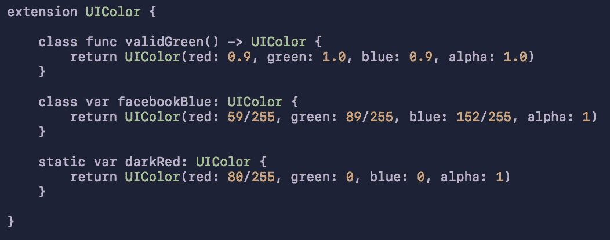

# Swifty UIColors

> 原文：<https://medium.com/hackernoon/swifty-uicolors-6352af05ed5d>



自定义 [Swift](https://hackernoon.com/tagged/swift) UIColors

回到 Swift 2，甚至更早，UIColors 是类函数，通过`UIColor.blackColor()`、`UIColor.redColor()`等调用。

自然地，创建自定义颜色看起来会像这样

```
extension UIColor { class func facebookBlue() -> UIColor { return UIColor(red: 59/255, green: 89/255, blue: 152/255, alpha: 1)}
```

并将通过`UIColor.facebookBlue()`进行呼叫。

在 Swift 3 中，默认的`UIColors`被修改为类属性，通过`UIColor.blue`调用(或者，如果类型已经确定，就简单地使用`.blue`)

我注意到很多人(包括我自己)仍然在以 Swift 3 之前的方式创建自定义`UIColors`。但是我要问，当你可以这样写的时候，你为什么要写呢？

```
extension UIColor { class var facebookBlue: UIColor { return UIColor(red: 59/255, green: 89/255, blue: 152/255, alpha: 1)}
```

在适当的情况下，通过`UIColor.facebookBlue`或`.facebookBlue`调用。

好多了，对吧？

**更奇怪的是**:关键字`class`意味着方法/属性是在类上调用的，而不是类的对象。这与`static`非常相似，如果你以前用过 C++或 Java，可能听起来更熟悉。

`static`实际上在 Swift 中也有，可以用来代替`class`，所以我有兴趣确定其中的区别。如果使用`class`，方法/属性可以在子类中被覆盖，而`static`不能。

这是创建自定义`UIColors`的一个非常小的细节，但是多一点知识不会有坏处！

**对于还在阅读的人:**当我们在一个`UIColor`扩展里面的时候…这里有一个`convenience init`我喜欢用来简化自定义`UIColor`初始化

```
convenience init(r: CGFloat, g: CGFloat, b: CGFloat, a: CGFloat {
    return UIColor(red: r/255, green: g/255, blue: b/255, alpha: a)
}//called via

class var facebookBlue: UIColor {
    return UIColor(r: 59, g: 89, b: 152, a: 1)
}
```

希望你喜欢！