# SwiftyWebRTC —使用 WebRTC 的 RTC 客户端

> 原文：<https://medium.com/hackernoon/swiftywebrtc-789936b0e39b>

## 如何使用 WebRTC 框架进行视频/音频通话

最近我要求在一个 ios 应用程序中启用视频通话，现在很多应用程序都这样做了，对吧。
我们都在 iOS 应用中使用 WebRTC 进行客户端到客户端的视频对话。WebRTC 是一个开源项目(libjingle_peerConnection ),由[谷歌](https://hackernoon.com/tagged/google)维护，为 iOS 和 Android 提供高级 API 实现。框架可以像这里的[所描述的那样构建，或者你可以下载许多开源项目提供的预构建的二进制文件。](https://webrtc.org/native-code/ios/)

在开始学习本教程之前，我们假设您已经了解了 WebRTC 的概念和 API。如果没有，可以在这里 *勾选* [*。*](https://developer.mozilla.org/en-US/docs/Web/API/WebRTC_API)

这个博客基本上是让 [WebRTC](https://hackernoon.com/tagged/webrtc) 在我们基于 swift 的应用中工作。在 ios 项目中，有许多带有预构建库和包装器的开源库。但是找不到一个用 swift 编写的、与 swift3 项目兼容的、有适当文档的好版本。它们要么与 carthage 和 swift 不兼容，要么没有更新以使用新的 WebRTC api。所以我决定做一个我自己的，用更少的文档，这不是那么直接的过程..
将一步一步地解释实现这一点的过程。

对于我的工作，我已经构建了 WebRTC 框架，如这里的[中所解释的](https://webrtc.org/native-code/ios/)。
现在，这项工作需要我们制作一个包装器来设置 RTCClient 并与我们的项目代码集成。

我们要做的总结如下:

> 简言之:将成为连接发起者的对等体 A 将创建提议。然后，他们将使用所选的信号信道将该提议发送给对等体 B。对等体 B 将从信号通道接收提议，并创建一个答案。然后，它们会沿着信号通道将此发送回对等体 A。

很简单，对吧！

**现在一步一步地打破这个过程，然后用相关的代码执行每一步。**

1.  首先，我们将启动“RTCPeerConnectionFactory”

```
RTCPeerConnectionFactory.initialize()self.connectionFactory = RTCPeerConnectionFactory() // save the instance for further uses
```

2.使用它创建一个“RTCPeerConnection”。

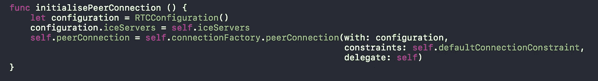

``iceServers``是您提供的眩晕和回合服务器列表。要生成 iceServer，您需要在 RTCIceServer init 方法中发送用户名、密码和 url。

如果您省略它，您将只生成内部网络主机候选，只要您在同一个网络上测试，这是没问题的。

3.现在我们已经配置了连接，让我们通过添加一个本地流来启动连接。

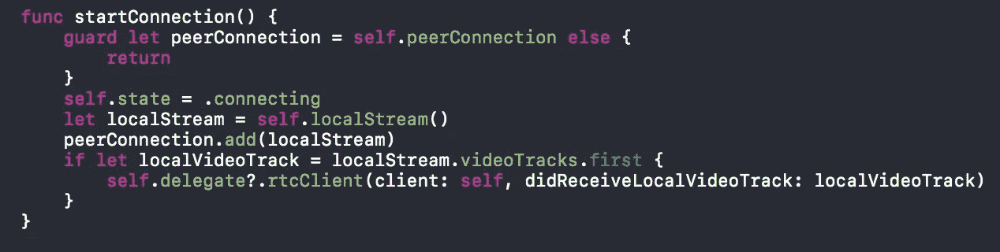

Start Connection

一次又一次地添加 videoTrack 会增加延迟，所以技巧是让它成为一个静态变量，只在连接开始或结束时添加和删除它。

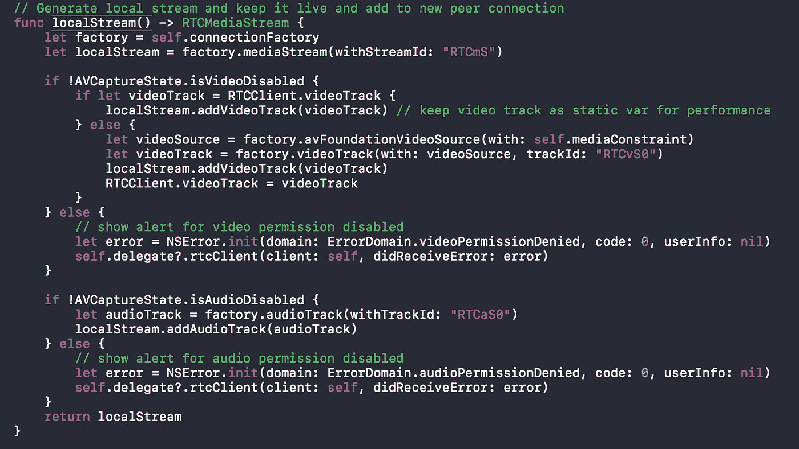

4.建立连接和本地流后，开始通话的时间到了。对等方 A 将通过创建报价来开始通话。

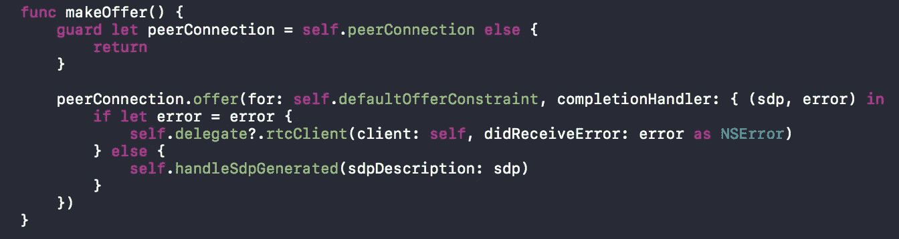

> 以下是我们将使用的不同约束

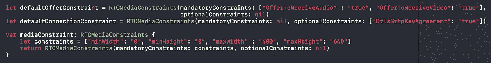

5.对等体 A 应该将该提议设置为*本地描述*(即连接的本地端的描述)，并使用信令服务器将该提议发送给呼叫的预期接收者。

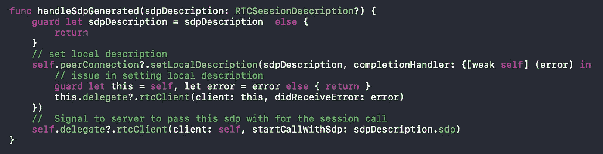

6.对等体 B 将从信令服务器接收该提议，并将其*远程描述设置为提议*(连接另一端的描述)。对等体 B 然后创建一个答案，并通过信令服务器再次发送它。

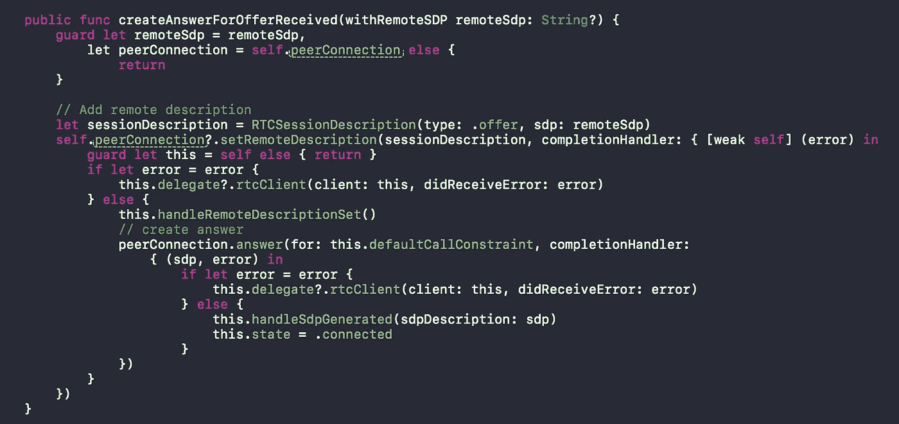

7.对等体 B 将设置 sdp generated 作为其本地描述。对等体 B 现在知道了连接两端的配置。生成的 Sdp 被发送到信令服务器，作为对呼叫者的回答。

8.对等体 A 接收到应答，将其设置为 remoteDescription。它现在知道了双方的配置。媒体开始按配置流动。

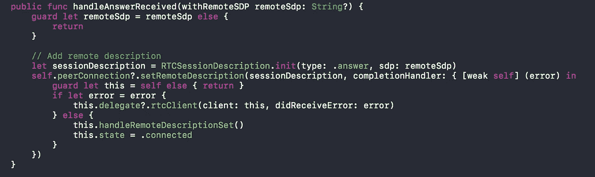

您可能想知道我们在哪里将 remoteStream 设置为“remoteVideoTrack”来呈现媒体。

9.从添加的流中获取 RemoteVideoTrack 以呈现远程媒体。

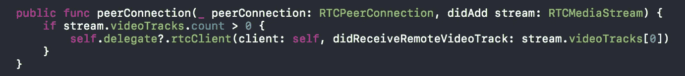

现在，我们已经为两个对等体设置了两个 sdp..还有一件更重要的事情我们还没有处理，即 **IceCandidate**

10.可以使用“RTCPeerConnectionDelegate”接收生成的 iceCandidate，需要将它发送到其他对等方以保持数据流。

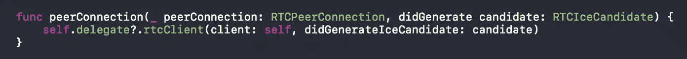

11.信令服务器用于发送/接收 iceCandidate 信息。
接收到的候选项被添加到对等连接，如下所示。

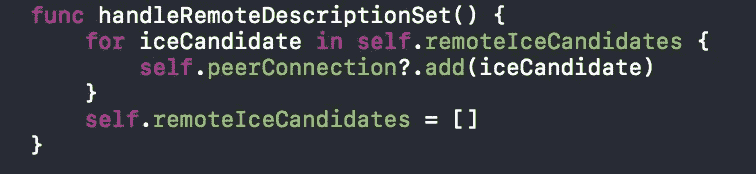

就这样，我们完成了处理 webRTC api 的工作，以便在我们支持 swift 的应用程序中实现视频通话。

包装器(“RTCClient”)和 WebRTC 构建的框架可以在“[https://github.com/Ankit-Aggarwal/SwiftyWebRTC](https://github.com/Ankit-Aggarwal/SwiftyWebRTC)”的我的报告中找到

可以使用 carthage 进行添加，如下所示:

```
github "Ankit-Aggarwal/SwiftyWebRTC"
```

如果您有任何问题，或者想要对代码进行一些添加/修改，或者您有任何反馈，请在下面的评论中提出。

**感谢阅读！**