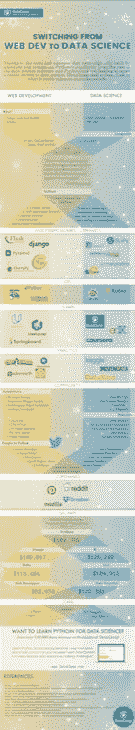

# 从 Web 开发转向数据科学

> 原文：<https://medium.com/hackernoon/switching-from-web-dev-to-data-science-42352ab0a9e>

*最初发布于:*[*https://www . data camp . com/community/blog/we B- development-data-science*](https://www.datacamp.com/community/blog/web-development-data-science)

[数据科学](https://hackernoon.com/tagged/data-science)领域仍然炙手可热，用于该领域的编程语言也是如此:R 的受欢迎程度每年都在增加，尤其是 [Python](https://hackernoon.com/tagged/python) 在数据科学行业越来越重要。这不仅是因为这种通用语言因其可读性和相对较低且非常渐进的学习曲线而脱颖而出，更主要的是因为最初由科学家和系统管理员构建的工具和概念。因为，尽管那些出于科学目的使用 Python 的人和那些出于更常规目的(如系统管理和 web 开发)使用 Python 的人之间似乎存在着[文化差异](http://youtu.be/wi-1UGYQiHM)，但他们的优势在于他们可以一起工作。这一点在最近几年得到了证明:Python 语言的坚实基础随着帮助数据科学家和数据科学团队解决复杂数据问题的包的创建和开发而得到了丰富。

因此，有些用户希望更多地将 Python 用于数据科学。那些学习数据科学的人经常想知道他们还能用这种流行的编程语言做些什么。

# 用 Python 从 Web 开发到数据科学

这就是为什么 [DataCamp](http://www.datacamp.com/?utm_source=blog&utm_medium=blog&utm_campaign=infographic_data_science_roles) 着眼于 Python web 开发和 Python 数据科学之间的差异，试图确定在两者之间进行转换真正需要什么。我们最新的信息图*“用 Python 从 Web 开发到数据科学”*总结了这些结果:

Switching From Web Dev to Data Science

*看这里的信息图:*[*https://www . data camp . com/community/blog/we B- development-data-science*](https://www.datacamp.com/community/blog/web-development-data-science)

在这张信息图中，你会发现网络开发人员和数据科学家之间的角色差异。我们着眼于两者的核心优势，两者都在使用的框架或库和 ide，学习和实践 Python 进行 web 开发和数据科学可以做些什么，如何在 web 开发和数据科学社区中很好地集成，哪些公司使用 Python 进行 web 开发和数据科学等等。希望这张信息图能帮助你更好地理解从一个到另一个转换时你必须考虑的不同方面。

如果你想了解更多关于数据科学的知识，请务必查看 [DataCamp 的交互式 R 和数据科学教程](http://www.datacamp.com/?utm_source=blog&utm_medium=blog&utm_campaign=infographic_data_science_roles)，加入 22 万数据爱好者的行列！您对我们的其他信息图感兴趣吗？查看[统计语言大战](https://www.datacamp.com/community/tutorials/statistical-language-wars-the-infograph)、[学数据科学](https://www.datacamp.com/community/tutorials/learn-data-science-infographic)、 [R vs Python](https://www.datacamp.com/community/tutorials/r-or-python-for-data-analysis) 、[数据科学产业](https://www.datacamp.com/community/tutorials/data-science-industry-infographic)。

*原载于*[*www.datacamp.com*](http://www.datacamp.com/community/blog/web-development-data-science)*。*

> [黑客中午](http://bit.ly/Hackernoon)是黑客如何开始他们的下午。我们是 T21 家庭的一员。我们现在[接受投稿](http://bit.ly/hackernoonsubmission)并乐意[讨论广告&赞助](mailto:partners@amipublications.com)机会。
> 
> 如果你喜欢这个故事，我们推荐你阅读我们的[最新科技故事](http://bit.ly/hackernoonlatestt)和[趋势科技故事](https://hackernoon.com/trending)。直到下一次，不要把世界的现实想当然！

