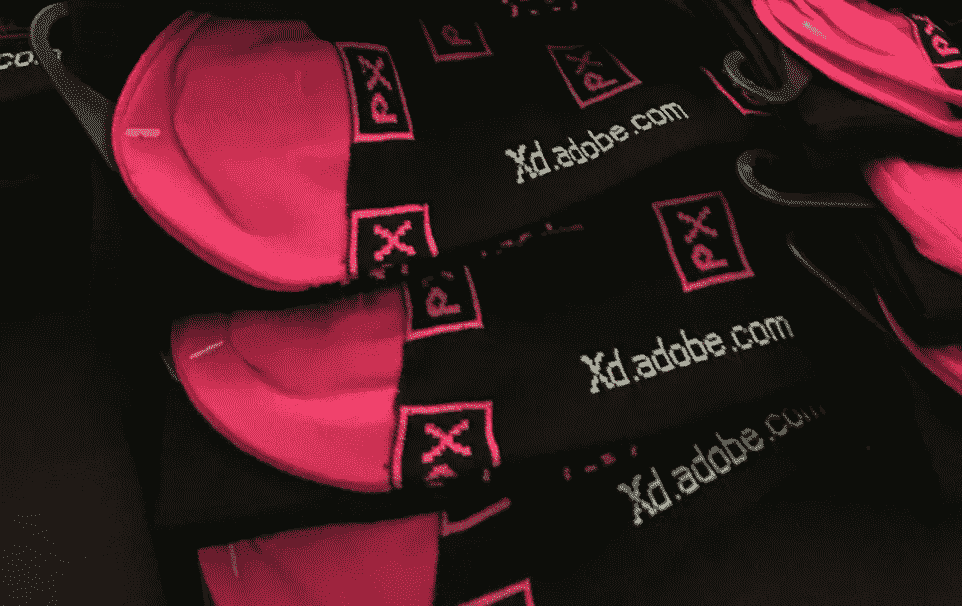
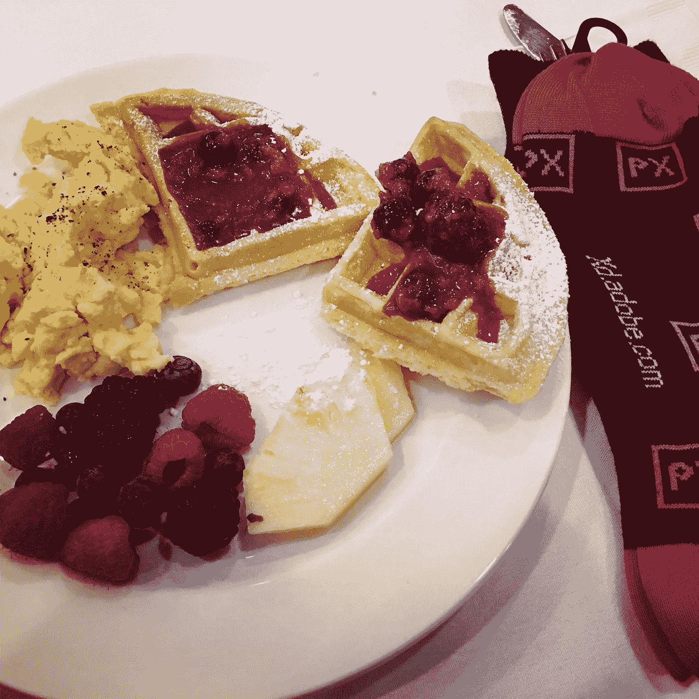
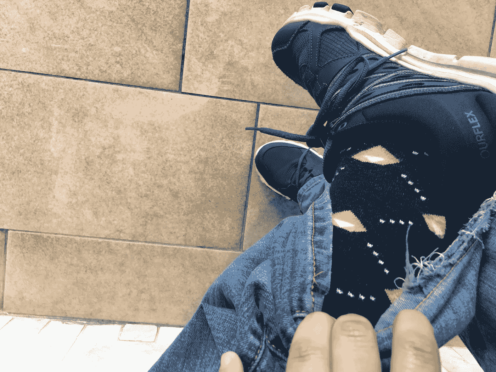
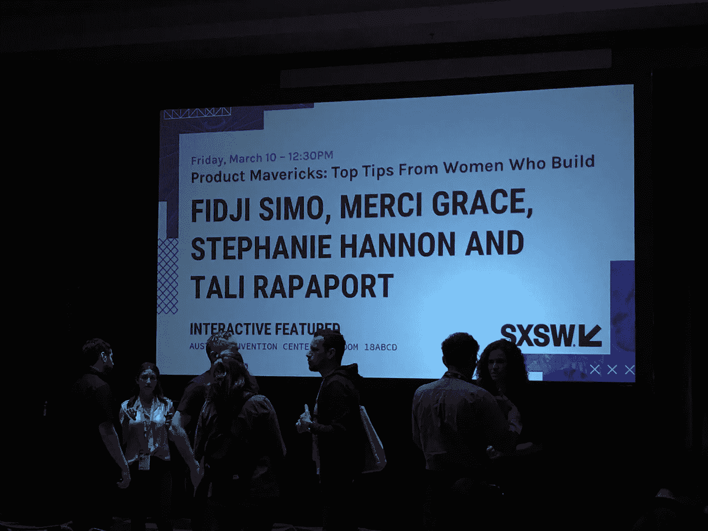
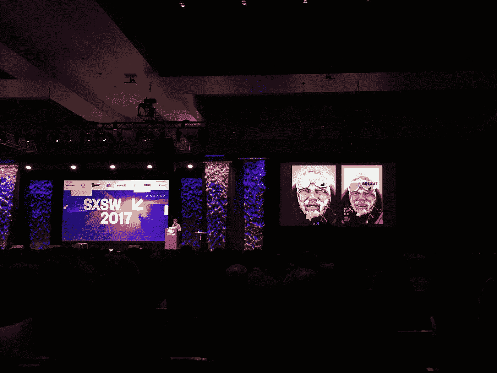
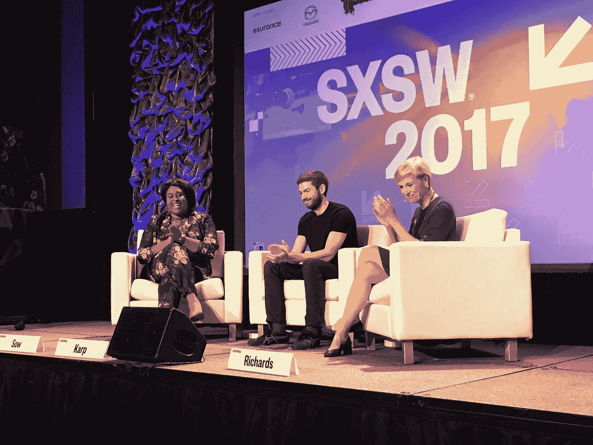

# SXSW 2017 —第一天回顾

> 原文：<https://medium.com/hackernoon/sxsw-2017-day-one-recap-bb64418f4e3e>

昨天是 2017 年 [SXSW](https://hackernoon.com/tagged/sxsw) 的正式发布会。这是我 10 年来第 8 次去南方，我仍然喜欢它带来的兴奋和活力。

我参加了这么多年，今年我能感觉到不同。这次会议反映了我们政府目前面临的问题和我们正在解决的社会问题。

这并不是说，没有很多有趣的事情发生！以下是我在 SXSW 度过的第一天。

# **土坯华夫饼和线框**

没有比准备一些美味的早餐更好的开始会议的方式了。我在上午 9:30 左右前往万豪酒店，我的准时得到了回报，因为我得到的奖励是只有大约 30 个人在我前面。

[Adobe](https://hackernoon.com/tagged/adobe) Xd 团队正在为这次活动做准备，他们准备了满满一桌子超赞的 Xd 袜子。当然，我的第一个想法是，“我如何得到一双？”但是当他们让我们进去并扫描我们的徽章时，每个人都收到了一双袜子。

一旦进入活动，他们有一个可怕的华夫饼和早餐吧，让我们得到一个盘子，载入一天中最重要的一餐。

Adobe Xd 团队给出了一个关于使用 Xd 进行线框和设计的快速演示，我必须承认我对它所能做的事情印象深刻。具有讽刺意味的是，当我坐着吃我的华夫饼干，抓着我的 Xd 袜子时，我的脚上穿着素描袜。

Shhhhhh… don’t tell Adobe I was wearing Sketch socks to their Xd event.

# 产品特立独行者:来自打造

在吃了早餐后，我去参加了我在 SXSW 这么多年里见过的最好的小组讨论之一，如果不是最好的话。

这个话题与我的职业生涯非常相关，但也与围绕多样性/女性在科技领域的大讨论非常相关。

全女性领导小组由直率的坏女人组成。

对我来说，Merci Grace 是一个杰出的人，她目前是 Slack 的产品/增长总监。Merci 对女性在科技领域面临的一些挑战非常诚实和坦率。听说我非常钦佩的公司 Slack 也是如此多样化和包容，这也很棒。

Merci 讨论了她最大的盟友是 Stuart Butterfield，以及增长团队的多样性是其成功的因素之一。

# 融合主题演讲:科里·理查兹

大约一个小时，我听了一个我听过的最让人心碎，最励志的故事。说真的，有人需要拍一部关于这个男人的电影，我说的不是一部关于他一生的电影，而是一部成熟的电影。

在参加这个主题演讲之前，我没有听说过科里·理查兹，但他从 13 岁开始的克服毒瘾的故事令人心碎。我一直在想，如果我 6 岁的女儿在这么小的年纪就染上毒瘾，作为父母，我该如何应对。

他被邀请在 SXSW 演讲，因为去年他拍下了他攀登珠穆朗玛峰的整个过程，但他只在主题演讲的最后 10 分钟谈到了这一点。在那之前的 50 分钟里，他经历了人生的起起落落，这才让他走到了那一步。

如果 SXSW 上传了主题演讲的视频，我会把它添加到这里，但现在，请查看他的[国家地理传记页面](http://www.nationalgeographic.com/explorers/bios/cory-richards-bio/)。

# 行动主义、联盟和我们的未来

Aminatou Sow, David Karp, Cecile Richards

这是我当天参加的最后一次小组讨论，非常及时。

在过去的几天里，共和党人一直在推动通过新的医疗保健立法，这将导致许多人失去他们的医疗保险。

Tumblr 和为人父母之间的关系是一个很好的例子，说明了技术立场在社会问题上可以发生什么。戴维·卡普甚至更进一步，加入了计划生育委员会，帮助他们进行技术创新，以及如何降低需要预约的年轻人的门槛。

总的来说，这一天是令人惊奇的第一天，也绝对是我过去 10 年来参加的最好的第一天。我期待着剩下的日子，在 Medium 上总结一下，或者随时在 Twitter 上关注我[@ hijennstar](http://twitter.com/hijennstarr)。

> [黑客中午](http://bit.ly/Hackernoon)是黑客如何开始他们的下午。我们是 [@AMI](http://bit.ly/atAMIatAMI) 家庭的一员。我们现在[接受投稿](http://bit.ly/hackernoonsubmission)并乐意[讨论广告&赞助](mailto:partners@amipublications.com)机会。
> 
> 如果你喜欢这个故事，我们推荐你阅读我们的[最新科技故事](http://bit.ly/hackernoonlatestt)和[趋势科技故事](https://hackernoon.com/trending)。直到下一次，不要把世界的现实想当然！

