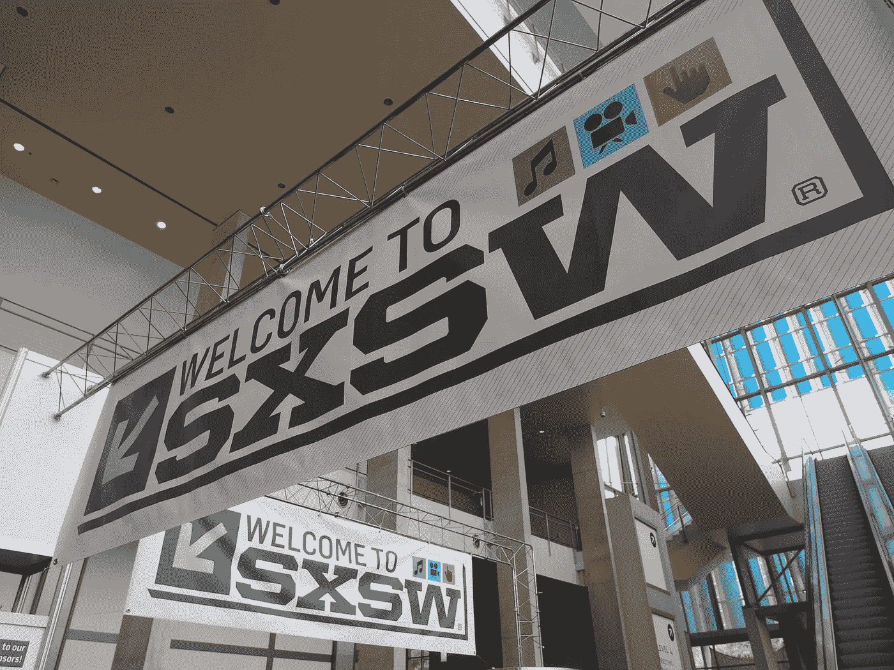
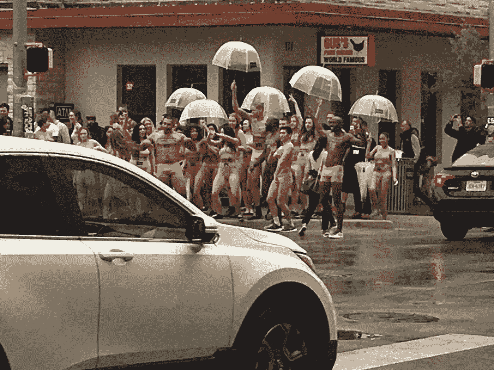

# SXSW 日记——第一天——我想我明白了。

> 原文：<https://medium.com/hackernoon/sxsw-diary-day-two-i-think-i-get-it-dc7fffa861b6>

我离开了寒冷的东北部，去寻找温暖的德克萨斯州的喘息之机，结果却在一个灰暗多雨的奥斯汀着陆了。我在这里的航班上挤满了前往 SXSW 的人，包括一个坐在飞机上的家伙，他带着一个非常大的专业电影相机，这个相机没有放在任何箱子里，也没有被用来拍摄任何东西。我想知道这是否只是一个滑稽的做作，或者他只是直接购买了一个佳能 Eos 作为配件。飞机上的气氛和大学的第一天很相似。陌生人不断地互相传递参加聚会的邀请，不少于六个穿着法兰绒的大胡子绅士互相建议“只是不要打算睡觉。”

昨天有人评论我的文章说我看起来像个不会校对的娘们。这很伤人，但似乎也有点准确，我的意思是我确实抱怨过人们喝得太多，想打领带。

我从第一天学到的两点是:

*   SXSW 比我想象的要低调得多
*   我想我明白 SXSW 的重点了

我所有的前期研究让我觉得 SXSW 将会是一个巨大的人群接管奥斯汀市中心，每个角落都将包含新的奇迹。坦率地说，街道似乎像一个中等规模的跳蚤市场一样拥挤，聚会似乎稀少，有点死气沉沉。我看到的唯一有点意思的街景是一群半裸的人跑来跑去喊口号，但即使这样也似乎很无聊，因为这显然是某种形式的装扮成酒神节的企业营销。

我确实参加了汉堡市在一个空地上举办的派对。他们有免费的圣保利女孩和可以预见的汉堡。这相当有趣，我和一位在一家名为 Horse Analytics 的公司工作的女士聊了聊，我以为这家公司只是一个名字，但实际上是一家对马匹进行分析的公司。我不得不想象网络机会对他们来说是轻的，除非他们找到一个稳定的谁刚刚踢它的旧学校，最近被一个热门的总经理谁想要拥抱创新的运动科学接管。

后来，我参加了一个活动，与会者包括一群在初创企业工作的千禧一代、一位大城市市长和一位著名的前 NFL 球员。食物并不好吃，但苏格兰威士忌很不错，对话也令人难以置信。我想，就像大多数年纪太大而不能成为千禧一代的人一样，我花了很多时间开玩笑说他们有多讨厌和不切实际。但是今天我最大的收获是骄傲。我被教导要付出代价，保持安静，做好自己的工作，慢慢提升。但是今晚我看着 25 岁的人(连领带都不打！)走向风险投资人、政客和名人，开始向他们要东西，大部分情况下，他们都带走了有用的东西。当我 24 岁的时候，我会对此感到震惊，但坦率地说，我错了，他们是对的，我也应该更大胆一些。

更重要的是，他们看起来真的对互相帮助和合作很感兴趣。我早期的商业生涯充满了关于照顾自己和不相信任何人的教训，以及被告知要阅读《孙子兵法》。这些孩子似乎忽略了这一切，希望看到彼此成功。就像一群螃蟹意识到如果他们停下来一起搭个梯子，他们就能逃出锅。

一些最后的想法:

*   我不应该为午餐付钱，免费的食物到处都是。
*   回复名单并不重要，你可以去任何地方。
*   显然杰克·塔珀今天做了一个精彩的演讲
*   乔·拜登明天就要来了,“拯救美国”的船员们周二就要来了。
*   我还没见过克里斯·瑞安。你在外面吗，减速器？

> [黑客中午](http://bit.ly/Hackernoon)是黑客如何开始他们的下午。我们是 [@AMI](http://bit.ly/atAMIatAMI) 家庭的一员。我们现在[接受投稿](http://bit.ly/hackernoonsubmission)并乐意[讨论广告&赞助](mailto:partners@amipublications.com)机会。
> 
> 如果你喜欢这个故事，我们推荐你阅读我们的[最新科技故事](http://bit.ly/hackernoonlatestt)和[趋势科技故事](https://hackernoon.com/trending)。直到下一次，不要把世界的现实想当然！

