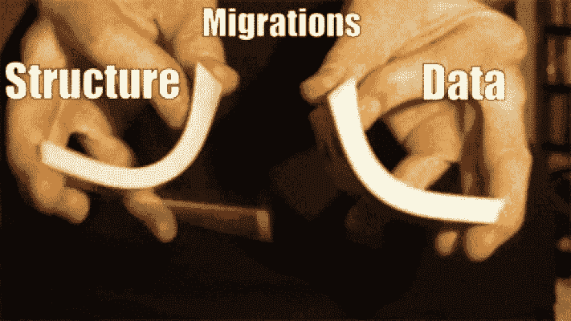

# 系统化您的数据库——成为迁移管理员的 Ruby 方法。

> 原文：<https://medium.com/hackernoon/systematize-your-database-the-ruby-way-to-be-the-croupier-of-migrations-7c9d56bc628d>

想知道赌台管理员是如何洗牌的吗？他们把牌分成两副，然后把两副牌混为一副。我已经试过很多次了，卡片到处乱飞😞。但是现在想象一下，您可以对您的数据和结构迁移进行洗牌，让它们按照应该的顺序运行……那将是一件很酷的事情！



当您的应用程序开始变得越来越大时，您的迁移文件夹可能也会变得越来越大，因此您可能需要在不同的表之间移动一些数据，或者甚至更改这些数据，因为您的结构也发生了变化。

您何时进行迁移？首先是数据迁移，然后是结构迁移，还是反过来？

使用这些方法中的任何一种，都容易发生一些错误:

*   在第一种方法(数据→结构)中，如果您需要的字段还没有创建(因为结构迁移还没有运行)，您会怎么做？
*   在第二种方法(结构→数据)中，如果您想要填充的字段需要在结构迁移中被删除的另一个字段中的数据，您会怎么做？

让我给你看一个例子:

*   假设您有一个`Post`模型，它有一个名为`:deleted`的布尔属性，代表被删除的`Posts`；
*   一段时间后，一些`Posts`被删除，你被要求不仅仅知道一个`Post`被删除，我们还需要知道`Post`何时被删除。因此您创建了包含删除日期的`:deleted_at`字段；
*   现在您创建了数据迁移，它搜索所有被删除的`Posts`并给`:deleted_at`字段加上时间戳。到目前为止还不错；
*   完成后，您可以安全地删除旧的和过时的`:deleted` 字段。

因此，在本例中，我们有 2 次结构迁移(创建`:deleted_at`字段并删除`:deleted`字段)和 1 次数据迁移(填充`:deleted_at`字段)。在您运行您的迁移之前，这一切都很美好，因为当您运行完结构化迁移时，您将没有一个`:deleted`字段来查询被删除的`Posts`。

考虑到这一点，让我向你介绍[系统化](https://github.com/RicardoBrazao/systematize)，它是让痛苦消失的宝石。

# 它是如何工作的？

只需将它添加到您的 gem 文件中:

```
#Gemfile
gem 'systematize', '~> 0.0.1'
```

或者通过`bundler`安装

```
bundle install 'systematize'
```

惊喜吧，惊喜吧，你有新任务了！

```
$> bundle exec rake -T
rake systematize:migrate       # Migrate the database
rake systematize:rollback      # Rollback the database (options: STEP=x, VERBOSE=false)
rake systematize:rollback_all  # Rollback all the database
```

有了这个，你的迁移将被重新安排，它们将按时间跨度运行，以确保一切顺利！

# 这不全是娱乐和游戏，你知道吗？

为了顺利进行，你只需要遵守一些规则:

*   迁移需要在正确的文件夹中，对于结构化迁移，应该在`db/migrate`中，数据迁移应该在`db/data`中。像这样:

```
- app
  |
  |-db
    |-data
    |-migrate
```

*   迁移需要遵循 [Rails](https://hackernoon.com/tagged/rails) 约定`YYYYMMDDHHMMSS_create_products.rb`

# 闪耀的时刻到了

现在，如果您需要迁移[数据库](https://hackernoon.com/tagged/database)，您只需运行:

```
bundle exec rake systematize:migrate
```

需要回滚之前的迁移吗？没问题。

```
bundle exec rake systematize:rollback
```

需要回滚 2/3/4 迁移吗？我抓住你了。

```
bundle exec rake systematize:rollback STEP=2
```

搞得一团糟，你需要重新开始？动手吧。(迁移需要是可逆的😅)

```
bundle exec rake systematize:rollback_all
```

别忘了打碎它💚按钮，如果你有什么要说的，就像它是热的一样下降 [@RicBrazao](https://twitter.com/RicBrazao) ！

[](http://bit.ly/HackernoonFB)[](https://goo.gl/k7XYbx)[](https://goo.gl/4ofytp)

> [黑客中午](http://bit.ly/Hackernoon)是黑客如何开始他们的下午。我们是这个家庭的一员。我们现在[接受投稿](http://bit.ly/hackernoonsubmission)并乐意[讨论广告&赞助](mailto:partners@amipublications.com)机会。
> 
> 如果你喜欢这个故事，我们推荐你阅读我们的[最新科技故事](http://bit.ly/hackernoonlatestt)和[趋势科技故事](https://hackernoon.com/trending)。直到下一次，不要把世界的现实想当然！

